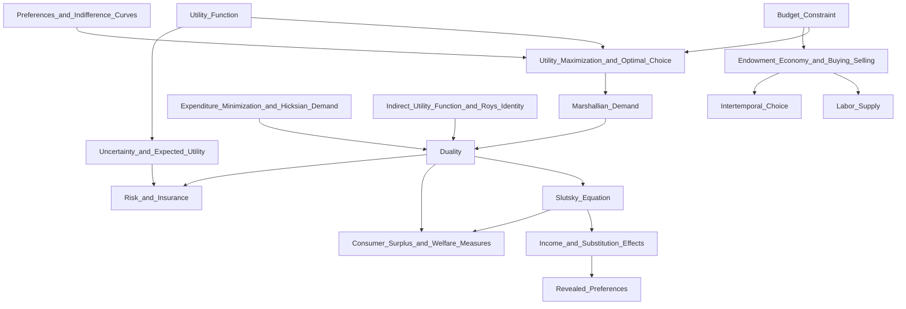

# JEB104 — Microeconomics I: Master Synthesis

> **Lecturer:** TBA · IES Prague, Charles University
> **Semester:** Summer Semester, Year 1
> **Credits:** 6 ECTS
> **Textbook:** Varian (2010) *Intermediate Microeconomics*; Nechyba (2011) *Microeconomics: An Intuitive Approach with Calculus*
> *Last updated after: Lectures (Tier 1 — all 17 lectures processed)*

---

## Concept Index

### I. Budget and Choice Sets
- [[Budget_Constraint]] — budget set, budget line, slope, numeraire, taxes, subsidies, rationing

### II. Preferences and Utility
- [[Preferences_and_Indifference_Curves]] — preference axioms, MRS, indifference curves, special preference types
- [[Utility_Function]] — ordinal utility, MRS, common functional forms (Cobb-Douglas, CES, quasi-linear, perfect substitutes/complements)

### III. Utility Maximisation and Demand
- [[Utility_Maximization_and_Optimal_Choice]] — UMP, Lagrangian, FOCs, corner solutions, WLOG, Walras' Law
- [[Marshallian_Demand]] — demand functions, homogeneity, Walras' Law, gross substitutes/complements, Engel curves

### IV. Expenditure Minimisation and Hicksian Demand
- [[Expenditure_Minimization_and_Hicksian_Demand]] — EMP, expenditure function, Shephard's Lemma, Hicksian demand, properties
- [[Indirect_Utility_Function_and_Roys_Identity]] — indirect utility $v(p,m)$, Roy's Identity, properties

### V. Duality
- [[Duality]] — UMP/EMP duality identities (D1–D4), Roy's Identity from duality, Slutsky from duality, Slutsky matrix

### VI. Price Effects and Decomposition
- [[Income_and_Substitution_Effects]] — Hicksian decomposition, graphical analysis, normal/inferior/Giffen goods
- [[Slutsky_Equation]] — full derivation, Slutsky matrix, symmetry and NSD, cross-price terms, Cobb-Douglas example

### VII. Revealed Preference
- [[Revealed_Preferences]] — direct/indirect revealed preference, WARP, SARP, GARP, Afriat's theorem, non-parametric testing

### VIII. Welfare Measurement
- [[Consumer_Surplus_and_Welfare_Measures]] — CS, CV, EV, ordering, deadweight loss, money metric utility, tax reform

### IX. Endowment Economies
- [[Endowment_Economy_and_Buying_Selling]] — endowment budget constraint, net demand, endowment Slutsky, offer curve, gains from trade
- [[Labor_Supply]] — labour-leisure model, backward-bending supply, reservation wage, comparative statics, Cobb-Douglas example
- [[Intertemporal_Choice]] — Fisher two-period model, PV budget, Euler equation, borrowing constraints, log-utility example

### X. Uncertainty
- [[Uncertainty_and_Expected_Utility]] — VNM axioms, expected utility representation, risk aversion, CE, RP, ARA/RRA, mean-variance, stochastic dominance
- [[Risk_and_Insurance]] — state-contingent goods, insurance demand, adverse selection, moral hazard, portfolio choice, stochastic discount factor

---

## I. Budget and Choice Sets

The budget constraint $p_1 x_1 + p_2 x_2 \leq m$ defines the **budget set** $B(p,m)$ as the feasible consumption space. The budget line has slope $-p_1/p_2$, the negative of the **relative price** or opportunity cost of good 1 in terms of good 2. A crucial property is **homogeneity of degree zero** in $(p, m)$: only relative prices matter, enabling simplification via a numeraire.

Policy interventions — quantity taxes, ad valorem taxes, subsidies, rationing, and in-kind transfers — all deform the budget line in predictable ways. The [[Budget_Constraint]] note catalogues each transformation explicitly.

---

## II. Preferences and Utility

Preferences must satisfy **completeness** and **transitivity** to be representable by a utility function (Debreu's theorem adds continuity). The **marginal rate of substitution** $MRS = -dx_2/dx_1|_{u=\text{const}}$ quantifies the trade-off a consumer is willing to make. Key special cases:

- **Perfect substitutes:** $u = ax_1 + bx_2$, linear indifference curves, MRS constant.
- **Perfect complements (Leontief):** $u = \min\{ax_1, bx_2\}$, L-shaped curves.
- **Cobb-Douglas:** $u = x_1^\alpha x_2^{1-\alpha}$, constant expenditure shares.
- **CES:** $u = (\alpha x_1^\rho + (1-\alpha)x_2^\rho)^{1/\rho}$, constant elasticity of substitution $\sigma = 1/(1-\rho)$.
- **Quasi-linear:** $u = v(x_1) + x_2$ — no income effect on good 1.

See [[Preferences_and_Indifference_Curves]] and [[Utility_Function]].

---

## III. Utility Maximisation and Marshallian Demand

The **Utility Maximisation Problem** (UMP) is:

$$\max_{x \geq 0}\ u(x) \quad \text{s.t.}\ p \cdot x = m$$

At an interior optimum, the tangency condition requires $MRS = p_1/p_2$ — the consumer equates their subjective trade-off (MRS) to the objective market trade-off (price ratio). Equivalently, via the Lagrangian:

$$\frac{\partial u/\partial x_i}{p_i} = \lambda \quad \forall i$$

i.e., marginal utility per dollar is equalised across goods. The multiplier $\lambda$ is the marginal utility of income.

Solving the FOCs yields **Marshallian demand** $x_i^*(p, m)$, satisfying:
- **Homogeneity of degree 0** in $(p, m)$: $x_i^*(\lambda p, \lambda m) = x_i^*(p, m)$.
- **Walras' Law:** $p \cdot x^*(p,m) \equiv m$.
- **Symmetry of cross-price Slutsky terms** (via duality).

See [[Utility_Maximization_and_Optimal_Choice]] and [[Marshallian_Demand]].

---

## IV. Expenditure Minimisation and Hicksian Demand

The **Expenditure Minimisation Problem** (EMP) is the dual of the UMP:

$$\min_{x \geq 0}\ p \cdot x \quad \text{s.t.}\ u(x) \geq \bar{u}$$

Its value function is the **expenditure function** $e(p, \bar{u})$, which is:
- Homogeneous of degree 1 in $p$.
- Concave in $p$.
- Non-decreasing in $\bar{u}$ and in each $p_i$.

**Shephard's Lemma:** $\partial e / \partial p_i = h_i(p, \bar{u})$ — the derivative of the expenditure function with respect to price $i$ is the **Hicksian (compensated) demand** for good $i$.

The value function of the UMP — the **indirect utility function** $v(p,m)$ — satisfies **Roy's Identity:**

$$x_i^*(p,m) = -\frac{\partial v/\partial p_i}{\partial v/\partial m}$$

See [[Expenditure_Minimization_and_Hicksian_Demand]] and [[Indirect_Utility_Function_and_Roys_Identity]].

---

## V. Duality

The full duality structure connects the UMP and EMP through four identities:

$$v(p, e(p, \bar{u})) = \bar{u} \tag{D1}$$

$$e(p, v(p, m)) = m \tag{D2}$$

$$x_i^*(p, e(p, \bar{u})) = h_i(p, \bar{u}) \tag{D3}$$

$$h_i(p, v(p, m)) = x_i^*(p, m) \tag{D4}$$

Differentiating D3 with respect to $p_j$ and applying Shephard's Lemma yields the Slutsky equation. Differentiating D2 with respect to $p_i$ and applying Shephard's Lemma yields Roy's Identity. The duality framework is the unifying architecture of consumer theory. See [[Duality]].

---

## VI. Price Effects and Decomposition

A price change has two distinct effects. The **Slutsky equation** formalises the decomposition:

$$\frac{\partial x_i^*}{\partial p_j} = \underbrace{\frac{\partial h_i}{\partial p_j}}_{\text{SE}} - \underbrace{x_j^* \frac{\partial x_i^*}{\partial m}}_{\text{IE}}$$

The substitution effect is always non-positive for own-price changes ($\partial h_i/\partial p_i \leq 0$) — Hicksian demand curves slope down. The income effect's sign depends on whether the good is normal ($\partial x_i^*/\partial m > 0$, IE reinforces SE) or inferior (IE opposes SE). An **extreme inferior good (Giffen good)** has $|IE| > |SE|$, reversing the law of demand.

The **Slutsky matrix** $S$ with $S_{ij} = \partial h_i/\partial p_j$ is **symmetric** (from $e$'s concavity), **NSD** (Hicks–Slutsky conditions), and satisfies $Sp = 0$.

See [[Slutsky_Equation]] and [[Income_and_Substitution_Effects]].

---

## VII. Revealed Preference

Rather than imposing utility on consumers, **revealed preference theory** tests rationality from observed choices. If a consumer chooses $x$ when $y$ is affordable, $x$ is revealed preferred to $y$. **WARP** rules out direct cycles; **SARP** rules out all transitivity violations; **GARP** (Afriat 1967) is the necessary and sufficient condition for the existence of a rationalising utility function on finite data sets.

Empirical demand analysis can test GARP non-parametrically (Varian 1982) or use the **Afriat efficiency index** to allow for bounded irrationality.

See [[Revealed_Preferences]].

---

## VIII. Welfare Measurement

Three monetary welfare measures quantify the impact of a price change on consumer well-being:

$$\Delta CS = -\int_{p_0}^{p_1} x^*(t, \bar{p}_{-1}, m)\, dt$$

$$CV = \int_{p_0}^{p_1} h(t, \bar{p}_{-1}, \bar{u}^0)\, dt$$

$$EV = \int_{p_0}^{p_1} h(t, \bar{p}_{-1}, \bar{u}^1)\, dt$$

For normal goods and a price increase: $EV \leq \Delta CS \leq CV$. All three coincide for quasi-linear preferences. The **deadweight loss** of a tax is approximately $\frac{1}{2} t^2 |\partial x/\partial p|$ — a second-order welfare cost.

See [[Consumer_Surplus_and_Welfare_Measures]].

---

## IX. Endowment Economies

When income is endogenous (derived from selling an endowment $\omega$), the budget line always passes through $\omega$. The **endowment Slutsky equation** for a price change:

$$\frac{dx_i}{dp_j} = \frac{\partial h_i}{\partial p_j} + (\omega_j - x_j) \frac{\partial x_i}{\partial m}$$

The extra term $(\omega_j - x_j)\partial x_i/\partial m$ reflects the wealth effect from the price change on the endowment value. Net sellers gain in wealth when the price of their endowed good rises; net buyers lose.

Three key applications:
1. **[[Endowment_Economy_and_Buying_Selling]]** — trade and general equilibrium foundations.
2. **[[Labor_Supply]]** — labour-leisure model; the **backward-bending labour supply curve** arises when the endowment income effect dominates the substitution effect at high wages.
3. **[[Intertemporal_Choice]]** — Fisher's two-period model; the Euler equation $u'(c_t) = \delta R u'(c_{t+1})$ is the optimality condition for consumption smoothing.

---

## X. Uncertainty

Consumer theory extends to risky environments via **Expected Utility Theory** (von Neumann & Morgenstern 1944). The four VNM axioms imply that preferences over lotteries can be represented by $U(L) = \mathbb{E}[u(x)]$ for a **Bernoulli utility function** $u$.

**Risk attitudes:** determined by the curvature of $u$:
- Risk averse: $u'' < 0$, positive risk premium $RP > 0$.
- Risk neutral: $u'' = 0$.
- Risk loving: $u'' > 0$.

**Arrow-Pratt measures:** $A(x) = -u''/u'$ (ARA) and $R(x) = -xu''/u'$ (RRA) quantify the degree of aversion. DARA (decreasing ARA) is the empirically plausible assumption.

In insurance markets, risk-averse consumers demand full coverage at actuarially fair prices. Informational frictions generate **adverse selection** (Akerlof 1970) and **moral hazard**, leading to partial coverage and potential market unravelling.

See [[Uncertainty_and_Expected_Utility]] and [[Risk_and_Insurance]].

---

## Concept Map

---

## Textbook Integration

| Concept | Varian (2010) | Nechyba (2011) |
|---------|--------------|----------------|
| Budget Constraint | Ch. 2 | Ch. 2B |
| Preferences | Ch. 3 | Ch. 4 |
| Utility | Ch. 4 | Ch. 4B |
| Choice / UMP | Ch. 5 | Ch. 5 |
| Demand | Ch. 6 | Ch. 6 |
| Revealed Preference | Ch. 7 | Ch. 7 |
| Slutsky Equation | Ch. 8 | Ch. 7B |
| Buying & Selling (Endowment) | Ch. 9 | Ch. 10 |
| Intertemporal Choice | Ch. 10 | Ch. 11 |
| Labour Supply | Ch. 9 (labour) | Ch. 19A |
| Uncertainty I | Ch. 12 | Ch. 17 |
| Uncertainty II / Insurance | Ch. 12 | Ch. 17B |
| Expenditure / Hicksian | Ch. 8 | Ch. 10B |
| Duality | Ch. 8 appendix | Ch. 10B |
| CV / EV / Welfare | Ch. 14 | Ch. 10B |

---

## Cross-Course Connections

| JEB104 Concept | Related Course | Related Topic |
|---------------|---------------|---------------|
| [[Slutsky_Equation]] | JEB009 (Makroekonomie I) | Aggregate demand and IS curve derivation |
| [[Utility_Function]] and [[Intertemporal_Choice]] | JEB027 (Finanční Ekonomie) | Euler equation, CCAPM, stochastic discount factor |
| [[Uncertainty_and_Expected_Utility]] | JEB027 | Portfolio theory, CAPM, risk premia |
| [[Risk_and_Insurance]] | JEB027 | Insurance pricing, adverse selection |
| [[Revealed_Preferences]] | JEB109 (Econometrics I) | Non-parametric demand testing (Varian 1982) |
| [[Consumer_Surplus_and_Welfare_Measures]] | JEB010 (Makroekonomie II) | Welfare analysis and policy evaluation |
| [[Labor_Supply]] | JEB010 | Labour market equilibrium and taxation |
