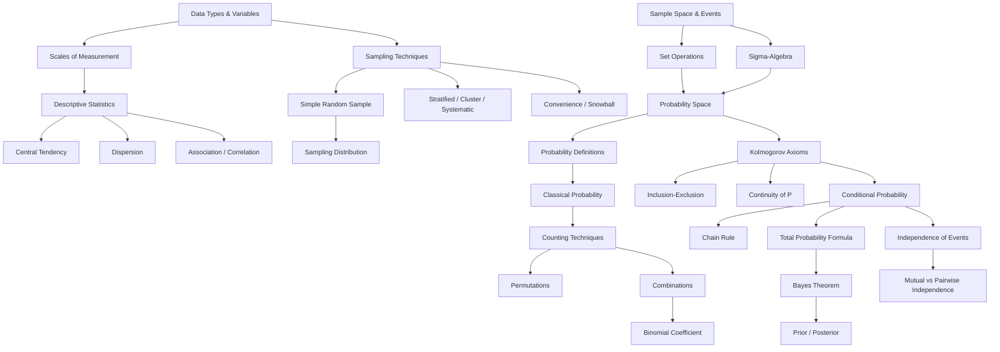

# JEB142 — Introductory Statistics: Master Synthesis

> **Lecturer:** IES, Faculty of Social Sciences, Charles University in Prague
> **Semester:** Summer 2024/2025
> **Credits:** 3 ECTS
> **Textbooks:** Sweeney et al. (Blocks 1 & 4) · Bartoszynski & Niewiadomska-Bugaj (Blocks 2 & 3) · Mittelhammer (Blocks 2 & 3)
> *Last updated after: Lectures (Tier 1)*

---

## Concept Index

### I. Data and Descriptive Statistics
- [[Data_Types_and_Variables]] — quantitative vs. qualitative, cross-sectional, time series, panel
- [[Scales_of_Measurement]] — nominal, ordinal, interval, ratio; permissible statistics
- [[Frequency_Distribution_and_Visualization]] — frequency tables, histograms, ogives, box plots, scatter plots
- [[Measures_of_Central_Tendency]] — mode, median, mean, percentiles, quartiles
- [[Measures_of_Dispersion]] — range, IQR, variance, standard deviation, CV
- [[Measures_of_Association]] — sample covariance, Pearson correlation coefficient

### II. Sample Space and Set Theory
- [[Sample_Space_and_Events]] — experiment, outcome, sample space, events, limsup/liminf
- [[Set_Operations_on_Events]] — union, intersection, complement, De Morgan's laws
- [[Sigma_Algebra]] — σ-algebra definition, Borel σ-algebra, generated σ-algebra

### III. Probability
- [[Probability_Definitions]] — classical, frequency, subjective, axiomatic definitions
- [[Kolmogorov_Axioms]] — axioms, probability space, inclusion-exclusion, continuity of probability

### IV. Counting
- [[Counting_Techniques]] — Cartesian product, permutations, combinations, multiset coefficient
- [[Binomial_Coefficient]] — properties, Pascal's recurrence, Newton's binomial formula

### V. Conditional Probability and Independence
- [[Conditional_Probability]] — definition, chain rule, conditional sample space
- [[Total_Probability_and_Bayes_Theorem]] — partition, total probability, Bayes' theorem, prior/posterior, Bayesian updating, conditional independence
- [[Independence_of_Events]] — pairwise independence, mutual independence, independence vs. disjointness

### VI. Sampling
- [[Sampling_Techniques]] — sampling error, SRS, stratified, cluster, systematic, convenience, snowball

---

## I. Data and Descriptive Statistics

Statistics begins with **data**. Before any analysis, one must understand the nature of the variable being measured: its type (quantitative or qualitative) and its [[Scales_of_Measurement]]. The scale of measurement determines which arithmetic operations are meaningful and hence which summary statistics may legitimately be computed.

**[[Data_Types_and_Variables]]** distinguishes between quantitative variables (interval and ratio) and qualitative variables (nominal and ordinal). It also covers structural types of datasets: cross-sectional, time-series, and panel (longitudinal) data — a taxonomy central to econometrics (see [[JEB109_Econometrics_I_main]]).

**[[Scales_of_Measurement]]** establishes the hierarchy: nominal → ordinal → interval → ratio. Only ratio-scale variables support all statistical operations including meaningful ratios and the coefficient of variation. Nominal variables support only the mode.

**[[Frequency_Distribution_and_Visualization]]** covers how raw data are organised into frequency tables and depicted graphically through histograms, ogives (cumulative frequency curves), stem-and-leaf plots, box plots, and scatter plots. These visual tools reveal distributional shape — symmetry, skewness, modality — that numerical summaries alone cannot fully convey.

**[[Measures_of_Central_Tendency]]** presents the mode, median, and mean as three distinct notions of "centre". The arithmetic mean $\bar{x} = \frac{1}{n}\sum x_i$ minimises the sum of squared deviations; the median minimises the sum of absolute deviations and is robust to outliers. Skewness determines which measure lies highest: for right-skewed distributions (typical of incomes) $\bar{x} > \tilde{x} > \text{mode}$.

**[[Measures_of_Dispersion]]** quantifies spread. The sample variance $s^2 = \frac{1}{n-1}\sum(x_i-\bar{x})^2$ uses degrees of freedom $n-1$ to yield an unbiased estimator. The IQR $= Q_3 - Q_1$ is robust; the coefficient of variation $CV = s/\bar{x}$ is dimensionless and enables cross-variable comparisons.

**[[Measures_of_Association]]** extends to the bivariate case. The sample covariance $s_{xy} = \frac{1}{n-1}\sum(x_i-\bar{x})(y_i-\bar{y})$ measures linear co-movement but is scale-dependent. The Pearson correlation $r_{xy} = s_{xy}/(s_x s_y) \in [-1,1]$ standardises covariance to produce a dimensionless index of linear association. Crucially, correlation does not imply causation.

---

## II. Sample Space and Set Theory

Probability theory rests on a precise set-theoretic foundation. **[[Sample_Space_and_Events]]** defines the experiment as any observable process with uncertain outcomes, the sample space $S$ as the universal set of all outcomes, and an event as any subset $A \subseteq S$. The classification of sample spaces (finite, countably infinite, uncountable) determines the technical machinery required.

**[[Set_Operations_on_Events]]** catalogues the laws governing unions ($A \cup B$), intersections ($A \cap B$), complements ($A^c$), and differences ($A \setminus B$). De Morgan's laws — $(A \cup B)^c = A^c \cap B^c$ and $(A \cap B)^c = A^c \cup B^c$ — are workhorses for deriving probability identities. Partitions of $S$ into disjoint, exhaustive subsets underlie the total probability formula.

**[[Sigma_Algebra]]** addresses a technical necessity: on uncountable sample spaces, probability cannot be assigned to every subset without generating paradoxes (Vitali sets). A σ-algebra $\mathcal{A}$ is a collection of subsets closed under complements and countable unions — the permissible domain for the probability function. The Borel σ-algebra $\mathcal{B}(\mathbb{R})$, generated by all open intervals, is the natural σ-algebra for real-valued measurements.

---

## III. Probability

**[[Probability_Definitions]]** surveys the historical development: the **classical** definition (equally likely outcomes, finite $S$), the **frequency** definition (long-run relative frequency), and the **subjective** definition (degree of belief). Each has applications and limitations; the frequency limit's existence is non-trivial and is established by the Law of Large Numbers (JEB105).

**[[Kolmogorov_Axioms]]** provides the rigorous foundation. The probability space $(S, \mathcal{A}, P)$ requires three axioms: nonnegativity, norming ($P(S)=1$), and countable additivity. From these, all standard probability results follow: $P(\emptyset)=0$, $P(A^c)=1-P(A)$, monotonicity ($A \subseteq B \Rightarrow P(A) \leq P(B)$), and subadditivity. The **inclusion-exclusion principle** generalises $P(A \cup B) = P(A)+P(B)-P(A \cap B)$ to $n$ events. **Continuity of probability** allows limits to pass through $P$ for monotone sequences of events. The **Bertrand paradox** illustrates that "uniform" probability requires an explicit specification of the probability space.

---

## IV. Counting

**[[Counting_Techniques]]** organises the four sampling paradigms by order and replacement:

| | With replacement | Without replacement |
|---|---|---|
| **Ordered** | Multiplication rule: $\prod k_i$ | Permutations: $P_n^k = n!/(n-k)!$ |
| **Unordered** | Multiset: $\binom{n+k-1}{k}$ | Combinations: $C_n^k = \binom{n}{k}$ |

These feed directly into classical probability calculations where $P(A) = N(A)/N(S)$.

**[[Binomial_Coefficient]]** $\binom{n}{k} = n!/(k!(n-k)!)$ counts $k$-subsets of an $n$-set. Key properties: symmetry $\binom{n}{k}=\binom{n}{n-k}$; Pascal's recurrence $\binom{n}{k}+\binom{n}{k-1}=\binom{n+1}{k}$; Newton's binomial formula $(x+y)^n = \sum_{k=0}^n \binom{n}{k}x^k y^{n-k}$; sum $\sum_k \binom{n}{k}=2^n$. The binomial coefficient is the coefficient of the binomial distribution (JEB105).

---

## V. Conditional Probability and Independence

**[[Conditional_Probability]]** formalises the update of probabilities given partial information. $P(A \mid B) = P(A \cap B)/P(B)$ reduces the sample space to $B$. The multiplication rule $P(A \cap B) = P(A \mid B)P(B)$ and its generalisation — the **chain rule** $P(A_1 \cdots A_n) = P(A_1)\prod_{i=2}^n P(A_i \mid A_1 \cdots A_{i-1})$ — are fundamental tools. $P(\cdot \mid B)$ is itself a valid probability measure on $B$.

**[[Total_Probability_and_Bayes_Theorem]]** covers two of the most important results in applied probability. The **total probability formula** $P(A) = \sum_n P(A \mid B_n)P(B_n)$ expresses any event probability as a weighted average over a partition $\{B_n\}$. **Bayes' theorem** inverts conditional probability:
$$P(B_m \mid A) = \frac{P(A \mid B_m)P(B_m)}{\sum_n P(A \mid B_n)P(B_n)}$$
The canonical medical testing example (1% prevalence, 98% sensitivity, 0.5% false positive rate) shows that even with a sensitive test, $P(\text{disease} \mid \text{positive}) \approx 66\%$ — base rates dominate. Sequential **Bayesian updating** turns the posterior from one observation into the prior for the next. **Conditional independence** simplifies multi-signal Bayesian inference (naive Bayes structure).

**[[Independence_of_Events]]** defines independence via $P(A \cap B) = P(A)P(B)$, which extends to $P(B)=0$ cases. Mutual independence of $n$ events requires the product rule for **every** subset, not just pairs — pairwise independence does not imply mutual independence (counterexample with four equally likely outcomes). Complements of independent events remain independent. Independence and disjointness are **opposite** properties for positive-probability events.

---

## VI. Sampling

**[[Sampling_Techniques]]** bridges probability theory and empirical data collection. A **simple random sample** ensures every size-$n$ sample has equal probability, implemented via random number tables or PRNGs. **Sampling error** is inherent and quantifiable — it is not a mistake. The **sampling distribution** of $\bar{x}$ (distribution of sample means across all possible samples) is the conceptual bridge to inference in JEB105.

**Probability techniques** — stratified (reduce variance by exploiting within-stratum homogeneity), cluster (cost-effective when clusters are heterogeneous microcosms), and systematic (ordered frame, fixed skip $k=N/n$) — each offer tradeoffs between precision and cost. **Non-probability techniques** (convenience, snowball) are appropriate for exploratory or hard-to-reach-population research but cannot support formal inference.

---

## Concept Map

---

## Textbook Integration

| Concept | Sweeney et al. | Bartoszynski & N-B | Mittelhammer |
|---------|---------------|---------------------|--------------|
| Data types, descriptive stats | Block 1 | — | — |
| Sampling techniques | Block 4 | — | — |
| Sample space, σ-algebra, probability | — | Block 2 | Block 2 |
| Counting, combinatorics | — | Block 2 | Block 2 |
| Conditional probability, Bayes | — | Block 3 | Block 3 |

---

## Cross-Course Connections

| Concept in JEB142 | Continuation in |
|-------------------|----------------|
| Descriptive statistics, sampling distribution | [[JEB105_Statistics_main]] — inference, CLT, hypothesis testing |
| Probability space, random variables | JEB105 — distributions, expectation, variance |
| Regression, correlation | [[JEB109_Econometrics_I_main]] — OLS, hypothesis tests |
| Probability, Bayes | JEB105 — parameter estimation, interval estimation |
| Data types, scales | [[JEB104_Microeconomics_I_main]] — utility measurement |
