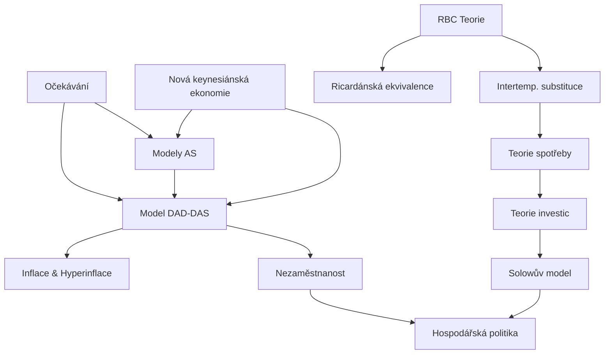

# JEB010 — Makroekonomie II: Master Synthesis

> **Lecturer:** Michal Hlaváček · UNRR (Národní rozpočtová rada)
> **Semester:** Summer 2025/2026
> **Credits:** 6 ECTS
> **Textbook:** Mankiw, N. G. (2016). *Macroeconomics* (9th ed.). Worth Publishers.
> *Last updated after: Lectures (Tier 1)*

---

## Concept Index

### I. Očekávání a agregátní nabídka
- [[Ocekavani_v_Makroekonomii]] — statická, adaptivní, racionální očekávání; Muth (1961)
- [[Modely_Agregatni_Nabidky_AS]] — 4 AS modely; $Y = Y^* + \alpha(P - P^e)$
- [[Nova_Keynesianska_Ekonomie]] — menu costs, efficiency wages, koordinační selhání

### II. Reálné hospodářské cykly
- [[Teorie_Realnych_Hospodarskych_Cyklu]] — optimalizační model; Walrasův zákon; trh zboží a peněz
- [[Intertemporalni_a_Intratemporalni_Substituce]] — Fisher model; vládní BC; udržitelnost dluhu
- [[Barro_Ricardanska_Ekvivalence]] — neutralita načasování daní; podmínky a selhání

### III. Dynamický model AD-AS
- [[Inflace_a_Hyperinflace]] — náklady inflace; seignorage; Lafferova křivka inflace
- [[Model_DAD_DAS]] — derivace DAD a DAS; sacrifice ratio; nabídkové šoky; politické reakce

### IV. Nezaměstnanost
- [[Nezamestnanost]] — definice; dynamický model; $u^* = s/(s+f)$; hystereze; Phillipsova křivka

### V. Spotřeba a investice
- [[Teorie_Spotreby]] — Keynesiánská FC; RBC; permanentní důchod (Friedman); HŽC (Modigliani); Kuznetzova hádanka
- [[01_Notes/2025_2026/Summer_Semester/JEB010_Makroekonomie_II/Lectures/Teorie_Investic]] — akcelerátor; neoklasický model; Tobin $q$; finanční akcelerátor; investice do bydlení a zásob

### VI. Ekonomický růst a hospodářská politika
- [[Solow_Model_Ekonomickeho_Rustu]] — stálý stav; zlaté pravidlo; populační a technologický růst; TFP
- [[Hospodarska_Politika_a_Debata_Pravidel]] — stabilizační politika; dynamická nekonzistence; Taylorovo pravidlo

---

## I. Očekávání a agregátní nabídka

Makroekonomie II navazuje na základní IS-LM model přidáním **dynamiky**, **očekávání** a mikroekonomicky fundovaných **rigidit**. Klíčovou otázkou je, jak agenti formují očekávání o budoucím vývoji cen, mezd a příjmů.

[[Ocekavani_v_Makroekonomii]] rozlišuje tři paradigmata: *statická* ($p_t^e = p_{t-1}$), *adaptivní* ($p_t^e = p_{t-1} + \Theta(p_{t-2}^e - p_{t-1})$) a *racionální* ($X_t^e = E(X \mid I_{t-1})$, John Muth 1961). Racionální očekávání jsou nezbysematicky chybná — Lucasova kritika implikuje, že systémová politika nemá reálné efekty.

Čtyři modely krátkodobé AS (viz [[Modely_Agregatni_Nabidky_AS]]) dospívají ke stejné rovnici $Y = Y^* + \alpha(P-P^e)$, lišící se mechanismem: strnulé mzdy (Keynesiánská rigidita), mzdová iluze (Friedman), nedokonalé informace (Lucas) a strnulé ceny (NKE). [[Nova_Keynesianska_Ekonomie]] doplňuje *menu costs* a *efficiency wages* jako mikroekonomický základ těchto rigidit.

---

## II. Reálné hospodářské cykly (RBC)

[[Teorie_Realnych_Hospodarskych_Cyklu]] (Kydland, Prescott 1982) vysvětluje cykly jako optimální reakce na technologické šoky — bez potřeby rigidit. Reprezentativní agent maximalizuje $u(c_1, c_2, L_1, L_2)$ za intertemporální BC:

$$c_1 + \frac{c_2}{1+r} \leq f_1(l_1) + \frac{f_2(l_2)}{1+r} + W$$

FOC zahrnují intra- i intertemporální podmínky (viz [[Intertemporalni_a_Intratemporalni_Substituce]]). Klíčová rozlišení: dočasný vs. permanentní šok a paralelní vs. proporcionální posun produkční funkce.

[[Barro_Ricardanska_Ekvivalence]] ukazuje, že při splnění podmínek (perfektní trhy, racionální očekávání, lump-sum daně) je načasování daní irelevantní pro soukromou spotřebu.

---

## III. Dynamický model DAD-DAS

[[Inflace_a_Hyperinflace]] kategorisuje náklady inflace (shoe leather costs $n^* = \sqrt{iY/(2tc)}$, menu costs, bracket creep) a definuje seignorage $S = m \cdot MB_{t-1}/P$ a inflační daň $\pi \cdot MB_{t-1}/P$.

[[Model_DAD_DAS]] přeformuluje AS do prostoru $(\pi, Y)$:

$$\text{DAS:} \quad \pi = \pi^e + \frac{1}{\alpha}(Y - Y^*) + \varepsilon$$

$$\text{DAD:} \quad \pi = m + \frac{h}{b}\Delta A + h\Delta\pi^e + \frac{h}{\gamma b}(Y_{t-1} - Y_t)$$

Sacrifice ratio pro USA (Volckerova dezinflace 1979–87): ~4,3 % HDP za 1 pp inflace. Na nabídkové šoky existují tři politické reakce: neutrální, akomodativní a restriktivní.

---

## IV. Nezaměstnanost

[[Nezamestnanost]] definuje populační identitu $P = U+E+O$ a klíčové ukazatele ($u = U/(U+E)$, $a = (U+E)/P$, $Y_{PC} = lp \cdot (1-u) \cdot a$). Dynamický model dává přirozenou míru:

$$u^* = \frac{s}{s+f} \qquad \text{(jednoduchý model)}$$

Hypotéza hystereze: $u > u^* \Rightarrow \uparrow u^*$ (ztráta dovedností, přetížení agentur). Phillipsova křivka: $\pi = \pi^e - \alpha(u-u^*)$.

---

## V. Spotřeba a investice

[[Teorie_Spotreby]] srovnává šest paradigmat. Klíčový výsledek: Modiglianino HŽC ($C = R/T \cdot Y$, MPC = APC = R/T) a Friedmanovo permanentní důchody ($C = c \cdot Y_P$) vysvětlují Kuznetzovu hádanku — krátkodobě MPC < 1 (APC klesá), dlouhodobě MPC = 1 (APC stabilní). Fisher s likviditním omezením: $\Delta C < \Delta Y$ krátkodobě, $\Delta C = \Delta Y$ dlouhodobě.

[[01_Notes/2025_2026/Summer_Semester/JEB010_Makroekonomie_II/Lectures/Teorie_Investic]] zahrnuje čtyři přístupy: jednoduchý akcelerátor ($I = v \cdot \Delta Y$), neoklasický model ($K^* = \alpha Y/(r+\delta)$ pro Cobb-Douglas, optimal: MPK = RCC = $P_K/P \cdot (r+\delta)$), flexibilní akcelerátor ($I = \lambda(K^* - K_{-1})$) a Tobinovo $q = \text{tržní cena}/\text{reprodukční hodnota}$.

---

## VI. Ekonomický růst a hospodářská politika

[[Solow_Model_Ekonomickeho_Rustu]]: stálý stav $s \cdot f(k^*) = (n+g+\delta) \cdot k^*$; zlaté pravidlo $MPK = n+g+\delta$; TFP (Solow reziduál) $\Delta A/A = \Delta Y/Y - \alpha \cdot \Delta K/K - (1-\alpha) \cdot \Delta L/L$.

[[Hospodarska_Politika_a_Debata_Pravidel]]: Dynamická nekonzistence (Kydland & Prescott) vede k inflačnímu biasu $\pi = a \cdot \alpha \cdot (Y^* - Y^{**})$ při diskrétní politice. Taylorovo pravidlo $i_t = \pi_t + r_t^* + a_\pi(\pi_t - \pi_t^*) + a_y(y_t - \bar{y}_t)$ jako dominantní forma inflačního cílení.

---

## Concept Map

---

## Textbook Integration

| Téma | Mankiw kapitola |
|---|---|
| Agregátní nabídka a očekávání | Kap. 13–14 |
| RBC teorie | Kap. 18 |
| Inflace a Phillipsova křivka | Kap. 15 |
| Spotřeba | Kap. 16 |
| Investice | Kap. 17 |
| Ekonomický růst (Solow) | Kap. 7–8 |
| Hospodářská politika | Kap. 15, 19 |

---

## Cross-Course Connections

| Koncept JEB010 | Prerekvizita | Kurz |
|---|---|---|
| IS-LM základ pro DAD derivaci | IS-LM model | [[JEB009_Makroekonomie_I_main]] |
| Phillipsova křivka | Agregátní poptávka a nabídka | [[JEB009_Makroekonomie_I_main]] |
| Racionální očekávání | Teorie her a očekávání | [[JEB160_Auctions_and_Game_Theory_main]] |
| Produkční funkce, MPK | Mikroekonomická teorie firmy | [[JEB108_Microeconomics_II_main]] |
| Econometrické testování modelů | OLS, testy specifikace | [[JEB109_Econometrics_I_main]] |
