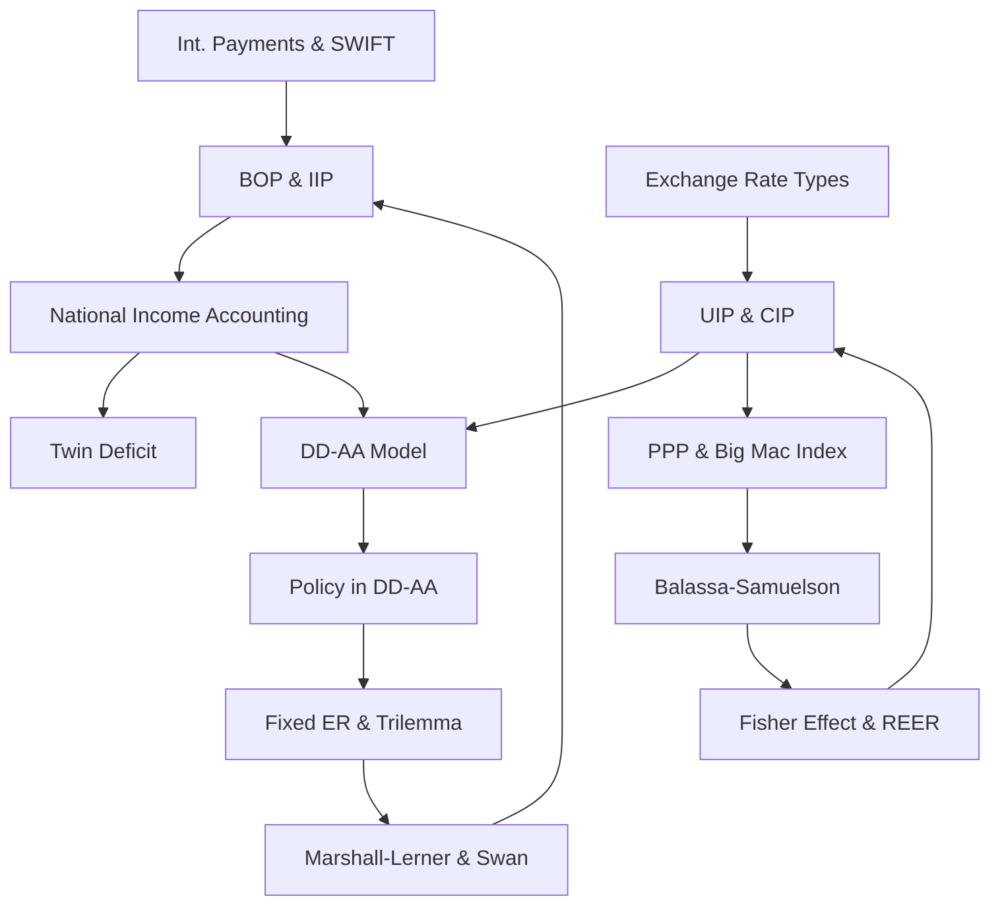

# JEB050 — International Finance: Master Synthesis

> **Lecturer:** Vilém Semerák, Ph.D. · IES FSV UK
> **Semester:** Summer 2025/2026
> **Credits:** 6 ECTS
> **Textbook:** Krugman, Obstfeld & Melitz (KOM). *International Economics: Theory and Policy* (12th ed.). Pearson.
> *Last updated after: Lectures (Tier 1)*

---

## Concept Index

### I. International Transactions and Accounting
- [[BOP_and_IIP]] — Balance of Payments structure; CA/KA/FA; IIP stock indicator; Czech IIP Sept 2025
- [[National_Income_Accounting_Open_Economy]] — $Y = C+I+G+(X-M)$; $CA = S-I$; twin deficit; saving-investment framework
- [[International_Payments_and_SWIFT]] — Correspondent banking; SWIFT architecture; financial sanctions; SPFS/CIPS

### II. Exchange Rate Determination
- [[Exchange_Rate_Types_and_Triangular_Arbitrage]] — Spot/forward; direct/indirect quotation; real exchange rate $R = E \cdot P^*/P$; triangular arbitrage
- [[UIP_and_CIP]] — Uncovered and covered interest parity; forward premium puzzle (Fama 1984); Zigraiova et al. (2020)

### III. Long-Run Exchange Rate Theory
- [[PPP_and_Big_Mac_Index]] — Absolute and relative PPP; LOOP; Big Mac Index; PPP puzzle (Rogoff 1996); non-tradables generalisation
- [[International_Fisher_Effect_and_REER]] — $R - R^* = \pi^e - \pi^{e*}$; NEER/REER derivation; CNB effective exchange rates
- [[Balassa_Samuelson_Effect]] — Two-sector model; dynamic convergence; EU price level convergence; Maastricht criteria tension

### IV. Short-Run Macroeconomic Model
- [[DD_AA_Model]] — DD curve (goods market); AA curve (asset markets); SR equilibrium; adjustment dynamics
- [[Policy_in_DD_AA]] — Temporary/permanent monetary and fiscal policy; exchange rate crowding out; monetary neutrality in the long run

### V. Fixed Exchange Rates and Policy Constraints
- [[Fixed_Exchange_Rates_and_Impossible_Trinity]] — Monetary impotence; fiscal effectiveness; devaluation; Impossible Trinity; sterilization
- [[Marshall_Lerner_Condition_and_Swan_Diagram]] — ML condition ($\eta_x + \eta_m > 1$); J-curve; Swan diagram; Tinbergen's rule; internal/external balance

---

## I. International Transactions and Accounting

International finance begins with the systematic accounting of cross-border economic activity. The **Balance of Payments** (see [[BOP_and_IIP]]) records all transactions between domestic and foreign residents as a flow over a period, structured into the Current Account ($CA$), Financial Account ($FA$), and smaller sub-accounts. Every transaction is recorded twice under double-entry bookkeeping, so the total always sums to zero: $CA + KA + FA + \Delta Reserves + E\&O = 0$.

The **International Investment Position** is the stock counterpart: Net IIP = Foreign Assets − Foreign Liabilities. The Czech Republic had a net IIP of −808 billion CZK as of September 2025, meaning it is a net debtor to the rest of the world.

The national income identity [[National_Income_Accounting_Open_Economy]] connects the CA to domestic saving and investment: $CA = S - I = (S^P - I) + (T - G)$. The **twin deficit hypothesis** observes that fiscal deficits and CA deficits tend to co-move — illustrated by US data from the 1981–85 Reagan-era episode.

Cross-border payments rely on correspondent banking and the [[International_Payments_and_SWIFT|SWIFT messaging system]]. Financial sanctions (particularly SWIFT exclusion of Russian banks in 2022) have emerged as a major foreign policy instrument, accelerating development of alternatives like Russia's SPFS and China's CIPS.

---

## II. Exchange Rate Determination

The [[Exchange_Rate_Types_and_Triangular_Arbitrage|nominal exchange rate]] $E_{CZK/EUR}$ quotes CZK per 1 EUR; a rise means CZK depreciation. The **real exchange rate** $R = E \cdot P^*/P$ measures competitiveness. In frictionless markets, **triangular arbitrage** enforces the no-arbitrage condition $S_{CZK/USD} = S_{CZK/EUR} \cdot S_{EUR/USD}$.

The asset approach to exchange rate determination rests on [[UIP_and_CIP]]:

$$R_{CZK} \approx R_\euro + \frac{E^e - E}{E} \quad \text{(UIP)}$$

$$F_{CZK/\euro} = E_{CZK/\euro} \cdot \frac{1 + R_{CZK}}{1 + R_\euro} \quad \text{(CIP)}$$

UIP is an equilibrium condition involving exchange rate risk; CIP is a pure arbitrage condition. The **forward premium puzzle** (Fama 1984) — empirical $\beta < 0$ in the regression $\Delta S = \alpha + \beta(F-S)$ — is a major anomaly: high interest rate currencies tend to appreciate rather than depreciate. A meta-analysis by Zigraiova, Havranek & Novak (2020) corrects for publication bias, finding $\hat{\beta} \approx 0.31$ (developed) and $0.98$ (emerging).

---

## III. Long-Run Exchange Rate Theory

**Purchasing Power Parity** [[PPP_and_Big_Mac_Index]] — tracing from the University of Salamanca to Gustav Cassel (1922) — holds that exchange rates should equalise price levels: $E_{PPP} = P/P^*$. Relative PPP: $\Delta E/E \approx \pi - \pi^*$. The Big Mac Index (The Economist, 1986) is an accessible single-good PPP measure; in January 2026, the CZK was 10.2% undervalued against the USD.

The **International Fisher Effect** [[International_Fisher_Effect_and_REER]] combines UIP and relative PPP to show that nominal interest rate differentials equal expected inflation differentials: $R - R^* = \pi^e - \pi^{e*}$. A rise in nominal interest rates signals higher expected inflation and currency depreciation — not an appreciation. The **NEER/REER** track effective exchange rates; for CEE convergence economies, CPI-based REER rises faster than PPI-based REER because non-tradable prices grow faster than tradable prices.

The **Balassa-Samuelson effect** [[Balassa_Samuelson_Effect]] (Balassa 1964, Samuelson 1964) explains systematic price level differences across countries. Lower productivity in tradables → lower wages → cheaper non-tradables → lower overall price level. Dynamically: as CEE economies catch up in tradables productivity, wages rise → non-tradable inflation → real appreciation. This creates tension with the Maastricht inflation criterion for euro adoption: BS-driven inflation may push a converging country above the 1.5 pp ceiling even without underlying competitiveness loss.

---

## IV. Short-Run Macroeconomic Model

The [[DD_AA_Model]] provides the core short-run open-economy framework. Output $Y$ and the exchange rate $E$ are jointly determined by:

**DD curve** (goods market): $Y = D(EP^*/P, Y-T, I, G)$, upward-sloping — depreciation raises competitiveness → aggregate demand rises → equilibrium output rises.

**AA curve** (asset markets): Combining UIP and LM ($M^s/P = L(R,Y)$), downward-sloping — higher output raises money demand → interest rate rises → exchange rate appreciates.

Equilibrium at the DD–AA intersection. Asset markets adjust instantaneously; goods markets adjust slowly.

Policy analysis in [[Policy_in_DD_AA]]:

| Policy | Curve effect | SR outcome | LR outcome |
|---|---|---|---|
| Temp. monetary expansion | AA ↑ | $Y\uparrow$, $E\uparrow$ | — (temporary) |
| Temp. fiscal expansion | DD → | $Y\uparrow$, $E\downarrow$ | — (temporary) |
| Perm. monetary expansion | AA ↑↑ (also $E^e\uparrow$) | $Y > Y^f$, $E\uparrow$ | $Y = Y^f$, $E\uparrow$ proportional |
| Perm. fiscal expansion | DD →, AA ↓ (via $E^e\downarrow$) | $Y = Y^f$ unchanged | $E\downarrow$ (permanent appreciation) |

Permanent fiscal expansion is **neutral on output** — exchange rate appreciation completely crowds out net exports.

---

## V. Fixed Exchange Rates and Policy Constraints

Under a fixed exchange rate [[Fixed_Exchange_Rates_and_Impossible_Trinity]], the CB commits to $E = \bar{E}$ via intervention. **Monetary policy is impotent**: any attempted $M^s$ expansion creates depreciation pressure → CB sells FC, buying domestic money → $M^s$ contracts back. **Fiscal policy is effective**: $G\uparrow$ → CB must supply money to keep $R = R^*$ → amplified stimulus.

**Devaluation** to $\bar{E}_1 > \bar{E}_0$: raises $EP^*/P$ → $CA \uparrow$ → $Y\uparrow$; CB accommodates by buying FC (expanding $M^s$). But whether devaluation actually improves the CA depends on the **Marshall-Lerner condition** [[Marshall_Lerner_Condition_and_Swan_Diagram]]: $\eta_x + \eta_m > 1$ (sum of export and import demand elasticities exceeds 1). Even when ML holds in the long run, the **J-curve** means the CA may deteriorate in the short run (time lags in quantity adjustment).

The **Impossible Trinity** states that a country can simultaneously maintain at most **two** of: fixed exchange rate, free capital mobility, and monetary autonomy. The eurozone combines fixed ER and capital mobility (no autonomy); China historically combined managed peg and autonomy (capital controls); floating economies combine autonomy and capital mobility.

The **Swan Diagram** (Trevor Swan 1955) maps simultaneous internal balance (IB: full employment + stable prices) and external balance (EB: CA equilibrium) in (absorption, real ER) space. IB is downward-sloping; EB is upward-sloping; their intersection is the policy optimum. **Tinbergen's rule**: achieving $n$ targets requires $n$ independent instruments — two targets (internal + external) require two instruments (expenditure-changing + expenditure-switching). The Greek debt crisis illustrates the constraint when only one instrument (austerity) was available.

---

## Concept Map

---

## Textbook Integration (KOM)

| Topic | KOM Chapter |
|---|---|
| BOP, IIP, national income accounting | Ch. 13 |
| Exchange rate determination: asset approach | Ch. 14 |
| Money, interest rates, PPP, long-run ER | Ch. 15–16 |
| DD-AA model; policy | Ch. 17 |
| Fixed exchange rates; intervention | Ch. 18 |
| International monetary systems | Ch. 19 |
| Optimum Currency Areas (monetary integration) | Ch. 20 |

---

## Cross-Course Connections

| Concept JEB050 | Prerequisite | Course |
|---|---|---|
| IS-LM foundation for DD-AA | IS-LM model; aggregate demand | [[JEB009_Makroekonomie_I_main]] |
| Rational expectations (UIP) | Rational expectations, Muth (1961) | [[JEB010_Makroekonomie_II_main]] |
| Dynamic consistency of ER policy | Kydland-Prescott, inflation bias | [[JEB010_Makroekonomie_II_main]] |
| Regression testing (forward premium puzzle) | OLS, t-tests, panel data | [[JEB109_Econometrics_I_main]] |
| Tobin q and investment under fixed ER | Neoclassical investment model | [[JEB010_Makroekonomie_II_main]] |
| Game theory in sanctions design | Nash equilibrium, strategic interaction | [[JEB160_Auctions_and_Game_Theory_main]] |
