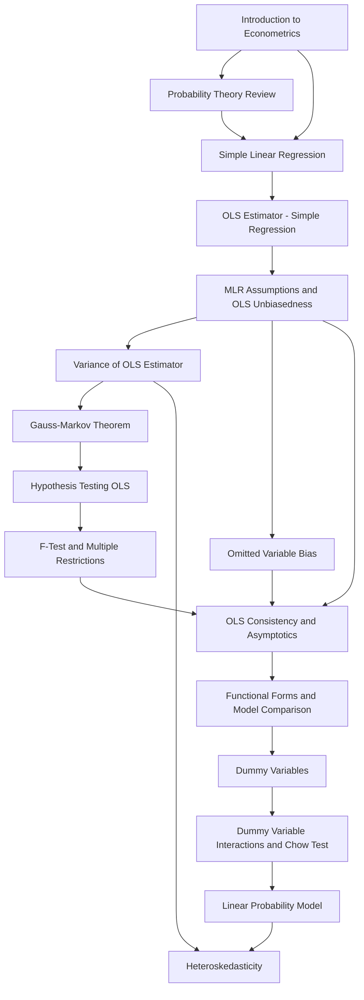

# JEB109 — Econometrics I: Master Synthesis

> **Lecturer:** Jiri Kukacka, Ph.D. · Institute of Economic Studies, FSS, Charles University
> **Semester:** Summer Semester 2026
> **Credits:** 6 ECTS
> **Textbook:** Wooldridge, J. M. (2012). *Introductory Econometrics: A Modern Approach*, 5th ed.
> *Last updated after: Lectures (Tier 1) — Lectures 01–10*

---

## Concept Index

### I. Foundations and Statistics Review

- [[Introduction_to_Econometrics]]
- [[Probability_Theory_Review]]

### II. Simple Linear Regression (SLR)

- [[Simple_Linear_Regression]]
- [[OLS_Estimator_Simple_Regression]]

### III. Multiple Linear Regression (MLR) — Estimation

- [[MLR_Assumptions_and_OLS_Unbiasedness]]
- [[Variance_of_OLS_Estimator]]
- [[Omitted_Variable_Bias]]

### IV. Statistical Inference

- [[Gauss_Markov_Theorem]]
- [[Hypothesis_Testing_OLS]]
- [[F_Test_and_Multiple_Restrictions]]

### V. Asymptotics and Large-Sample Theory

- [[OLS_Consistency_and_Asymptotics]]

### VI. Model Specification and Qualitative Data

- [[Functional_Forms_and_Model_Comparison]]
- [[Dummy_Variables]]
- [[Dummy_Variable_Interactions_and_Chow_Test]]

### VII. Binary Dependent Variables

- [[Linear_Probability_Model]]

### VIII. Heteroskedasticity

- [[Heteroskedasticity]]

---

## I. Foundations and Statistics Review

**Econometrics** combines economic theory, mathematical statistics, and data to quantify causal relationships among economic variables. Unlike controlled experiments, most econometric data are **observational**, making the identification of ceteris paribus effects the central challenge. The dominant data structures are **cross-sections**, **time series**, and **panel data** — see [[Introduction_to_Econometrics]].

The statistical prerequisites crucial for the course include the properties of the **Normal**, **$\chi^2$**, **$t$**, and **$F$ distributions**, the **Law of Large Numbers (LLN)**, and the **Central Limit Theorem (CLT)**. These underpin both finite-sample inference (exact $t$ and $F$ statistics under normality) and asymptotic inference (which rescues inference when the normality assumption fails). For details see [[Probability_Theory_Review]].

---

## II. Simple Linear Regression (SLR): Model and OLS Derivation

The **SLR model** is $y = \beta_0 + \beta_1 x + u$. The slope $\beta_1$ measures the ceteris paribus change in $y$ per unit increase in $x$; the error $u$ absorbs all other determinants of $y$. The critical identification assumption is **SLR.4 zero conditional mean**: $E(u \mid x) = 0$, which ensures $x$ is exogenous and gives the **Population Regression Function (PRF)** $E(y \mid x) = \beta_0 + \beta_1 x$ — see [[Simple_Linear_Regression]].

The **OLS estimator** can be derived two ways — both yield the same closed form (see [[OLS_Estimator_Simple_Regression]]):

1. **Method of Moments:** Replace population moment conditions $E(u) = 0$ and $\text{Cov}(x, u) = 0$ with sample analogues.
2. **Least Squares:** Minimise $\text{SSR} = \sum_{i=1}^n (y_i - \hat\beta_0 - \hat\beta_1 x_i)^2$.

The OLS slope formula:

$$\hat\beta_1^{\text{OLS}} = \frac{\sum_{i=1}^n (x_i - \bar x)(y_i - \bar y)}{\sum_{i=1}^n (x_i - \bar x)^2}.$$

The **coefficient of determination** $R^2 = 1 - \text{SSR}/\text{SST} \in [0,1]$ measures the fraction of variance explained by the regression.

---

## III. Multiple Linear Regression (MLR): Estimation and Unbiasedness

The **MLR model** $y = \beta_0 + \beta_1 x_1 + \cdots + \beta_k x_k + u$ adds multiple regressors to control for confounds, enabling ceteris paribus interpretation of each $\hat\beta_j$. In matrix form: $\mathbf{Y} = \mathbf{X}\boldsymbol\beta + \mathbf{u}$, with the OLS estimator:

$$\hat{\boldsymbol\beta}^{\text{OLS}} = (\mathbf{X}^T\mathbf{X})^{-1}\mathbf{X}^T\mathbf{Y}.$$

Under **MLR.1–MLR.4** (linearity, random sampling, no perfect collinearity, zero conditional mean), OLS is **unbiased**: $E(\hat{\boldsymbol\beta}) = \boldsymbol\beta$ — see [[MLR_Assumptions_and_OLS_Unbiasedness]].

The **variance** of $\hat\beta_j$ under MLR.1–MLR.5 (adding homoskedasticity):

$$\text{Var}(\hat\beta_j) = \frac{\sigma^2}{\text{SST}_j(1 - R_j^2)},$$

where $R_j^2$ is from regressing $x_j$ on all other regressors. The **Variance Inflation Factor** $\text{VIF}_j = 1/(1-R_j^2)$ summarises the penalty of multicollinearity — see [[Variance_of_OLS_Estimator]].

**Omitted Variable Bias (OVB):** When a relevant variable correlated with included regressors is omitted, OLS is systematically biased. The bias formula:

$$\text{Bias}(\hat\beta_1) = \beta_2 \cdot \frac{\text{Cov}(x_1, x_2)}{\text{Var}(x_1)}.$$

The direction is determined by sign($\beta_2$) × sign(Corr$(x_1, x_2)$) — see [[Omitted_Variable_Bias]].

---

## IV. Statistical Inference

### Gauss-Markov Theorem

Under MLR.1–MLR.5 (the Gauss-Markov assumptions), OLS is **BLUE** — Best Linear Unbiased Estimator. No other linear unbiased estimator has smaller variance. Adding MLR.6 (normality of $u$) gives the full **Classical Linear Model (CLM)**, under which $\hat\beta_j \sim N(\beta_j, \sigma^2[(\mathbf{X}^T\mathbf{X})^{-1}]_{jj})$ exactly — see [[Gauss_Markov_Theorem]].

### t-Test and Confidence Intervals

Under CLM assumptions:

$$\frac{\hat\beta_j - \beta_j}{\text{se}(\hat\beta_j)} \sim t_{n-k-1}.$$

The **t ratio** $t_{\hat\beta_j} = \hat\beta_j / \text{se}(\hat\beta_j)$ tests $H_0{:}\ \beta_j = 0$. Reject at level $\alpha$ if $|t_{\hat\beta_j}| > c_{\alpha/2}$. The $(1-\alpha)$ **confidence interval**: $\hat\beta_j \pm t_{n-k-1,1-\alpha/2}\cdot\text{se}(\hat\beta_j)$. For testing linear combinations $H_0{:}\ \beta_1 - \beta_2 = 0$, reparameterise the model to avoid computing cross-covariances — see [[Hypothesis_Testing_OLS]].

### F-Test and LM Test

The **F statistic** tests $q$ simultaneous linear restrictions by comparing restricted and unrestricted models:

$$F = \frac{(\text{SSR}_{\text{R}} - \text{SSR}_{\text{UR}})/q}{\text{SSR}_{\text{UR}}/(n-k-1)} \sim F_{q,\, n-k-1}.$$

The **Lagrange Multiplier (LM) test** is an asymptotic alternative: $\text{LM} = nR^2_{\tilde u} \overset{a}{\sim} \chi^2_q$. It requires only estimation of the restricted model and is valid without MLR.6 — see [[F_Test_and_Multiple_Restrictions]].

---

## V. Asymptotics

**Consistency** (plim $\hat\beta_j = \beta_j$ as $n \to \infty$) holds under MLR.1–MLR.3 and the weaker MLR.4′ (zero correlation). **Asymptotic normality** holds under MLR.1–MLR.5; the CLT ensures $t$ and $F$ statistics are approximately valid even without MLR.6. OLS remains **asymptotically efficient** (smallest asymptotic variance) under the Gauss-Markov assumptions. Inconsistency due to omitted variables: plim$(\hat\beta_1) - \beta_1 = \text{Cov}(x_1, u)/\text{Var}(x_1)$ — see [[OLS_Consistency_and_Asymptotics]].

---

## VI. Functional Forms and Qualitative Data

**Functional form flexibility**: Level-log, log-level, log-log, quadratic, and interaction specifications extend OLS to non-linear relationships while preserving the linearity-in-parameters requirement. Data scaling affects estimates and SEs proportionally but leaves $t$ statistics and $p$-values unchanged. The **adjusted $\bar R^2$** penalises for additional regressors and increases only when the added variable's $|t| > 1$ — see [[Functional_Forms_and_Model_Comparison]].

**Dummy variables** encode qualitative information by creating 0/1 indicator variables. An **intercept dummy** shifts the regression function vertically:

$$D_i = 1: \quad y_i = (\beta_0 + \beta_k) + \beta_1 x_{i,1} + \cdots + u_i$$

The **dummy variable trap** — perfect collinearity from including all group dummies — is avoided by omitting one base group. For ordinal data, the choice between a single ordinal regressor and a full set of dummies depends on whether equal-interval increments are assumed — see [[Dummy_Variables]].

**Dummy interactions and the Chow test**: interactions between two dummies (or a dummy and a continuous variable — the **slope dummy**) allow group-specific intercepts *and* slopes:

$$y = \beta_0 + \beta_1 x + \beta_2 D + \beta_3 Dx + u \implies \begin{cases} D=0: & y = \beta_0 + \beta_1 x \\ D=1: & y = (\beta_0+\beta_2) + (\beta_1+\beta_3) x \end{cases}$$

The **Chow test** checks full parameter stability across subgroups via the $F$ statistic:

$$F = \frac{\text{SSR}_P - (\text{SSR}_1 + \text{SSR}_2)}{\text{SSR}_1 + \text{SSR}_2} \cdot \frac{n - 2(k+1)}{k+1} \sim F_{k+1,\; n-2(k+1)}$$

See [[Dummy_Variable_Interactions_and_Chow_Test]].

---

## VII. Binary Dependent Variables: Linear Probability Model

When the dependent variable $y \in \{0,1\}$ is binary (loan approval, employment, home ownership), applying OLS directly to the standard MLR specification yields the **Linear Probability Model (LPM)**:

$$p(\mathbf{X}) \equiv P(y = 1 \mid \mathbf{X}) = \mathbb{E}(y \mid \mathbf{X}) = \beta_0 + \beta_1 x_1 + \cdots + \beta_k x_k$$

Each $\beta_j$ measures the change in the **probability of success** per unit change in $x_j$. Under MLR.1–4, OLS is still unbiased and consistent.

The LPM has four well-known shortcomings: (1) predicted probabilities can fall outside $[0,1]$; (2) marginal effects are constant rather than S-shaped; (3) the error is **inherently heteroskedastic** with $\text{Var}(u \mid \mathbf{X}) = p(\mathbf{X})(1 - p(\mathbf{X}))$; (4) the error is non-normal. Despite these, the LPM remains widely used because it is easy to estimate and interpret, and inference can be repaired with robust SEs or WLS — see [[Linear_Probability_Model]].

---

## VIII. Heteroskedasticity

**Heteroskedasticity** occurs when $\text{Var}(u_i \mid \mathbf{X}) = \sigma_i^2 \neq \sigma^2$ (violation of MLR.5). It leaves OLS **unbiased and consistent** but destroys efficiency and invalidates standard errors, $t$ statistics, $F$ statistics, and LM statistics even asymptotically.

Three complementary responses:

**1. Heteroskedasticity-robust (White) standard errors.** Replace the standard SE formula with the sandwich estimator:
$$\widehat{\text{Var}}(\hat\beta_j) = \frac{\sum_{i=1}^n \hat{u}_i^2 \hat{r}_{ij}^2}{\text{SSR}_j^2}$$
Valid asymptotically for any heteroskedasticity form (requires $n - k - 1 \geq 120$). Construct $t$ statistics and CIs as usual.

**2. Testing for heteroskedasticity.**
- **Breusch-Pagan test**: regress $\hat{u}^2$ on all regressors; test $H_0: \delta_1 = \cdots = \delta_k = 0$ by $F$ or LM ($\chi^2_k$).
- **White test**: extend the auxiliary regression to include squared regressors and cross-products; or use the condensed version $\hat{u}^2 = \delta_0 + \delta_1\hat{y} + \delta_2\hat{y}^2 + v$ ($\chi^2_2$).

**3. Weighted/Feasible GLS.**
When $h(\mathbf{X})$ is known exactly, **WLS** (dividing all variables by $\sqrt{h_i}$) is BLUE. When $h(\mathbf{X})$ must be estimated (typically via a log-auxiliary regression), **FGLS** is consistent and asymptotically more efficient than OLS but biased in small samples.

See [[Heteroskedasticity]].

---

## Concept Map

---

## Textbook Integration

| Concept | Wooldridge Chapter(s) |
|---------|----------------------|
| Data structures, introduction | Ch. 1; App. B, C.3, C.6 |
| SLR model and OLS derivation | Ch. 2 |
| MLR model, matrix notation | Ch. 3 |
| OLS variance, Gauss-Markov | Ch. 3.4, 3.5 |
| Omitted variable bias | Ch. 3.3 |
| Inference, t and F tests | Ch. 4 |
| Asymptotics, LM test | Ch. 5 |
| Functional forms, adjusted $R^2$ | Ch. 6 |
| Dummy variables, qualitative data | Ch. 7.1–7.3 |
| Dummy interactions, slope dummies, Chow test | Ch. 7.4–7.7 |
| Linear Probability Model | Ch. 7.5 |
| Heteroskedasticity, robust SEs, WLS, FGLS | Ch. 8 |

---

## Cross-Course Connections

| Concept | Connected Course |
|---------|-----------------|
| Distributions ($\chi^2$, $t$, $F$), LLN, CLT | [[JEB105_Statistics_main]] |
| Confidence intervals, hypothesis testing | [[JEB105_Statistics_main]] |
| Maximum Likelihood Estimation | [[JEB105_Statistics_main]] |
| Wage and labour market applications | [[JEB104_Microeconomics_I_main]] |
| CAPM and asset pricing (F-test example) | [[JEB027_Finanční_Ekonomie_main]] |
| Matrix algebra, derivatives | JEB029 Matematika IV |
| Binary choice models (logit/probit) — extension of LPM | JEB110 Econometrics II |
