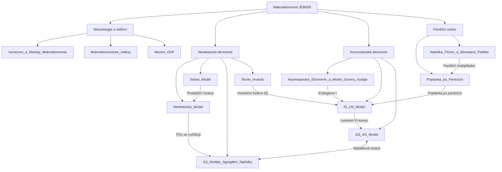

# JEB009 — Makroekonomie I: Master Synthesis

> **Vyučující:** Michal Hlaváček · ÚNRR (Úřad pro rozpočtovou odpovědnost)
> **Semestr:** Winter 2025/2026
> **Kredity:** 6 ECTS
> **Učebnice:** Cahlík, Hlaváček, Seidler: *Makroekonomie* (Karolinum 2010); Mankiw: *Macroeconomics* (9th ed., 2016); Dornbusch, Fisher, Startz: *Macroeconomics* (11th ed., 2011)
> *Last updated after: Lectures (Tier 1)*

---

## Concept Index

### I. Metodologie a měření

- [[Vymezeni_a_Metody_Makroekonomie]] — Definice, nástroje, architektura modelů, hospodářský cyklus, Okunův zákon, Phillipsova křivka
- [[Makroekonomicke_Indexy]] — Stavové vs. tokové indexy, CPI, Laspeyres vs. Paasche, trh práce, HDP
- [[Mereni_HDP]] — Systém národních účtů (SNA), základní identity, I-O analýza, Leontievova inverze, tři metody HDP

### II. Neoklasická ekonomie

- [[Neoklasicky_Model]] — Produkční funkce, maximalizace zisku, trhy v rovnováze, klasická dichotomie, kvantitativní teorie peněz
- [[Solow_Model]] — Stálý stav, zlaté pravidlo, populační a technologický růst, growth accounting, Solow reziduál

### III. Agregátní nabídka

- [[AS_Modely_Agregátní_Nabídky]] — 4 modely AS (sticky wage, worker misperception, imperfect information, sticky price), odvození z Phillipsovy křivky, cyklické chování W/P

### IV. Investice

- [[01_Notes/2025_2026/Winter_Semester/JEB009_Makroekonomie_I/Lectures/Teorie_Investic]] — Jednoduchý akcelerátor, neoklasický přístup (RCC, Cobb-Douglas), flexibilní akcelerátor, Tobinovo q, investice do bydlení a zásob

### V. Keynesiánská ekonomie a fiskální politika

- [[Keynesianska_Ekonomie_a_Model_Duveru_Vydaje]] — Model D-V, spotřební funkce, keynesiánský multiplikátor, veřejný sektor, Haavelmo teorem, otevřená ekonomika, pravidla fiskální odpovědnosti

### VI. IS-LM model

- [[IS_LM_Model]] — Křivka IS, křivka LM, teorie preference likvidity, multiplikátor fiskální a monetární politiky, past likvidity, past investic, klasický případ, vytlačování, koordinace politik

### VII. AD-AS model

- [[AD_AS_Model]] — Odvození AD z IS-LM, Cambridgský a Keynesův efekt, krátkodobé a dlouhodobé efekty, speciální případy, kritika IS-LM

### VIII. Poptávka po penězích

- [[Poptavka_po_Penezich]] — Peněžní agregáty, kvantitativní teorie (Fisher, Marshall), Tobinův portfoliový model, Friedmanův model, Baumol-Tobinův model, elasticity

### IX. Nabídka peněz a monetární politika

- [[Nabidka_Penez_a_Monetarni_Politika]] — Bilance ČNB, MB, peněžní multiplikátor, nástroje CB (konvenční i nekonvenční), transmisní mechanismy, cíle CB, dynamická nekonzistence, Taylorovo pravidlo, IS-MP-IA model

---

## I. Metodologie a měření

Makroekonomie analyzuje ekonomiku jako celek prostřednictvím agregátních veličin — HDP, cenové hladiny, nezaměstnanosti a platební bilance. Narozdíl od mikroekonomie nesleduje chování jednotlivých agentů, ale hledá rovnovážné stavy celého systému (viz [[Vymezeni_a_Metody_Makroekonomie]]).

**Architektura modelů:** Každý model transformuje exogenní vstupy na endogenní výstupy za daných předpokladů. Klíčové rozlišení je mezi krátkým a dlouhým obdobím: v krátkém období jsou ceny strnulé, v dlouhém flexibilní.

**Měření:** Třemi metodami výpočtu HDP — výdajová ($Y = C + I + G + NX$), důchodová ($Y = w + \pi + \text{depr}$) a produkční ($Y = \sum VA_i$) — dostaneme vždy tentýž výsledek díky účetní identitě SNA. Cenové indexy (CPI, deflátor) systematicky nadhodnocují inflaci kvůli substitučnímu, kvalitativnímu a novoprodukt­ovému zkreslení (viz [[Makroekonomicke_Indexy]], [[Mereni_HDP]]).

---

## II. Neoklasická ekonomie

Neoklasika předpokládá **trhy, které se vyčišťují** (*market clearing*) a **dokonalou konkurenci**. Výstup je vždy na úrovni potenciálu $Y^P$ a změny agregátní poptávky se přenáší pouze do cenové hladiny — platí **klasická dichotomie** (viz [[Neoklasicky_Model]]).

Jádrem je **maximalizace zisku** firem při CRS produkční funkci $F(K;L)$: optimum nastane při $MPL = W/P$ a $MPK = r$. Kvantitativní teorie peněz $M \cdot V = P \cdot Y$ uzavírá model určením $P$.

**Solowův model** (viz [[Solow_Model]]) vysvětluje, proč ekonomiky dlouhodobě rostou a proč bohatší ekonomiky rostou pomaleji (*konvergence*). Ve stálém stavu $s \cdot f(k^*) = (n + g + \delta) \cdot k^*$ je per-capita výstup $Y/L$ konstantní a roste pouze díky technologickému pokroku $g$. Solow reziduál ($TFP$) zachycuje veškerý nevysvětlený růst.

---

## III. Agregátní nabídka

Čtyři modely AS odvozují **krátkodobou rostoucí křivku AS**: $Y = Y^* + \alpha(P - P^e)$. Odlišují se tím, zda se trhy vyčišťují a kde leží nedokonalost (trh práce vs. zboží), a interpretací $P^e$ (viz [[AS_Modely_Agregátní_Nabídky]]).

**Dlouhodobá AS** je vždy vertikální na $Y^P$ — v dlouhém období se $P^e$ přizpůsobí. Model strnulých mezd (M.S.M.) a strnulých cen (M.S.C.) produkuje delší hospodářské cykly (ceny se uzamknou ve smlouvách); modely mzdové a cenové iluze produkují krátké cykly (iluze rozptýlena do 1–2 měsíců).

---

## IV. Investice

Investice jsou nejvíce volatilní složkou AD a klíčovým determinantem dlouhodobé AS prostřednictvím akumulace kapitálu (viz [[01_Notes/2025_2026/Winter_Semester/JEB009_Makroekonomie_I/Lectures/Teorie_Investic]]).

**Neoklasický přístup** definuje optimální kapitálovou zásobu z $MPK = RCC = (r + \delta) P_K/P$. Pro Cobb-Douglas: $K^* = \alpha Y / (r + \delta)$. **Tobinovo $q$** rozšiřuje model o instalační náklady a propojuje investice s cenovými pohyby na akciovém trhu ($q > 1 \implies I \uparrow$). Likviditní omezení (asymetrická informace, adverse selection) způsobuje, že investice závisejí i na interních zdrojích firem.

---

## V. Keynesiánská ekonomie a fiskální politika

**Model Důchod–výdaje** vychází z předpokladu horizontální AS (ceny fixní) a efektivní poptávky (viz [[Keynesianska_Ekonomie_a_Model_Duveru_Vydaje]]). Rovnovážný výstup:

$$Y^* = \frac{1}{1 - c(1-t)} \cdot A = \mu_t \cdot A$$

**Multiplikátor** $\mu_t > 1$ — každý nárůst autonomních výdajů o 1 Kč zvyšuje výstup o více než 1 Kč díky kaskádě výdajů.

**Haavelmo/multiplikátor vyrovnaného rozpočtu = 1:** Simultánní nárůst $G$ a $TA$ o $\Delta G$ zvýší $Y$ právě o $\Delta G$.

---

## VI. IS-LM model

IS-LM model (Hicks 1937) endogenizuje úrokovou míru: rovnováha musí nastat simultánně na trhu zboží (křivka IS) i na trhu peněz (křivka LM), viz [[IS_LM_Model]].

Multiplikátor fiskální politiky v IS-LM:
$$\alpha_G = \frac{\mu_t h}{h + \mu_t bk} < \mu_t$$

je menší než keynesiánský multiplikátor kvůli **vytlačování investic** ($G \uparrow \implies i \uparrow \implies I \downarrow$). V **pasti likvidity** ($h \to \infty$) je fiskální politika maximálně účinná, monetární politika neúčinná. V **klasickém případě** ($h \to 0$) je naopak monetární politika maximálně účinná.

---

## VII. AD-AS model

AD-AS model uvolňuje předpoklad fixní cenové hladiny IS-LM (viz [[AD_AS_Model]]). Křivka AD odvozená z IS-LM je klesající: $P \downarrow \implies M/P \uparrow \implies$ (Keynesův efekt) $i \downarrow \implies I \uparrow \implies Y \uparrow$.

Fiskální expanze: krátkodobě zvyšuje $Y$ i $P$; v dlouhém období — adaptace $P^e$ — vrací $Y$ na $Y^P$ a inflace je vyšší. Výsledek závisí na sklonu SRAS (resp. modelech AS).

---

## VIII–IX. Peněžní sektor

Poptávka po penězích má tři motivy (transakční, opatrnostní, spekulativní). **Baumol-Tobinův model** ukazuje, že důchodová elasticita $M^d$ = 1/2 (nikoli 1) díky úsporám z rozsahu. **Friedmanův model** zpochybňuje citlivost $M^d$ na $i$ (přes stabilitu $Y^P$), viz [[Poptavka_po_Penezich]].

Nabídka peněz je určena peněžní bází $MB$ a multiplikátorem $m = (cu+1)/(cu+r_D)$. ČNB ovlivňuje $MB$ zejména prostřednictvím REPO operací (OMO). Nekonvenční nástroje (QE, forward guidance, kurzový závazek) byly masivně využity po roce 2008 a v ČR 2013–2017. **Dynamická nekonzistence** (Kydland-Prescott) vysvětluje, proč CB volí pravidla (inflační cílování, Taylorovo pravidlo) namísto diskrétní politiky, viz [[Nabidka_Penez_a_Monetarni_Politika]].

---

## Concept Map

---

## Textbook Integration

| Concept Note | Cahlík–Hlaváček (2010) | Mankiw (9th ed.) | Dornbusch–Fisher–Startz (11th ed.) |
|---|---|---|---|
| [[Vymezeni_a_Metody_Makroekonomie]] | Kap. 1 | Ch. 1 | Ch. 1 |
| [[Mereni_HDP]] | Kap. 2 | Ch. 2 | Ch. 2 |
| [[Makroekonomicke_Indexy]] | Kap. 2 | Ch. 2 | Ch. 2 |
| [[Neoklasicky_Model]] | Kap. 3 | Ch. 3 | Ch. 3 |
| [[Solow_Model]] | Kap. 4 | Ch. 8 | Ch. 3 |
| [[AS_Modely_Agregátní_Nabídky]] | Kap. 5 | Ch. 14 | Ch. 7 |
| [[01_Notes/2025_2026/Winter_Semester/JEB009_Makroekonomie_I/Lectures/Teorie_Investic]] | Kap. 6 | Ch. 19 | Ch. 9 |
| [[Keynesianska_Ekonomie_a_Model_Duveru_Vydaje]] | Kap. 7 | Ch. 11 | Ch. 8 |
| [[IS_LM_Model]] | Kap. 8 | Ch. 11–12 | Ch. 10–11 |
| [[AD_AS_Model]] | Kap. 9 | Ch. 13 | Ch. 12 |
| [[Poptavka_po_Penezich]] | Kap. 10 | Ch. 4–5 | Ch. 18 |
| [[Nabidka_Penez_a_Monetarni_Politika]] | Kap. 11 | Ch. 4–5, 15 | Ch. 18–19 |

---

## Cross-Course Connections

| Téma JEB009 | Příbuzné kurzy | Popis vazby |
|---|---|---|
| Produkční funkce, MPL, MPK | [[JEB108_Microeconomics_II_main\|JEB108 Mikroekonomie II]] | Teorie firmy, volba výrobních faktorů |
| Národní účty, HDP identity | [[JEB044_Financial_Accounting_main]] | Účetní zachycení toků |
| Solow reziduál, growth accounting | [[JEB109_Econometrics_I_main\|JEB109 Econometrics I]] | Regresní analýza, OLS v kontextu produkčních funkcí |
| Inflace, cenové indexy | [[JEB105_Statistics_main\|JEB105 Statistics]] | Indexy, pravděpodobnostní výpočty |
| IS-LM model, monetární politika | [[JEB010_Makroekonomie_II_main\|JEB010 Makroekonomie II]] | Otevřená ekonomika, model Mundell-Fleming |
| Teorie portfolia, Tobinovo q | [[JEB027_Finanční_Ekonomie_main]] | CAPM, ceny aktiv |
| Dynamická nekonzistence, hry | [[JEB160_Auctions_and_Game_Theory_main\|JEB160 Auctions and Game Theory]] | Teorie her, Nash equilibrium |
| Kurz, NX, platební bilance | [[JEB050_International_Finance_main\|JEB050 International Finance]] | IS-LM-BP, Mundell-Fleming |
