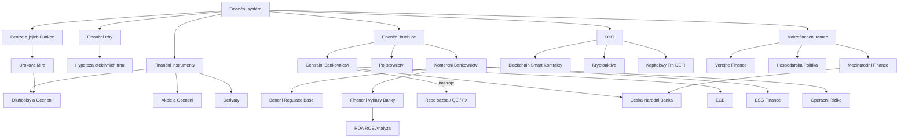

# JEB027 — Finanční Ekonomie: Master Synthesis

> **Přednášející:** prof. PhDr. Petr Teplý, Ph.D. · Institut ekonomických studií FSV UK
> **Semestr:** Zimní semestr 2025/2026
> **Kredity:** 6 ECTS
> **Učebnice:** Mejstřík, M. et al. (2014). *Bankovnictví v teorii a praxi*. Praha: Karolinum
> *Last updated after: Lectures (Tier 1)*

---

## Concept Index

### I. Základy finančního systému

- [[Uvod_do_Financni_Ekonomie]]
- [[Penize_a_jejich_Funkce]]
- [[Urokova_Mira_a_Casova_Hodnota_Penez]]

### II. Finanční trhy a instrumenty

- [[Financni_Trhy]]
- [[Hypoteza_Efektivnich_Trhu]]
- [[Financni_Instrumenty]]
- [[Dluhopisy_a_Oceneni]]
- [[Akcie_a_Oceneni]]

### III. Komerční bankovnictví a regulace

- [[Financni_Vykazy_Banky]]
- [[ROA_ROE_Analyza]]
- [[Komercni_Bankovnictvi]]
- [[Bancni_Regulace_a_Basel]]

### IV. DeFi, Blockchain a Fintech

- [[Decentralizovane_Finance]]
- [[Blockchain_a_Smart_Kontrakty]]
- [[Kryptoaktiva]]
- [[Kapitalovy_Trh_a_DEFI]]

### V. Riziko a nefinanční finanční instituce

- [[Operacni_Riziko]]
- [[Pojistovnictvi]]
- [[ESG_Finance]]

### VI. Makrofinanční rámec

- [[Verejne_Finance]]
- [[Hospodarska_Politika]]
- [[Mezinarodni_Finance_JEB027]]

### VII. Centrální bankovnictví

- [[Centralni_Bankovnictvi]]
- [[Ceska_Narodni_Banka]]

---

## I. Základy finančního systému

**Finanční systém** zprostředkovává tok fondů od přebytkových subjektů (věřitelé, spořitelé) k deficitním subjektům (dlužníci, investoři). Jeho pilíře jsou [[Financni_Trhy]], finanční instituce a [[Financni_Instrumenty]]. Peníze — jakožto prostředek směny, zúčtovací jednotka a uchovatel hodnoty (viz [[Penize_a_jejich_Funkce]]) — jsou klíčovým médiem tohoto systému. Jejich množství v ekonomice je měřeno měnovými agregáty M0–M3, přičemž [[Centralni_Bankovnictvi]] kontroluje měnovou bázi prostřednictvím repo operací a dalších nástrojů. Peněžní multiplikátor (M2/MB) propojuje měnový základ s širší peněžní zásobou, ale po globální finanční krizi 2007–2009 tento mechanismus výrazně selhal.

Klíčovým konceptem spojeným s hodnocením finančních aktiv je [[Urokova_Mira_a_Casova_Hodnota_Penez]]: $PV = FV/(1+r)^n$. Fisherova rovnice $(1+i) = (1+r)(1+\pi)$ odděluje nominální a reálné efekty, výnosová křivka modeluje termínovou strukturu úrokových sazeb.

---

## II. Finanční trhy a instrumenty

[[Financni_Trhy]] jsou organizovaná místa pro obchodování s [[Financni_Instrumenty]]. Dělí se na peněžní trh (splatnost do 1 roku) a kapitálový trh (splatnost nad 1 rok), na primární a sekundární, a na burzovní a OTC. Hypotéza efektivních trhů ([[Hypoteza_Efektivnich_Trhu]], Fama 1970) říká, že ceny plně odrážejí dostupné informace. Slabá forma popírá technickou analýzu, polosilná i fundamentální, silná dokonce i insider trading. Behaviorální finance (Kahneman, Thaler) však identifikují systematické odchylky — overconfidence, herding, loss aversion, momentum efekt.

**Dluhopisy** ([[Dluhopisy_a_Oceneni]]): Cena $P = \sum C/(1+r)^t + F/(1+r)^n$; cena a výnos jsou inverzní. Modifikovaná durace $D_{Mod}$ měří citlivost na sazby; konvexita koriguje lineární aproximaci. Kreditní riziko se odráží ve yieldovém spreadu nad bezrizikovým benchmarkem; ratingové agentury (Moody's, S&P, Fitch) rozdělují emitenty do investment grade a high yield.

**Akcie** ([[Akcie_a_Oceneni]]): Gordonův model $P_0 = D_1 / (r_e - g)$; DCF přes FCFF/WACC; CAPM definuje požadovaný výnos $r_e = r_f + \beta(r_m - r_f)$. Relativní ocenění: P/E, P/BV, EV/EBITDA.

**Deriváty** (součást [[Financni_Instrumenty]]): Opce (Black-Scholes: $C = S_0 N(d_1) - Ke^{-rT}N(d_2)$), futures (standardizované, clearing), forwardy (OTC, kreditní riziko), swapy (IRS — výměna fixní za variabilní sazbu; CCS — měnový swap).

---

## III. Komerční bankovnictví a regulace

Komerční banka plní 4 funkce: přijímání depozit, poskytování úvěrů, platební styk a transformaci splatností (viz [[Komercni_Bankovnictvi]]). Tato transformace generuje úrokové riziko a riziko likvidity. Výkonnost bank se hodnotí přes [[ROA_ROE_Analyza]]: $ROE = ROA \times EM$; DuPont rozklad odhaluje zdroje rentability. Trojúhelník vysoké ziskovosti bank v ČR: vysoká NIM + nízký C/I + nízký NPL.

Bankovní regulace ([[Bancni_Regulace_a_Basel]]): Basel III definuje tři typy kapitálu (CET1 ≥ 4,5 %; Tier1 ≥ 6 %; CAR ≥ 8 % RWA), pákový poměr ≥ 3 %, LCR ≥ 100 % a NSFR ≥ 100 %. EU rámec: CRD IV/CRR, BRRD (bail-in), SSM (ECB dohled). Ochrana vkladů: DGS — pojistí vklady do 100 000 EUR.

Finanční výkazy banky ([[Financni_Vykazy_Banky]]): Rozvaha zachycuje transformaci krátkodobých pasiv (depozita) na dlouhodobá aktiva (úvěry). P&L ukazuje NIM = Čisté úrokové výnosy / Úrokové aktiva.

---

## IV. DeFi, Blockchain a Fintech

[[Decentralizovane_Finance|DeFi]] jsou finanční služby na DLT bez tradičních zprostředkovatelů. Základem je [[Blockchain_a_Smart_Kontrakty|blockchain]] — distribuovaná, neměnná databáze s konsenzuálními algoritmy (PoW, PoS). Smart kontrakty (principy „Code is Law") automaticky vykonávají podmíněné finanční operace. [[Kryptoaktiva]] jsou digitální aktiva (nehmotná movitá věc — nikoliv „kryptoměna"), lišící se od CBDC (závazek CB, legální platidlo, pevná hodnota). Stablecoiny (USDC, DAI) se snaží eliminovat volatilitu; selhání TerraUST (2022) upozornilo na systémové riziko v DeFi.

[[Kapitalovy_Trh_a_DEFI|Kapitálový trh DeFi]]: DEX (Uniswap — AMM, $xy = k$) vs. CEX (Coinbase); tokenizace RWA (nemovitosti, státní dluhopisy on-chain); DeFi lending (Aave — overcollateralized, Health Factor, flash loans). Regulace: MiCA (EU 2024), STABLE/GENIUS Act (USA).

---

## V. Riziko a nefinanční finanční instituce

[[Operacni_Riziko]] (Basel definice): Riziko z nedostatečných procesů, lidí, systémů nebo externích událostí. 7 kategorií ztrát (IF, EF, EPWS, CPBP, DAMA, BDSF, EDPM). Kapitálový požadavek: BIA ($\alpha = 15\%$ z GI); Basel IV: Business Indicator Component × ILM. Nástroje: RCSA, KRI, Loss Event Database.

[[Pojistovnictvi|Pojišťovny]]: Zákon velkých čísel umožňuje sdílení rizika. Solvency II (analogie Basel III) definuje SCR = $VaR_{99,5\%}(\Delta NAV_{1Y})$; pilíře 1-3. Klíčové ukazatele: Loss Ratio, Combined Ratio (< 100 % = underwriting profit).

[[ESG_Finance|ESG]]: Tři pilíře E, S, G integrrovány do bankovní regulace (SFDR Art. 6/8/9; EU Taxonomy; CSRD; TCFD). Zelené dluhopisy (Green Bond Principles ICMA), greenium. Klimatické riziko: transition risk (stranded assets) + physical risk (záplavy = impairment bankovního portfolia).

---

## VI. Makrofinanční rámec

[[Verejne_Finance]]: Státní rozpočet funguje jako nástroj fiskální politiky. Maastrichtská kritéria: deficit < 3 % HDP, dluh < 60 % HDP. Dluhová dynamika: $\Delta(D/Y) \approx (r-g)(D/Y) + d$. Fiskální multiplikátor: $m_G = 1/[1-c(1-t)]$.

[[Hospodarska_Politika]]: Koordinace fiskální a měnové politiky; čtyřúhelník cílů (inflace, zaměstnanost, růst, vnější rovnováha). Supply-side politiky cílí potenciální produkt. Post-COVID konflikt: fiskální expanze + QE → inflační vlna 2021–2023.

[[Mezinarodni_Finance_JEB027|Mezinárodní finance]]: Platební bilance (BÚ + KÚ + FÚ = 0). Devizový kurz — PPP ($E = P^{dom}/P^{for}$), UIP ($i^{dom} = i^{for} + E[\Delta E/E]$), CIP (arbitráž). Příklad: devizové intervence ČNB 2013–2017 (FX floor 27 CZK/EUR).

---

## VII. Centrální bankovnictví

[[Centralni_Bankovnictvi]]: CB ovlivňuje krátkodobé sazby (repo operace, povinné rezervy, diskontní okno). Transmisní mechanismus: úrokový kanál, kanál bohatství, kurzový kanál, úvěrový kanál. Nekonvenční nástroje: QE, LTRO/TLTRO, forward guidance, záporné sazby, devizové intervence. Po GFC: selhání peněžního multiplikátoru.

[[Ceska_Narodni_Banka|ČNB]]: Primární cíl = cenová stabilita ($\pi^* = 2\%$). Klíčový nástroj: 2T repo sazba. Bankovní rada: 7 členů jmenovaných prezidentem ČR. Role: inflační cílování, makroprudenční dohled (CCyB, LTV/DTI limity), platební styk, dohled nad fin. trhem. Devizové intervence ČNB 2013–2017: FX floor 27 CZK/EUR → devizové rezervy vzrostly na ~130 mld. USD.

---

## Concept Map

---

## Textbook Integration

| Téma | Přednáška | Capartmen v Mejstříkovi et al. (2014) |
|------|-----------|---------------------------------------|
| Bankovní systém, funkce bank | P01A, P05 | Kap. 1–2 |
| Peníze a měnové agregáty | P01B | Kap. 3 |
| Finanční trhy a instrumenty | P02–P03 | Kap. 4–6 |
| Komerční bankovnictví | P04A, P05 | Kap. 7–9 |
| Regulace (Basel) | P05 | Kap. 10–11 |
| Centrální bankovnictví | P12A | Kap. 12–13 |
| Pojišťovny | P09 | Kap. 14 |
| DeFi/Blockchain | P06, P06B | — (novější literatura) |
| ESG | P08A | — (novější literatura) |

---

## Cross-Course Connections

| Téma JEB027 | Propojení | Kurz |
|-------------|-----------|------|
| IS-LM, poptávka po penězích | [[IS_LM_Model]], [[Poptavka_po_Penezich]] | JEB009 Makroekonomie I |
| Agregátní poptávka/nabídka | [[AD_AS_Model]] | JEB009 Makroekonomie I |
| Solow model — dopad fiskálu na growth | [[Solow_Model]] | JEB009 Makroekonomie I |
| Normální rozdělení (Black-Scholes, VaR) | [[Normal_Distribution]] | JEB105 Statistics |
| Pravděpodobnostní základ pojišťovnictví | [[Kolmogorov_Axioms]], [[Conditional_Probability]] | JEB142 Intro. Statistics |
| Regresní modely pro credit scoring/ESG | [[Maximum_Likelihood_Estimation]] | JEB105 Statistics |
