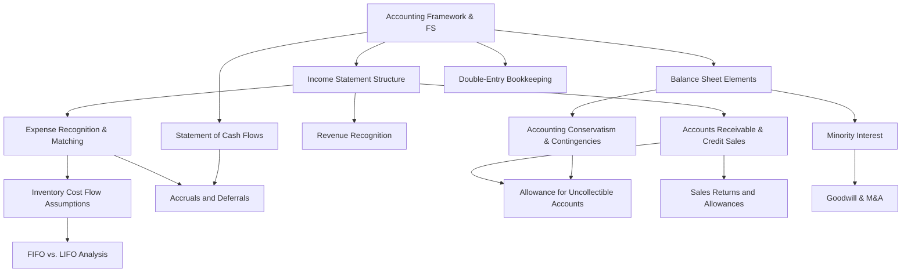

# JEB044 — Financial Accounting: Master Synthesis

> **Lecturer:** Jiří Novák · IES FSV UK, Charles University Prague
> **Semester:** Winter Semester 2024/25
> **Credits:** 6 ECTS
> **Textbook:** Harrison, Horngren, Thomas, Tietz, Suwardy (2018). *Financial Accounting: IFRS*, 11th ed., Pearson.
> **Exam:** Closed-book, open-ended questions
> *Last updated after: Lectures (Tier 1)*

---

## Concept Index

### I. The Accounting Framework
- [[Accounting_Framework_and_Financial_Statements]]
- [[Double_Entry_Bookkeeping]]
- [[Balance_Sheet_Elements]]
- [[Accounting_Conservatism_and_Contingencies]]

### II. Revenues and Expenses
- [[Income_Statement_Structure]]
- [[Revenue_Recognition]]
- [[Expense_Recognition_and_Matching_Principle]]

### III. Working Capital Assets
- [[Inventory_Cost_Flow_Assumptions]]
- [[FIFO_vs_LIFO_Analysis]]
- [[Accounts_Receivable_and_Credit_Sales]]
- [[Allowance_for_Uncollectible_Accounts]]
- [[Sales_Returns_and_Allowances]]

### IV. Cash Flows and Performance Measurement
- [[Statement_of_Cash_Flows]]
- [[Accruals_and_Deferrals]]

### V. Consolidation and Business Combinations
- [[Minority_Interest]]
- [[Goodwill_and_Mergers_Acquisitions]]

---

## I. The Accounting Framework

Financial accounting is an **information system** producing general-purpose financial statements for external users — investors, creditors, regulators, and tax authorities. The four articulated statements are the Balance Sheet (BS), Income Statement (IS), Statement of Cash Flows (SCF), and Statement of Equity (SE).

The structural bedrock of accounting is the **accounting equation**:

$$\text{Assets} = \text{Liabilities} + \text{Equity}$$

This identity is enforced by [[Double_Entry_Bookkeeping]], which requires every transaction to be recorded with equal debits and credits ($\Sigma\text{Dr} = \Sigma\text{Cr}$). Assets and Expenses carry debit-normal balances; Liabilities, Equity, and Revenues carry credit-normal balances.

The [[Balance_Sheet_Elements]] page defines the three IFRS elements in detail. An **asset** is a resource controlled by the enterprise from past events with expected future economic benefits. A **liability** is a present obligation from past events whose settlement will result in resource outflows. **Equity** is the residual interest. Assets are ordered by liquidity; liabilities by maturity.

Accounting operates under a **reliability–relevance** trade-off. [[Accounting_Conservatism_and_Contingencies]] codifies the asymmetric treatment of uncertain gains (recognised only when virtually certain) versus uncertain losses (recognised when probable). **IAS 37** provides the probability table: provisions are required when outflows are probable (>50%); footnote disclosure when possible (>5%); silence when remote (<5%).

---

## II. Revenues and Expenses

The [[Income_Statement_Structure]] follows the multi-step format:

$$NI = NS - COGS - SG\&A \pm \text{Other Operating} \pm \text{Financial} - \text{Tax}$$

$$EBIT = NS - COGS - SG\&A - \text{Other Operating}$$

Net income updates Retained Earnings via the **Clean Surplus** identity: $ARE_t = ARE_{t-1} + NI_t - Dv_t$.

[[Revenue_Recognition]] is governed by **IFRS 15**'s five-step model: (1) identify contract, (2) identify performance obligations, (3) determine transaction price, (4) allocate to obligations at standalone selling prices, (5) recognise revenue when (or as) control transfers to the customer. This replaced the older IAS 18 risk-and-rewards test with a principles-based control model. Key applications: bundled packages, long-term contracts (percentage-of-completion), gift cards (unearned revenue until redemption), and warranties as performance obligations.

[[Expense_Recognition_and_Matching_Principle]] distinguishes **product costs** (COGS — stored in inventory, expensed when sold) from **period costs** (SG&A — expensed as incurred). The matching principle requires costs to be recognised in the same period as the revenues they generate. R&D and advertising fail the capitalisation test (uncertain future benefit) and are expensed immediately. Depreciation is a systematic matching of long-lived asset cost against the revenues it generates.

---

## III. Working Capital Assets

**Inventory** sits at the nexus of the BS and IS. The cost allocation identity is:

$$COGS_t = Iv_{t-1} + \text{Purchases}_t - Iv_t$$

[[Inventory_Cost_Flow_Assumptions]] describes the three methods. **FIFO** (first-in, first-out) assigns old costs to COGS and current costs to ending inventory — appropriate BS valuation but overstated profits in inflation. **LIFO** (last-in, first-out) assigns current costs to COGS — economically accurate but produces understated BS inventory; prohibited under IFRS (IAS 2, 2003). **Average Cost** produces middle-of-the-road results. The **LIFO reserve** ($LFR = Iv_\text{FIFO} - Iv_\text{LIFO}$) allows analysts to convert LIFO statements to FIFO.

[[FIFO_vs_LIFO_Analysis]] examines real-world choice drivers: LIFO is favoured for tax minimisation (15% of S&P 500), especially in oil/gas and metals; FIFO is favoured for executive compensation, international comparability, and simplified reporting. The US TCJA 2017 (35%→21% corporate tax cut) reduced LIFO's tax advantage, driving ~30 switches to FIFO in 2021–22.

**Accounts receivable** records amounts owed by customers on credit. [[Accounts_Receivable_and_Credit_Sales]] establishes that AR is recorded at the selling price; inventory is simultaneously expensed at purchase cost (COGS). AR is reported at **net realizable value** = gross AR – AUA.

[[Allowance_for_Uncollectible_Accounts]] contrasts the **Allowance Method** (financial accounting: pre-recognise estimated losses → relevant) with the **Direct Write-Off Method** (tax accounting: recognise only confirmed losses → reliable). The IS Approach estimates bad debt as a percentage of credit sales; the BS Approach (aging schedule) targets the required ending AUA balance. The allowance is a contra-asset; write-offs affect neither NI nor Net AR once the provision has been established.

[[Sales_Returns_and_Allowances]] (SRA) is a contra-revenue account reducing Gross Sales to Net Sales. Returns also reverse the original inventory/COGS entries. Under IFRS 15, expected returns must be estimated at the point of sale and deferred.

---

## IV. Cash Flows and Performance Measurement

The [[Statement_of_Cash_Flows]] summarises cash receipts and payments across three sections:

$$\Delta\text{Cash} = CFO + CFI + CFF$$

Derived from first differences of the BS:

$$\Delta\text{Cash} = \underbrace{NI + Dp - \Delta COA + \Delta COL}_{CFO} - \underbrace{CapEx}_{CFI} + \underbrace{\Delta CC - Dv + \Delta LTFL + \Delta CFL - \Delta CFA}_{CFF}$$

The **indirect method** (required for CFO) starts from NI and reverses accrual adjustments. Depreciation is added back (non-cash); gains on asset sales are removed from CFO (realised in CFI). The fundamental long-run equivalence holds: $\sum_{t=1}^{\infty} NI_t = \sum_{t=1}^{\infty} CF_t$.

[[Accruals_and_Deferrals]] provides the four-category framework organizing the timing mismatch between cash and economic events:

| | Expenses | Revenues |
|---|---|---|
| **Cash first** | Prepaid Expense (Asset) | Unearned Revenue (Liability) |
| **Cash later** | Accrued Expense (Liability) | Accrued Revenue (Asset) |

Each category has a corresponding balance sheet account that stores the timing difference and is reversed through the indirect SCF. The decision framework for cash payments: future benefit → capitalise as asset; current benefit → expense immediately; past benefit → reduce liability.

---

## V. Consolidation and Business Combinations

When a parent acquires >50% but <100% of a subsidiary, full consolidation is required. [[Minority_Interest]] (non-controlling interest) is the portion of subsidiary equity not owned by the parent — it appears in the consolidated equity section.

For a simple acquisition with no premium:

$$MI = Pct_{\text{minority}} \times BV(NA)$$

[[Goodwill_and_Mergers_Acquisitions]] extends this to acquisition premiums. Goodwill is the intangible asset representing the excess paid over the fair value of identifiable net assets:

$$Gw = \text{Purchase Price} - \text{Revalued Net Assets}$$

For partial acquisitions, two MI valuation methods exist:
- **Method A (Book Value MI):** premium entirely attributed to majority; $MI = Pct_\text{minority} \times BV(NA)$; $Gw = (P + MI) - \text{Revalued}(NA)$.
- **Method B (Market Value MI, IFRS 3 preferred):** premium distributed proportionally; $MV(NA) = P/Pct_\text{majority}$; $MI = MV(NA) \times Pct_\text{minority}$; $Gw = MV(NA) - \text{Revalued}(NA)$.

Goodwill is not amortised but tested annually for impairment.

---

## Concept Map

---

## Textbook Integration

| Concept | HHTTS Chapter (approx.) |
|---|---|
| Accounting Framework, BS, IS | Ch. 1–2 |
| Double-Entry, Trial Balance | Ch. 2–3 |
| Revenue Recognition (IFRS 15) | Ch. 3 |
| Inventory (FIFO/LIFO/AC) | Ch. 6 |
| Accounts Receivable, Bad Debts | Ch. 5 |
| Statement of Cash Flows | Ch. 12 |
| Accruals & Deferrals | Ch. 3–4 |
| Consolidation / Goodwill | Ch. 10 |

---

## Cross-Course Connections

| Concept | Related Course | Link |
|---|---|---|
| Net Income, ROE, valuation multiples | JEB027 Finanční ekonomie | [[JEB027_Finanční_Ekonomie_main]] |
| Time value of money in IFRS 15 | JEB027 Finanční ekonomie | discounting in transaction price |
| Statistical distributions (sampling in audits) | JEB105 Statistics | sampling theory |
| Supply/demand for accounting information | JEB108 Microeconomics II | information asymmetry |
