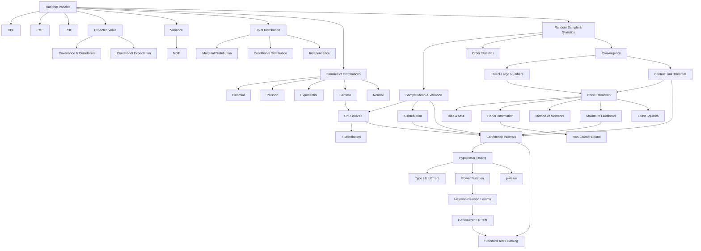

# JEB105 — Statistics: Master Synthesis

> **Lecturer:** IES FSV, Charles University in Prague
> **Semester:** Winter Semester 2025/2026
> **Credits:** 6 ECTS
> **Textbooks:** Bartoszynski & Niewiadomska-Bugaj; Mittelhammer (supplementary)
> *Last updated after: Lectures (Parts 1–10, complete)*

---

## Concept Index

### I. Random Variables and Distributions

- [[Random_Variable]] — definition, classification, CDF, PMF, PDF, functions of RVs
- [[Cumulative_Distribution_Function]] — properties, right-continuity, probability computation
- [[Probability_Mass_Function]] — discrete RVs, normalisation
- [[Probability_Density_Function]] — continuous RVs, density vs. probability

### II. Multivariate Distributions

- [[Joint_Distribution]] — joint PMF/PDF, joint CDF
- [[Marginal_Distribution]] — marginalising over one variable
- [[Independence_of_Random_Variables]] — factorisation criterion
- [[Conditional_Distribution]] — conditional PMF/PDF, relation to joint and marginal

### III. Expectations and Moments

- [[Expected_Value]] — linearity, LOTUS, existence conditions
- [[Variance]] — computation rules, standard deviation
- [[Covariance_and_Correlation]] — definition, Cauchy-Schwarz, correlation coefficient
- [[Conditional_Expectation]] — best MSE predictor, law of iterated expectations, law of total variance
- [[Moment_Generating_Function]] — definition, moment extraction, reproductive properties

### IV. Selected Families of Distributions

- [[Binomial_Distribution]] — parameters, PMF, mean, variance, MGF
- [[Poisson_Distribution]] — counting model, Poisson approximation
- [[Exponential_Distribution]] — memoryless property, rate parameter
- [[Gamma_Distribution]] — generalisation of exponential, relation to chi-squared
- [[Normal_Distribution]] — Gaussian PDF, standardisation, reproductive property, 68-95-99.7 rule, bivariate normal

### V. Random Samples and Sampling Distributions

- [[Random_Sample_and_Statistics]] — i.i.d. assumption, definition of statistic, sampling distribution
- [[Sample_Mean_and_Sample_Variance]] — expectation, variance, Bessel's correction, Cochran's theorem
- [[Chi_Squared_Distribution]] — definition, connection to Gamma, reproductive property, key role in variance inference
- [[t_Distribution]] — derivation from normal/chi-squared, heavy tails, convergence to normal
- [[F_Distribution]] — ratio of chi-squared variables, variance ratio tests
- [[Order_Statistics]] — $k$-th order statistic CDF and PDF, sample minimum/maximum

### VI. Convergence and Limit Theorems

- [[Convergence_of_Random_Variables]] — a.s., in probability, in distribution; implication chain; Slutsky's theorem
- [[Law_of_Large_Numbers]] — WLLN, SLLN, proof via Chebyshev, consistency of $\bar{X}$
- [[Central_Limit_Theorem]] — statement, approximation, continuity correction, delta method

### VII. Point Estimation

- [[Point_Estimation]] — setup, estimator vs. estimate, why $\bar{X}$
- [[Bias_and_MSE]] — bias, unbiasedness, consistency, MSE decomposition, test of consistency
- [[Fisher_Information]] — score function, regularity, $I(\theta)$, properties (Theorem 58)
- [[Rao_Cramer_Lower_Bound]] — CRLB statement, efficiency, relative efficiency
- [[Method_of_Moments]] — equating moments, examples, consistency
- [[Maximum_Likelihood_Estimation]] — likelihood function, MLE definition, invariance, asymptotic normality
- [[Least_Squares_Estimation]] — regression setup, normal equations, connection to MLE under normality

### VIII. Interval Estimation

- [[Confidence_Intervals]] — definition, coverage probability, $z$-based, $t$-based, $\chi^2$-based CIs; large-sample CLT-based CIs; duality with tests

### IX. Hypothesis Testing

- [[Hypothesis_Testing_Framework]] — setup, null/alternative, critical region, size, level, significance level
- [[Type_I_and_Type_II_Errors]] — definitions, asymmetry, trade-off, power
- [[Power_Function]] — definition, properties, comparing tests, UMP
- [[Neyman_Pearson_Lemma]] — reduction principle, likelihood ratio test, most powerful test
- [[Generalized_Likelihood_Ratio_Test]] — GLR statistic, Wilks' theorem, connection to standard tests
- [[p_Value]] — definition, computation, decision rule, misinterpretations
- [[Standard_Tests_Catalog]] — $z$-test, $t$-test, $\chi^2$-test, $F$-test, two-sample tests, paired test, CLT-based tests

---

## I. Random Variables and Distributions

Statistics begins with the mathematical formalisation of randomness. A [[Random_Variable]] $X: \Omega \to \mathbb{R}$ maps outcomes of a probability experiment to real numbers, enabling algebraic manipulation. The distribution of $X$ — fully encoded in its [[Cumulative_Distribution_Function]] $F(x) = P(X \leq x)$ — is the fundamental object of study.

For **discrete** $X$, the [[Probability_Mass_Function]] $p(x_i) = P(X = x_i)$ provides a complete description. For **continuous** $X$, the [[Probability_Density_Function]] $f(x)$ satisfies $P(a \leq X \leq b) = \int_a^b f(x)\,dx$. The probability integral transform ($Y = F_X(X) \sim U(0,1)$) and the change-of-variables formula for functions of RVs complete the toolkit for working with individual distributions.

---

## II. Multivariate Distributions

When studying multiple random variables simultaneously, the [[Joint_Distribution]] $f_{X,Y}(x,y)$ encodes all probabilistic structure. [[Marginal_Distribution|Marginal distributions]] are recovered by integrating/summing out the other variable. [[Independence_of_Random_Variables|Independence]] is characterised by the factorisation $f_{X,Y}(x,y) = f_X(x)f_Y(y)$.

[[Conditional_Distribution|Conditional distributions]] $f_{X|Y}(x|y)$ quantify how knowledge of $Y$ updates beliefs about $X$. They link directly to Bayes' theorem and to regression: $E[X | Y = y]$ is the best mean-squared-error predictor of $X$ given $Y = y$.

---

## III. Expectations and Moments

The [[Expected_Value]] $E[X] = \int x\,f(x)\,dx$ is the theoretical mean, characterising the centre of a distribution. [[Variance]] $\text{Var}(X) = E[(X-\mu)^2]$ measures spread. [[Covariance_and_Correlation]] quantify linear association between two random variables, with the Pearson correlation $\rho_{XY} = \text{Cov}(X,Y)/(\sigma_X\sigma_Y) \in [-1,1]$.

[[Conditional_Expectation]] $E[X|Y]$ is a random variable — the best predictor of $X$ given $Y$. The **law of iterated expectations** $E[E[X|Y]] = E[X]$ and the **law of total variance** $\text{Var}(X) = E[\text{Var}(X|Y)] + \text{Var}(E[X|Y])$ are fundamental identities used throughout inference.

The [[Moment_Generating_Function]] $M_X(t) = E[e^{tX}]$ generates moments via differentiation and uniquely characterises distributions under regularity conditions. Its reproductive properties under independence (e.g., sums of independent normals are normal) are critical for deriving sampling distributions.

---

## IV. Selected Families of Distributions

The course covers the core named distributions used in econometrics and statistics:

**Discrete:** [[Binomial_Distribution]] models the number of successes in $n$ Bernoulli trials; [[Poisson_Distribution]] models rare-event counts (Poisson approximation to binomial).

**Continuous:** [[Exponential_Distribution]] models inter-arrival times with the memoryless property; [[Gamma_Distribution]] generalises it and is the parent of the [[Chi_Squared_Distribution]] ($\chi^2_k = \text{Gamma}(k/2, 1/2)$); [[Normal_Distribution]] is the most important distribution in statistics — symmetric, fully characterised by $(\mu, \sigma^2)$, reproductive under linear combinations, and the limit distribution for sums of i.i.d. RVs (CLT).

---

## V. Random Samples and Sampling Distributions

Inference is built on the concept of a [[Random_Sample_and_Statistics|random sample]] $X_1, \ldots, X_n$ i.i.d. from $f(x,\theta)$. A **statistic** is any function of the sample; its distribution is the **sampling distribution**.

The [[Sample_Mean_and_Sample_Variance|sample mean and variance]] are the canonical statistics:
$$\bar{X} \sim N\!\left(\mu, \frac{\sigma^2}{n}\right), \qquad \frac{(n-1)S^2}{\sigma^2} \sim \chi^2_{n-1}$$
under normality, with $\bar{X} \perp S^2$ (Cochran's theorem). This independence underlies the [[t_Distribution]]:
$$T = \frac{\bar{X}-\mu}{S/\sqrt{n}} \sim t_{n-1}.$$

The [[F_Distribution]] arises as a ratio of independent scaled chi-squared variables and is used for comparing variances. [[Order_Statistics]] $X_{1:n} \leq \cdots \leq X_{n:n}$ provide information about the range and extreme values of the sample.

---

## VI. Convergence and Limit Theorems

The theoretical justification for statistical inference rests on limit theorems. [[Convergence_of_Random_Variables|Three modes of convergence]] — almost sure ($\xrightarrow{a.s.}$), in probability ($\xrightarrow{P}$), and in distribution ($\xrightarrow{d}$) — form a hierarchy with a.s. implying in probability implying in distribution.

The **[[Law_of_Large_Numbers]]** guarantees $\bar{X}_n \xrightarrow{P} \mu$ (WLLN) or $\bar{X}_n \xrightarrow{a.s.} \mu$ (SLLN) — the mathematical foundation of frequentist statistics. The **[[Central_Limit_Theorem]]** goes further:
$$\sqrt{n}(\bar{X}_n - \mu)/\sigma \xrightarrow{d} N(0,1),$$
providing the normal approximation that underpins $z$-tests, confidence intervals, and asymptotic MLE theory. Slutsky's theorem allows consistent estimators to replace unknown parameters without changing limiting distributions.

---

## VII. Point Estimation

[[Point_Estimation]] is the process of producing a single-number approximation $\hat{\theta}$ to the unknown parameter $\theta$. Quality criteria include:
- **Unbiasedness:** $E[\hat{\theta}] = \theta$.
- **Consistency:** $\hat{\theta} \xrightarrow{P} \theta$ (controlled via [[Bias_and_MSE|MSE decomposition]]).
- **Efficiency:** Variance attains the [[Rao_Cramer_Lower_Bound]] $1/(nI(\theta))$.

[[Fisher_Information]] $I(\theta) = E[(J(X,\theta))^2]$ quantifies the information about $\theta$ in a single observation and sets the precision limit for unbiased estimation via the [[Rao_Cramer_Lower_Bound|Cramér-Rao lower bound]].

Three construction methods are covered:
1. **[[Method_of_Moments]]:** Equate sample moments to population moments and solve.
2. **[[Maximum_Likelihood_Estimation]]:** Maximise $L(\theta; x) = \prod f(x_i, \theta)$; the MLE is asymptotically efficient and satisfies the invariance principle.
3. **[[Least_Squares_Estimation]]:** Minimise squared residuals $S(\theta)$; coincides with MLE under normality of errors and connects to the regression framework of [[JEB109_Econometrics_I_main]].

---

## VIII. Interval Estimation

A [[Confidence_Intervals|confidence interval]] $(L(X), U(X))$ captures $\theta$ with pre-specified probability $1-\alpha$:
$$P_\theta(L(X) \leq \theta \leq U(X)) = 1-\alpha.$$

The standard CIs for normal data:
- **Known $\sigma^2$:** $\bar{X} \pm z_{\alpha/2}\sigma/\sqrt{n}$ (exact $z$-based).
- **Unknown $\sigma^2$:** $\bar{X} \pm t_{\alpha/2,n-1} S/\sqrt{n}$ (exact $t$-based).
- **Variance:** $(n-1)S^2/\chi^2_{\alpha/2,n-1}$ to $(n-1)S^2/\chi^2_{1-\alpha/2,n-1}$ (chi-squared based).
- **Large $n$ (MLE):** $\hat{\theta} \pm z_{\alpha/2}/\sqrt{nI(\hat{\theta})}$ (asymptotic).

There is a fundamental **duality** between confidence intervals and hypothesis tests: the $(1-\alpha)$-CI for $\theta$ consists exactly of the parameter values not rejected by the $\alpha$-level two-sided test.

---

## IX. Hypothesis Testing

The [[Hypothesis_Testing_Framework]] tests $H_0: \theta \in \Theta_0$ against $H_1: \theta \notin \Theta_0$ using a critical region $C$. The **size** $\bar{\alpha}(C) = \sup_{\theta \in \Theta_0} \pi_C(\theta)$ controls the maximum type I error; the **significance level** $\alpha$ is the threshold we impose.

[[Type_I_and_Type_II_Errors]] are the two kinds of mistakes:
- Type I (false rejection): $\alpha(\theta) = P(X \in C \mid \theta \in \Theta_0)$.
- Type II (false non-rejection): $\beta(\theta) = 1 - \pi_C(\theta)$ for $\theta \in \Theta_1$.

The [[Power_Function]] $\pi_C(\theta) = P_\theta(X \in C)$ gives the complete performance profile.

The **[[Neyman_Pearson_Lemma]]** establishes that for simple $H_0$ vs. simple $H_1$, the most powerful test rejects when the likelihood ratio $f(x,\theta_1)/f(x,\theta_0) \geq K$. For composite hypotheses, the [[Generalized_Likelihood_Ratio_Test]] extends this via $\lambda(X) = \sup_{\Theta_0} L / \sup_\Theta L$, with $-2\log\lambda \xrightarrow{d} \chi^2_r$ under $H_0$ (Wilks' theorem).

The [[p_Value]] is the smallest $\alpha$ at which $H_0$ would be rejected — a continuous summary of the evidence against $H_0$. The [[Standard_Tests_Catalog]] collects all JEB105 tests: $z$-tests, $t$-tests, $\chi^2$-tests, $F$-tests for one/two samples, and large-sample CLT-based proportion tests.

---

## Concept Map

---

## Textbook Integration

| Topic | Bartoszynski & Niewiadomska-Bugaj | Mittelhammer |
|---|---|---|
| Random Variables & Distributions | Ch. 1–4 | Ch. 2–3 |
| Multivariate Distributions | Ch. 5–6 | Ch. 3 |
| Expectations & MGF | Ch. 7 | Ch. 3 |
| Selected Families | Ch. 8–9 | Ch. 4 |
| Random Samples | Ch. 10.1–10.2 | Ch. 7.1–7.4 |
| CLT & LLN | Ch. 11.1–11.6 | Ch. 8.1–8.4 |
| Point Estimation | Ch. 11.7, 12.1–12.3 | Ch. 9.1–9.4 |
| Interval Estimation | Ch. 12.2–12.3 | Ch. 10.1–10.3 |
| Hypothesis Testing | Ch. 12.1–12.3, 12.5, 12.6, 12.8–12.9 | Ch. 10.1–10.3, 10.7 |

---

## Cross-Course Connections

| JEB105 Concept | Related Course | Connection |
|---|---|---|
| [[Normal_Distribution]], [[t_Distribution]] | [[JEB109_Econometrics_I_main]] | Distributional assumptions in OLS regression |
| [[Least_Squares_Estimation]] | [[JEB109_Econometrics_I_main]] | OLS is LSE for linear regression |
| [[Confidence_Intervals]] | [[JEB109_Econometrics_I_main]] | CIs for regression coefficients |
| [[Hypothesis_Testing_Framework]] | [[JEB109_Econometrics_I_main]] | $t$-tests and $F$-tests for linear restrictions |
| [[Expected_Value]], [[Variance]] | [[JEB142_Introductory_Statistics_main]] | Population moments vs. sample moments |
| [[Conditional_Expectation]] | [[JEB109_Econometrics_I_main]] | Regression as conditional expectation $E[Y|X]$ |
| [[Central_Limit_Theorem]] | [[JEB109_Econometrics_I_main]] | Asymptotic theory for OLS estimators |
| [[Maximum_Likelihood_Estimation]] | [[JEB027_Finanční_Ekonomie_main]] | MLE for financial models |
| [[p_Value]] | [[JEB109_Econometrics_I_main]] | Interpretation of regression $p$-values |
