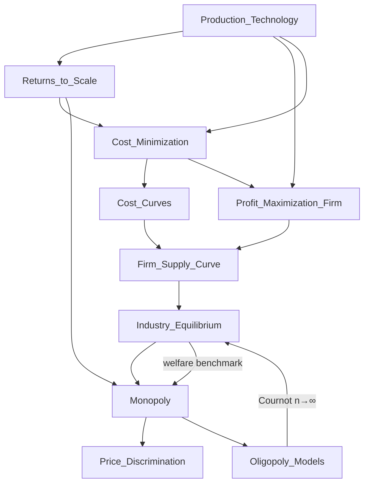

# JEB108 — Microeconomics II: Master Synthesis

> **Lecturers:** Julie Chytilová (julie.chytilova@fsv.cuni.cz) · Matěj Bajgar (matej.bajgar@fsv.cuni.cz) · IES FSV UK
> **Semester:** Winter 2025/2026
> **Credits:** 6 ECTS
> **Textbook:** Varian, H.R. (2010). *Intermediate Microeconomics: A Modern Approach* (8th ed.). W.W. Norton. + Nechyba, Nicholson/Snyder, Schotter
> *Last updated after: Seminars (Tier 3 — final)*

---

## Concept Index

### I. Production Technology
- [[Production_Technology]] — Production set, production function, isoquants; Leontief, perfect substitutes, Cobb-Douglas; marginal product; TRS; elasticity of substitution
- [[Returns_to_Scale]] — CRS, IRS, DRS; output elasticity; implications for profit maximization

### II. Firm Cost & Optimization
- [[Profit_Maximization_Firm]] — FOC ($p = MC$), SOC, isoprofit lines, WAPM, revealed profitability
- [[Cost_Minimization]] — Lagrange method, tangency condition ($TRS = -w_1/w_2$), Shephard's lemma, WACM, short vs. long run, sunk vs. fixed costs
- [[Cost_Curves]] — $TC = FC + VC$; MC, ATC, AVC, AFC; U-shape derivation; short vs. long run envelope

### III. Competitive Markets
- [[Firm_Supply_Curve]] — Derivation from profit maximization; short-run and long-run shut-down rules; CRS special case
- [[Industry_Equilibrium]] — SR and LR equilibrium; free entry/exit; long-run supply curve; tax incidence and DWL; economic rents

### IV. Market Power
- [[Monopoly]] — $MR = MC$; Lerner index; linear demand solution; DWL; natural monopoly; Lerner index and HHI
- [[Price_Discrimination]] — 1st degree (perfect); 2nd degree (non-linear pricing, two-part tariff, bundling); 3rd degree (market segmentation); welfare comparison
- [[Oligopoly_Models]] — Stackelberg (sequential quantity); Cournot (simultaneous quantity); Bertrand (simultaneous price); comparison table; collusion and cartel

### V. Seminar Applications
- [[Seminar_1_2_Technology_Profit_Cost]] — Cobb-Douglas TRS, WAPM implications, Leontief cost minimization, opportunity cost
- [[Seminar_3_Cost_Curves]] — AC/MC intersection derivations, shut-down price, SR vs. LR envelope
- [[Seminar_4_Firm_Supply]] — Supply curve derivations, Leontief-based supply, factor price effects
- [[Seminar_5_6_Industry_Equilibrium]] — Market supply aggregation, long-run equilibrium computation, tax incidence
- [[Seminar_7_Monopoly]] — $MR = MC$ exercises, welfare decomposition, DWL, natural monopoly regulation
- [[Seminar_8_9_Price_Discrimination_Oligopoly]] — Third-degree discrimination, two-part tariff, Stackelberg/Cournot with heterogeneous firms
- [[Seminar_12_Collusion]] — Cartel individual rationality, Cournot vs. collusion profit comparison
- [[Seminar_13_Bertrand_Differentiated]] — Asymmetric-cost Bertrand, differentiated product price competition

---

## I. Production Technology

The foundation of producer theory is the **production technology** — the set of technically feasible input-output combinations. The [[Production_Technology]] note establishes the key concepts: the production set $Y$, the production function $f(x_1, \ldots, x_n)$ (its upper boundary), and **isoquants** $Q(y_0)$ (level sets of $f$, the producer analogue of consumer indifference curves).

Three canonical technologies frame the analysis. **Leontief technology** $f = \min\{ax_1, bx_2\}$ admits no substitution — inputs are perfect complements with L-shaped isoquants. **Linear technology** $f = ax_1 + bx_2$ treats inputs as perfect substitutes (straight-line isoquants). The workhorse **Cobb-Douglas** $f = Ax_1^a x_2^b$ provides an intermediate case with smooth, convex isoquants and constant elasticity of substitution.

The **marginal product** $MP_i = \partial f/\partial x_i$ measures the output gain from a marginal unit of input $i$, subject to the Law of Diminishing Marginal Product ($\partial MP_i / \partial x_i \leq 0$). The **Technical Rate of Substitution** $TRS = -(MP_1/MP_2)$ is the slope of the isoquant, characterising input substitutability.

[[Returns_to_Scale]] characterise how output responds when all inputs scale by factor $t$: constant ($f(tx) = tf(x)$), increasing ($f(tx) > tf(x)$) or decreasing ($f(tx) < tf(x)$). For Cobb-Douglas, returns are determined by the sum $a + b$. Returns to scale have critical implications for the existence of a profit maximum and the shape of long-run cost curves.

---

## II. Firm Cost and Optimization

### Profit Maximization

[[Profit_Maximization_Firm]] describes how a competitive firm chooses output $y$ to maximize $\pi = py - TC(y)$. The central result is the **FOC: $p = MC(y^*)$** — price equals marginal cost. The **SOC** requires $MC$ to be upward-sloping at $y^*$. The firm shuts down if $p < \min(AC)$ in the long run, or $p < \min(AVC)$ in the short run.

The **WAPM** (Weak Axiom of Profit Maximization) provides a model-free revealed-preference framework: any pair of observed choices must satisfy $\Delta p \cdot \Delta y - \Delta w \cdot \Delta x \geq 0$, yielding all comparative statics results without assuming functional forms. **Isoprofit lines** geometrically represent combinations of inputs and output at a given profit level; optimal choice is the tangency with the production function.

A striking behavioural application: **NYC cab drivers** (Camerer et al., 1997) work fewer hours on high-wage days, consistent with daily earnings targets rather than rational labour-leisure optimization.

### Cost Minimization

Before choosing output, the firm must solve the **cost minimization problem**: $\min_x \{w_1 x_1 + w_2 x_2 : f(x_1, x_2) = y\}$ (see [[Cost_Minimization]]). The optimality condition $TRS = -w_1/w_2$ equates the technological trade-off with the economic trade-off. **Shephard's Lemma** $\partial c/\partial w_i = x_i^*(w, y)$ recovers conditional factor demands from the cost function.

The **WACM** (Weak Axiom of Cost Minimization) establishes that $\Delta w \cdot \Delta x \leq 0$ — conditional demand is non-increasing in its own price, a result requiring only rational cost-minimizing behavior. The **expansion path** traces optimal input combinations as output varies; **normal** inputs have conditional demands increasing in output, **inferior** inputs decreasing.

**Short-run costs** fix some inputs, creating a wedge between $STC$ and $LTC$; $LTC \leq STC$ always (envelope property). **Sunk costs** are irrelevant to future decisions — only opportunity costs matter.

### Cost Curves

[[Cost_Curves]] develops the geometry of $TC = FC + VC$. Key results: (1) $MC$ intersects both $AVC$ and $ATC$ at their minima (since $d(ATC)/dy = (MC - ATC)/y$); (2) the long-run cost curve is the lower envelope of short-run curves; (3) the shape of $LRATC$ reflects returns to scale (U-shaped for first IRS then DRS; horizontal for CRS).

---

## III. Competitive Markets

### Firm Supply

The [[Firm_Supply_Curve]] of a competitive firm is the **upward-sloping segment of $MC$** above the shut-down threshold. In the short run: supply = $MC$ curve above $\min(AVC)$. In the long run: supply = $MC$ above $\min(ATC)$. Under **CRS**, the supply curve is **horizontal** (firm is scale-indifferent at $p = AC = MC$). Supply is more price-elastic in the long run than in the short run.

### Industry Equilibrium

[[Industry_Equilibrium]] analyzes how markets clear. In the short run (fixed $n$), equilibrium is where $D(p) = \sum S_i(p)$, with positive or negative profits possible. In the long run, **free entry and exit** drive $\pi \to 0$, pinning the equilibrium price to $\min(LRATC)$ for identical firms — the long-run supply curve is **horizontal**.

**Tax incidence** depends solely on supply/demand elasticities, not statutory assignment. The firm bearing inelastic demand (or supply) pays more. **Economic rents** arise when factors are inelastically supplied; rent-seeking generates deadweight loss. Under standard conditions, perfect competition is **Pareto efficient**.

---

## IV. Market Power

### Monopoly

[[Monopoly]] arises when a single firm faces the entire market demand. Optimality requires $MR = MC$, where $MR = p(1 - 1/|\varepsilon_D|) < p$. The **Lerner index** $L = (p - MC)/p = 1/|\varepsilon_D|$ measures market power. The monopolist restricts output below the competitive level and charges $p > MC$, generating a **deadweight loss** equal to the triangle between $D$, $MC$ and $[y^M, y^{PC}]$.

**Natural monopoly** (IRS technology) requires regulated pricing: marginal-cost pricing eliminates DWL but causes losses; average-cost pricing breaks even with some DWL; two-part tariffs may simultaneously achieve efficiency and cost recovery.

### Price Discrimination

[[Price_Discrimination]] allows a monopolist with market power to extract surplus beyond a uniform price:
- **1st degree:** Individualized pricing at reservation price → no DWL, zero CS.
- **2nd degree:** Non-linear pricing (two-part tariffs, block pricing, bundling) → self-selection.
- **3rd degree:** Segment-based pricing where $MR_i = MC \; \forall i$ → less-elastic segment pays more.

Welfare effects are nuanced — discrimination may expand total output and reduce DWL relative to uniform monopoly, but at the cost of reduced consumer surplus.

### Oligopoly

[[Oligopoly_Models]] models strategic interaction among a small number of firms:

- **Stackelberg** (sequential): Leader gains first-mover advantage ($\pi_1^* > \pi_2^*$). Total output $3(a-c)/4b$ between monopoly and Cournot.
- **Cournot** (simultaneous quantity): Nash equilibrium in quantities; as $n \to \infty$, converges to perfect competition.
- **Bertrand** (simultaneous price): Even with $n = 2$ identical firms, $p = MC$ and $\Pi = 0$ — the **Bertrand Paradox**.

The threat of **collusion** is the Prisoner's Dilemma of oligopoly — each firm benefits from defecting, but collective defection destroys market power.

---

## Concept Map

---

## Textbook Integration

| Concept | Varian Chapter |
|---|---|
| Production Technology | Ch. 18 — Technology |
| Returns to Scale | Ch. 18 |
| Profit Maximization | Ch. 19 — Profit Maximization |
| Cost Minimization | Ch. 20 — Cost Minimization |
| Cost Curves | Ch. 21 — Cost Curves |
| Firm Supply | Ch. 22 — Firm Supply |
| Industry Equilibrium | Ch. 23 — Industry Supply |
| Monopoly | Ch. 24 — Monopoly |
| Price Discrimination | Ch. 25 — Monopoly Behavior |
| Oligopoly (Cournot, Bertrand, Stackelberg) | Ch. 27 — Oligopoly |

---

## Cross-Course Connections

| JEB108 Concept | Related Course | Related Concept |
|---|---|---|
| [[Production_Technology]] | [[JEB104_Microeconomics_I_main\|JEB104]] | [[Preferences_and_Indifference_Curves]] (isoquant ↔ indifference curve) |
| [[Cost_Minimization]] | JEB104 | [[Expenditure_Minimization_and_Hicksian_Demand]] (Shephard's lemma ↔ Roy's identity) |
| [[Firm_Supply_Curve]] | JEB104 | [[Marshallian_Demand]] (supply curve ↔ demand curve via duality) |
| [[Industry_Equilibrium]] | JEB009 (Macroeconomics I) | [[IS_LM_Model]] (goods market clearing) |
| [[Monopoly]] | JEB109 (Econometrics I) | [[Hypothesis_Testing_Framework]] (Lerner index empirical testing) |
| [[Oligopoly_Models]] | JEB160 (Auctions & Game Theory) | Nash equilibrium, Prisoner's Dilemma |
| [[Price_Discrimination]] | JEB027 (Financial Economics) | Asset pricing segmentation |
