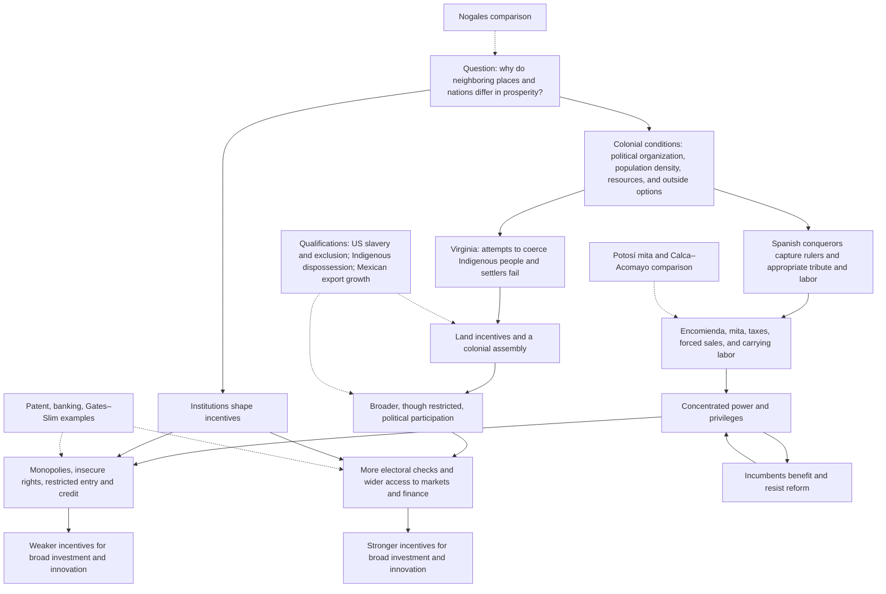

# Colonial institutions and divergence: *Why Nations Fail*, chapter 1

**Question:** Why can places with similar geography and people have very different living standards? Acemoglu and Robinson argue that political and economic institutions create different incentives to work, invest, innovate, provide public goods, and exercise power. This chapter introduces an institutional explanation of comparative economic performance through the history of the Americas. It belongs with the introductory discussion in the [[01_Notes/2026_2027/Winter_Semester/Comparative_Economics/Comparative_Economics_main.md#Week 1|Comparative Economics course hub]]: to compare economic systems, we need to ask who sets the rules, whose actions those rules reward, and how the rules persist. [[00_Materials/2026_2027/Winter_Semester/Comparative_Economics/Week_1/Acemoglu Robinson - Why-Nations-Fail - chapter 1.pdf#page=38|Acemoglu & Robinson, PDF pp. 38–41]]

All page references below are **physical PDF pages**; this extracted chapter does not show printed book page numbers. The examples and historical interpretations are the authors' arguments, not independent causal estimates supplied by this chapter. The source is [[00_Materials/2026_2027/Winter_Semester/Comparative_Economics/Week_1/Acemoglu Robinson - Why-Nations-Fail - chapter 1.pdf|Acemoglu & Robinson, “So Close and Yet So Different”]].

## Topic map

The solid arrows map the **authors' proposed mechanism**, not a mechanical law that every country must follow. The dotted connections identify illustrations and limits. Colonial conditions shaped what conquerors could extract; political institutions then influenced economic rules, while those who benefited from the rules had reasons to defend them. The two Nogaleses pose the question, the colonial histories suggest how different paths began, and later finance and business cases show how the paths might still matter. [[00_Materials/2026_2027/Winter_Semester/Comparative_Economics/Week_1/Acemoglu Robinson - Why-Nations-Fail - chapter 1.pdf#page=3|Acemoglu & Robinson, PDF pp. 3–23, 27–41]]

## Nogales: the question that motivates the chapter

Nogales is divided by the United States–Mexico border. The authors describe an average annual household income of about **$30,000** on the Arizona side and about **one-third of that** on the Sonora side. They also contrast education, health, roads, public utilities, security, and the practical ability to start a business. The figures describe the period of the book; they should not be read as current statistics. For the authors, political accountability matters as well as income: residents in Arizona could replace elected officials, whereas residents of Sonora lived under the long rule of Mexico's PRI until the political reforms of 2000. [[00_Materials/2026_2027/Winter_Semester/Comparative_Economics/Week_1/Acemoglu Robinson - Why-Nations-Fail - chapter 1.pdf#page=1|Acemoglu & Robinson, PDF pp. 1–2]]

The neighboring cities share climate and a similar disease environment, and the authors describe their residents as having broadly similar ancestry and culture. They therefore argue that the border's political and economic rules are more convincing explanations for the disparity than local climate or a simple cultural difference. On their account, rules and public services in the United States make schooling, occupational choice, investment, and adoption of technology more rewarding; political institutions also give citizens leverage over officials. The comparison makes their hypothesis vivid, but this chapter does not turn it into a controlled statistical experiment or establish that no other factor matters. [[00_Materials/2026_2027/Winter_Semester/Comparative_Economics/Week_1/Acemoglu Robinson - Why-Nations-Fail - chapter 1.pdf#page=2|Acemoglu & Robinson, PDF pp. 2–3]]

There is an important qualification within the authors' own account. Nogales, Sonora, is more prosperous than much of Mexico because it benefits from proximity to the United States and from maquiladora factories using US capital and know-how. Thus the story is about different **institutional incentives and opportunities**, not an assertion that no productive activity can occur on the Mexican side or that the border cuts off all economic influence. [[00_Materials/2026_2027/Winter_Semester/Comparative_Economics/Week_1/Acemoglu Robinson - Why-Nations-Fail - chapter 1.pdf#page=37|Acemoglu & Robinson, PDF pp. 37–38]]

## Spanish colonization: creating rules for extraction

### Why the first Buenos Aires failed while Asunción prospered for conquerors

The first Spanish settlement at Buenos Aires had a favorable climate, but the Charrúa and Querandí resisted attempts to obtain their food and labor. The region offered neither easily accessible gold nor a large, centralized population that the colonists could control through its leaders. The Spaniards had planned to extract resources and compel others to work, so a place where they would have to produce food themselves was unattractive to them. An expedition instead encountered the sedentary, farming Guaraní. After overcoming resistance, Spanish settlers placed themselves above existing systems of tribute and forced labor in Asunción; Buenos Aires was abandoned and not resettled until 1580. This contrast illustrates **conquerors' incentives**: a colony could be attractive to its rulers because people and resources were easy to appropriate, regardless of its long-run potential for broad prosperity. [[00_Materials/2026_2027/Winter_Semester/Comparative_Economics/Week_1/Acemoglu Robinson - Why-Nations-Fail - chapter 1.pdf#page=4|Acemoglu & Robinson, PDF pp. 4–5]]

### Capturing leaders and appropriating existing organization

The authors describe a recurring conquest strategy in Mexico and Peru. Conquerors captured a ruler, demanded wealth and provisions, then installed themselves as the new elite over existing systems of taxation, tribute, and compelled labor. Cortés's seizure of Moctezuma and Pizarro's capture of Atahualpa at Cajamarca illustrate the method. The account of Atahualpa includes a ransom of one room of gold and two rooms of silver; he was executed despite its delivery. Capturing a ruler was useful precisely because an existing political hierarchy could transmit orders and organize resources. These are historical cases of violent appropriation, not evidence that the affected populations consented to the new rules. [[00_Materials/2026_2027/Winter_Semester/Comparative_Economics/Week_1/Acemoglu Robinson - Why-Nations-Fail - chapter 1.pdf#page=5|Acemoglu & Robinson, PDF pp. 5–10]]

The **encomienda** was a colonial grant assigning Indigenous people to a Spanish holder, the *encomendero*. Those assigned owed tribute and labor; the holder was formally charged with converting them to Christianity. In practice, the authors' examples from Bartolomé de las Casas describe severe coercion, seizure of land and food, and work for the settler's benefit. The legal description and the observed power relationship need to be kept separate: an encomienda was neither ordinary wage employment nor simply a grant of land. It gave the holder control over people's obligations and the surplus from their work. [[00_Materials/2026_2027/Winter_Semester/Comparative_Economics/Week_1/Acemoglu Robinson - Why-Nations-Fail - chapter 1.pdf#page=7|Acemoglu & Robinson, PDF pp. 7–9]]

### The Potosí mita and its local legacy

The discovery of Potosí silver made access to mine labor especially valuable. Viceroy Francisco de Toledo first concentrated much of the Indigenous population into *reducciones*, settlements that made labor easier to organize and control. He then adapted the earlier Inca **mita**, a turn of compulsory labor. The authors distinguish the earlier Inca use of labor for plantations supplying temples, elites, and armies, with famine relief and security in return, from Toledo's colonial mining mita. The latter drew workers from a catchment of about **200,000 square miles** in present-day Peru and Bolivia and required **one-seventh of its male inhabitants** to work in Potosí's mines. It lasted until 1825. [[00_Materials/2026_2027/Winter_Semester/Comparative_Economics/Week_1/Acemoglu Robinson - Why-Nations-Fail - chapter 1.pdf#page=10|Acemoglu & Robinson, PDF pp. 10–11]]

The chapter's **Map 1** shows the Inca realm, road network, colonial cities, modern borders, and the mining-mita catchment. Its value is to make clear that the compulsory-labor zone covered a large part of the Inca heartland rather than an isolated mine. The map marks a historical boundary; by itself it does not quantify the later economic effect of being inside it. [[00_Materials/2026_2027/Winter_Semester/Comparative_Economics/Week_1/Acemoglu Robinson - Why-Nations-Fail - chapter 1.pdf#page=12|Acemoglu & Robinson, Map 1, PDF p. 12]]

![[01_Notes/2026_2027/Winter_Semester/Comparative_Economics/assets/Week_1_Acemoglu_p12_mita_map.png]]

*Map 1. Shading identifies the Inca Empire, while separate lines mark the Inca road network and the Potosí mita catchment; dots mark colonial cities. The catchment overlaps the former imperial heartland, including the region around Cusco.* [[00_Materials/2026_2027/Winter_Semester/Comparative_Economics/Week_1/Acemoglu Robinson - Why-Nations-Fail - chapter 1.pdf#page=12|Acemoglu & Robinson, Map 1, PDF p. 12]]

The authors compare nearby Quechua-speaking provinces: Acomayo, inside the former mita zone, and Calca, outside it. They say inhabitants of Acomayo consume about one-third less, its road is worse, and farmers there produce more for subsistence, while Calca farmers more often sell to markets. The example gives an intuition for **institutional persistence**: past coercion may leave less infrastructure and fewer market opportunities. The chapter presents this as a historical interpretation, not a formal identification strategy that rules out every other difference between the provinces. [[00_Materials/2026_2027/Winter_Semester/Comparative_Economics/Week_1/Acemoglu Robinson - Why-Nations-Fail - chapter 1.pdf#page=12|Acemoglu & Robinson, PDF pp. 12–13]]

Toledo's system extended beyond the mine. A fixed head tax payable in silver pushed households toward paid labor so they could obtain cash; the *repartimiento de mercancías* forced locals to buy goods at prices set by Spaniards; and the *trajín* compelled people to carry loads for elite businesses. Together with the encomienda and mita, these rules transferred land, labor, and income to colonial rulers and constrained Indigenous people's ability to choose work and accumulate resources. The authors argue that this enriched the Crown and colonial elites while reducing the scope for broad economic development. [[00_Materials/2026_2027/Winter_Semester/Comparative_Economics/Week_1/Acemoglu Robinson - Why-Nations-Fail - chapter 1.pdf#page=13|Acemoglu & Robinson, PDF pp. 13–14]]

## Jamestown: why attempts at coercion changed course

England entered American colonization later than Spain. The authors say the regions with dense populations and precious metals had already been claimed, and the English arrived in a northern territory where the Spanish model was harder to operate. Roanoke failed; Jamestown was founded in 1607. The Virginia Company nevertheless initially sought provisions, treasure, and labor from Indigenous people. The Powhatan Confederacy had political organization, but its ruler Wahunsunacock did not command the same centralized, resource-rich empire as the rulers in Mexico and Peru. Colonists could not seize a leader and thereby obtain a ready-made tributary workforce. [[00_Materials/2026_2027/Winter_Semester/Comparative_Economics/Week_1/Acemoglu Robinson - Why-Nations-Fail - chapter 1.pdf#page=14|Acemoglu & Robinson, PDF pp. 14–17]]

Food shortages made this failure costly. John Smith arranged trade for supplies and argued that settlers would need practical skills and would have to work themselves. The colonists' search for gold continued; their attempt to make Wahunsunacock subordinate to the English king failed, and he imposed a trade embargo. Smith's departure preceded the winter of 1609–10, during which only about **60 of 500** colonists survived. The chapter treats this sequence as evidence that the Spanish extraction strategy was not viable in Virginia. Its Pocahontas rescue story is expressly qualified as appearing only “according to some accounts”; it is not needed for the economic explanation. [[00_Materials/2026_2027/Winter_Semester/Comparative_Economics/Week_1/Acemoglu Robinson - Why-Nations-Fail - chapter 1.pdf#page=16|Acemoglu & Robinson, PDF pp. 16–19]]

The company then tried to compel its **own settlers** to work. Gates and Dale imposed severe rules, including death penalties for escape and some theft. Land belonged to the company; workers received assigned rations and worked in supervised gangs. This resembled the encomienda in its aim of extracting labor through coercion, but it **was not an encomienda**: no Spanish grant of Indigenous people to an encomendero operated in Jamestown. The immediate targets of this later system were English settlers under company authority. [[00_Materials/2026_2027/Winter_Semester/Comparative_Economics/Week_1/Acemoglu Robinson - Why-Nations-Fail - chapter 1.pdf#page=19|Acemoglu & Robinson, PDF pp. 19–21]]

The company's power was limited because settlers had **outside options**: they could leave for Indigenous communities or try to live on the frontier. An outside option is the next best available action if one rejects an imposed arrangement. It makes harsh terms harder to enforce because the person can exit. The authors also contrast relatively sparse population in much of North America with dense areas of central Mexico and Andean Peru. **Map 2** visualizes estimated population density around 1500; its legend is in people per **square kilometer**, while the neighboring prose offers examples per **square mile**. Those numbers must not be equated without converting units. The map supports a broad contrast in settlement patterns, not a claim that all of North America had the same population density. [[00_Materials/2026_2027/Winter_Semester/Comparative_Economics/Week_1/Acemoglu Robinson - Why-Nations-Fail - chapter 1.pdf#page=20|Acemoglu & Robinson, Map 2 and discussion, PDF pp. 20–21]]

![[01_Notes/2026_2027/Winter_Semester/Comparative_Economics/assets/Week_1_Acemoglu_p20_population_map.png]]

*Map 2. Estimated population density around 1500. The legend separates no data from four density bands—0–0.75, 0.75–2.5, 2.5–10, and 10–400 people per square kilometer. The darker areas in central Mexico and the Andes help explain why taking over existing tribute and labor systems was more feasible there than in Virginia.* [[00_Materials/2026_2027/Winter_Semester/Comparative_Economics/Week_1/Acemoglu Robinson - Why-Nations-Fail - chapter 1.pdf#page=20|Acemoglu & Robinson, Map 2, PDF p. 20]]

Unable to compel either Indigenous people or settlers on the desired terms, the company shifted to **incentives**. In 1618 it began the headright system: a male settler received 50 acres, plus 50 acres for each family member and servant brought to Virginia. Settlers were released from contracts and received houses; in 1619 the General Assembly gave settlers a political say. Land and voice raised the return to cultivating and investing in the colony. This was a change in economic rights accompanied by a change in political rights, not an immediate arrival at modern universal democracy. [[00_Materials/2026_2027/Winter_Semester/Comparative_Economics/Week_1/Acemoglu Robinson - Why-Nations-Fail - chapter 1.pdf#page=21|Acemoglu & Robinson, PDF p. 21]]

English elites later tried to create landed hierarchies in Maryland and Carolina. Lord Baltimore's Maryland scheme assigned large manors to lords; Carolina's proposed constitution placed hereditary *leet-men* below an aristocracy of landgraves and caziques. Settlers' ability to seek land and other options made these schemes difficult to impose. By the 1720s the thirteen colonies had governors and elected assemblies, generally based on male property ownership. These assemblies helped establish a tradition of political participation and limits on rulers, but **women, enslaved people, and the propertyless did not vote**. The authors' comparison is one of relative breadth of rights, not a claim that colonial America was egalitarian. [[00_Materials/2026_2027/Winter_Semester/Comparative_Economics/Week_1/Acemoglu Robinson - Why-Nations-Fail - chapter 1.pdf#page=22|Acemoglu & Robinson, PDF pp. 22–23]]

## Different paths after independence

The authors trace the US constitutional order of 1787 back to the colonial assemblies that began at Jamestown in 1619. In their account, broader political participation constrained arbitrary power and made more broadly usable economic rights possible. This was still profoundly limited: the US Constitution accepted slavery, counted an enslaved person as three-fifths for allocating House seats, and left voting rules to states; women and enslaved people were excluded. Later conflict over slavery culminated in the Civil War. The point is not that US institutions were fully free, but that political power and economic opportunity were distributed more broadly **for a substantial part of the population** than in the authors' Mexican comparison. [[00_Materials/2026_2027/Winter_Semester/Comparative_Economics/Week_1/Acemoglu Robinson - Why-Nations-Fail - chapter 1.pdf#page=23|Acemoglu & Robinson, PDF pp. 23–26]]

Mexico's independence had a different political starting point in the authors' narrative. Napoleon's invasion of Spain created a constitutional crisis, and the 1812 Cádiz Constitution proposed popular sovereignty, limits on privilege, and equality before the law. Mexican elites, shaped by colonial hierarchies and alarmed by Hidalgo's revolt, feared that wider political participation would threaten their position. When Spanish constitutional reform returned in 1820 with proposals to end coerced labor and special privileges, these elites supported independence under Iturbide's 1821 Plan de Iguala, which removed the provisions they found threatening. Iturbide then concentrated power and dismissed the constitutionally authorized congress. Independence therefore did not necessarily end colonial economic privileges. [[00_Materials/2026_2027/Winter_Semester/Comparative_Economics/Week_1/Acemoglu Robinson - Why-Nations-Fail - chapter 1.pdf#page=24|Acemoglu & Robinson, PDF pp. 24–26]]

Political turnover and coercion continued: the authors report that Antonio López de Santa Ana occupied the presidency eleven times and that Mexico had 52 presidents between 1824 and 1867. Their mechanism is that insecure government and property rights, weak tax and service capacity, and retained monopolies made investment and initiative risky for many people. Later Porfirio Díaz restored a measure of order and opened trade, but also used expropriation and political favors to benefit allies. Political stability alone is therefore not sufficient in this account; one must ask **who can use state power, who receives property and market access, and who can challenge privilege**. [[00_Materials/2026_2027/Winter_Semester/Comparative_Economics/Week_1/Acemoglu Robinson - Why-Nations-Fail - chapter 1.pdf#page=26|Acemoglu & Robinson, PDF pp. 26–27, 30–33]]

The authors call this **path-dependent change**. New opportunities such as late nineteenth-century export trade and valuable frontier land did not erase earlier power relations. US land laws gave many settlers access to frontier holdings, while in much of Latin America connected elites received land. The US story also involved the dispossession of Indigenous people; “broader access” did not include them. Díaz's export-oriented modernization brought some growth, yet the authors describe continued exclusion and the deportation of possibly 30,000 Yaqui people between 1900 and 1910. Institutions can change in form while preserving who captures the gains. [[00_Materials/2026_2027/Winter_Semester/Comparative_Economics/Week_1/Acemoglu Robinson - Why-Nations-Fail - chapter 1.pdf#page=32|Acemoglu & Robinson, PDF pp. 32–33]]

Persistence is not permanence. The chapter recounts revolutions, civil wars, reforms, and eventual movement toward democracy in Latin America, showing that rules can change, albeit often through conflict. Its discussion of repression draws on different reports and estimates, which should not be merged into a single precise count: for example, it reports 2,279 political killings in Chile in a truth commission report, 42,275 named Guatemalan victims in a clarification commission report with higher estimates elsewhere, and 9,000 Argentine deaths in an official commission count with higher human-rights estimates. These events underline the human cost of struggles over power; they do not by themselves prove every economic link in the authors' theory. [[00_Materials/2026_2027/Winter_Semester/Comparative_Economics/Week_1/Acemoglu Robinson - Why-Nations-Fail - chapter 1.pdf#page=33|Acemoglu & Robinson, PDF pp. 33–34]]

## From political rules to invention, firms, and finance

The Industrial Revolution increased productivity through mechanization and new inventions. An inventor who expects to benefit from an idea has a reason to develop and commercialize it; a patent protects some rights to that idea. But a patent alone does not finance a factory or a new firm. Entrepreneurs also need entry into markets, a workforce, and credit. The authors use this sequence to show why the **same individual talent** can yield different outcomes under different rules. Their examples include Thomas Edison, who had limited formal schooling, sold an early patent to raise capital, and later founded businesses. [[00_Materials/2026_2027/Winter_Semester/Comparative_Economics/Week_1/Acemoglu Robinson - Why-Nations-Fail - chapter 1.pdf#page=28|Acemoglu & Robinson, PDF pp. 28–29, 39]]

The chapter reports that among US patentees in 1820–45, only **19%** came from professional or major landowning families and **40%** had primary schooling or less. It also reports growth from **338 US banks with $160 million in assets in 1818** to **27,864 banks with $27.3 billion in assets in 1914**. The authors argue that competitive finance helped people with inventions obtain capital at lower rates. As a contrast, they report **42 banks in Mexico in 1910**, with two controlling **60%** of banking assets; concentrated lending favored wealthy insiders and higher rates. These figures refer to different dates and national contexts, so they illustrate the institutional argument rather than serving as a matched quantitative causal test. [[00_Materials/2026_2027/Winter_Semester/Comparative_Economics/Week_1/Acemoglu Robinson - Why-Nations-Fail - chapter 1.pdf#page=28|Acemoglu & Robinson, PDF pp. 28–30]]

The authors do **not** claim that US bankers were naturally less interested in profits. They argue that the same profit motive was channeled differently by political rules. US politicians also attempted to create bank monopolies for allies, but voters could remove officeholders who used regulation in ways harmful to a wider electorate. Where rulers and their allies could sustain monopoly privileges, banking remained concentrated and potential competitors struggled to borrow. The proposed causal chain is: distribution of political power → rules and enforcement for banking → access to finance → who can start and grow a firm. [[00_Materials/2026_2027/Winter_Semester/Comparative_Economics/Week_1/Acemoglu Robinson - Why-Nations-Fail - chapter 1.pdf#page=30|Acemoglu & Robinson, PDF pp. 30–32]]

## Carlos Slim, Bill Gates, and the limits of business power

The chapter contrasts two wealthy entrepreneurs to make the effect of rules concrete. In the United States, Bill Gates could build Microsoft using a skilled workforce, finance, markets, and enforceable property rights. His wealth did not exempt Microsoft from public antitrust action: US authorities investigated the company and the Department of Justice filed a case in 1998 over its alleged abuse of monopoly power, with a settlement in 2001. The authors do not portray the US market as free of monopoly attempts; they emphasize constraints that can operate even against a powerful firm. [[00_Materials/2026_2027/Winter_Semester/Comparative_Economics/Week_1/Acemoglu Robinson - Why-Nations-Fail - chapter 1.pdf#page=34|Acemoglu & Robinson, PDF pp. 34–35, 39]]

Carlos Slim had succeeded in investments and turning around firms, but the chapter identifies his acquisition of **Telmex** as the decisive opportunity. During privatization in 1990, a Slim-led consortium won control of **51% of the voting stock, equivalent to 20.4% of total stock**, although it had not submitted the highest bid. The authors say payment could be delayed and financed using Telmex dividends. A former public telecommunications monopoly became a highly profitable private monopoly. The broader environment included licenses, red tape, political connections, and scarce finance that could keep competitors out. This is an account of how **access to a protected market** can generate wealth; it should not be reduced to a claim that Slim lacked ability. [[00_Materials/2026_2027/Winter_Semester/Comparative_Economics/Week_1/Acemoglu Robinson - Why-Nations-Fail - chapter 1.pdf#page=35|Acemoglu & Robinson, PDF p. 35]]

The Mexican Competition Commission found substantial Telmex monopoly power in several telephone markets, but the authors say regulatory efforts failed. They highlight the *recurso de amparo*, originally a constitutional protection of individual rights, as a legal instrument Telmex could use to resist regulation. In a separate CompUSA/COC dispute litigated in Dallas, Slim's side lost and was fined **$454 million**. The authors interpret this as evidence that a business strategy successful under one set of legal and political rules can fail under another. These cases are illustrations of institutional constraints and advantages, not a complete assessment of either entrepreneur's career or of every antitrust system. [[00_Materials/2026_2027/Winter_Semester/Comparative_Economics/Week_1/Acemoglu Robinson - Why-Nations-Fail - chapter 1.pdf#page=35|Acemoglu & Robinson, PDF pp. 35–36]]

## What the authors mean by institutions

**Economic institutions** are the rules and their enforcement that affect economic choices: property and contract security, freedom to enter occupations and markets, access to land and credit, competition, schooling, and incentives to save, invest, and adopt technology. **Political institutions** determine who can make and change those economic rules, how rulers are constrained, how state power is exercised, and whether citizens or groups can act collectively to hold officials accountable. The category includes constitutions and elections, but also the state's capacity to govern and the real distribution of political power. A written constitutional promise alone is insufficient when rulers can ignore it. [[00_Materials/2026_2027/Winter_Semester/Comparative_Economics/Week_1/Acemoglu Robinson - Why-Nations-Fail - chapter 1.pdf#page=38|Acemoglu & Robinson, PDF pp. 38–39]]

The authors' explanation has two linked parts. **Economics:** institutions alter the expected return and risk of schooling, work, innovation, investment, and entrepreneurship, so they affect prosperity. **Politics:** power determines which institutions are adopted and whether they survive. An arrangement that lowers total welfare can still be valuable to an incumbent who collects monopoly profit or controls land and labor. That person has a reason to resist reforms even if a broader population would gain. This feedback explains why unequal rules can persist and why knowledge of a better policy is not enough to implement it. [[00_Materials/2026_2027/Winter_Semester/Comparative_Economics/Week_1/Acemoglu Robinson - Why-Nations-Fail - chapter 1.pdf#page=39|Acemoglu & Robinson, PDF pp. 39–41]]

The chapter states a broad theory rather than presenting a complete statistical identification of it. Nogales, Acomayo–Calca, banking, and the two entrepreneurs give historically specific reasons to take the theory seriously, but their contrasts are not by themselves proof that institutions are the only cause of prosperity. Equally, institutional paths are not fixed forever: the chapter itself describes reforms, conflict, and change. The careful reading is that incentives, enforcement, political power, and feedback must be examined together for each comparison. [[00_Materials/2026_2027/Winter_Semester/Comparative_Economics/Week_1/Acemoglu Robinson - Why-Nations-Fail - chapter 1.pdf#page=3|Acemoglu & Robinson, PDF pp. 3, 13, 31–34, 38–41]]

## Answers to the six assigned reading questions

These questions are transcribed from the [[00_Materials/2026_2027/Winter_Semester/Comparative_Economics/Week_1/Pasted 03-10-2026 at 14.19.39.png|Week 1 course screenshot]]. The answers use this chapter alone.

1. **What seem to be the main differences between the two Nogaleses?** The authors report much higher income, schooling, health, public-service quality, security, and political accountability in Nogales, Arizona. Nogales, Sonora, has lower average income and weaker services, and starting a firm is exposed to crime, bureaucracy, and corruption. The cities' proximity makes the institutional difference across the border their proposed explanation. The Sonora side is nevertheless relatively prosperous within Mexico because of US-linked manufacturing. [[00_Materials/2026_2027/Winter_Semester/Comparative_Economics/Week_1/Acemoglu Robinson - Why-Nations-Fail - chapter 1.pdf#page=1|Acemoglu & Robinson, PDF pp. 1–3, 37–38]]

2. **What was the encomienda and how did it work?** It was a grant assigning Indigenous people to an *encomendero*. They owed tribute and labor; the holder was formally responsible for Christian conversion. The authors' examples show the arrangement functioning as a means of coerced labor and extraction, including seizure of land, food, and output. It was a rule over people's obligations rather than simply a land title or a normal employment contract. [[00_Materials/2026_2027/Winter_Semester/Comparative_Economics/Week_1/Acemoglu Robinson - Why-Nations-Fail - chapter 1.pdf#page=7|Acemoglu & Robinson, PDF pp. 7–9]]

3. **Was the encomienda or a similar system used in Jamestown?** There was **no encomienda as such** in Jamestown. The Virginia Company first tried to exploit the Powhatan population but could not reproduce the Spanish conquest strategy. It later imposed a harsh company-run labor regime on English settlers, with company land, rations, supervised work, and severe penalties. That was similar in its coercive goal, but differed in its legal form and target. Settlers' outside options helped force a shift toward headright land grants and an assembly. [[00_Materials/2026_2027/Winter_Semester/Comparative_Economics/Week_1/Acemoglu Robinson - Why-Nations-Fail - chapter 1.pdf#page=15|Acemoglu & Robinson, PDF pp. 15–23]]

4. **What important historical differences between Mexico and the USA are explained?** In the authors' account, densely populated and organized parts of Spanish America enabled colonizers to take over systems of tribute and forced labor; efforts to impose comparable coercion in Virginia failed, leading to land incentives and colonial assemblies. At independence, US constitutional constraints grew out of that assembly tradition, while Mexican elites sought to preserve privileges threatened by Cádiz reforms. Later instability, land and bank monopolies, and politically allocated favors restricted economic entry in Mexico; broader rights and competitive finance supported invention and firms in the United States. The US path also included slavery, exclusion from voting, and Indigenous dispossession, so it is a **relative** contrast. [[00_Materials/2026_2027/Winter_Semester/Comparative_Economics/Week_1/Acemoglu Robinson - Why-Nations-Fail - chapter 1.pdf#page=5|Acemoglu & Robinson, PDF pp. 5–33]]

5. **How did Carlos Slim become rich?** The authors say Slim made gains in securities and firm acquisitions, then greatly increased his wealth by winning the privatized Telmex monopoly through a Slim-led consortium. Political access, barriers to entry, limited competition, favorable payment terms, and the ability to challenge regulation helped protect its profits. The answer is about how institutions shaped an opportunity available to a skilled and ambitious entrepreneur, not a claim that a single law or transaction explains his entire fortune. [[00_Materials/2026_2027/Winter_Semester/Comparative_Economics/Week_1/Acemoglu Robinson - Why-Nations-Fail - chapter 1.pdf#page=35|Acemoglu & Robinson, PDF pp. 35–36]]

6. **How do the authors understand institutions?** They are the economic and political rules made and enforced collectively through the state and society. Economic rules shape incentives to acquire skills, invest, innovate, enter markets, and use credit. Political rules and the actual distribution of power determine who chooses economic rules, how officials are constrained, and whether favored groups can preserve benefits at others' expense. Institutions include enforcement and state capacity, not only written laws. Their interaction can make a prosperous or unequal path persistent. [[00_Materials/2026_2027/Winter_Semester/Comparative_Economics/Week_1/Acemoglu Robinson - Why-Nations-Fail - chapter 1.pdf#page=38|Acemoglu & Robinson, PDF pp. 38–41]]

## Synthesis

The chapter's central claim is a chain of incentives and power: colonial circumstances influenced which rules conquerors could impose; the resulting distribution of political power shaped economic rights, entry, and finance; and beneficiaries of those rules often defended them. This helps explain why the authors see lasting differences between the two Nogaleses and between the United States and Mexico. The claim is strongest as a framework for asking **who has power, which economic choices are rewarded, and why reform is hard**. Its historical contrasts are informative illustrations, while the exclusions and violence within both national histories prevent a simple story of one uniformly “good” society and one uniformly “bad” one. [[00_Materials/2026_2027/Winter_Semester/Comparative_Economics/Week_1/Acemoglu Robinson - Why-Nations-Fail - chapter 1.pdf#page=37|Acemoglu & Robinson, PDF pp. 37–41]]
