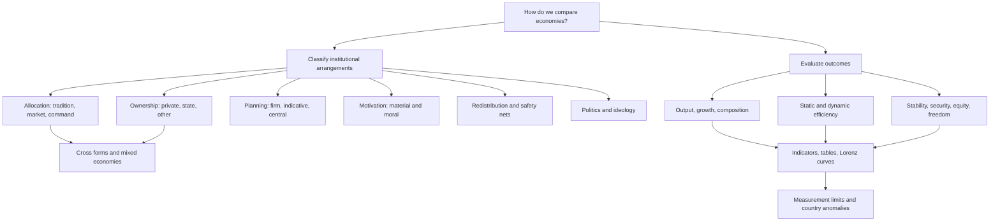
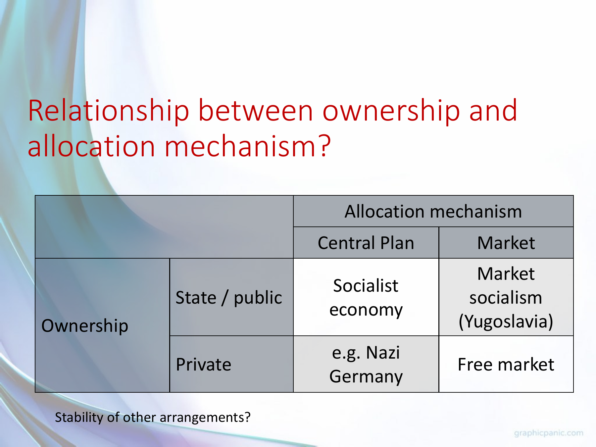
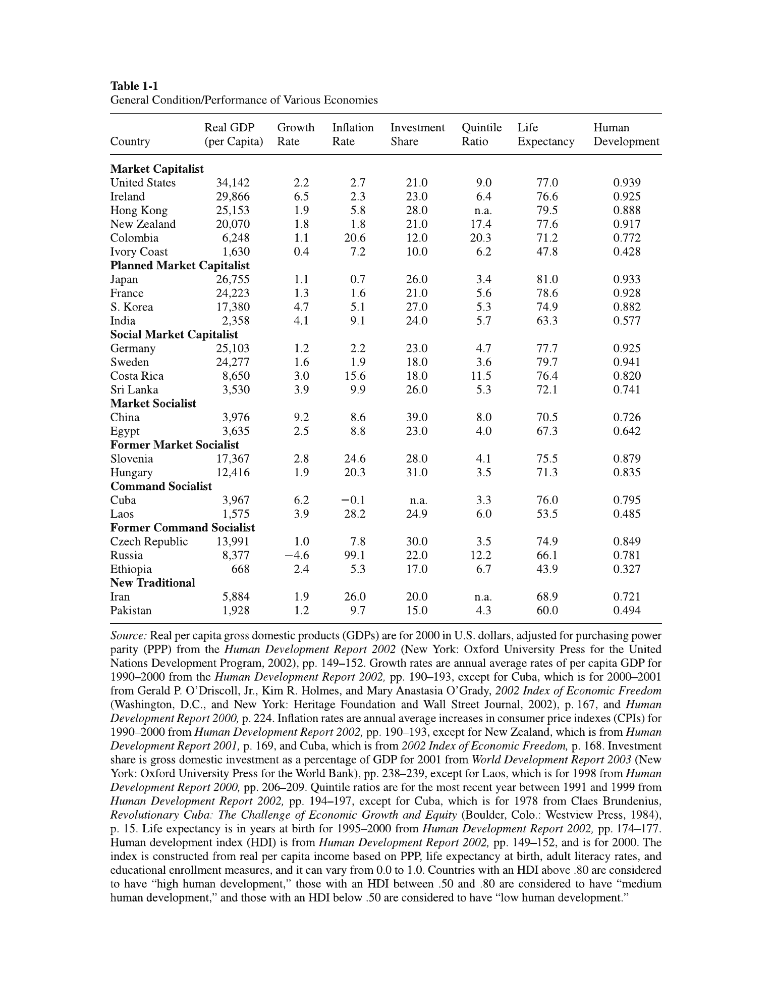
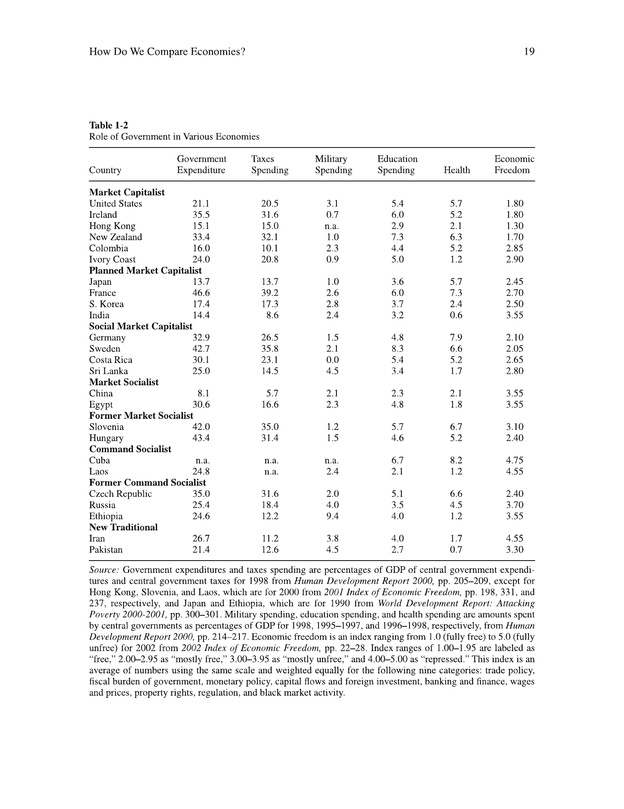
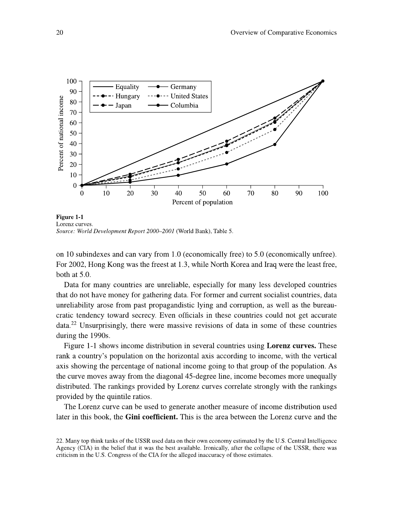
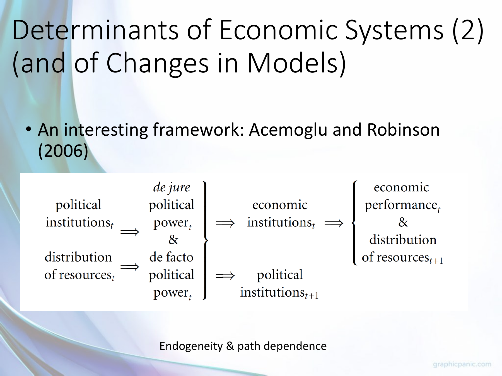
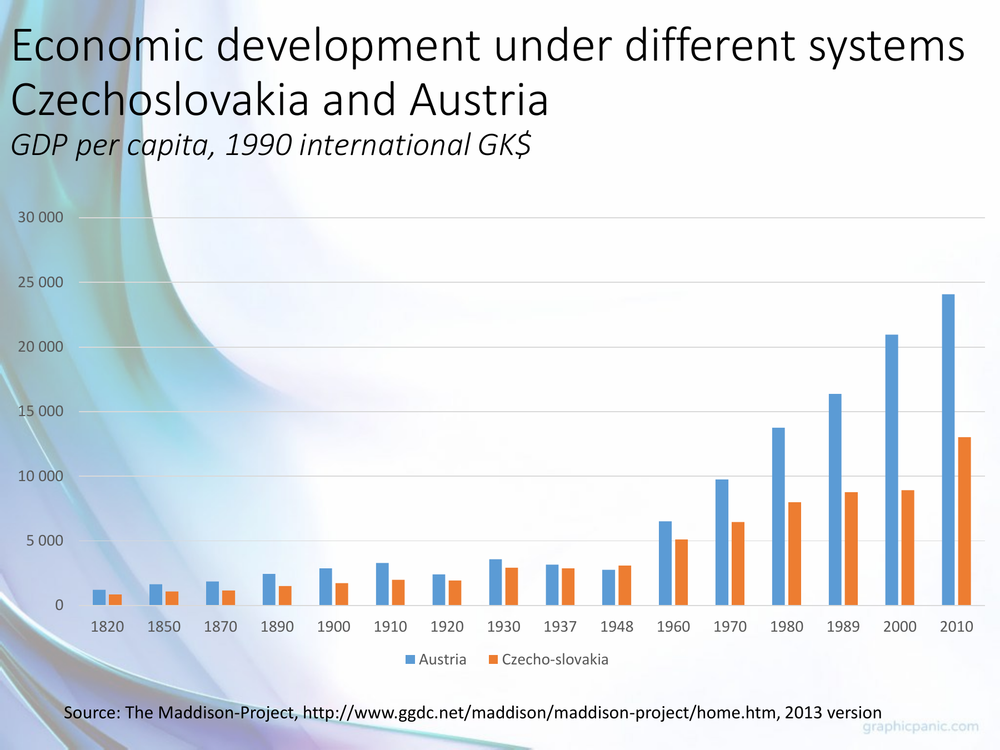
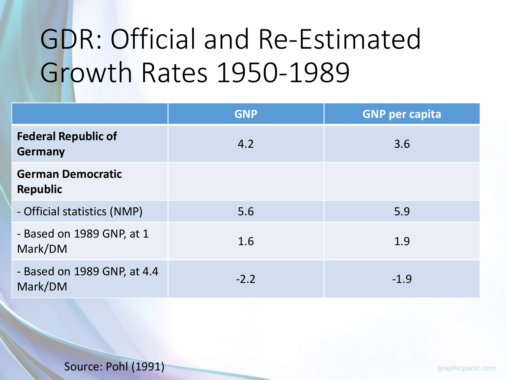

# Comparing economic systems: rules, outcomes, and change

**Question.** How can we compare economies when every country contains a different mixture of markets, public authority, customs, and political rules? Week 1 introduces comparative economics as a study of those institutional arrangements, the behavior they induce, and the outcomes they help produce. A useful comparison first says *what differs*, then chooses *what outcome matters*, and finally asks whether the available evidence can support the proposed explanation. [[00_Materials/2026_2027/Winter_Semester/Comparative_Economics/Week_1/Week I - lecture - shorter - large slides.pdf#page=10|Week I lecture, PDF slide 10]] [[00_Materials/2026_2027/Winter_Semester/Comparative_Economics/Week_1/Rosser Rosser Comparative Economics - chapter 1 full.pdf#page=3|Rosser & Rosser, PDF p. 3 (printed p. 5)]]

Return to the [[01_Notes/2026_2027/Winter_Semester/Comparative_Economics/Comparative_Economics_main.md#Week 1|Week 1 course overview]]. The companion note [[01_Notes/2026_2027/Winter_Semester/Comparative_Economics/Week_1/Institutions_and_Economic_Development.md|Institutions and economic development]] explains five transaction problems behind many system differences; [[01_Notes/2026_2027/Winter_Semester/Comparative_Economics/Week_1/Colonial_Institutions_and_Divergence.md|Colonial institutional divergence]] develops one historical explanation of long-run differences.

## Topic map from Rosser and Rosser, chapter 1

This map follows the chapter's two tasks: classify the institutional rules and evaluate performance. Its branches are a coverage plan, not a claim that any one institutional feature alone causes a national outcome. [[00_Materials/2026_2027/Winter_Semester/Comparative_Economics/Week_1/Rosser Rosser Comparative Economics - chapter 1 full.pdf#page=4|Rosser & Rosser, PDF pp. 4–19 (printed pp. 6–21)]]

## Why comparative economics remains useful

The older plan-versus-market debate asked which allocation mechanism could use resources efficiently. After the Soviet bloc's collapse, some observers expected convergence toward liberal democracy and market capitalism. Rosser and Rosser set out that convergence thesis, but emphasize continuing variation: different capitalist models, surviving socialist forms, and institutions rooted in custom or religion. Their opening is a historical framing from the book's early-2000s context, not a statement of current country classifications. The lecture describes a parallel shift in the field: before 1989, comparison of systems, especially forms of socialism; after 1989, reform and transition; more recently, differences among legal, political, cultural, and other institutions within capitalism. [[00_Materials/2026_2027/Winter_Semester/Comparative_Economics/Week_1/Rosser Rosser Comparative Economics - chapter 1 full.pdf#page=1|Rosser & Rosser, PDF pp. 1–3 (printed pp. 3–5)]] [[00_Materials/2026_2027/Winter_Semester/Comparative_Economics/Week_1/Week I - lecture - shorter - large slides.pdf#page=12|Week I lecture, PDF slides 12–17]]

Comparison matters because institutions shape the setting in which households and firms choose what to produce, combine labor and capital, distribute output, save and invest, and judge whether that distribution is legitimate. An observed behavior that looks puzzling under one system can be sensible under another. The lecture's example is replacing a windshield wiper: a buyer in a well supplied market may search sellers and pay a price, whereas a buyer in a shortage economy may need a queue, personal contact, or another nonmarket channel. The slide poses this as a question, so the specific channel should be treated as an illustration of the mechanism, not as a documented answer for every Soviet-bloc setting. [[00_Materials/2026_2027/Winter_Semester/Comparative_Economics/Week_1/Week I - lecture - shorter - large slides.pdf#page=23|Week I lecture, PDF slides 23–25, 49–50]]

## What is being classified?

Rosser and Rosser call an economy a group of people operating within a set of rules, customs, and laws. A label such as “capitalist” or “socialist” can hide substantial differences in how the group decides, owns, motivates, protects, and redistributes. The six dimensions below should be examined separately before attaching a system label. The lecture adds a useful alternative set of questions: who decides, what information reaches decision makers, what motivates them, and how their choices are coordinated. These four structures describe the *mechanism* by which the six dimensions operate. [[00_Materials/2026_2027/Winter_Semester/Comparative_Economics/Week_1/Rosser Rosser Comparative Economics - chapter 1 full.pdf#page=3|Rosser & Rosser, PDF pp. 3–4 (printed pp. 5–6)]] [[00_Materials/2026_2027/Winter_Semester/Comparative_Economics/Week_1/Week I - lecture - shorter - large slides.pdf#page=30|Week I lecture, PDF slide 30]]

### 1. Allocation: custom, exchange, or command

An **allocation mechanism** determines which uses receive scarce labor, land, inputs, and products. Under *tradition*, established status or custom assigns roles and goods; the Rosser chapter uses caste-based occupations as an example. Under *market exchange*, bids, offers, and prices coordinate decentralized decisions, provided participants can exchange and respond to prices. Under *command*, an authority directs production or distribution. These are ideal types: commands can coexist with markets, and customs continue inside market economies. The distinction is about *how decisions are coordinated*, not who owns the assets. [[00_Materials/2026_2027/Winter_Semester/Comparative_Economics/Week_1/Rosser Rosser Comparative Economics - chapter 1 full.pdf#page=4|Rosser & Rosser, PDF pp. 4–5 (printed pp. 6–7)]] [[00_Materials/2026_2027/Winter_Semester/Comparative_Economics/Week_1/Week I - lecture - shorter - large slides.pdf#page=26|Week I lecture, PDF slide 26]]

### 2. Ownership: who controls productive assets?

Ownership concerns claims to and control of the **means of production**: land, machines, firms, and other productive assets. Private ownership is central to the chapter's definition of capitalism; public ownership is central to its definition of socialism. Public ownership can be central or local, and religious or collective ownership adds further forms. Legal title alone may conceal who actually controls decisions or receives returns, so allocation and ownership should be crossed rather than conflated. [[00_Materials/2026_2027/Winter_Semester/Comparative_Economics/Week_1/Rosser Rosser Comparative Economics - chapter 1 full.pdf#page=5|Rosser & Rosser, PDF pp. 5–7 (printed pp. 7–9)]]

*The lecture's two-by-two schematic:* public ownership plus a central plan is labeled a socialist economy; public ownership plus markets is market socialism, with Yugoslavia as the historical example; private ownership plus markets is a free-market model; private ownership plus central commands is illustrated by Nazi Germany. The table demonstrates that “market” does not logically imply private ownership and “command” does not logically imply public ownership. It is a schematic classification, not a claim that any actual country has only one cell's features. [[00_Materials/2026_2027/Winter_Semester/Comparative_Economics/Week_1/Week I - lecture - shorter - large slides.pdf#page=27|Week I lecture, PDF slide 27]] [[00_Materials/2026_2027/Winter_Semester/Comparative_Economics/Week_1/Rosser Rosser Comparative Economics - chapter 1 full.pdf#page=6|Rosser & Rosser, PDF pp. 6–7 (printed pp. 8–9)]]

Rosser and Rosser note Yugoslav worker management as a market-socialist arrangement, and wartime command over privately owned production as a command-capitalist arrangement. Their point is conceptual: neither pair of labels is a contradiction. They also caution that all real economies are mixed, so the categories describe dominant tendencies rather than exhaustive inventories. [[00_Materials/2026_2027/Winter_Semester/Comparative_Economics/Week_1/Rosser Rosser Comparative Economics - chapter 1 full.pdf#page=6|Rosser & Rosser, PDF pp. 6–7 (printed pp. 8–9)]]

### 3–6. Planning, incentives, redistribution, and politics

**Planning** is a separate dimension because every firm plans some of its own activity even in a market economy. Governments may make nonbinding, *indicative* plans while prices still coordinate exchange; a central plan can instead prescribe most output and inputs. Command can also be improvised without a coherent plan, as the book's War Communism example shows. Thus “planning” does not simply mean “no market.” [[00_Materials/2026_2027/Winter_Semester/Comparative_Economics/Week_1/Rosser Rosser Comparative Economics - chapter 1 full.pdf#page=7|Rosser & Rosser, PDF pp. 7–8 (printed pp. 9–10)]] [[00_Materials/2026_2027/Winter_Semester/Comparative_Economics/Week_1/Week I - lecture - shorter - large slides.pdf#page=28|Week I lecture, PDF slide 28]]

**Incentives** may be material, such as wages, profits, and access to goods, or moral, such as duty to a group or an ideological ideal. The chapter does not claim that people respond to only one type; systems blend incentives, and informal norms affect how material rewards work. **Redistribution** asks both how unequal market or administrative rewards are and how taxes, transfers, and safety nets alter the final distribution and economic security. Rosser contrasts minimal-state arguments, Rawlsian concern for the least advantaged, and Marx's distinct principles for socialism and communism. These are competing ethical and institutional positions, not measurements of a country's performance. [[00_Materials/2026_2027/Winter_Semester/Comparative_Economics/Week_1/Rosser Rosser Comparative Economics - chapter 1 full.pdf#page=8|Rosser & Rosser, PDF pp. 8–11 (printed pp. 10–13)]]

Moral appeals do not have a fixed economic effect. Rosser and Rosser describe Mao-era China and Castro-era Cuba campaigns that appealed to collective ideals and coincided with serious stagnation. They contrast these with the United States' World War II production surge under wage and price controls, when patriotic appeals contributed to work effort. These cases show that the appeal operates alongside material incentives and other conditions; neither outcome establishes a universal effect of moral motivation. [[00_Materials/2026_2027/Winter_Semester/Comparative_Economics/Week_1/Rosser Rosser Comparative Economics - chapter 1 full.pdf#page=9|Rosser & Rosser, PDF p. 9 (printed p. 11)]]

**Politics and ideology** concern who holds power, how rulers are selected or constrained, and which rules are regarded as legitimate. Market capitalism can coexist with authoritarian government; substantial public ownership and redistribution can coexist with electoral democracy. Rosser and Rosser advance the narrower *hypothesis* that permanent, comprehensive command over the economy is incompatible with liberal political freedom because effective opposition would threaten the command structure. This is the authors' argument, not a definitional identity or a result established merely by the four-cell matrix. [[00_Materials/2026_2027/Winter_Semester/Comparative_Economics/Week_1/Rosser Rosser Comparative Economics - chapter 1 full.pdf#page=11|Rosser & Rosser, PDF pp. 11–13 (printed pp. 13–15)]]

## Comparing performance: define the outcome first

Rosser and Rosser use nine evaluation criteria drawn from Bornstein. **Output level** is real output per person, adjusted for population and prices; it approximates average material living standards, not distribution or freedom. **Growth** is the change in output per person, so population growth must be removed before comparing living standards over time. **Composition** asks what is produced and how much output goes to consumption, investment, military use, or public goods. **Static efficiency** concerns using available resources and technology well at a point in time; *Pareto efficiency* means no feasible reallocation makes someone better off without making someone else worse off. It does not imply an equitable distribution. **Dynamic efficiency** concerns choices over time, including whether current extraction or investment undermines future output; the chapter's Soviet oil-well example illustrates the distinction from maximizing current production. [[00_Materials/2026_2027/Winter_Semester/Comparative_Economics/Week_1/Rosser Rosser Comparative Economics - chapter 1 full.pdf#page=13|Rosser & Rosser, PDF pp. 13–15 (printed pp. 15–17)]]

The growth criterion needs a mechanism as well as a rate. Rosser and Rosser argue that the poorest economies may have too little surplus after subsistence consumption to invest, while economies that have escaped that trap can adopt existing frontier technology and catch up. The richest economies must push the technological frontier itself, so their growth opportunity differs. The chapter says command socialist systems sometimes achieved rapid growth for extended periods but tended toward longer-run stagnation. These are historical tendencies in the authors' account, not predictions from a country's label alone. [[00_Materials/2026_2027/Winter_Semester/Comparative_Economics/Week_1/Rosser Rosser Comparative Economics - chapter 1 full.pdf#page=14|Rosser & Rosser, PDF p. 14 (printed p. 16)]]

The remaining criteria are **macroeconomic stability** of output, employment, and prices; **individual economic security**, including jobs and health care; **equity** in income and wealth; and **freedom** to work, consume, own, invest, and exercise civil and political rights. Rosser and Rosser say strict command systems are often credited with short-run stability, but note major exceptions, including instability in surviving command systems after the Soviet breakup. A country can score differently on each criterion. A single ranking therefore requires value judgments about how to weigh these outcomes. The book also cautions against assuming an unavoidable equality–growth trade-off: it gives historical examples of relatively equal, fast-growing economies and unequal, slow-growing ones. Those examples question a simple rule; they do not prove that any specific redistribution policy raises growth. [[00_Materials/2026_2027/Winter_Semester/Comparative_Economics/Week_1/Rosser Rosser Comparative Economics - chapter 1 full.pdf#page=10|Rosser & Rosser, PDF pp. 10–11, 15 (printed pp. 12–13, 17)]]

### Reading the chapter's evidence

*Table 1-1* lists 25 economies grouped by the book's system categories. Its indicators include purchasing-power-adjusted GDP per person in 2000, annual average per-person growth and consumer-price inflation generally over 1990–2000, investment share, a top-to-bottom income-quintile ratio, life expectancy, and the Human Development Index (**HDI**). The HDI combines real income per person, life expectancy, adult literacy, and educational enrollment on a 0–1 scale, with higher values indicating greater measured development. Read the footnote before treating columns as simultaneous: Cuba's growth covers 2000–01, New Zealand's and Cuba's inflation use other sources or periods, and several other indicators have different reference years. The table is a **dated cross-country comparison** with missing values and mixed measurement quality; it cannot by itself isolate the effect of an allocation or ownership rule. [[00_Materials/2026_2027/Winter_Semester/Comparative_Economics/Week_1/Rosser Rosser Comparative Economics - chapter 1 full.pdf#page=15|Rosser & Rosser, PDF pp. 15–16 (printed pp. 17–18), Table 1-1 and source note]]

*Table 1-2* reports central-government expenditure and taxes, plus central-government military, education, and health spending, **each as a percentage of GDP**. It also gives an Economic Freedom Index whose **source scale runs from 1 (freer) to 5 (less free)**. Its columns draw on different years, as the source note explains; the values should not be read as current or perfectly synchronized. For a concrete comparison, Table 1-1 gives 2000 GDP per person of $34,142 for the United States and $24,277 for Sweden, but similar HDI values of 0.939 and 0.941 and different top/bottom quintile ratios of 9.0 and 3.6. Table 1-2 reports central-government expenditure of 21.1% and 42.7% of GDP, respectively, in its source period. The pair illustrates how rankings vary by criterion and institutional arrangement; it does not establish that spending caused the observed HDI or distribution. [[00_Materials/2026_2027/Winter_Semester/Comparative_Economics/Week_1/Rosser Rosser Comparative Economics - chapter 1 full.pdf#page=16|Rosser & Rosser, PDF pp. 16–17 (printed pp. 18–19), Tables 1-1 and 1-2 with source notes]]

*Figure 1-1* plots cumulative population ranked from poorest to richest on the horizontal axis against cumulative national income on the vertical axis. Equal income would trace the 45-degree line; a curve farther below it indicates greater inequality. The **Gini coefficient** is defined as the area between the equality line and a country's Lorenz curve divided by the whole area under the equality line, ranging from 0 (equal) toward 1 (maximally unequal in the limiting case). This converts the picture to one number, but neither the curve nor Gini identifies why inequality arose or whether an observed distribution is just. The figure's named countries and data are historical. [[00_Materials/2026_2027/Winter_Semester/Comparative_Economics/Week_1/Rosser Rosser Comparative Economics - chapter 1 full.pdf#page=18|Rosser & Rosser, PDF pp. 18–19 (printed pp. 20–21), Figure 1-1]]

The chapter explicitly warns that data may be especially weak in poorer countries and in former command systems, where secrecy, reporting incentives, and later revisions complicate comparisons. System classifications themselves are partly arbitrary: openness, industry structure, law, corruption, trust, population density, and other features can matter even when two countries share a headline label. Use the tables to form precise questions, not to treat a category average as a causal estimate. [[00_Materials/2026_2027/Winter_Semester/Comparative_Economics/Week_1/Rosser Rosser Comparative Economics - chapter 1 full.pdf#page=18|Rosser & Rosser, PDF pp. 18–19 (printed pp. 20–21)]]

## Systems change, and institutions feed back on themselves

The lecture rejects a single inevitable route from tradition to feudalism to capitalism or from central planning to one market model. It uses China and Russia to illustrate different, politically shaped transition paths toward forms it calls state capitalism. **Path dependence** means that earlier arrangements alter the resources, expectations, and power of later decision makers; a reform starts from that inherited position. A related **survivorship bias** arises if we infer the original form of all traditional societies only from those that still survive. A system change may lack a deliberate starting decision or a clear start date; where there was a decision, the new system could have been imposed rather than voluntarily chosen, as with Soviet-bloc central planning. The design and survival of a system can also serve political goals, so political control can help stabilize it even when its economic results are poor for much of the population. These are interpretive claims from the slides, not proof that one historical path is universal. [[00_Materials/2026_2027/Winter_Semester/Comparative_Economics/Week_1/Week I - lecture - shorter - large slides.pdf#page=31|Week I lecture, PDF slides 31–36]]

*The lecture's Narrow Corridor schematic* places state power vertically and society's power horizontally. It labels a corridor where state capacity is constrained by organized society as the **Shackled Leviathan**; outside it are a **Despotic Leviathan** where state power dominates, an **Absent Leviathan** with weak state capacity, and a weak-both **Paper Leviathan**. The country labels are illustrative placements in a qualitative model, not measured coordinates or a necessary sequence of development. This visual connects political constraints to economic institutions; the course's uploaded *Why Nations Fail* chapter supplies a different historical argument, so one should not pretend that chapter itself contains this figure. [[00_Materials/2026_2027/Winter_Semester/Comparative_Economics/Week_1/Week I - lecture - shorter - large slides.pdf#page=34|Week I lecture, PDF slides 34–35]]

*The lecture's Acemoglu–Robinson (2006) feedback diagram* links today's political institutions to **de jure** (legally assigned) power, and today's distribution of resources to **de facto** (effective) power. Together those forms of power help shape today's economic institutions and tomorrow's political institutions. Economic institutions affect economic performance and the next resource distribution, which feeds back into later power. The arrows express a conceptual causal mechanism and endogeneity, not measured coefficients or algebraic identities. [[00_Materials/2026_2027/Winter_Semester/Comparative_Economics/Week_1/Week I - lecture - shorter - large slides.pdf#page=43|Week I lecture, PDF slides 43–44]]

### Why a striking comparison may still mislead

*Austria–Czechoslovakia comparison.* The chart plots GDP per person in **1990 international Geary–Khamis dollars** over 1820–2010 using the Maddison Project 2013 version. The visible gap later in the series motivates a question about divergent institutions and systems. It does not isolate a causal effect of socialism: war, borders, industrial structure, measurement, and other historical differences also require analysis. The slide retains a “Czecho-slovakia” series for 2000 and 2010, after the state's dissolution, without explaining how those observations were constructed. Read its units, source date, and this labeling limit before using it as evidence. [[00_Materials/2026_2027/Winter_Semester/Comparative_Economics/Week_1/Week I - lecture - shorter - large slides.pdf#page=40|Week I lecture, PDF slide 40]]

*Germany measurement example.* For 1950–1989, the slide reports West German GNP and GNP-per-person growth figures of 4.2 and 3.6, while its East German official **NMP** series reports 5.6 and 5.9. Two re-estimates of East German GNP using different 1989 Mark/DM conversions report 1.6/1.9 and −2.2/−1.9 respectively. The table's labels do not print a unit for these rates, and NMP and GNP are different aggregates. The key lesson is sensitivity to accounting and conversion, not a precise uncontested ranking from unlike numbers. [[00_Materials/2026_2027/Winter_Semester/Comparative_Economics/Week_1/Week I - lecture - shorter - large slides.pdf#page=41|Week I lecture, PDF slide 41, table attributed there to Pohl (1991)]]

The lecture surveys geography, culture, and leaders' ignorance as proposed explanations of prosperity, then poses Nogales and other counterexamples to simple one-factor accounts. It argues that trust and cooperation can themselves be shaped by institutions. These examples show why competing explanations must be examined; they do not mean geography or culture never matters. The [[01_Notes/2026_2027/Winter_Semester/Comparative_Economics/Week_1/Colonial_Institutions_and_Divergence.md|Nogales and colonial-history note]] explains the uploaded chapter's own evidence and its limits in detail. [[00_Materials/2026_2027/Winter_Semester/Comparative_Economics/Week_1/Week I - lecture - shorter - large slides.pdf#page=37|Week I lecture, PDF slides 37–43]]

Finally, the lecture's Lagos insecurity scenario, Adam Smith quotation, and China discussion all point to the same decision mechanism: if property claims, contract enforcement, or predictable treatment are doubtful, an investor has reason to protect or conceal resources, seek personal connections, or use shorter-horizon opportunities. The China slide specifically names inconsistent rules, weak independent judicial checks, and reliance on *guanxi* networks; those are lecturer claims for discussion, not a blanket characterization of every Chinese transaction. The uploaded Roland chapter explains the contracting problems behind that intuition. [[00_Materials/2026_2027/Winter_Semester/Comparative_Economics/Week_1/Week I - lecture - shorter - large slides.pdf#page=46|Week I lecture, PDF slides 46–52]] [[01_Notes/2026_2027/Winter_Semester/Comparative_Economics/Week_1/Institutions_and_Economic_Development.md|Institutions and economic development]]

*The lecture's final example* is a screenshot of a September 2024 article describing a debated practice in which a relative's conviction can restrict access to certain public jobs, university programs, or military service. It illustrates an **indirect effect** of legal rules on people who were not convicted and why households may care about predictability and equal application. The screenshot reports nearly 25 million recorded offenders during 2000–2022 and states that **some 100 million people could be at risk** if each has three affected relatives. That multiplication gives about 75 million relative instances before any overlap; the article does not explain the difference. Neither number is an observed count of people actually penalized. The slide presents this as an article excerpt, not as independently verified course data. [[00_Materials/2026_2027/Winter_Semester/Comparative_Economics/Week_1/Week I - lecture - shorter - large slides.pdf#page=52|Week I lecture, PDF slide 52]]

## Synthesis

First identify the rules for allocation, ownership, planning, motivation, redistribution, and political control. Then choose explicit performance criteria and examine whether the indicators are comparable and dated appropriately. Historical paths and power can cause the rules themselves to change or persist, so observed outcomes cannot be attributed to a simple system label without considering institutions, context, and measurement. This is why Week 1 connects system classification to the Roland account of transaction costs and the Acemoglu–Robinson account of political and economic institutions. [[00_Materials/2026_2027/Winter_Semester/Comparative_Economics/Week_1/Rosser Rosser Comparative Economics - chapter 1 full.pdf#page=19|Rosser & Rosser, PDF p. 19 (printed p. 21)]] [[00_Materials/2026_2027/Winter_Semester/Comparative_Economics/Week_1/Week I - lecture - shorter - large slides.pdf#page=20|Week I lecture, PDF slides 20–21, 43–44]]
