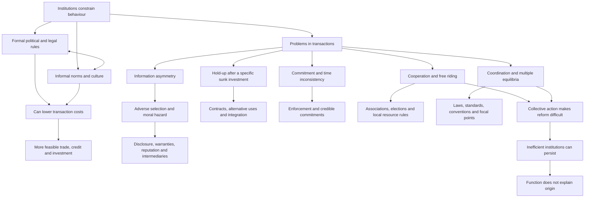

# Institutions and Economic Development

[[01_Notes/2026_2027/Winter_Semester/Comparative_Economics/Comparative_Economics_main.md#Week 1|Back to the Comparative Economics course hub]]

## Why institutions belong in comparative economics

**Question:** Why can the same apparently profitable exchange or investment happen easily in one economy but not another? Roland begins with a farmer buying land. A recorded title, surveyed boundaries and a court that will enforce the title make it safer to improve the plot and allow it to serve as loan collateral. If ownership is hard to prove and eviction or encroachment is hard to challenge, the farmer may avoid a productive investment. The example illustrates a mechanism: the physical land and the farmer's idea can be the same, while rules and enforcement change the expected return. It is an illustration, not evidence that any particular country's institutions caused a measured growth difference. [[00_Materials/2026_2027/Winter_Semester/Comparative_Economics/Week_1/Roland - chapter 7 (Institutions) - single page.pdf#page=1|Roland, PDF p. 1 (printed p. 175)]]

The diagram follows the chapter's sequence: what institutions are, the five problems they help address, and why useful solutions do not automatically emerge. The arrows are a map of the author's argument, not an estimated causal model. [[00_Materials/2026_2027/Winter_Semester/Comparative_Economics/Week_1/Roland - chapter 7 (Institutions) - single page.pdf#page=1|Roland, PDF p. 1 (printed p. 175)]], [[00_Materials/2026_2027/Winter_Semester/Comparative_Economics/Week_1/Roland - chapter 7 (Institutions) - single page.pdf#page=4|Roland, PDF p. 4 (printed p. 178)]], [[00_Materials/2026_2027/Winter_Semester/Comparative_Economics/Week_1/Roland - chapter 7 (Institutions) - single page.pdf#page=24|Roland, PDF p. 24 (printed p. 198)]], [[00_Materials/2026_2027/Winter_Semester/Comparative_Economics/Week_1/Roland - chapter 7 (Institutions) - single page.pdf#page=25|Roland, PDF p. 25 (printed p. 199)]]

An **institution** is a socially created constraint on human behaviour. It includes written law and also unwritten norms that people expect others to follow. A **transaction cost** is a cost of arranging and carrying out an exchange, such as finding reliable information, negotiating, monitoring quality, or enforcing payment. Where expected transaction costs or risks consume the gains from trade, a buyer and seller may rationally leave a potentially valuable exchange undone. Across many transactions, this can hinder credit, entrepreneurship, trade and investment. This is the chapter's proposed route from institutions to economic development, with no single institution guaranteed to solve every problem. [[00_Materials/2026_2027/Winter_Semester/Comparative_Economics/Week_1/Roland - chapter 7 (Institutions) - single page.pdf#page=1|Roland, PDF p. 1 (printed p. 175)]], [[00_Materials/2026_2027/Winter_Semester/Comparative_Economics/Week_1/Roland - chapter 7 (Institutions) - single page.pdf#page=2|Roland, PDF p. 2 (printed p. 176)]], [[00_Materials/2026_2027/Winter_Semester/Comparative_Economics/Week_1/Roland - chapter 7 (Institutions) - single page.pdf#page=4|Roland, PDF p. 4 (printed p. 178)]]

For clarity, an agent-created accounting illustration is: **net gain from a transaction = gross gain from exchange − transaction costs**. If the net gain is negative for a participant, the exchange may not occur even when the gross gain is positive. This is a way to organize the chapter's reasoning, not a numerical estimate reported by Roland. [[00_Materials/2026_2027/Winter_Semester/Comparative_Economics/Week_1/Roland - chapter 7 (Institutions) - single page.pdf#page=1|Roland, PDF p. 1 (printed p. 175)]], [[00_Materials/2026_2027/Winter_Semester/Comparative_Economics/Week_1/Roland - chapter 7 (Institutions) - single page.pdf#page=2|Roland, PDF p. 2 (printed p. 176)]]

## What institutions are

### Formal political and legal rules

**Formal institutions** are codified rules with recognized procedures for enforcement. Political institutions allocate power: they specify, for example, how executives and legislators are selected, constrained and removed. Elections and separation of powers can make it easier to replace a leader and defend the rule of law, though the chapter explicitly warns that democracy and effective legal enforcement do not coincide perfectly. A regime label alone does not establish how well contracts or rights are enforced. [[00_Materials/2026_2027/Winter_Semester/Comparative_Economics/Week_1/Roland - chapter 7 (Institutions) - single page.pdf#page=2|Roland, PDF p. 2 (printed p. 176)]], [[00_Materials/2026_2027/Winter_Semester/Comparative_Economics/Week_1/Roland - chapter 7 (Institutions) - single page.pdf#page=3|Roland, PDF p. 3 (printed p. 177)]]

**Legal institutions** set rules for private and public interactions beyond the selection of political officeholders. The chapter distinguishes common-law systems, which rely heavily on prior judicial decisions, from civil-law systems, which rely heavily on codified statutes. It also notes legal traditions with religious or longer-standing cultural roots. These categories describe sources of legal reasoning; they do not by themselves tell us whether a legal system is efficient or fair. Colonial inheritance is one way such legal frameworks reached developing countries. [[00_Materials/2026_2027/Winter_Semester/Comparative_Economics/Week_1/Roland - chapter 7 (Institutions) - single page.pdf#page=3|Roland, PDF p. 3 (printed p. 177)]]

### Informal norms, culture and interaction with law

**Informal institutions** are socially expected standards of behaviour enforced through reputation, peer pressure, guilt or moral obligation rather than a statute. Roland uses *culture* for beliefs and values passed between generations: beliefs concern how the world and social relations work, while values guide what a society considers acceptable. Courtesy, trust and ordinary methods of settling disputes are examples. These norms continue to matter even where formal law is extensive, because written rules cannot specify every circumstance. [[00_Materials/2026_2027/Winter_Semester/Comparative_Economics/Week_1/Roland - chapter 7 (Institutions) - single page.pdf#page=3|Roland, PDF p. 3 (printed p. 177)]]

The two kinds of institution interact in three ways. First, changing social views can lead to a change in law. Second, a new formal rule can work poorly when it conflicts with a strong existing norm: Roland's examples include colonial borders cutting across group loyalties and anti-nepotism rules clashing with obligations to relatives. Third, law and norms can reinforce each other: a legal penalty for fraud supports an honesty norm, while an honesty norm makes legal promises easier to honour. This is a reason to ask how a rule is understood and enforced in practice, rather than to infer its effect from its written text alone. [[00_Materials/2026_2027/Winter_Semester/Comparative_Economics/Week_1/Roland - chapter 7 (Institutions) - single page.pdf#page=4|Roland, PDF p. 4 (printed p. 178)]]

The chapter organizes the economic consequences around five problems: **information**, **hold-up**, **commitment**, **cooperation**, and **coordination**. They overlap in real transactions, but each identifies a different obstacle and therefore a different reason why a proposed institutional remedy may or may not work. [[00_Materials/2026_2027/Winter_Semester/Comparative_Economics/Week_1/Roland - chapter 7 (Institutions) - single page.pdf#page=4|Roland, PDF p. 4 (printed p. 178)]]

## 1. Information: hidden quality and hidden action

### Adverse selection before exchange

**Asymmetric information** means one side knows something relevant that the other does not. A seller may know a car's defects when the buyer cannot inspect them fully; a lender may not know a borrower's creditworthiness. Some good transactions then fail because the less-informed side must price a mixture of good and bad counterparties. **Adverse selection** occurs when that pooled price discourages the good type from participating, leaving a worse pool. The problem concerns hidden characteristics already present when a contract is offered. [[00_Materials/2026_2027/Winter_Semester/Comparative_Economics/Week_1/Roland - chapter 7 (Institutions) - single page.pdf#page=5|Roland, PDF p. 5 (printed p. 179)]]

Roland's used-car example makes the logic concrete. A good car costs its seller $10,000 and is worth $12,000 to a buyer, so there is $2,000 of possible surplus. A bad car costs its seller $5,000 but is worth only $4,000 to the buyer, so no price can make both sides gain on the bad car. Assume buyers cannot distinguish cars, believe half are good and half bad, and are **risk neutral**, meaning they value this uncertain purchase at its probability-weighted expected value. Then their most they will pay for an unidentified car is

$$
E[V]=0.5(\$12{,}000)+0.5(\$4{,}000)=\$8{,}000.
$$

At $8,000, a good-car seller cannot recover $10,000 and exits. Once buyers anticipate that only bad cars remain, the price they will offer falls to at most $4,000, below the bad seller's $5,000 cost. In this stripped-down example, trade disappears even though mutually beneficial good-car trades existed under full information. This result depends on the assumed values, shares and inability to verify type; it is not a claim that every used-car market collapses. [[00_Materials/2026_2027/Winter_Semester/Comparative_Economics/Week_1/Roland - chapter 7 (Institutions) - single page.pdf#page=5|Roland, PDF p. 5 (printed p. 179)]], [[00_Materials/2026_2027/Winter_Semester/Comparative_Economics/Week_1/Roland - chapter 7 (Institutions) - single page.pdf#page=6|Roland, PDF p. 6 (printed p. 180)]]

**Source arithmetic warning:** printed p. 180 says a bad-car seller would make an $8,000 *profit* at the pooled price. With the source's own $5,000 seller cost, the profit is $8,000 − $5,000 = **$3,000**; $8,000 is revenue. The selection mechanism above uses the printed inputs and correct subtraction. A risk-averse buyer may offer less than the $8,000 risk-neutral expected value, but the chapter gives no utility function with which to calculate a precise amount. [[00_Materials/2026_2027/Winter_Semester/Comparative_Economics/Week_1/Roland - chapter 7 (Institutions) - single page.pdf#page=5|Roland, PDF p. 5 (printed p. 179)]], [[00_Materials/2026_2027/Winter_Semester/Comparative_Economics/Week_1/Roland - chapter 7 (Institutions) - single page.pdf#page=6|Roland, PDF p. 6 (printed p. 180)]]

Credit shows a related selection problem. The book posits a bank with deposit funding costing 6%, half good borrowers whose projects earn 10%, and half bad borrowers who do not repay. When it cannot identify types, raising the loan rate may drive away the good borrowers while leaving those who plan not to repay. Hence the bank may **ration credit**—deny some applicants at a rate below a nominal market-clearing rate—rather than raise the price of credit. Screening can help but will not necessarily identify every good borrower. [[00_Materials/2026_2027/Winter_Semester/Comparative_Economics/Week_1/Roland - chapter 7 (Institutions) - single page.pdf#page=6|Roland, PDF p. 6 (printed p. 180)]], [[00_Materials/2026_2027/Winter_Semester/Comparative_Economics/Week_1/Roland - chapter 7 (Institutions) - single page.pdf#page=7|Roland, PDF p. 7 (printed p. 181)]]

The book says a 12% loan rate would cover the 6% deposit cost because $6\%/0.5=12\%$. That calculation covers only expected **interest**, while its bad borrower is said not to repay the loan at all. To see the omitted principal, let a bank lend $L$ financed by a deposit that must be repaid at $1.06L$. If half the loans repay principal plus interest $r$ and half repay zero, then the break-even condition under these exact assumptions is

$$
0.5(1+r)L+0.5(0)=1.06L
\quad\Longrightarrow\quad r=1.12\text{, or }112\%.
$$

The 112% figure is an agent derivation from the chapter's simplified assumptions, not a figure Roland reports; recovery, screening costs and different funding would change it. The qualitative conclusion is unchanged: even a good project yielding 10% cannot support the pooled break-even rate when half the principal is lost. [[00_Materials/2026_2027/Winter_Semester/Comparative_Economics/Week_1/Roland - chapter 7 (Institutions) - single page.pdf#page=6|Roland, PDF p. 6 (printed p. 180)]]

### Moral hazard after a contract

**Moral hazard** is a problem of an action that one party can take but the other cannot observe or contract on completely. If a farmer receives a fixed hourly wage and effort is hard for the landowner to verify, the worker may supply less effort than if fully exposed to the output. In insurance, hidden driver *type* before coverage is adverse selection; a driver choosing to take less care *because* coverage exists is moral hazard. Borrowing may contain both: ability or honesty may be hidden before lending, while project choice or effort may change afterward. The before/after distinction is useful, though in real cases the two mechanisms can coexist. [[00_Materials/2026_2027/Winter_Semester/Comparative_Economics/Week_1/Roland - chapter 7 (Institutions) - single page.pdf#page=7|Roland, PDF p. 7 (printed p. 181)]]

### Remedies and their limits

Formal rules can require **disclosure** of relevant information or qualifications for entry into a profession. Contractual devices can also signal quality: a return policy lets a buyer learn quickly and reverse a purchase; a warranty shifts some longer-term repair risk to a seller. A brand or franchise puts accumulated reputation at risk if quality falls. Chain stores and rating agencies gather information on behalf of buyers or lenders. These devices depend on credibility: a warranty does little if courts cannot enforce it, and a rating intermediary can itself make serious mistakes, as the chapter illustrates with ratings before the 2008–09 financial crisis. [[00_Materials/2026_2027/Winter_Semester/Comparative_Economics/Week_1/Roland - chapter 7 (Institutions) - single page.pdf#page=7|Roland, PDF p. 7 (printed p. 181)]], [[00_Materials/2026_2027/Winter_Semester/Comparative_Economics/Week_1/Roland - chapter 7 (Institutions) - single page.pdf#page=8|Roland, PDF p. 8 (printed p. 182)]], [[00_Materials/2026_2027/Winter_Semester/Comparative_Economics/Week_1/Roland - chapter 7 (Institutions) - single page.pdf#page=9|Roland, PDF p. 9 (printed p. 183)]]

Where formal enforcement is weak, **relational contracting** can make repeated dealings self-enforcing. A partner who cheats risks losing future business; a seller who has invested in reputation gives customers some reason to trust quality. The chapter's Madagascar and 1990s Russia examples show why firms may prefer a known trading network to unfamiliar alternatives. The cost is less search for better prices and fewer new partners, so a mechanism that makes an existing exchange possible may still limit market expansion. Reputation works only if information about behaviour can circulate. Roland notes that weak communication and weak courts can jointly blunt it. These are illustrated mechanisms, not a controlled comparison showing a single cause of national development. [[00_Materials/2026_2027/Winter_Semester/Comparative_Economics/Week_1/Roland - chapter 7 (Institutions) - single page.pdf#page=9|Roland, PDF p. 9 (printed p. 183)]], [[00_Materials/2026_2027/Winter_Semester/Comparative_Economics/Week_1/Roland - chapter 7 (Institutions) - single page.pdf#page=10|Roland, PDF p. 10 (printed p. 184)]], [[00_Materials/2026_2027/Winter_Semester/Comparative_Economics/Week_1/Roland - chapter 7 (Institutions) - single page.pdf#page=11|Roland, PDF p. 11 (printed p. 185)]]

## 2. Hold-up: investment changes bargaining power

A **hold-up problem** arises when one party makes an investment valuable mainly in a particular relationship and the other party can then demand a worse deal. The investor's cost is **sunk** if it cannot be recovered by walking away. This is an ex ante versus ex post problem: before investing, the threat of later renegotiation may make the whole project unattractive; after investing, it can still be rational to accept a price that fails to repay the original investment. Neither party needs to have hidden information for this problem to occur. [[00_Materials/2026_2027/Winter_Semester/Comparative_Economics/Week_1/Roland - chapter 7 (Institutions) - single page.pdf#page=11|Roland, PDF p. 11 (printed p. 185)]], [[00_Materials/2026_2027/Winter_Semester/Comparative_Economics/Week_1/Roland - chapter 7 (Institutions) - single page.pdf#page=12|Roland, PDF p. 12 (printed p. 186)]]

Roland's axle example sets out the timing. A subcontractor must first invest $I=\$10{,}000$ in equipment. It then can make $q=1{,}000$ axles for a variable cost of $c=\$20$ each. The agreed price is $p=\$30$ per axle. On the book's cost figures, the total profit at that price is

$$
\pi(p)=pq-cq-I=(p-c)q-I,
\qquad
\pi(30)=(30-20)(1{,}000)-10{,}000=0.
$$

The zero is *break-even*, not a windfall. More generally, the minimum promised per-unit price that pays both variable and initial cost is $p_{\mathrm{BE}}=c+I/q$. Once the $10,000 has been irreversibly spent, the truck maker cuts the offer to $p'=\$25$. The subcontractor's **future operating surplus** from producing is $(25-20)(1{,}000)=\$5{,}000>0$. Producing leaves an overall project loss of $5,000; rejecting leaves a loss of the entire $10,000 investment. Thus producing at $25 is the better *current* choice, even though knowing in advance that the price would be $25 would have prevented the investment. In the simple model with no alternative buyer or use, any post-investment price above the $20 variable cost induces production, while only a price of at least $30 recovers the investment. This demonstrates how a potentially viable opportunity can be lost before it starts. [[00_Materials/2026_2027/Winter_Semester/Comparative_Economics/Week_1/Roland - chapter 7 (Institutions) - single page.pdf#page=11|Roland, PDF p. 11 (printed p. 185)]]

The printed page calls its $(25-20)(1{,}000)-10{,}000=-\$5{,}000$ result “operating profit.” That expression is the **total project loss**, because it subtracts the sunk investment. Operating surplus from the decision to produce after the investment is $5,000. Keeping those two calculations separate is essential to the logic. [[00_Materials/2026_2027/Winter_Semester/Comparative_Economics/Week_1/Roland - chapter 7 (Institutions) - single page.pdf#page=11|Roland, PDF p. 11 (printed p. 185)]]

**Asset specificity** means the investment is worth substantially less outside this particular trading relationship. If the axle producer can sell identical axles to another manufacturer or cheaply convert the machine to another product, the original buyer has less bargaining power. Roland gives analogous risks when a farmer changes crop for a promised buyer or improves rented land that a landlord can later reclaim or reprice. Enforceable price contracts help, but contracts often omit unforeseen quality or delivery details, and litigation can be costly; a powerful buyer may exploit those gaps to press for renegotiation. [[00_Materials/2026_2027/Winter_Semester/Comparative_Economics/Week_1/Roland - chapter 7 (Institutions) - single page.pdf#page=12|Roland, PDF p. 12 (printed p. 186)]]

**Vertical integration**—putting supplier and purchaser inside one firm—is another possible response. It avoids bargaining across two separate owners, though it may make production less efficient and may require capital that a domestic firm in a poor economy cannot raise. Roland argues that multinationals can sometimes finance integration more easily through international capital markets. Social norms may restrain opportunism, but their effectiveness also depends on credible sanctions. These are trade-offs, not a proof that integration is always best. [[00_Materials/2026_2027/Winter_Semester/Comparative_Economics/Week_1/Roland - chapter 7 (Institutions) - single page.pdf#page=13|Roland, PDF p. 13 (printed p. 187)]]

## 3. Commitment: promises can become unattractive to keep

A **commitment problem** exists when a party wants to make a promise now but may prefer to break it later, after the other party has acted. The chapter calls this **time inconsistency**: an action optimal at the time of a promise ceases to be optimal at the time it must be performed. Suppose a bicycle is delivered before payment. A buyer who wants the seller to deliver can sincerely offer a promise, yet, if keeping the bicycle without paying carries no consequence, paying afterward is no longer her privately best option. The seller anticipates this and may refuse the transaction. Reversing the order gives the buyer an equivalent concern about delivery. This is a general problem of sequential exchange; unlike hold-up, it does **not** require a specific prior investment. [[00_Materials/2026_2027/Winter_Semester/Comparative_Economics/Week_1/Roland - chapter 7 (Institutions) - single page.pdf#page=13|Roland, PDF p. 13 (printed p. 187)]], [[00_Materials/2026_2027/Winter_Semester/Comparative_Economics/Week_1/Roland - chapter 7 (Institutions) - single page.pdf#page=14|Roland, PDF p. 14 (printed p. 188)]]

The same logic extends beyond a bicycle sale. A government may promise fiscal restraint and later find pre-election spending attractive; a central bank may announce low inflation and later be tempted to stimulate output through surprise expansion. If people anticipate the change, the announcement loses credibility. A seller of a new durable product may promise to maintain a high price, but after selling to eager early customers can be tempted to lower it for others; buyers who foresee this may wait. These are the chapter's examples of incentives changing over time, not demonstrations that the actors always renege. [[00_Materials/2026_2027/Winter_Semester/Comparative_Economics/Week_1/Roland - chapter 7 (Institutions) - single page.pdf#page=14|Roland, PDF p. 14 (printed p. 188)]]

A legally enforceable contract can **tie a party's hands**: breach can trigger a court-imposed penalty, so a promise can be credible when the moment of performance arrives. This third-party enforcement can allow both sides to proceed with an exchange that otherwise would be too risky. It does not mean all contracts must be rigid. If circumstances change and *both* parties prefer a new product or delivery arrangement, they can agree to replace their contract; the original contract remains a fallback that protects each party's bargaining position. [[00_Materials/2026_2027/Winter_Semester/Comparative_Economics/Week_1/Roland - chapter 7 (Institutions) - single page.pdf#page=14|Roland, PDF p. 14 (printed p. 188)]]

Witnesses, public promises or costly irreversible actions are informal ways to make reneging more difficult. The chapter also describes violent private enforcement in Russia during its 1990s transition. Such enforcement may sometimes secure a promise, but it can turn into extortion and additional violence. This illustrates why calling a mechanism an “informal solution” does not imply that it is socially desirable. [[00_Materials/2026_2027/Winter_Semester/Comparative_Economics/Week_1/Roland - chapter 7 (Institutions) - single page.pdf#page=15|Roland, PDF p. 15 (printed p. 189)]]

## 4. Cooperation: individual incentives defeat a shared gain

A **cooperation problem** occurs when each person, deciding in isolation, has an incentive to avoid a contribution even though all would gain if everyone contributed. The chapter's model is the **prisoner's dilemma**. Two prisoners independently choose to confess or remain silent. In the table, a smaller prison term is better for a prisoner; each cell gives *A's term, B's term*. [[00_Materials/2026_2027/Winter_Semester/Comparative_Economics/Week_1/Roland - chapter 7 (Institutions) - single page.pdf#page=16|Roland, PDF p. 16 (printed p. 190)]]

| A's action | B stays silent | B confesses |
| --- | --- | --- |
| A stays silent | 6 months, 6 months | 10 years, 0 years |
| A confesses | 0 years, 10 years | 2 years, 2 years |

*The prisoner's dilemma, adapted from the chapter's Table 7.1; PDF p. 16, printed p. 190.* [[00_Materials/2026_2027/Winter_Semester/Comparative_Economics/Week_1/Roland - chapter 7 (Institutions) - single page.pdf#page=16|Roland, PDF p. 16 (printed p. 190)]]

![[01_Notes/2026_2027/Winter_Semester/Comparative_Economics/assets/Week_1_Roland_p16_prisoners_dilemma.png]]

*Original Table 7.1 from the source, PDF p. 16, printed p. 190.* [[00_Materials/2026_2027/Winter_Semester/Comparative_Economics/Week_1/Roland - chapter 7 (Institutions) - single page.pdf#page=16|Roland, PDF p. 16 (printed p. 190)]]

If B is silent, A compares six months with walking free and confesses. If B confesses, A compares ten years with two years and again confesses. Confessing is therefore A's **dominant strategy**, an action best regardless of B's choice. B has the same incentives. Both confess is a **Nash equilibrium**: neither improves their own outcome by switching alone. Yet both would prefer six months each to two years each. Mutual silence is jointly better, but it is unstable without a credible mechanism to maintain it. The prisoner's dilemma shows why individually sensible choices can produce an inferior collective outcome under these specified payoffs. [[00_Materials/2026_2027/Winter_Semester/Comparative_Economics/Week_1/Roland - chapter 7 (Institutions) - single page.pdf#page=16|Roland, PDF p. 16 (printed p. 190)]], [[00_Materials/2026_2027/Winter_Semester/Comparative_Economics/Week_1/Roland - chapter 7 (Institutions) - single page.pdf#page=17|Roland, PDF p. 17 (printed p. 191)]]

The chapter applies this structure to climate action: each country may hope to enjoy benefits from others' costly emissions reductions. A large emitter, however, can benefit materially from its *own* reductions, so the simple claim that inaction is always a dominant strategy is qualified even in the chapter's footnote. The Kyoto Protocol and 2009 Copenhagen negotiations are historical illustrations of international commitment difficulties, not a description of present policy. In a **common resource** such as shared grazing land, each user can gain from extra use while spreading the depletion cost across the group. Roland's enclosure example adds an important distributional qualification: restricting access may protect a resource while harming people who previously depended on it. [[00_Materials/2026_2027/Winter_Semester/Comparative_Economics/Week_1/Roland - chapter 7 (Institutions) - single page.pdf#page=17|Roland, PDF p. 17 (printed p. 191)]], [[00_Materials/2026_2027/Winter_Semester/Comparative_Economics/Week_1/Roland - chapter 7 (Institutions) - single page.pdf#page=18|Roland, PDF p. 18 (printed p. 192)]]

A **collective-action problem** appears when a shared goal needs costly participation. In Roland's demonstration example, residents oppose a polluting factory and need a threshold of protesters. Each would like the protest to succeed while avoiding their own time cost. If each individual believes their attendance will not be pivotal, free riding can leave turnout below the threshold. The chapter labels staying home a dominant strategy, but the literal threshold setup admits a qualification: if one person knows their attendance is pivotal and values stopping the project more than participation costs, joining can be their best response. The defensible lesson is that organization is difficult, not that turnout must always be zero. [[00_Materials/2026_2027/Winter_Semester/Comparative_Economics/Week_1/Roland - chapter 7 (Institutions) - single page.pdf#page=18|Roland, PDF p. 18 (printed p. 192)]], [[00_Materials/2026_2027/Winter_Semester/Comparative_Economics/Week_1/Roland - chapter 7 (Institutions) - single page.pdf#page=19|Roland, PDF p. 19 (printed p. 193)]]

Unions, professional associations, political parties and international organizations can coordinate contributions and enforce collective decisions. Elections and freedom of association give citizens regular means to organize and replace leaders, while dictatorships may raise the cost of organizing opposition. The chapter also acknowledges that spontaneous protest and voluntary associations do arise even though simple free-riding models predict difficulty. Its East German and South Korean protest examples illustrate that mobilization can sometimes expand rapidly, but informal movements may also be fragile. [[00_Materials/2026_2027/Winter_Semester/Comparative_Economics/Week_1/Roland - chapter 7 (Institutions) - single page.pdf#page=19|Roland, PDF p. 19 (printed p. 193)]], [[00_Materials/2026_2027/Winter_Semester/Comparative_Economics/Week_1/Roland - chapter 7 (Institutions) - single page.pdf#page=20|Roland, PDF p. 20 (printed p. 194)]], [[00_Materials/2026_2027/Winter_Semester/Comparative_Economics/Week_1/Roland - chapter 7 (Institutions) - single page.pdf#page=21|Roland, PDF p. 21 (printed p. 195)]]

Elinor Ostrom's common-resource cases add a crucial solution beyond simple privatization or remote state control: local users can create access rules, monitor use, resolve conflicts and sanction violations. The chapter says such governance often works best where groups can build trust through repeated interaction and participate in decisions. This is a source-reported pattern and mechanism, not a claim that every small community successfully manages a commons. [[00_Materials/2026_2027/Winter_Semester/Comparative_Economics/Week_1/Roland - chapter 7 (Institutions) - single page.pdf#page=20|Roland, PDF p. 20 (printed p. 194)]]

## 5. Coordination: which shared pattern will people choose?

In a **coordination problem**, what is best for a person depends on what others do. Driving on the right is sensible if everyone else does; driving on the left is sensible if everyone else does that instead. Either shared rule can be a Nash equilibrium, because a lone driver would not want to switch. Unlike the prisoner's dilemma above, there is no single dominant action independent of the group. Some coordination equilibria, like road side under adapted cars, may be similarly good; others differ greatly in welfare. [[00_Materials/2026_2027/Winter_Semester/Comparative_Economics/Week_1/Roland - chapter 7 (Institutions) - single page.pdf#page=21|Roland, PDF p. 21 (printed p. 195)]]

The chapter's **stag hunt** makes multiple equilibria precise. Each hunter can hunt a stag, which succeeds only if both cooperate, or a hare, which either can catch alone. Payoffs in the table are *A, B*, with a larger number preferred. [[00_Materials/2026_2027/Winter_Semester/Comparative_Economics/Week_1/Roland - chapter 7 (Institutions) - single page.pdf#page=23|Roland, PDF p. 23 (printed p. 197)]]

| A's action | B hunts stag | B hunts hare |
| --- | --- | --- |
| A hunts stag | **4, 4** | 0, 3 |
| A hunts hare | 3, 0 | **3, 3** |

*The stag hunt, adapted from the chapter's box on PDF p. 23, printed p. 197; both bold cells are Nash equilibria.* [[00_Materials/2026_2027/Winter_Semester/Comparative_Economics/Week_1/Roland - chapter 7 (Institutions) - single page.pdf#page=23|Roland, PDF p. 23 (printed p. 197)]]

![[01_Notes/2026_2027/Winter_Semester/Comparative_Economics/assets/Week_1_Roland_p23_stag_hunt.png]]

*Original stag-hunt box from the source, PDF p. 23, printed p. 197.* [[00_Materials/2026_2027/Winter_Semester/Comparative_Economics/Week_1/Roland - chapter 7 (Institutions) - single page.pdf#page=23|Roland, PDF p. 23 (printed p. 197)]]

If B hunts stag, A does better joining (4 rather than 3); if B hunts hare, A does better hunting hare (3 rather than 0). The same applies to B. Both hunting stag yields more for each, but a player uncertain of the other's participation may prefer the safer hare. This is why moving from one equilibrium to another can require common expectations, not merely a better individual plan. [[00_Materials/2026_2027/Winter_Semester/Comparative_Economics/Week_1/Roland - chapter 7 (Institutions) - single page.pdf#page=23|Roland, PDF p. 23 (printed p. 197)]]

Roland applies this to rule of law. With limited police resources, widespread law-breaking can reduce the probability of detection, making violations individually attractive; widespread compliance can let the same police resources make violations unattractive. The two patterns can reinforce themselves, with different implications for trust and investment. He also interprets a **big push** as a coordination response: private investors wait for roads, ports or electricity, while government hesitates to build them without expected private investment. Joint infrastructure aid and policies that encourage private investment aim to shift both sides' expectations and actions together. The chapter presents these as mechanisms, not an estimate that every big-push programme succeeds. [[00_Materials/2026_2027/Winter_Semester/Comparative_Economics/Week_1/Roland - chapter 7 (Institutions) - single page.pdf#page=22|Roland, PDF p. 22 (printed p. 196)]]

Formal standards can select a common pattern, as road rules or a shared rail gauge do. Yet an established gauge can persist even when cross-border differences impose transfer costs, because changing rails is itself costly. Informal **conventions** serve a similar purpose; the person who placed a dropped telephone call may be expected to call back. A **focal point** is a conspicuous choice people may independently select without communication, such as a central station as a meeting place. Cultural variation means some focal points or norms are obvious to insiders but not outsiders. These examples show how coordination can be achieved by law, shared expectation or experience. [[00_Materials/2026_2027/Winter_Semester/Comparative_Economics/Week_1/Roland - chapter 7 (Institutions) - single page.pdf#page=23|Roland, PDF p. 23 (printed p. 197)]], [[00_Materials/2026_2027/Winter_Semester/Comparative_Economics/Week_1/Roland - chapter 7 (Institutions) - single page.pdf#page=24|Roland, PDF p. 24 (printed p. 198)]]

## Why imperfect institutions can persist

It would be a mistake to conclude that, because an institution *could* reduce a transaction cost, it will automatically appear wherever that problem exists. Roland calls the inference from a thing's present **function** to the cause of its **origin** the **functionalist fallacy**. His microwave example makes the logic clear: an invention's later use need not have been its designer's original aim. Similarly, political settlers seeking protection from tyranny may create rules that later support commerce, even if promoting growth was not their stated purpose. Knowing how a rule works and knowing why it arose are separate questions. [[00_Materials/2026_2027/Winter_Semester/Comparative_Economics/Week_1/Roland - chapter 7 (Institutions) - single page.pdf#page=24|Roland, PDF p. 24 (printed p. 198)]], [[00_Materials/2026_2027/Winter_Semester/Comparative_Economics/Week_1/Roland - chapter 7 (Institutions) - single page.pdf#page=25|Roland, PDF p. 25 (printed p. 199)]]

Inefficient institutions can last because replacing them requires people to organize, bear costs and overcome those who benefit from the existing arrangement. Weak courts, insecure property rights and restrictions on association can themselves make reform harder. Coordination creates an additional hurdle: each person may wait for others to adopt a better pattern before changing their own behaviour. Thus observing a bad rule does not prove no better rule is possible, and observing a useful rule does not prove it arose because it was efficient. The chapter particularly emphasizes collective-action barriers and imperfect democracy; it does not supply a universal account of every institution's history. [[00_Materials/2026_2027/Winter_Semester/Comparative_Economics/Week_1/Roland - chapter 7 (Institutions) - single page.pdf#page=22|Roland, PDF p. 22 (printed p. 196)]], [[00_Materials/2026_2027/Winter_Semester/Comparative_Economics/Week_1/Roland - chapter 7 (Institutions) - single page.pdf#page=24|Roland, PDF p. 24 (printed p. 198)]], [[00_Materials/2026_2027/Winter_Semester/Comparative_Economics/Week_1/Roland - chapter 7 (Institutions) - single page.pdf#page=25|Roland, PDF p. 25 (printed p. 199)]]

The chapter locates this argument in an institutionalist tradition. Veblen stressed status-motivated consumption and social norms; Commons treated transactions and legal rules as central; Coase examined transaction costs, the firm and property rights; Williamson developed asset specificity and hold-up; North emphasized long-run property-rights institutions; and Olson explained free riding in collective action. These are conceptual connections supplied by Roland, not six independent empirical tests in this chapter. [[00_Materials/2026_2027/Winter_Semester/Comparative_Economics/Week_1/Roland - chapter 7 (Institutions) - single page.pdf#page=25|Roland, PDF p. 25 (printed p. 199)]], [[00_Materials/2026_2027/Winter_Semester/Comparative_Economics/Week_1/Roland - chapter 7 (Institutions) - single page.pdf#page=26|Roland, PDF p. 26 (printed p. 200)]]

## Answers to the Week 1 Roland reading questions

The four questions below come from the [[00_Materials/2026_2027/Winter_Semester/Comparative_Economics/Week_1/Pasted 03-10-2026 at 14.19.39.png|Week 1 assignment screenshot]].

1. **What are institutions? What types does the author mention?** Institutions are socially created constraints that shape behaviour and interaction. Roland distinguishes **formal** rules, especially political and legal institutions, from **informal** social norms grounded in culture, beliefs and values. Formal and informal rules can evolve together, conflict, or reinforce each other. The important question is how they change what people can reliably expect in a transaction. [[00_Materials/2026_2027/Winter_Semester/Comparative_Economics/Week_1/Roland - chapter 7 (Institutions) - single page.pdf#page=1|Roland, PDF p. 1 (printed p. 175)]], [[00_Materials/2026_2027/Winter_Semester/Comparative_Economics/Week_1/Roland - chapter 7 (Institutions) - single page.pdf#page=2|Roland, PDF p. 2 (printed p. 176)]], [[00_Materials/2026_2027/Winter_Semester/Comparative_Economics/Week_1/Roland - chapter 7 (Institutions) - single page.pdf#page=3|Roland, PDF p. 3 (printed p. 177)]], [[00_Materials/2026_2027/Winter_Semester/Comparative_Economics/Week_1/Roland - chapter 7 (Institutions) - single page.pdf#page=4|Roland, PDF p. 4 (printed p. 178)]]

2. **What is the hold-up problem?** After one party makes a sunk, relationship-specific investment, the other party may use the investor's weaker outside option to renegotiate the price. In the axle example, $30 per unit covers the $10,000 initial cost across 1,000 units, but after that cost is sunk the subcontractor will still produce for $25 rather than lose the whole investment. Anticipating this, it might decline to invest at all. Contracts, alternative buyers or uses, and sometimes integration can reduce the risk, each with limits. [[00_Materials/2026_2027/Winter_Semester/Comparative_Economics/Week_1/Roland - chapter 7 (Institutions) - single page.pdf#page=11|Roland, PDF p. 11 (printed p. 185)]], [[00_Materials/2026_2027/Winter_Semester/Comparative_Economics/Week_1/Roland - chapter 7 (Institutions) - single page.pdf#page=12|Roland, PDF p. 12 (printed p. 186)]], [[00_Materials/2026_2027/Winter_Semester/Comparative_Economics/Week_1/Roland - chapter 7 (Institutions) - single page.pdf#page=13|Roland, PDF p. 13 (printed p. 187)]]

3. **How would you explain the commitment problem?** A promise that makes cooperation possible today may become privately unattractive to keep tomorrow. With sequential bicycle exchange, whoever receives payment or the bicycle first may be tempted not to complete their side. Anticipation of that temptation can stop the trade. Enforceable contracts, witnesses and credible self-binding make future performance more likely; the general problem requires no special sunk investment. [[00_Materials/2026_2027/Winter_Semester/Comparative_Economics/Week_1/Roland - chapter 7 (Institutions) - single page.pdf#page=13|Roland, PDF p. 13 (printed p. 187)]], [[00_Materials/2026_2027/Winter_Semester/Comparative_Economics/Week_1/Roland - chapter 7 (Institutions) - single page.pdf#page=14|Roland, PDF p. 14 (printed p. 188)]], [[00_Materials/2026_2027/Winter_Semester/Comparative_Economics/Week_1/Roland - chapter 7 (Institutions) - single page.pdf#page=15|Roland, PDF p. 15 (printed p. 189)]]

4. **Why can imperfect institutions persist?** A bad institution does not disappear merely because a better one would help society. Reform requires people to organize and pay costs, while each can hope others will act; entrenched rules may also inhibit organization. People may remain coordinated on a low-trust equilibrium while waiting for others to change. Finally, an institution's useful function does not explain why it emerged in the first place. These are the chapter's mechanisms, not a claim that all imperfect institutions persist for one identical reason. [[00_Materials/2026_2027/Winter_Semester/Comparative_Economics/Week_1/Roland - chapter 7 (Institutions) - single page.pdf#page=22|Roland, PDF p. 22 (printed p. 196)]], [[00_Materials/2026_2027/Winter_Semester/Comparative_Economics/Week_1/Roland - chapter 7 (Institutions) - single page.pdf#page=24|Roland, PDF p. 24 (printed p. 198)]], [[00_Materials/2026_2027/Winter_Semester/Comparative_Economics/Week_1/Roland - chapter 7 (Institutions) - single page.pdf#page=25|Roland, PDF p. 25 (printed p. 199)]]

## Synthesis and scope

Institutions matter in this chapter because rules and norms influence the information people can trust, the promises they can enforce and the collective patterns they can sustain. Better disclosure will not by itself solve hold-up; a contract will not by itself solve a free-rider problem; and a profitable investment may still fail when the parties expect others not to act. The five-problem framework is most useful when it identifies the precise obstacle and the assumptions under which a remedy changes incentives. Roland's examples and dated historical cases illustrate those mechanisms. They do not identify a single institutional variable that mechanically determines development everywhere. [[00_Materials/2026_2027/Winter_Semester/Comparative_Economics/Week_1/Roland - chapter 7 (Institutions) - single page.pdf#page=4|Roland, PDF p. 4 (printed p. 178)]], [[00_Materials/2026_2027/Winter_Semester/Comparative_Economics/Week_1/Roland - chapter 7 (Institutions) - single page.pdf#page=24|Roland, PDF p. 24 (printed p. 198)]], [[00_Materials/2026_2027/Winter_Semester/Comparative_Economics/Week_1/Roland - chapter 7 (Institutions) - single page.pdf#page=27|Roland, PDF p. 27 (printed p. 201)]]
