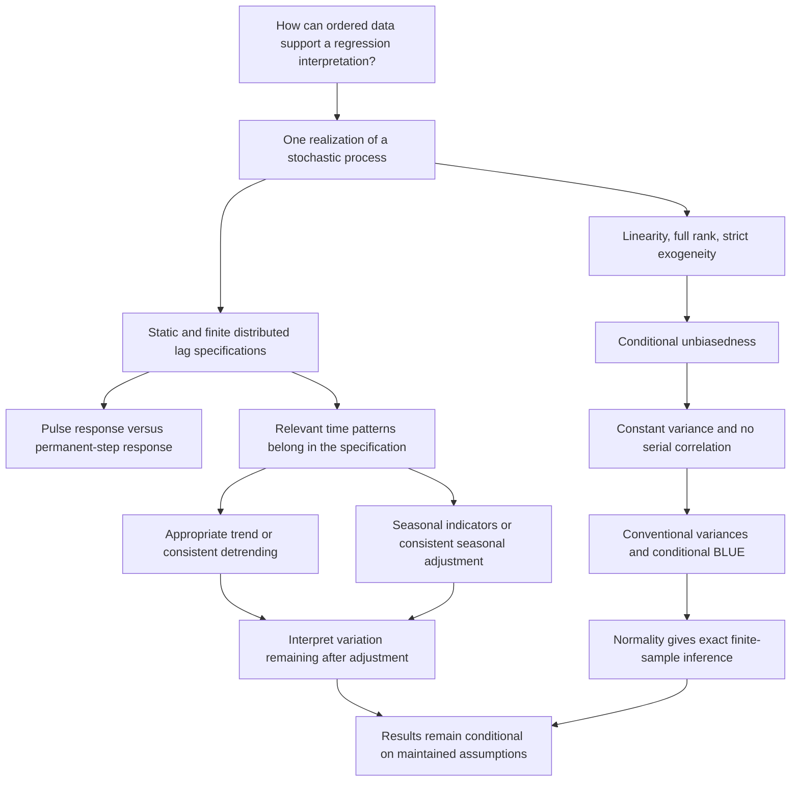

[[#Week 1|Week 1]] · [[#Week 2|Week 2]]

# Econometrics II

Econometrics II develops the ability to conduct and interpret an empirical analysis: formulate a regression from an economic question, select appropriate data and methods, estimate it, evaluate its assumptions, and explain what the results establish. Week 1 revises cross-sectional OLS before the course extends those methods to other settings. This hub contains the material actually ingested for the first week. [[00_Materials/2026_2027/Winter_Semester/Econometrics_II/Week_1/2026_Lecture1_print.pdf#page=10|Lecture 1, PDF pp. 10–12]]

## Week 1

Concept index:

- [[01_Notes/2026_2027/Winter_Semester/Econometrics_II/Week_1/OLS_Estimator_and_Assumptions|OLS estimator and assumptions]]
- [[01_Notes/2026_2027/Winter_Semester/Econometrics_II/Week_1/Unbiasedness_Consistency_and_Efficiency|Unbiasedness, consistency, and efficiency]]
- [[01_Notes/2026_2027/Winter_Semester/Econometrics_II/Week_1/Transport_Demand_Regression_Seminar|Transport demand: regression and interpretation]]
- [[01_Notes/2026_2027/Winter_Semester/Econometrics_II/Week_1/Course_Organization_and_Source_Discrepancies|Course organization and source discrepancies]]

### The sample calculation and the population question

Begin with $y_i=\beta_0+\beta_1x_i+u_i$. OLS chooses the intercept and slope that minimize squared residuals, giving

$$
\hat\beta_1=
\frac{\sum_i(x_i-\bar x)(y_i-\bar y)}{\sum_i(x_i-\bar x)^2},
\qquad
\hat\beta_0=\bar y-\hat\beta_1\bar x.
$$

The numerator measures sample co-movement and the denominator sample regressor variation. The coefficients describe the fitted sample line; their relation to the population parameters depends on the data-generating assumptions. [[01_Notes/2026_2027/Winter_Semester/Econometrics_II/Week_1/OLS_Estimator_and_Assumptions|OLS estimator and assumptions]] develops the normal equations, distinguishes disturbances from residuals, and explains why multiple regression estimates coefficients jointly. [[00_Materials/2026_2027/Winter_Semester/Econometrics_II/Week_1/2026_Lecture1_print.pdf#page=14|Lecture 1, PDF pp. 14–15]]

### Three properties, three questions

The decomposition $\hat\beta_1=\beta_1+\sum_i(x_i-\bar x)u_i/S_{xx}$ exposes the estimation error. Under linearity, random sampling, no perfect collinearity, and zero conditional mean, the conditional mean of that error is zero, so OLS is unbiased. This means correct centering over repeated samples, while a single estimate may still be imprecise. For consistency, divide the numerator and denominator by $n$ and use a law of large numbers: the probability limit is $\beta_1+\operatorname{Cov}(x,u)/\operatorname{Var}(x)$. With suitable moment and nondegeneracy conditions, zero covariance removes the limiting error. A larger sample does not remove bias arising from nonzero population covariance. [[00_Materials/2026_2027/Winter_Semester/Econometrics_II/Week_1/2026_Lecture1_print.pdf#page=16|Lecture 1, PDF pp. 16–22]]

Adding homoskedasticity yields the Gauss–Markov result: OLS has the smallest conditional variance among linear unbiased estimators. Adding normality further gives the lecture's exact conditional normal, $t$, and $F$ distributions. [[01_Notes/2026_2027/Winter_Semester/Econometrics_II/Week_1/Unbiasedness_Consistency_and_Efficiency|Unbiasedness, consistency, and efficiency]] explains the assumptions in each proof and distinguishes finite-sample results from large-sample ones. Neither BLUE nor consistency is a guarantee that a particular estimate is close to the truth. [[00_Materials/2026_2027/Winter_Semester/Econometrics_II/Week_1/2026_Lecture1_print.pdf#page=23|Lecture 1, PDF pp. 23–26]]

### From a fare question to an empirical report

The seminar asks a transport manager to estimate travel demand as a function of fare, then calculate residuals, variation, variance estimates, and a slope $t$ statistic. Its ten-city table makes the OLS formula concrete. The accompanying 1,000-observation CSV then supports comparison of simple price regression with models that also include income and gasoline. [[01_Notes/2026_2027/Winter_Semester/Econometrics_II/Week_1/Transport_Demand_Regression_Seminar|Transport demand: regression and interpretation]] contains explicitly labeled agent-computed worked examples, coefficient tables, $R^2$ and adjusted $R^2$, and residual diagnostic plots and tests. The supplied CSV does not document units or its generating equation, so its numerical coefficients are interpreted in file units and its `u` column is not assumed to identify a known structural disturbance. [[00_Materials/2026_2027/Winter_Semester/Econometrics_II/Week_1/Seminar 1 OS/Seminar1.pdf#page=1|Seminar 1, PDF pp. 1–2]]; [[00_Materials/2026_2027/Winter_Semester/Econometrics_II/Week_1/Seminar 1 OS/travel.csv|travel.csv]]

The lesson is to connect a coefficient to its comparison and assumptions: controls change what is held fixed, fit describes sample variation, and residual checks cannot establish population exogeneity or random sampling. A useful report therefore explains the model, estimates, uncertainty, diagnostics, and remaining limits together. This follows the course's stated aim of producing and evaluating empirical analysis. [[00_Materials/2026_2027/Winter_Semester/Econometrics_II/Week_1/2026_Lecture1_print.pdf#page=11|Lecture 1, PDF p. 11]]; [[00_Materials/2026_2027/Winter_Semester/Econometrics_II/Week_1/Seminar 1 OS/Seminar1.pdf#page=2|Seminar 1, PDF p. 2]]

### Preparation and unresolved source details

Week 1 is listed as unbiasedness, consistency, and efficiency, with Wooldridge Chapters 2 and 5. For the next lecture, the slides request revision of OLS assumptions and properties and reading Chapter 10; Chapter 10 itself is not part of this ingestion. [[01_Notes/2026_2027/Winter_Semester/Econometrics_II/Week_1/Course_Organization_and_Source_Discrepancies|Course organization and source discrepancies]] records assessment information and source differences that need clarification: assignment 1's deadline is October 26 in the lecture and October 19 in the syllabus; grading thresholds use different fractional/integer boundaries; the syllabus prints the impossible date “Sept 31”; and the uploaded midterm end time is unclear. These are preserved without choosing one source over another. [[00_Materials/2026_2027/Winter_Semester/Econometrics_II/Week_1/2026_Lecture1_print.pdf#page=8|Lecture 1, PDF pp. 6, 8–9, 13]]; [[00_Materials/2026_2027/Winter_Semester/Econometrics_II/Week_1/Syllabus_2026.pdf#page=1|Syllabus 2026, PDF pp. 1–2]]

## Week 2

Concept index:

- [[01_Notes/2026_2027/Winter_Semester/Econometrics_II/Week_2/Time_Series_OLS_and_Strict_Exogeneity|Time-series OLS and strict exogeneity]]
- [[01_Notes/2026_2027/Winter_Semester/Econometrics_II/Week_2/Static_and_Finite_Distributed_Lag_Models|Static and finite distributed lag models]]
- [[01_Notes/2026_2027/Winter_Semester/Econometrics_II/Week_2/Trends_Detrending_and_Seasonality|Trends, detrending, and seasonality]]

*Concept map verified against Lecture 2, PDF pp. 3–30, and Wooldridge Chapter 10, printed pp. 344–355 and 363–374 (PDF pp. 372–383 and 391–402). It maps the Week 2 topics supported by the reading; additional Chapter 10 applications and next-week Chapter 11 detail are not separate study targets here.* [[00_Materials/2026_2027/Winter_Semester/Econometrics_II/Dump/textbook.pdf#page=372|Wooldridge, 5th ed., PDF p. 372 (printed p. 344)]]; [[00_Materials/2026_2027/Winter_Semester/Econometrics_II/Dump/textbook.pdf#page=402|Wooldridge, 5th ed., PDF p. 402 (printed p. 374)]]

### Ordered observations change the assumptions

A time series is one realization of a stochastic process, with dates whose order matters. Its dependence structure means that the cross-sectional random-sampling argument cannot simply be reused. OLS still minimizes squared residuals, but its conditional-unbiasedness proof needs $E[u_t\mid X]=0$, where $X$ contains regressors at all sample dates. This strict exogeneity condition excludes correlation of today's disturbance with future regressors, including feedback when a future policy decision reacts to an unexpected outcome today. Same-date exogeneity alone gives no such guarantee. [[01_Notes/2026_2027/Winter_Semester/Econometrics_II/Week_2/Time_Series_OLS_and_Strict_Exogeneity|The time-series OLS note]] develops the matrix proof, the named assumption ladder, variance derivations, and exact-inference boundary. [[00_Materials/2026_2027/Winter_Semester/Econometrics_II/Week_2/2026_Lecture2_print.pdf#page=5|Lecture 2, PDF pp. 5–13]]; [[00_Materials/2026_2027/Winter_Semester/Econometrics_II/Dump/textbook.pdf#page=379|Wooldridge, 5th ed., PDF pp. 379–380 (printed pp. 351–352)]]

Add constant conditional variance and no conditional serial correlation to obtain $\operatorname{Var}(u\mid X)=\sigma^2I_T$. This yields conventional coefficient variances and conditional BLUE. Normality adds exact finite-sample null distributions. These results concern different properties: serial correlation can invalidate a conventional variance formula even when strict exogeneity preserves unbiasedness. Names prevent a source-numbering trap: the deck labels strict exogeneity TS2 and full rank TS3, while the supplied textbook reverses those two labels; the deck's statement that TS6 implies TS3 therefore cannot be read literally. [[00_Materials/2026_2027/Winter_Semester/Econometrics_II/Week_2/2026_Lecture2_print.pdf#page=14|Lecture 2, PDF pp. 14–21]]; [[00_Materials/2026_2027/Winter_Semester/Econometrics_II/Dump/textbook.pdf#page=383|Wooldridge, PDF p. 383 (printed p. 355)]]

### Describe the timing of a modeled response

A static model uses the current explanatory value. An FDL model also includes earlier values: $y_t=\alpha_0+\sum_{j=0}^q\delta_jz_{t-j}+u_t$. Holding other model inputs and disturbances fixed, a temporary unit pulse produces successive responses $\delta_0,\ldots,\delta_q$, whereas a permanent unit step builds to $LRP=\sum_{j=0}^q\delta_j$. [[01_Notes/2026_2027/Winter_Semester/Econometrics_II/Week_2/Static_and_Finite_Distributed_Lag_Models|Static and finite distributed lag models]] explains these paths, why lag correlation reduces individual precision, and how a long-run sum can nevertheless be estimated more precisely. It develops the lecture's EET restaurant-price specification and lagged-response visual, with the source's absent data/coding and unverified policy-date claims clearly identified. [[00_Materials/2026_2027/Winter_Semester/Econometrics_II/Week_2/2026_Lecture2_print.pdf#page=22|Lecture 2, PDF pp. 22–25, 35]]; [[00_Materials/2026_2027/Winter_Semester/Econometrics_II/Dump/textbook.pdf#page=375|Wooldridge, PDF pp. 375–376 (printed pp. 347–348)]]

The static special case sets the **lag** coefficients to zero and retains the current-value coefficient. The lecture's p. 24 wording includes $\delta_0$ in the zero list, contrary to its arrows; the textbook states the appropriate restriction explicitly. These are specification interpretations whose causal use still requires suitable exogeneity, rather than effects established by a formula alone. [[00_Materials/2026_2027/Winter_Semester/Econometrics_II/Week_2/2026_Lecture2_print.pdf#page=24|Lecture 2, PDF p. 24]]; [[00_Materials/2026_2027/Winter_Semester/Econometrics_II/Dump/textbook.pdf#page=376|Wooldridge, PDF p. 376 (printed p. 348)]]

### Compare deviations from trend and calendar patterns

Two series can appear closely related because they share a time pattern. [[01_Notes/2026_2027/Winter_Semester/Econometrics_II/Week_2/Trends_Detrending_and_Seasonality|Trends, detrending, and seasonality]] explains the omitted-trend mechanism, shows the source GDP/productivity figures, and develops equivalent OLS comparisons using an appropriate trend regressor or the same detrending controls for every variable. Its detrended $R^2$ uses outcome variation remaining after trend removal; it answers a different fit question from the original overall $R^2$. A textbook housing example makes that difference numerical. Stable seasonal differences can be modeled with seasonal indicators, leaving one reference period when there is an intercept, or removed by consistent residualization. Neither adjustment alone establishes causal identification or cures every persistent time-series problem. [[00_Materials/2026_2027/Winter_Semester/Econometrics_II/Week_2/2026_Lecture2_print.pdf#page=26|Lecture 2, PDF pp. 26–30, 32–34]]; [[00_Materials/2026_2027/Winter_Semester/Econometrics_II/Dump/textbook.pdf#page=397|Wooldridge, PDF pp. 397–401 (printed pp. 369–373)]]

### Reading identity and scope

The lecture assigns Chapter 10 for today and Chapter 11 for next week. The uploaded textbook is the **Fifth Edition**, whose Chapter 10 is printed pp. 344–379 / physical PDF pp. 372–407, and Chapter 11 is printed pp. 380–411 / PDF pp. 408–439. Its pagination therefore differs from the slides' pp. 311–342 and 347–370; the chapter titles establish the match. Chapter 10 explanations are integrated into these same topic notes. Chapter 11 is used only where it clarifies the present assumption/trend boundary; its broader next-week methods are not developed here. The slides' unprovided board examples, linked video, EET data, and unlabeled units/provenance for the GDP figures remain outside verified supplied coverage. [[00_Materials/2026_2027/Winter_Semester/Econometrics_II/Week_2/2026_Lecture2_print.pdf#page=2|Lecture 2, PDF pp. 2, 28–31]]; [[00_Materials/2026_2027/Winter_Semester/Econometrics_II/Dump/textbook.pdf#page=372|Wooldridge, Chapter 10 opening, PDF p. 372 (printed p. 344)]]; [[00_Materials/2026_2027/Winter_Semester/Econometrics_II/Dump/textbook.pdf#page=408|Chapter 11 opening, PDF p. 408 (printed p. 380)]]
