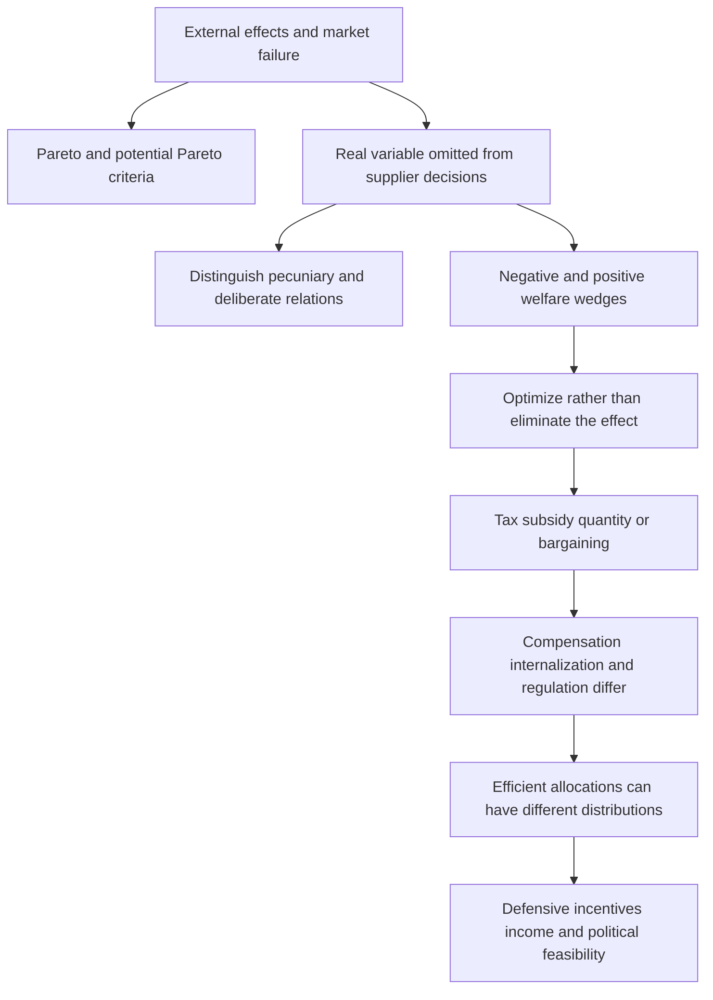

# Externalities and Welfare Optimum

Source: [[00_Materials/2026_2027/Winter_Semester/Economics_of_Green_Deal/Week_2/01_Regulation_Externality-1.pdf]]; [[00_Materials/2026_2027/Winter_Semester/Economics_of_Green_Deal/Week_2/ARTICLE_01a_Verhoef_2002-1.pdf]]

Back to [[01_Notes/2026_2027/Winter_Semester/Economics_of_Green_Deal/Economics_of_Green_Deal_main#Week 2|Week 2]].

An externality explains why individually sensible choices can produce a socially inefficient allocation. The central question is which consequences a decision maker considers, and whether the remaining effects create a wedge between private and social marginal benefits or costs. This develops the resource, waste and utility paths in the [[01_Notes/2026_2027/Winter_Semester/Economics_of_Green_Deal/Week_1/Environment_Economy_Nexus|environment–economy framework]]. The analysis also asks who bears the loss and who receives policy revenue: finding an efficient allocation does not settle distribution. [[00_Materials/2026_2027/Winter_Semester/Economics_of_Green_Deal/Week_2/01_Regulation_Externality-1.pdf#page=3|Lecture, physical PDF pp. 3–6]] [[00_Materials/2026_2027/Winter_Semester/Economics_of_Green_Deal/Week_2/ARTICLE_01a_Verhoef_2002-1.pdf#page=1|Verhoef Externalities, physical PDF pp. 1–2]]

## Topic map of the Verhoef chapter

*Source-grounded topic map of the chapter “Externalities,” physical PDF pp. 1–9 (printed pp. 197–213). The printed p. 214 references and the next-chapter fragment on physical p. 10 are accounted for below.* [[00_Materials/2026_2027/Winter_Semester/Economics_of_Green_Deal/Week_2/ARTICLE_01a_Verhoef_2002-1.pdf#page=1|Verhoef Externalities, physical PDF pp. 1–9]]

## What welfare criteria can establish

A **Pareto improvement** makes at least one person better off without making anyone worse off. A **Pareto-efficient allocation** leaves no feasible rearrangement that everyone weakly prefers, with somebody strictly preferring it. These criteria make relatively little use of interpersonal welfare comparisons, but they cannot rank alternative efficient allocations with different distributions. Verhoef contrasts them with **potential Pareto** or compensation criteria: the winners could compensate the losers so that a Pareto improvement becomes possible. The Kaldor version asks whether winners can compensate losers after the change; the Hicks version asks whether losers could pay the winners to prevent the change. Actual compensation is not required by the potential criterion. Therefore a positive aggregate net benefit can coexist with people who lose. [[00_Materials/2026_2027/Winter_Semester/Economics_of_Green_Deal/Week_2/ARTICLE_01a_Verhoef_2002-1.pdf#page=2|Verhoef Externalities, physical PDF p. 2]]

Under the conditions of the first welfare theorem, a competitive equilibrium is Pareto efficient; the second theorem relates alternative efficient allocations to appropriate endowment distributions. The chapter also relates maxima of Paretian, welfaristic social welfare functions to efficiency and, under concavity, the converse with suitable welfare weights. These are conditional results. Increasing returns, market power, external effects, public goods and imperfect information can prevent their usual competitive conclusion. Equity and merit-good arguments are additional rationales for intervention, distinct from a demonstration of market failure. A failure identifies a possible efficiency rationale; an intervention still needs gains exceeding its costs. The chapter calls a technological externality potentially Pareto relevant when correcting it costs less than the available welfare gain. [[00_Materials/2026_2027/Winter_Semester/Economics_of_Green_Deal/Week_2/ARTICLE_01a_Verhoef_2002-1.pdf#page=2|Verhoef Externalities, physical PDF pp. 2–3]] [[00_Materials/2026_2027/Winter_Semester/Economics_of_Green_Deal/Week_2/01_Regulation_Externality-1.pdf#page=4|Lecture, physical PDF pp. 4,22]]

## Identify the externality before proposing a remedy

The chapter's definition has two actors: a **supplier** whose action determines a real variable and a **receptor** whose utility or production function depends on it. The supplier does not account for that effect in choosing the action. Noise, contaminated water or air quality can be such real variables. An upstream factory that discharges waste, reduces dissolved oxygen and fish stocks, and harms downstream anglers illustrates the mechanism. If downstream welfare does not enter the factory's decision, the private return from production remains higher than its social return. The lecture also presents the uncompensated-welfare-loss wording of an external cost. The definition used in the chapter makes the neglected real relationship central; compensation and incentives require separate analysis. [[00_Materials/2026_2027/Winter_Semester/Economics_of_Green_Deal/Week_2/01_Regulation_Externality-1.pdf#page=3|Lecture, physical PDF pp. 3,5–6]] [[00_Materials/2026_2027/Winter_Semester/Economics_of_Green_Deal/Week_2/ARTICLE_01a_Verhoef_2002-1.pdf#page=3|Verhoef Externalities, physical PDF pp. 3,5]]

A physical environmental change without a utility or production consequence does not establish an economic externality. An unpriced relationship is also insufficient. Barter can exchange benefits implicitly, and altruism deliberately takes another person's pleasure into account. The chapter excludes deliberate violence, jealousy and promotion from its externality category as well. This is a classification of the argument for efficiency correction, not approval of harmful conduct or a claim that policy has no equity or other rationale. [[00_Materials/2026_2027/Winter_Semester/Economics_of_Green_Deal/Week_2/01_Regulation_Externality-1.pdf#page=7|Lecture, physical PDF pp. 7–10]] [[00_Materials/2026_2027/Winter_Semester/Economics_of_Green_Deal/Week_2/ARTICLE_01a_Verhoef_2002-1.pdf#page=3|Verhoef Externalities, physical PDF p. 3]]

**Pecuniary effects** operate through prices in existing markets. A change in transport or input prices moves a consumer along a given demand/utility relationship rather than creating the technological shift represented by an externality. Under the competitive assumptions here, the market already transmits these effects. Greater consumer surplus from cheaper output can be valuable without being an external benefit. Employment and value added in related industries are likewise not evidence that excessive externality-generating activity should be encouraged. Infrastructure investment and the actual use of infrastructure need separate assessments. The [[01_Notes/2026_2027/Winter_Semester/Economics_of_Green_Deal/Week_2/Road_Transport_External_Costs|transport note]] develops these distinctions. [[00_Materials/2026_2027/Winter_Semester/Economics_of_Green_Deal/Week_2/01_Regulation_Externality-1.pdf#page=9|Lecture, physical PDF pp. 9–10,19]] [[00_Materials/2026_2027/Winter_Semester/Economics_of_Green_Deal/Week_2/ARTICLE_01a_Verhoef_2002-1.pdf#page=3|Verhoef Externalities, physical PDF pp. 3–5]]

### Types and boundaries

Positive versus negative refers to the receptor's benefit or loss, while production versus consumption refers to the originating activity. Spatial neighbourhood, partial/global and intergenerational classifications identify the reach of the effect. The lecture also lists effects involving several interacting uses, such as fishing, boating and swimming, and marginal versus inframarginal effects. These classifications identify which relationships require measurement; the lecture supplies no separate formal model for every category. [[00_Materials/2026_2027/Winter_Semester/Economics_of_Green_Deal/Week_2/01_Regulation_Externality-1.pdf#page=12|Lecture, physical PDF p. 12]]

A **depletable** effect differs from an **undepletable** effect in whether one receptor's consumption changes what is available to others. An undepletable externality has public-good or public-bad characteristics alongside the externality. The chapter reports that this distinction does not require different Pigouvian pricing rules by itself, but can make voluntary bargaining vulnerable to strategic behaviour and free riding. In **congestion**, an actor can simultaneously cause and receive effects; the appropriate individual-level incentive does not disappear merely because the harm stays inside the road-user sector. [[00_Materials/2026_2027/Winter_Semester/Economics_of_Green_Deal/Week_2/ARTICLE_01a_Verhoef_2002-1.pdf#page=3|Verhoef Externalities, physical PDF pp. 3,6–7]] [[00_Materials/2026_2027/Winter_Semester/Economics_of_Green_Deal/Week_2/01_Regulation_Externality-1.pdf#page=12|Lecture, physical PDF pp. 12,27]]

## Derive the private and social activity levels

Let $Q$ denote an activity level over a given period, $MPB(Q)$ marginal private benefit, $MPC(Q)$ marginal private cost, $MEC(Q)$ marginal external cost and $MEB(Q)$ marginal external benefit. Marginal quantities are money or welfare equivalents per unit of $Q$, measured on a common basis. In the source's smooth partial-equilibrium diagrams, private choice satisfies

$$MPB(Q^0)=MPC(Q^0).$$

Without external effects this also maximizes the area between the benefit and cost curves. With negative external effects,

$$MSC(Q)=MPC(Q)+MEC(Q),\qquad MPB(Q^*)=MPC(Q^*)+MEC(Q^*).$$

An explanatory mathematical reconstruction of the diagram is

$$W(Q)=\int_0^Q\big[MPB(q)-MPC(q)-MEC(q)\big]dq,$$

so that $W'(Q)=MPB(Q)-MPC(Q)-MEC(Q)$. The interior optimum sets this derivative to zero; a negative second derivative or suitable concavity is needed for a maximum. The source's increasing marginal external cost and decreasing net private benefit produce $Q^*<Q^0$. This formula is a synthesis of the source's areas, rather than an extra empirical model. It excludes other distortions and any fixed costs absent from the diagram. [[00_Materials/2026_2027/Winter_Semester/Economics_of_Green_Deal/Week_2/ARTICLE_01a_Verhoef_2002-1.pdf#page=3|Verhoef Externalities, physical PDF pp. 3–5,9 note7]] [[00_Materials/2026_2027/Winter_Semester/Economics_of_Green_Deal/Week_2/01_Regulation_Externality-1.pdf#page=14|Lecture, physical PDF pp. 14–15,20]]

![[01_Notes/2026_2027/Winter_Semester/Economics_of_Green_Deal/assets/Week2_Externality_Optimum_Slide15.png]]

*Lecture physical PDF p. 15: the downward curve is marginal net private benefit ($MNPB=MPB-MPC$), the upward curve is MEC. At zero activity, the diagram normalizes welfare to zero. At unrestricted $Q_{max}$, private net benefit is $A+B+C$ and damage is $B+C+D$, giving $A-D$. At $Q_{optimum}$, private net benefit is $A+B$, damage is $B$, and welfare is $A$. The increase from restriction is $D$, while $B$ remains as optimal damage.* [[00_Materials/2026_2027/Winter_Semester/Economics_of_Green_Deal/Week_2/01_Regulation_Externality-1.pdf#page=15|Lecture, physical PDF pp. 15,25]]

The lettered areas in this lecture figure differ from those in Verhoef's Figure 13.1. In the chapter's negative-externality panel, $A$ denotes optimal external damage and $C$ the deadweight loss avoided by restricting activity. Area labels must always be read within their own figure. Optimization does **not** imply eliminating all external damage. Nor is reducing production necessarily a strict Pareto improvement: the supplier loses private returns and would need appropriate compensation to satisfy that stronger criterion. [[00_Materials/2026_2027/Winter_Semester/Economics_of_Green_Deal/Week_2/ARTICLE_01a_Verhoef_2002-1.pdf#page=4|Verhoef Externalities, physical PDF pp. 4–5]]

For a positive externality, social benefit is $MSB=MPB+MEB$ and the condition is

$$MPB(Q^*)+MEB(Q^*)=MPC(Q^*).$$

The source's diagrams imply $Q^*>Q^0$: the supplier otherwise omits part of the benefit. A correcting subsidy $s^*=MEB(Q^*)$ can align the private choice, just as $t^*=MEC(Q^*)$ can correct the negative externality in the simple setting. These are marginal, optimum-specific rates, not total damage divided arbitrarily by output. [[00_Materials/2026_2027/Winter_Semester/Economics_of_Green_Deal/Week_2/01_Regulation_Externality-1.pdf#page=16|Lecture, physical PDF pp. 16–20]] [[00_Materials/2026_2027/Winter_Semester/Economics_of_Green_Deal/Week_2/ARTICLE_01a_Verhoef_2002-1.pdf#page=4|Verhoef Externalities, physical PDF pp. 4–5]]

![[01_Notes/2026_2027/Winter_Semester/Economics_of_Green_Deal/assets/Week2_Positive_Externality_Slide17.png]]

*Lecture p. 17: adding the external benefit raises MSB above MPB, moves the chosen output from $Q^0$ toward $Q^*$ and supplies the subsidy wedge $s^*$.* [[00_Materials/2026_2027/Winter_Semester/Economics_of_Green_Deal/Week_2/01_Regulation_Externality-1.pdf#page=17|Lecture, physical PDF p. 17]]

The lecture p. 18 compares output below, at and above $Q^*$ using coloured areas. Its line for $Q^+>Q^*$ adds the pointwise expression $MSB[q^+]-MPC[q^+]$ to areas $A+B+C$. A marginal value and a total welfare area have different dimensions; that printed expression should not be used as a complete total-welfare identity. The reliable comparison follows the marginal curves: beyond their intersection the extra activity has negative marginal social surplus, so its accumulated welfare effect is the integral of that negative difference. This dimensional clarification is agent synthesis of the diagram and the chapter's area definition. [[00_Materials/2026_2027/Winter_Semester/Economics_of_Green_Deal/Week_2/01_Regulation_Externality-1.pdf#page=18|Lecture, physical PDF p. 18]] [[00_Materials/2026_2027/Winter_Semester/Economics_of_Green_Deal/Week_2/ARTICLE_01a_Verhoef_2002-1.pdf#page=3|Verhoef Externalities, physical PDF pp. 3–5]]

### Why a cost reduction is not a new external benefit

![[01_Notes/2026_2027/Winter_Semester/Economics_of_Green_Deal/assets/Week2_Verhoef2002_Figure13_1.png]]

*Verhoef physical p. 4, printed pp. 202–203, Figure 13.1: normal market choice, negative external cost, positive external benefit and pecuniary benefit. The original spread has been rotated for readability.* [[00_Materials/2026_2027/Winter_Semester/Economics_of_Green_Deal/Week_2/ARTICLE_01a_Verhoef_2002-1.pdf#page=4|Verhoef Externalities, physical PDF p. 4]]

In panel (d), a lower private cost curve lowers social cost too, assuming the external cost function is unchanged. The new efficient output can increase, and lower market prices increase consumer surplus through a movement along MPB. That price-mediated benefit is pecuniary. The external wedge remains: new unrestricted output still exceeds the new optimum. Calling the extra consumer surplus an external benefit would wrongly suggest another subsidy on top of the remaining correction. [[00_Materials/2026_2027/Winter_Semester/Economics_of_Green_Deal/Week_2/ARTICLE_01a_Verhoef_2002-1.pdf#page=4|Verhoef Externalities, physical PDF pp. 4–5]] [[00_Materials/2026_2027/Winter_Semester/Economics_of_Green_Deal/Week_2/01_Regulation_Externality-1.pdf#page=19|Lecture, physical PDF p. 19]]

## Four different policy concepts

**Optimization** means choosing an effect level consistent with optimal allocation under the potential Pareto criterion. **Compensation** is a transfer covering the receptor's welfare effect. **Internalization**, in the chapter's narrow terminology, removes the external character by creating a market for the effect or gathering interests, for example by merging an upstream and a downstream firm. **Regulation** is direct government intervention, including taxes, standards or permits. The chapter explicitly notes that Pigouvian taxation is often called internalization in broader usage, although it does not create a market and thus fails its narrow definition. The lecture uses both regulation and market creation in explaining remedies. Preserve that terminology difference rather than equating all four operations. [[00_Materials/2026_2027/Winter_Semester/Economics_of_Green_Deal/Week_2/ARTICLE_01a_Verhoef_2002-1.pdf#page=5|Verhoef Externalities, physical PDF pp. 5,9 note9]] [[00_Materials/2026_2027/Winter_Semester/Economics_of_Green_Deal/Week_2/01_Regulation_Externality-1.pdf#page=28|Lecture, physical PDF p. 28]]

A transfer need not optimize behaviour. If receptors are automatically reimbursed for residual harm or protective spending, they may have less reason to choose efficient defensive measures. Conversely, a negotiated payment under well-defined rights can coexist with efficient choice because the bargain itself governs the effect. The [[01_Notes/2026_2027/Winter_Semester/Economics_of_Green_Deal/Week_2/Road_Transport_External_Costs#Activity abatement and defence are jointly chosen|abatement-and-defence model]] shows why incentives at both sides matter. [[00_Materials/2026_2027/Winter_Semester/Economics_of_Green_Deal/Week_2/ARTICLE_01a_Verhoef_2002-1.pdf#page=5|Verhoef Externalities, physical PDF pp. 5–6]] [[00_Materials/2026_2027/Winter_Semester/Economics_of_Green_Deal/Week_2/01_Regulation_Externality-1.pdf#page=28|Lecture, physical PDF p. 28]]

## Coasean bargaining and its limitations

The lecture illustrates bargaining with radio stations whose broadcasts interfere. With enforceable rights, transferable money, feasible ways of avoiding the harm and no transaction costs, the station with the higher-valued use can compensate the other to obtain that use. In the usual Coasean argument, bargaining reaches an efficient outcome regardless of initial rights, under the stated ideal conditions and with the lecture's uniqueness qualification. Initial rights still govern who pays whom and how surplus is distributed. [[00_Materials/2026_2027/Winter_Semester/Economics_of_Green_Deal/Week_2/01_Regulation_Externality-1.pdf#page=23|Lecture, physical PDF pp. 23–24]] [[00_Materials/2026_2027/Winter_Semester/Economics_of_Green_Deal/Week_2/ARTICLE_01a_Verhoef_2002-1.pdf#page=3|Verhoef Externalities, physical PDF pp. 3,7–8]]

Transaction costs include finding and coordinating participants, negotiating, monitoring and enforcing agreements. The lecture's factory facing a thousand landowners illustrates why the two-person ideal becomes difficult: individual victims can wait for others to finance the improvement. Missing environmental-quality rights and undepletable public-bad effects add difficulties. With transaction costs, the attainable allocation can depend on initial rights. The lecture's “Second Coase theorem” recommends institutions that reduce reallocation costs, while admitting that governments cannot know the highest-valued use without cost. This title is the lecture's wording, not a reason to omit its qualifications. [[00_Materials/2026_2027/Winter_Semester/Economics_of_Green_Deal/Week_2/01_Regulation_Externality-1.pdf#page=26|Lecture, physical PDF pp. 26–27]] [[00_Materials/2026_2027/Winter_Semester/Economics_of_Green_Deal/Week_2/ARTICLE_01a_Verhoef_2002-1.pdf#page=3|Verhoef Externalities, physical PDF p. 3]]

## Efficiency and equity lead to different comparisons

An efficient tax sets the marginal incentive; it need not equal the total unpaid bill. For an increasing MEC curve, the rectangle $Q^*t^*$ can exceed the area of total external damage. In the chapter's linear diagram it is twice the optimal external damage $A$. With constant MEC, marginal and average damage coincide. Thus the polluter-pays principle is ambiguous until one specifies payment of total damage, marginal incentive, or both. Willingness to pay or accept also depends on income: the same physical exposure can receive a larger money valuation for a richer receptor. Locating pollution where measured money damage is low can therefore conflict with equity concerns. [[00_Materials/2026_2027/Winter_Semester/Economics_of_Green_Deal/Week_2/ARTICLE_01a_Verhoef_2002-1.pdf#page=6|Verhoef Externalities, physical PDF p. 6]]

![[01_Notes/2026_2027/Winter_Semester/Economics_of_Green_Deal/assets/Week2_Verhoef2002_Table13_1.png]]

*Table 13.1, physical p. 7, printed p. 208. The efficiency question needs marginal external cost, individual aggregation and both intra- and intersectoral harm. The unpaid-bill question needs total external cost plus defensive outlays, sectoral aggregation and costs shifted outside the sector. Footnotes retain the qualifications on insurance and taxes.* [[00_Materials/2026_2027/Winter_Semester/Economics_of_Green_Deal/Week_2/ARTICLE_01a_Verhoef_2002-1.pdf#page=7|Verhoef Externalities, physical PDF p. 7]]

A fixed annual insurance premium or ownership tax has little direct effect on the next kilometre driven. It can nevertheless matter to unpaid-bill accounting, with the table's restrictions: insurance payments must be compared with costs imposed outside the sector; ownership taxes cover unpaid costs only above infrastructure expenditure; fuel taxes used as Pigouvian corrections need a differential above ordinary indirect taxation, apart from second-best taxation questions. Existing transfers should therefore be evaluated against the actual research question. [[00_Materials/2026_2027/Winter_Semester/Economics_of_Green_Deal/Week_2/ARTICLE_01a_Verhoef_2002-1.pdf#page=7|Verhoef Externalities, physical PDF p. 7]]

![[01_Notes/2026_2027/Winter_Semester/Economics_of_Green_Deal/assets/Week2_Verhoef2002_Table13_2.png]]

*Table 13.2, physical p. 8, printed p. 210. It compares distribution under a single producer, a single victim unable to defend itself, and the Figure 13.2 area convention. Parentheses denote transfers between producer and victim; square brackets denote transfers to the regulator. In the simple model all optimizing schemes yield social welfare $A+B$, while non-intervention yields $A+B-E$.* [[00_Materials/2026_2027/Winter_Semester/Economics_of_Green_Deal/Week_2/ARTICLE_01a_Verhoef_2002-1.pdf#page=7|Verhoef Externalities, physical PDF pp. 7–8]]

A quantity restriction leaves producer welfare $A+B+C$ and victim welfare $-C$. A Pigouvian tax transfers $B+C$ to the regulator, leaving producer welfare $A$, victim welfare $-C$ and the same social total. Direct compensation transfers $C$ to the victim, leaving it at zero and the producer at $A+B$. A merger gathers the interests into the common total. If the producer owns the right, the victim pays to reduce production: the two extreme-bargainer cases transfer $D$ or $D+E$ and leave the producer above its unrestricted welfare in one case. If the victim owns the right, the producer pays between $C$ and $A+B+C$ in the table's extreme cases. These are alternative distributional bounds, not simultaneous payments. The chapter consequently explains why producer and victim rank schemes differently and why political support for standards can differ from support for taxes. Revenue allocation is assumed ignored by both actors in the table's tax row. [[00_Materials/2026_2027/Winter_Semester/Economics_of_Green_Deal/Week_2/ARTICLE_01a_Verhoef_2002-1.pdf#page=7|Verhoef Externalities, physical PDF pp. 7–8]]

The tax-versus-quantity equivalence here relies on a deliberately simple model. Chapter note 8 warns that uncertainty and heterogeneity can break it; tradable permits also introduce a market absent from a plain quantity restriction. The [[01_Notes/2026_2027/Winter_Semester/Economics_of_Green_Deal/Week_2/Market_Based_Environmental_Instruments|instrument note]] explains cost effectiveness and enforcement, while the [[01_Notes/2026_2027/Winter_Semester/Economics_of_Green_Deal/Week_2/Optimal_Environmental_Taxation|taxation note]] adds pre-existing fiscal distortions. [[00_Materials/2026_2027/Winter_Semester/Economics_of_Green_Deal/Week_2/ARTICLE_01a_Verhoef_2002-1.pdf#page=9|Verhoef Externalities, physical PDF pp. 9 notes8,11]] [[00_Materials/2026_2027/Winter_Semester/Economics_of_Green_Deal/Week_2/01_Regulation_Externality-1.pdf#page=31|Lecture, physical PDF pp. 31–54]]

## The next-chapter fragment included in the file

Physical PDF p. 10 includes printed p. 215, the opening of “Endogenous environmental risk” by Crocker and Shogren. It defines risk through an event's likelihood and severity and explains how defensive choices can alter these, particularly when insurance/contingent-claims markets are incomplete. Examples include boiling contaminated drinking water, filtering water, changing outdoor activity and using sunscreen. Insurance compensates an insured loss; it does not by itself change the probability. Defining only contamination as a fixed state can hide the household's ability to change the risk of illness through boiling. This is an additional supplied fragment, not the full chapter, and contains no complete risk model or later argument to reconstruct. [[00_Materials/2026_2027/Winter_Semester/Economics_of_Green_Deal/Week_2/ARTICLE_01a_Verhoef_2002-1.pdf#page=10|Verhoef Externalities, physical PDF p. 10]]

## What to retain

Identify a neglected real welfare relationship before applying externality policy. In the smooth first-best model, compare social marginal benefit and social marginal cost; optimal damage can remain positive. Compensation, internalization and regulation have different incentive and distribution effects. The efficiency optimum is conditional and cannot by itself settle fairness, income-sensitive valuation or political feasibility. [[00_Materials/2026_2027/Winter_Semester/Economics_of_Green_Deal/Week_2/ARTICLE_01a_Verhoef_2002-1.pdf#page=3|Verhoef Externalities, physical PDF pp. 3–9]] [[00_Materials/2026_2027/Winter_Semester/Economics_of_Green_Deal/Week_2/01_Regulation_Externality-1.pdf#page=20|Lecture, physical PDF pp. 20–28]]

## Sources and page convention

The lecture has 54 physical PDF pages, generally matching slide numbers. Verhoef's scan has 10 physical pages: p. 1 is printed p. 197; physical pp. 2–9 contain two printed pages each (198–213); physical p. 10 contains printed pp. 214–215. Nearby references use physical PDF pages and clarify printed labels where relevant. No linked external source was consulted.
