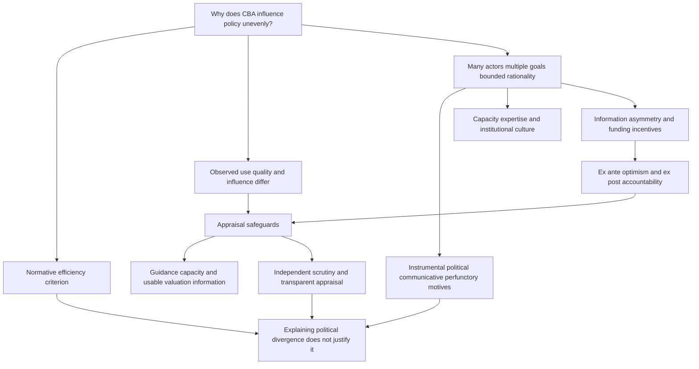

# Political Economy of Cost-Benefit Analysis

Source: [[00_Materials/2026_2027/Winter_Semester/Economics_of_Green_Deal/Week_2/ARTICLE_04_Ch17_CBA.pdf]]

Back to [[01_Notes/2026_2027/Winter_Semester/Economics_of_Green_Deal/Economics_of_Green_Deal_main#Week 2|Week 2]].

Why can a policy with favourable economic appraisal fail to influence the decision, while a formally completed appraisal changes little? OECD Chapter 17 answers by placing cost-benefit analysis (CBA) inside the policy process. Economic efficiency is one objective among several, and officials, elected representatives, consultants and affected groups can have different objectives and limited information. Understanding that process helps explain when appraisal supports a decision and when its use becomes selective or ceremonial. It does not establish that departing from an efficiency criterion is justified. This reading complements the Week 2 externality models: identifying a welfare gain is different from explaining whether a government will implement the corresponding policy. [[00_Materials/2026_2027/Winter_Semester/Economics_of_Green_Deal/Week_2/ARTICLE_04_Ch17_CBA.pdf#page=2|OECD chapter 17, PDF pp. 2–3 (printed pp. 424–425)]]

The chapter is about the **political economy of appraisal**, rather than a complete manual for calculating discounted project benefits. Its institutional examples and numerical evidence are historical reports in a 2018 publication; they are not verification of present rules or present appraisal quality.

## Topic map

The map follows the chapter's question, evidence on use and influence, explanation through motives and incentives, and institutional responses. Its final qualification preserves the distinction between describing actual decisions and evaluating them. [[00_Materials/2026_2027/Winter_Semester/Economics_of_Green_Deal/Week_2/ARTICLE_04_Ch17_CBA.pdf#page=2|OECD chapter 17, PDF pp. 2–15 (printed pp. 424–437)]]

## The normative benchmark and its limits

CBA is a **decision-informing procedure**: it supplies economic evidence to the decision process. It does not by itself settle every policy objective. The chapter's efficiency benchmark considers changes in people's wellbeing, represented through preferences and willingness to pay or accept compensation. Money is the common measuring unit used to aggregate the effects. In its deliberately simplified concluding expression,

$$\Delta SW=\sum_{i,t}\Delta W_{i,t},$$

$\Delta$ means a change, $W_{i,t}$ wellbeing for individual $i$ at time $t$, and $SW$ aggregate social welfare. An individual's change can be positive or negative. The displayed expression ignores discounting for convenience; it is not a complete discounted project-valuation formula. Within this benchmark, passing the CBA test requires $\Delta SW>0$. [[00_Materials/2026_2027/Winter_Semester/Economics_of_Green_Deal/Week_2/ARTICLE_04_Ch17_CBA.pdf#page=14|OECD chapter 17, PDF p. 14 (printed p. 436)]]

A policy that makes at least one person better off and nobody worse off satisfies the stronger Pareto-improvement condition. More commonly, a positive aggregate change means that gains exceed losses. It can therefore leave some people worse off. The chapter's summation does not establish that actual compensation occurs or that distribution is unimportant. This connects to [[01_Notes/2026_2027/Winter_Semester/Economics_of_Green_Deal/Week_2/Externalities_and_Welfare_Optimum#What welfare criteria can establish|the distinction between Pareto and potential-compensation criteria]]: efficiency appraisal and the allocation of gains and losses answer different questions. [[00_Materials/2026_2027/Winter_Semester/Economics_of_Green_Deal/Week_2/ARTICLE_04_Ch17_CBA.pdf#page=14|OECD chapter 17, PDF pp. 14–15 (printed pp. 436–437)]]

The actual decision process can attach different weights to distribution, sectoral interests, administrative feasibility or political objectives. Government is not a single all-knowing guardian of welfare: it comprises actors inside the process and interacts with actors outside it. **Bounded rationality** here means limited ability and time to generate and process the information needed for an ideal decision, even when actors pursue their own objectives rationally. The chapter describes a qualitative political welfare function to explain these different priorities; it does not estimate one. [[00_Materials/2026_2027/Winter_Semester/Economics_of_Green_Deal/Week_2/ARTICLE_04_Ch17_CBA.pdf#page=2|OECD chapter 17, PDF p. 2 (printed p. 424)]]

## Distinguish use, quality and influence

An appraisal's existence is evidence of **use**. Its completeness, treatment of uncertainty and comparison of options concern **quality**. Whether it changes the choice or design of policy concerns **influence**. These distinctions prevent the mistaken inference that a completed document must represent a complete CBA, or that a complete CBA must determine the decision.

In the chapter's review of 74 US Environmental Protection Agency impact assessments from 1982–1999, all monetised at least some costs, about half monetised some benefits, and only about a quarter on average supplied a full monetised range of benefit estimates. Completeness and low/high uncertainty estimates were also often missing. Comparing an already favoured option with the status quo was more common than comparing multiple alternatives early in policy design. This is evidence about a particular historical sample, not a percentage applicable to all governments or current environmental policies. [[00_Materials/2026_2027/Winter_Semester/Economics_of_Green_Deal/Week_2/ARTICLE_04_Ch17_CBA.pdf#page=3|OECD chapter 17, PDF pp. 3–4 (printed pp. 425–426)]]

![[01_Notes/2026_2027/Winter_Semester/Economics_of_Green_Deal/assets/Week2_CBA_Table_17_1.png]]

*Table 17.1 reports 325 impact appraisals across eight European jurisdictions. Monetary assessment ranges from 0% in the Cyprus cases to 92% in the United Kingdom cases. The category is broader than complete CBA. Report length is not an independent quality measure: Denmark and Finland average 2.5 pages, while the Commission average is 84 pages. The case periods and jurisdictions differ, so the table does not identify a causal effect of any country's institutions.* [[00_Materials/2026_2027/Winter_Semester/Economics_of_Green_Deal/Week_2/ARTICLE_04_Ch17_CBA.pdf#page=4|OECD chapter 17, PDF p. 4 (printed p. 426), Table 17.1]]

The World Bank evidence provides another caution. CBA use declined from 1970 to 2000, partly because investment moved toward sectors without a long appraisal tradition, but use also declined in traditional sectors. Projects with ex ante CBA had relatively higher returns in the cited evaluation, yet confounding makes it difficult to attribute those returns to appraisal itself. An observed association between appraisal and success is not a demonstrated causal effect. [[00_Materials/2026_2027/Winter_Semester/Economics_of_Green_Deal/Week_2/ARTICLE_04_Ch17_CBA.pdf#page=3|OECD chapter 17, PDF pp. 3 and 5 (printed pp. 425 and 427)]]

Influence can occur at several stages. Fine-tuning a selected option is useful, but it misses the opportunity to compare alternatives before a choice is settled. At an earlier agenda-setting stage, the Stern Review, the UK National Ecosystem Assessment and TEEB supplied economic arguments about climate and ecosystem losses. Such evidence frames a problem; it does not substitute for appraisal of a specific subsequent policy. The chapter also reports a 2014 Canadian air-quality appraisal with benefit-cost ratios from 15 to more than 30, including health, agricultural productivity, building-soiling and visibility effects. Its inference of strong economic merits is conditional on those estimated values being roughly accurate, and the appraisal emerged from collaboration across government levels. [[00_Materials/2026_2027/Winter_Semester/Economics_of_Green_Deal/Week_2/ARTICLE_04_Ch17_CBA.pdf#page=4|OECD chapter 17, PDF pp. 4–5 (printed pp. 426–427)]]

Capacity to analyse and influence on a decision can also diverge. A Canadian survey of nearly 3,000 decision makers found environmental departments using technical tools and possessing comparable expertise, while their respondents were more doubtful about whether evidence informed decisions and whether adequate support existed. The water sector in England and Wales offered substantial practical social-CBA and choice-modelling experience, but proprietary and unpublished studies made systematic learning difficult. These examples caution against treating either lack of technical capacity or lack of research publications as the sole explanation. [[00_Materials/2026_2027/Winter_Semester/Economics_of_Green_Deal/Week_2/ARTICLE_04_Ch17_CBA.pdf#page=5|OECD chapter 17, PDF pp. 5–6 (printed pp. 427–428)]]

## Four motives for using appraisal

The chapter draws on a wider impact-assessment literature to distinguish four motives. **Instrumental use** employs appraisal to inform an evidence-based policy decision. **Political use** employs it to control the policy process, constrain agencies, delay action or focus attention on politically salient interests. **Communicative use** makes appraisal a vehicle for consultation, stakeholder interaction and deliberation. **Perfunctory use** completes an obligation as a ritual or a box to tick, with little conviction that it should guide the decision. A single appraisal can serve several motives simultaneously. These categories describe possible uses; they do not classify every political actor as dishonest. [[00_Materials/2026_2027/Winter_Semester/Economics_of_Green_Deal/Week_2/ARTICLE_04_Ch17_CBA.pdf#page=6|OECD chapter 17, PDF pp. 6–7 (printed pp. 428–429)]]

![[01_Notes/2026_2027/Winter_Semester/Economics_of_Green_Deal/assets/Week2_CBA_Table_17_2.png]]

*Table 17.2 examines six environmental impact-assessment cases. Instrumental use appears in two cases and is never the only identified motive: air-pollution appraisal combines instrumental and communicative motives, and the landfill case combines instrumental and perfunctory motives. Other cases include political or perfunctory use. This is qualitative evidence from six selected cases, not a representative estimate that only one-third of all CBAs serve evidence-based decisions.* [[00_Materials/2026_2027/Winter_Semester/Economics_of_Green_Deal/Week_2/ARTICLE_04_Ch17_CBA.pdf#page=7|OECD chapter 17, PDF p. 7 (printed p. 429), Table 17.2]]

The motives help explain an **incomplete contract**: official appraisal guidelines codify expectations, but practical discretion permits partial implementation. Requiring analysis is different from binding a decision to its recommendation. Political priorities can also narrow the analysis to business costs or one sector's benefits, changing what actors consider good enough. Improving a manual or training analysts may then fail to remove the obstacle, because the constraint concerns leadership, institutional culture or distrust of appraisal rather than a missing technical instruction. [[00_Materials/2026_2027/Winter_Semester/Economics_of_Green_Deal/Week_2/ARTICLE_04_Ch17_CBA.pdf#page=6|OECD chapter 17, PDF pp. 6–8 (printed pp. 428–430)]]

External consultants can relieve limited capacity by estimating physical impacts and monetary values, but outsourcing creates governance questions about whose analysis is used and how it is scrutinised. Conversely, economic appraisal can expose claims to public criticism. In the chapter's HS2 example, opponents questioned omitted landscape and biodiversity costs and assumptions about business travellers' time savings. Economic reasoning was used by interested nonexperts as well as specialists. The political context can therefore weaken appraisal, but it can also make appraisal a language for scrutiny and accountability. [[00_Materials/2026_2027/Winter_Semester/Economics_of_Green_Deal/Week_2/ARTICLE_04_Ch17_CBA.pdf#page=9|OECD chapter 17, PDF p. 9 (printed p. 431)]]

## Forecast errors and strategic incentives

An **ex ante** appraisal forecasts impacts before the decision. An **ex post** appraisal revisits costs and benefits later, permitting comparison with the forecast and learning for future decisions. Accuracy is therefore another dimension of quality. The transport-infrastructure meta-study cited in the chapter found cost escalation in 90% of examined projects across Europe, the United States and other countries, spanning the 1920s–1990s. The direction is not universal: EU environmental regulations sometimes cost less than forecast because firms found cheaper compliance methods, and a US review found no systematic bias for environmental regulation. These findings must remain attached to their study contexts. [[00_Materials/2026_2027/Winter_Semester/Economics_of_Green_Deal/Week_2/ARTICLE_04_Ch17_CBA.pdf#page=9|OECD chapter 17, PDF pp. 9–10 (printed pp. 431–432)]]

One response to cost optimism is to incorporate a premium into forecast costs; another is to improve analytical training. Neither automatically resolves incentives to present a proposal favourably. The chapter's historical EU regional-funding example illustrates the difference between the **social case** and the **financial case**. Social net present value (NPV) asks whether social gains exceed social costs; financial NPV asks whether the project's cash flows make it pay its own way. In the reported arrangement, a positive social NPV supports justification, while a negative financial NPV can establish a funding gap for possible cofinancing. A positive financial NPV removes that particular funding rationale. The source does not supply a current funding-eligibility rule or a full NPV calculation procedure. [[00_Materials/2026_2027/Winter_Semester/Economics_of_Green_Deal/Week_2/ARTICLE_04_Ch17_CBA.pdf#page=10|OECD chapter 17, PDF p. 10 (printed p. 432)]]

An applicant can consequently have an incentive to make the social case look strong while making the financial case look weak. The funding authority is the **principal** and the applicant the **agent**; the principal relies on information supplied by the agent and faces costly scrutiny and limited analytical capacity. This creates scope for strategic distortion. It does not prove that every inaccurate forecast is dishonest: technical uncertainty and events outside the applicant's control remain possible. **Cofinancing** can change incentives by making the recipient bear part of any cost inefficiency. [[00_Materials/2026_2027/Winter_Semester/Economics_of_Green_Deal/Week_2/ARTICLE_04_Ch17_CBA.pdf#page=10|OECD chapter 17, PDF pp. 10–11 (printed pp. 432–433)]]

Ex post accountability adds a prospective consequence: an applicant who expects credible later scrutiny and possible reputational or other sanctions has a stronger reason to appraise carefully at the start. The qualification matters. Review must be likely to detect shortcomings, and the principal must be willing to act on them. Sanctioning uncontrollable errors can be unfair; politicians may resist expensive reviews of past decisions or embarrassing outcomes. Therefore adding an audit requirement without credible implementation need not solve the incentive problem. [[00_Materials/2026_2027/Winter_Semester/Economics_of_Green_Deal/Week_2/ARTICLE_04_Ch17_CBA.pdf#page=11|OECD chapter 17, PDF p. 11 (printed p. 433)]]

## Improving the appraisal process

The chapter's response combines clear ground rules and technical capacity with institutions that scrutinise actual analysis. Independent review can require better definitions of objectives, baselines and alternatives; disclosure makes quality evidence available to outsiders. In its historical account, the European Regulatory Scrutiny Board and its predecessor review impact assessments and can require revisions. A shale-gas assessment illustrates requests for clearer economic and fiscal benefits and fuller option and compliance-cost comparisons. [[00_Materials/2026_2027/Winter_Semester/Economics_of_Green_Deal/Week_2/ARTICLE_04_Ch17_CBA.pdf#page=11|OECD chapter 17, PDF pp. 11–12 (printed pp. 433–434)]]

![[01_Notes/2026_2027/Winter_Semester/Economics_of_Green_Deal/assets/Week2_CBA_Table_17_3.png]]

*Table 17.3 reports resubmission requests rising from 9% in 2007 to 48% in 2015, with fluctuations between those dates. Initial submission counts fall to 25 and 29 in 2014 and 2015, compared with 97 in each of 2012 and 2013. The series does not show a consistent disappearance of appraisal problems. The chapter's possible chilling effect of scrutiny on submissions is explicitly speculative; lower submissions alone do not establish its cause.* [[00_Materials/2026_2027/Winter_Semester/Economics_of_Green_Deal/Week_2/ARTICLE_04_Ch17_CBA.pdf#page=12|OECD chapter 17, PDF pp. 12–13 (printed pp. 434–435), Table 17.3]]

A scrutiny body's **remit** determines what it can enforce. The UK Regulatory Policy Committee in the chapter concentrates on business and related regulatory impacts. It questioned whether plastic-bag-charge revenues would actually pass to charities and whether cost savings would reach consumers; a biodiversity-offsetting proposal received a negative assessment for inadequate enforcement and monitoring and increased developer costs. Yet the narrow business remit was different from judging the full social case. The cited parliamentary report found satisfactory social costs and benefits in only one-third of examined 2014 cases, while the committee could not reject proposals on that basis. A review institution can therefore be powerful within one remit and weak on omitted social dimensions. [[00_Materials/2026_2027/Winter_Semester/Economics_of_Green_Deal/Week_2/ARTICLE_04_Ch17_CBA.pdf#page=12|OECD chapter 17, PDF pp. 12–13 (printed pp. 434–435)]]

Review itself also merits scrutiny: representation of internal and external actors, dependence on supplied information, the cost of checking it, and possible political control all matter. Accessibility can improve routine use. Valuation databases and centrally collated economic information allow local environmental officers to combine ecological knowledge with economic appraisal without personally becoming valuation specialists. The Water Framework Directive example demonstrates this possibility when the data-provision challenge can be overcome; it does not establish that every appraisal can be delegated without expertise. [[00_Materials/2026_2027/Winter_Semester/Economics_of_Green_Deal/Week_2/ARTICLE_04_Ch17_CBA.pdf#page=13|OECD chapter 17, PDF pp. 13–14 (printed pp. 435–436)]]

## How to interpret a decision that departs from CBA

A useful source-grounded synthesis is to ask whether the appraisal was used, whether it was complete enough for its purpose, when it entered the decision, which actors' motives shaped it, and whether incentives or institutional powers help explain its influence. This is an interpretive guide assembled from the chapter, not an estimated model of political behaviour. It prevents two errors: assuming that a favourable aggregate result settles every policy concern, and treating political divergence as evidence that economic appraisal is useless. [[00_Materials/2026_2027/Winter_Semester/Economics_of_Green_Deal/Week_2/ARTICLE_04_Ch17_CBA.pdf#page=14|OECD chapter 17, PDF pp. 14–15 (printed pp. 436–437)]]

The 2018 European Parliament draft opinion reproduced in note 5 reinforces the decision-informing boundary: assessment should cover medium- and long-term economic, social, environmental and health effects, aid politically accountable decisions, and avoid becoming an obstacle to unwanted legislation. This is a historical quoted position in the supplied chapter. The central result remains conditional: CBA explains what a decision would look like under its economic welfare criterion, while political economy explains why actual appraisal and decisions can diverge. Explanation supplies grounds for improving the process; it does not itself excuse poor appraisal. [[00_Materials/2026_2027/Winter_Semester/Economics_of_Green_Deal/Week_2/ARTICLE_04_Ch17_CBA.pdf#page=15|OECD chapter 17, PDF p. 15 (printed p. 437), conclusion and note 5]]

## Sources and page conventions

The supplied chapter has 18 physical PDF pages. Physical p. 1 is printed p. 423; physical p. 17 is printed p. 439. Physical pp. 15–17 contain the chapter's notes and references; substantive note 5 is integrated above. Physical p. 18 is blank. Publisher geographic disclaimers on p. 1 and bibliographic entries were inspected but do not add CBA mechanisms. All institutional examples and figures retain their source date and scope; no external documents were retrieved.
