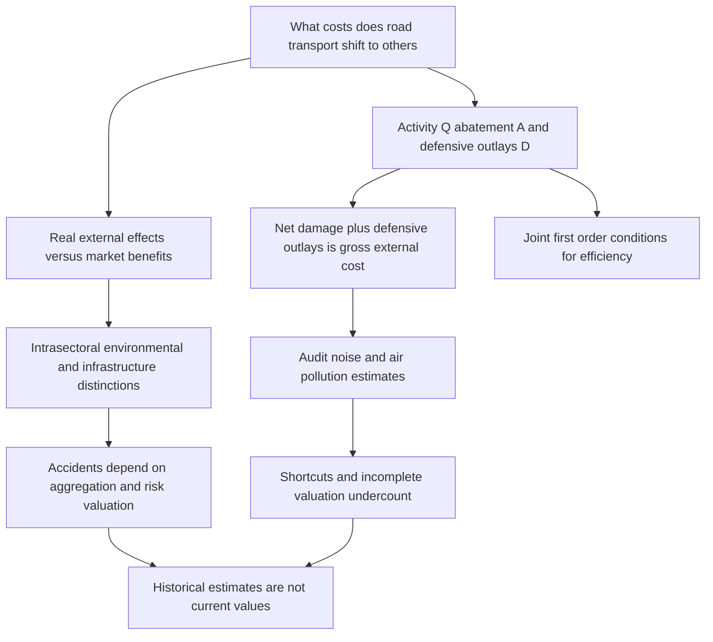

# Road Transport External Costs

Source: [[00_Materials/2026_2027/Winter_Semester/Economics_of_Green_Deal/Week_2/ARTICLE_01b_Verhoef_1994.pdf]]

Back to [[01_Notes/2026_2027/Winter_Semester/Economics_of_Green_Deal/Economics_of_Green_Deal_main#Week 2|Week 2]].

Verhoef's 1994 article asks what road transport actually shifts to other people, and whether published estimates measure that burden. Its argument combines a definition of external effects, a model of activity and protective spending, and a critical survey of historical noise, pollution and accident estimates. It is not a new causal estimation of a transport policy and its reported monetary figures are historical values, not estimates for the present. The [[01_Notes/2026_2027/Winter_Semester/Economics_of_Green_Deal/Week_2/Externalities_and_Welfare_Optimum|externality note]] supplies the welfare criteria and private/social marginal wedge used here. [[00_Materials/2026_2027/Winter_Semester/Economics_of_Green_Deal/Week_2/ARTICLE_01b_Verhoef_1994.pdf#page=1|Verhoef 1994, physical PDF p. 1]]

## Topic map of the paper

*The diagram follows sections 2–6 and the qualifications in the original, physical PDF pp. 1–14 (printed pp. 273–286).* [[00_Materials/2026_2027/Winter_Semester/Economics_of_Green_Deal/Week_2/ARTICLE_01b_Verhoef_1994.pdf#page=1|Verhoef 1994, physical PDF pp. 1–14]]

## Transport benefits and external benefits are different

The article requires a real variable in a receptor's utility/profit function whose value depends on a supplier's behaviour and is omitted from that supplier's decision. Ordinary economic dependencies through prices are excluded from this definition. In the paper's simple Figure 1, external costs push unrestricted activity beyond its efficient level, while external benefits would justify encouragement. A downward private-cost shift can increase consumer surplus while leaving the external-cost wedge intact. Thus useful transport and technological external benefit are different propositions. [[00_Materials/2026_2027/Winter_Semester/Economics_of_Green_Deal/Week_2/ARTICLE_01b_Verhoef_1994.pdf#page=2|Verhoef 1994, physical PDF pp. 2–3]]

The author finds no significant external benefits of **individual road transport activities**, apart from a possible car-spotter example. Cheaper production, wider product choice and faster delivery generally enter market transactions; associated employment and value added do not justify transport above its optimum. Visits to friends can reflect reciprocal exchange or deliberate altruism. Infrastructure's contribution to accessibility and regional development belongs to the investment appraisal, rather than being credited as an external benefit of each extra trip. Better emergency access also depends on infrastructure; more traffic may instead obstruct it through congestion. These conclusions are the author's classifications under the stated market framework, including the assumption of no distortions elsewhere when tracing market benefits to final consumers. They do not say transport has no private or social benefit. [[00_Materials/2026_2027/Winter_Semester/Economics_of_Green_Deal/Week_2/ARTICLE_01b_Verhoef_1994.pdf#page=4|Verhoef 1994, physical PDF pp. 4–6]]

### Classify the harm and its incidence

![[01_Notes/2026_2027/Winter_Semester/Economics_of_Green_Deal/assets/Week2_Verhoef1994_Transport_Typology.png]]

*Figure 2, physical PDF p. 4 (printed p. 276), also reproduced in lecture p. 11. Rows separate intra-sectoral harm among road users from ecological and social environmental harm; columns separate moving traffic, stationary vehicles and infrastructure-associated effects. Shading represents first-order incidence.* [[00_Materials/2026_2027/Winter_Semester/Economics_of_Green_Deal/Week_2/ARTICLE_01b_Verhoef_1994.pdf#page=4|Verhoef 1994, physical PDF p. 4]]

Congestion lies largely within the sector; noise affects social surroundings; air, water and soil pollution reach ecological surroundings; accidents have several incidences, including fellow road users and people outside the sector, and hazardous-material accidents can harm ecosystems. Parking consumes public space and can create parking congestion. Infrastructure can sever biotopes, create visual annoyance or impose barriers within communities. The article displays this broad typology but explicitly excludes environmental effects caused by the mere presence of infrastructure from its later analysis. A second-order effect can connect categories: congestion increases emissions per vehicle-kilometre. Severity is sensitive to time and place. [[00_Materials/2026_2027/Winter_Semester/Economics_of_Green_Deal/Week_2/ARTICLE_01b_Verhoef_1994.pdf#page=4|Verhoef 1994, physical PDF pp. 4, footnote2]]

## Activity abatement and defence are jointly chosen

The basic output diagram makes harm depend only on $Q$. The richer model allows the supplier to reduce damage through **abatement** (for example quieter/cleaner vehicles) and the receptor to reduce exposure through **defensive measures** (for example double glazing). Let $Q$ be the externality-causing activity, $A$ monetary abatement outlays by the supplier, $D$ monetary defensive outlays by the victim, and $EC$ the residual or **net external cost** after those measures:

$$EC=EC(Q,D,A).$$

The article sometimes writes the argument order $(Q,A,D)$; variable names consistently identify the same three inputs. With $PC(Q)$ private production cost, the distinctions are

$$\begin{aligned}
\text{gross private cost}&=PC(Q)+A,\\
\text{gross external cost}&=EC(Q,D,A)+D,\\
\text{social cost of the activity}&=PC(Q)+A+EC(Q,D,A)+D.
\end{aligned}$$

Defensive expenditure consumes real resources even if it succeeds in reducing experienced harm. Ignoring it treats an externally induced expense as costless. Abatement is included on the supplier's side rather than being added automatically to the receptor's unpaid bill. The article cautions that this explicit supplier/victim split fits environmental nuisance better than congestion or accidents, where the same road user can be on both sides. [[00_Materials/2026_2027/Winter_Semester/Economics_of_Green_Deal/Week_2/ARTICLE_01b_Verhoef_1994.pdf#page=6|Verhoef 1994, physical PDF pp. 6, equation1 and footnote5]]

### Assumptions and derivative notation

A subscript denotes a partial derivative holding the other arguments fixed: $EC_Q=\partial EC/\partial Q$, $EC_{DD}=\partial^2 EC/\partial D^2$, and so forth. The paper assumes

$$EC_Q>0,\quad EC_{QQ}\geq0;\qquad EC_D<0,\quad EC_{DD}>0;\qquad EC_A<0,\quad EC_{AA}>0.$$

Activity raises residual damage at a nondecreasing marginal rate. Spending on defence or abatement reduces it, but each additional money unit has diminishing damage-reduction effectiveness. For smooth functions it also postulates

$$EC_{DQ}=EC_{QD}<0,\qquad EC_{AQ}=EC_{QA}<0,\qquad EC_{AD}=EC_{DA}>0.$$

More activity gives protective outlays more damage to reduce; protection lowers the damage added by extra activity. The positive cross derivative between $A$ and $D$ means greater protection on one side reduces the marginal effectiveness of the other side. These are assumed functional properties for the model's likely case, not measured transport coefficients. [[00_Materials/2026_2027/Winter_Semester/Economics_of_Green_Deal/Week_2/ARTICLE_01b_Verhoef_1994.pdf#page=7|Verhoef 1994, physical PDF pp. 7, equations2a–i]]

Let $PB(Q)$ be private benefit and define net private benefit as $NPB(Q)=PB(Q)-PC(Q)$. The displayed equation makes this a difference, although the source's adjacent prose mistakenly calls it a “sum”; the subtraction is also used in its welfare function. The assumption $NPB_{QQ}<0$ means diminishing marginal net private benefit. Supplier welfare and victim welfare are

$$W^p=NPB(Q)-A,\qquad W^v=-EC(Q,D,A)-D.$$

Summing them gives

$$W=NPB(Q)-EC(Q,D,A)-A-D.$$

The monetary units of $A$ and $D$ are crucial: a one-unit increase directly costs one unit of welfare in this money-valued representation. The model's additive welfare measure abstracts from additional income effects or heterogeneous welfare weights. [[00_Materials/2026_2027/Winter_Semester/Economics_of_Green_Deal/Week_2/ARTICLE_01b_Verhoef_1994.pdf#page=7|Verhoef 1994, physical PDF pp. 7, equations3–6]]

### Derive and interpret the efficient conditions

Differentiate the welfare expression with respect to each choice:

$$\begin{aligned}
W_Q&=NPB_Q-EC_Q=0\quad\Rightarrow\quad NPB_Q=EC_Q,\\
W_A&=-EC_A-1=0\quad\Rightarrow\quad EC_A=-1,\\
W_D&=-EC_D-1=0\quad\Rightarrow\quad EC_D=-1.
\end{aligned}$$

The first condition balances the benefit sacrificed by reducing activity against the avoided damage. The second and third say that a last money unit spent on either abatement or defence avoids one money unit of residual harm. Together, all three available ways of reducing external cost have the same marginal efficiency. They apply to an interior solution. Boundary constraints can instead prevent an equality, and the paper's footnote7 requires the relevant Hessian conditions for a welfare maximum; stationarity alone is insufficient. [[00_Materials/2026_2027/Winter_Semester/Economics_of_Green_Deal/Week_2/ARTICLE_01b_Verhoef_1994.pdf#page=7|Verhoef 1994, physical PDF pp. 7–8, equations7a–c]]

Without a mechanism making residual damage enter the supplier's objective, it chooses $Q$ to maximize $NPB$ and has no benefit from $A$ in $W^p$, so the simple model predicts excessive activity and zero abatement. A victim who bears both damage and protective cost already faces the $D$ tradeoff and can behave efficiently on that margin. Automatic compensation can alter this incentive. This motivates policies aimed first at reducing activity and inducing abatement, while examining what compensation does to defence. It is a result of the model's separation of objectives, not a universal prediction that every real driver makes no voluntary abatement investment. [[00_Materials/2026_2027/Winter_Semester/Economics_of_Green_Deal/Week_2/ARTICLE_01b_Verhoef_1994.pdf#page=8|Verhoef 1994, physical PDF p. 8]]

Minimizing the activity's social **cost** alone would select no activity and no outlays, whereas maximizing welfare balances costs against benefits. The paper contrasts this with a nuisance-based cost convention including foregone production: different definitions can make a “minimum social cost” statement mean a different optimization problem. Always identify the accounting boundary before using that phrase. [[00_Materials/2026_2027/Winter_Semester/Economics_of_Green_Deal/Week_2/ARTICLE_01b_Verhoef_1994.pdf#page=8|Verhoef 1994, physical PDF pp. 8, footnote8]]

## Efficiency and the unpaid bill require different measures

One question asks for optimal marginal choices or road prices. The other asks what total burden transport shifts to other people. The second requires $EC+D$, rather than residual damage alone. Average gross burden indicates an optimal marginal rate only under additional conditions such as constant marginal external cost; total harm divided by total kilometres generally does not supply a time-and-place-specific optimal price. There is no single aggregate optimal road-transport quantity independent of location and time. [[00_Materials/2026_2027/Winter_Semester/Economics_of_Green_Deal/Week_2/ARTICLE_01b_Verhoef_1994.pdf#page=8|Verhoef 1994, physical PDF p. 8]]

The level of aggregation matters too. Harm imposed by one motorist on another is external to the first motorist but remains inside the motorist sector. Adding that harm to environmental damage can be appropriate for some social-cost questions, but it cannot be labelled without qualification as the sector's unpaid bill to the rest of society. This distinction becomes especially important in accident accounting. [[00_Materials/2026_2027/Winter_Semester/Economics_of_Green_Deal/Week_2/ARTICLE_01b_Verhoef_1994.pdf#page=8|Verhoef 1994, physical PDF pp. 8–9]]

## Why noise and air-pollution estimates can undercount

The paper evaluates the studies in Tables 1 and 2 as mostly unpaid-bill studies, not estimations of the welfare-maximizing activity. A recurring problem is estimating one component of gross external cost instead of $EC+D$. Actual protective expenditure measures part of $D$ while omitting remaining damage. A valuation of experienced harm measures part of $EC$ while omitting induced protective expenditure. Studies using abatement expenditure $A$ measure a different component again. The paper's exceptions combining prevention and residual damage try to assess an optimal rather than actual situation, and their choice of optimum is unclear. [[00_Materials/2026_2027/Winter_Semester/Economics_of_Green_Deal/Week_2/ARTICLE_01b_Verhoef_1994.pdf#page=9|Verhoef 1994, physical PDF pp. 9–10]]

### Shortcuts and choice of a standard

Using observed protection outlays as the entire loss assumes away the harm that remains after rational protection. Usually victims stop protection while another reduction in nuisance would still have value, because additional spending competes with other consumption. Using the hypothetical cost of a programme that reduces nuisance to a supposedly reasonable level has three further problems: it omits remaining damage, replaces the value of the damage reduction with the programme cost, and selects the standard before the cost/benefit balance that should determine it. The IRT France estimates vary by a factor of six with the noise standard; the Dutch Van der Meijs estimates differ by factors of nine for noise and twelve for pollution. These illustrate dependence on an imposed norm, not precision about the underlying welfare loss. [[00_Materials/2026_2027/Winter_Semester/Economics_of_Green_Deal/Week_2/ARTICLE_01b_Verhoef_1994.pdf#page=10|Verhoef 1994, physical PDF pp. 10–11, footnotes9–10]]

### What valuation techniques measure

Nonbehavioural linkage methods start with a damage or dose-response relationship and multiply physical impacts by market prices: building deterioration, agricultural damage or cost of illness are examples. They do not directly recover the receptor's utility loss and can omit non-use values. Behavioural linkage methods infer valuation from choices in a **surrogate market**, such as hedonic house prices, travel costs or household protection, or from a **hypothetical market**, such as a contingent-valuation willingness-to-pay survey. Surrogate markets may be absent or regulated; hypothetical responses have methodological uncertainty. The author prefers utility-linked valuation conceptually but does not rank one method as universally best. [[00_Materials/2026_2027/Winter_Semester/Economics_of_Green_Deal/Week_2/ARTICLE_01b_Verhoef_1994.pdf#page=11|Verhoef 1994, physical PDF pp. 11–12]]

Some methods can be complementary if they measure genuinely different components. The example is psychological willingness to pay combined with costs, such as paid sick leave, that may not enter an individual's optimization. This is a conditional argument for assessing omitted components, not permission to add overlapping valuations blindly. The article notes that both behavioural and nonbehavioural estimates can still capture only net damage. [[00_Materials/2026_2027/Winter_Semester/Economics_of_Green_Deal/Week_2/ARTICLE_01b_Verhoef_1994.pdf#page=12|Verhoef 1994, physical PDF p. 12]]

### Read the historical tables

![[01_Notes/2026_2027/Winter_Semester/Economics_of_Green_Deal/assets/Week2_Verhoef1994_Table1_Noise.png]]

*Table 1, PDF p. 9, printed p. 281. Columns retain authors/year/country, original monetary units, GDP shares and measurement methods. The footnote identifies GDP data from IMF (1991) and estimates quoted through Quinet (1989).* [[00_Materials/2026_2027/Winter_Semester/Economics_of_Green_Deal/Week_2/ARTICLE_01b_Verhoef_1994.pdf#page=9|Verhoef 1994, physical PDF p. 9]]

The road-noise row for Dogs et al. (1991), Germany, reports DM 0.84 billion / 0.03% GDP for avoidance cost versus DM 12.8 billion / 0.52% GDP for willingness to pay. This is about fifteen times as large, but the comparison concerns distinct methods rather than two independently comparable estimates of identical complete costs. The UK Sharp estimate of 11.18% GDP is particularly high because the study did not spread outlays over their useful years; a stock of investment should not be compared unadjusted with annual GDP. [[00_Materials/2026_2027/Winter_Semester/Economics_of_Green_Deal/Week_2/ARTICLE_01b_Verhoef_1994.pdf#page=9|Verhoef 1994, physical PDF pp. 9,11–12]]

![[01_Notes/2026_2027/Winter_Semester/Economics_of_Green_Deal/assets/Week2_Verhoef1994_Table2_Air_Pollution.png]]

*Table 2, PDF p. 10, printed p. 282. The source retains the distinct damage, programme-cost and WTP approaches and warns that some rows include noise or all transport modes.* [[00_Materials/2026_2027/Winter_Semester/Economics_of_Green_Deal/Week_2/ARTICLE_01b_Verhoef_1994.pdf#page=10|Verhoef 1994, physical PDF p. 10]]

Dogs et al.'s road-pollution rows report DM 12.1 billion / 0.49% GDP for damage cost and DM 22.3 billion / 0.91% GDP for WTP. Shulz's table contrasts DM 3–6 billion / 0.15–0.30% GDP for damage with DM 5–16 billion / 0.25–0.79% GDP for willingness to pay; each is attributed to 30% of the corresponding total air-pollution burden/value. Higher survey figures can indicate understatement by other methods **or** difficulties in contingent valuation. The article does not establish the larger figure as the true complete loss. Its review of hedonic noise studies reports house-price reductions of 0.15–1.3% per extra decibel, dependent on the zero-annoyance baseline and study setting. [[00_Materials/2026_2027/Winter_Semester/Economics_of_Green_Deal/Week_2/ARTICLE_01b_Verhoef_1994.pdf#page=10|Verhoef 1994, physical PDF pp. 10,12]]

The conclusion challenges frequently cited OECD-country figures of 0.1% GDP for noise and 0.4% for air pollution. It suggests possible multipliers of eight for noise and two or three for air pollution **if** hypothetical valuations are trusted. The author also identifies omitted effects, including then-unestimated CO₂ emissions and other Figure 2 categories. These are the 1994 review's criticism and conditional numerical comparisons; they are not present-day GDP shares, statistical confidence intervals or a new aggregate estimate. [[00_Materials/2026_2027/Winter_Semester/Economics_of_Green_Deal/Week_2/ARTICLE_01b_Verhoef_1994.pdf#page=14|Verhoef 1994, physical PDF p. 14]]

## Accidents: risk valuation and aggregation

Accident costs can include vehicle/property/environmental damage, legal/police/emergency costs, medical/funeral costs, pain and suffering and lost production. Responsibility can be shared in a chain collision; a responsible driver's own injury can impose further losses on relatives and society. Some published studies define social accident costs as total costs less insurance coverage, which differs from the article's earlier total private-plus-external social-cost definition. Fixed yearly insurance premiums can compensate losses without pricing the marginal kilometre, so compensation does not establish optimized accident risk. [[00_Materials/2026_2027/Winter_Semester/Economics_of_Green_Deal/Week_2/ARTICLE_01b_Verhoef_1994.pdf#page=12|Verhoef 1994, physical PDF pp. 12–13, footnote12]]

Valuing life solely through expected net production can give negative values for elderly or jobless people. The author instead favours ex ante valuation of changes in physical risk. Historical estimates differ substantially by concept: the paper cites ECU 12,280 for gross earnings in Portugal, ECU 1,667,246 for social willingness to pay in Switzerland, and an even lower Netherlands friction-cost estimate of DFL 2,400 (about ECU 1,000). These are evidence of incompatible valuation concepts rather than comparable prices of a human being. [[00_Materials/2026_2027/Winter_Semester/Economics_of_Green_Deal/Week_2/ARTICLE_01b_Verhoef_1994.pdf#page=13|Verhoef 1994, physical PDF pp. 13–14]]

![[01_Notes/2026_2027/Winter_Semester/Economics_of_Green_Deal/assets/Week2_Verhoef1994_Table3_Accidents.png]]

*Table 3, PDF p. 13, printed p. 285. The original source clips some text at the right margin; the legible numerical columns and method distinctions are retained. These are social accident costs with varied boundaries, not one consistently defined environmental external-cost series.* [[00_Materials/2026_2027/Winter_Semester/Economics_of_Green_Deal/Week_2/ARTICLE_01b_Verhoef_1994.pdf#page=13|Verhoef 1994, physical PDF p. 13]]

The Swiss Neuenschwander et al. (1991) rows give SF 5,379 million / 1.70% GDP in social costs, SF 1,488 million / 0.47% GDP in external cost at individual level, and SF 789 million / 0.25% GDP at mode level. The footnote on PDF p. 12 likewise contrasts individual and mode aggregation for car traffic and reports a larger proportional reduction for rail traffic. Changing the analytical boundary changes what is external. The paper therefore warns against adding these accident totals to noise and air-pollution external costs and calling the result transport's external burden. [[00_Materials/2026_2027/Winter_Semester/Economics_of_Green_Deal/Week_2/ARTICLE_01b_Verhoef_1994.pdf#page=12|Verhoef 1994, physical PDF pp. 12 footnote11,13–14]]

## What the review establishes

Transport's value to users and markets does not cancel a technological externality. A consistent assessment must specify the activity, who causes/receives effects, the aggregation boundary, and whether it measures residual damage, protective resources or both. Efficiency requires a joint marginal analysis; an unpaid-bill calculation needs the correctly bounded total. The survey's strongest conclusion is the conceptual incompleteness and noncomparability of many historical estimates, with contingent-valuation uncertainty and accident-specific complications retained. [[00_Materials/2026_2027/Winter_Semester/Economics_of_Green_Deal/Week_2/ARTICLE_01b_Verhoef_1994.pdf#page=6|Verhoef 1994, physical PDF pp. 6–14]]

## Sources and page convention

The source has 15 physical PDF pages, corresponding to printed pp. 273–287. All pages were inspected, including equations, footnotes and Tables 1–3. The bibliography on pp. 14–15 supplies references only; its outside sources were not opened.
