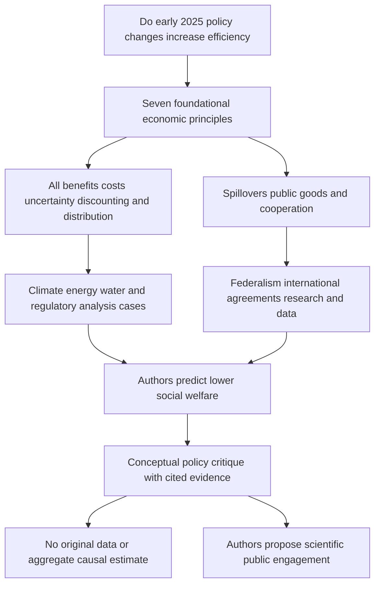

# US Environmental Policy and Economic Principles

Source: [[00_Materials/2026_2027/Winter_Semester/Economics_of_Green_Deal/Week_2/ARTICLE_02_Kling_2025.pdf]]

Back to [[01_Notes/2026_2027/Winter_Semester/Economics_of_Green_Deal/Economics_of_Green_Deal_main#Week 2|Week 2]].

Kling, Polasky and Segerson ask whether the environmental-policy changes initiated during the early months of the second Trump administration promote economic efficiency. Their 2025 paper argues that many changes omit environmental benefits, ignore spillovers or weaken the information needed for effective decisions. It is a conceptual policy critique using documented actions and cited studies. The authors declare that the paper uses no data and received no funding; it does not estimate an original causal effect or a total monetary welfare loss. All policy descriptions below are what this paper reported in 2025, including proposals and unresolved actions. They have not been updated into a claim about the present legal situation. [[00_Materials/2026_2027/Winter_Semester/Economics_of_Green_Deal/Week_2/ARTICLE_02_Kling_2025.pdf#page=1|Kling et al. 2025, physical PDF pp. 1–2,20]]

## Topic map and argument

*Source-grounded map of the question, economic criteria, policy applications, conclusion and method limitation. The paper's substantive argument occupies physical PDF pp. 1–20, printed pp. 2291–2310; references continue through p. 27.* [[00_Materials/2026_2027/Winter_Semester/Economics_of_Green_Deal/Week_2/ARTICLE_02_Kling_2025.pdf#page=1|Kling et al. 2025, physical PDF pp. 1–20]]

The authors distinguish their economic critique from a party-political standard and acknowledge that earlier administrations have also failed to choose efficient instruments. Their benchmark is not whether a policy is labelled regulation or deregulation, but whether benefits exceed costs and a chosen objective is achieved with the least resource cost. Simply removing a costly programme can lower welfare if its forgone benefits exceed its saved cost. Distributional goals remain additional legitimate considerations. [[00_Materials/2026_2027/Winter_Semester/Economics_of_Green_Deal/Week_2/ARTICLE_02_Kling_2025.pdf#page=2|Kling et al. 2025, physical PDF pp. 2–3]]

## Seven principles for evaluating environmental policy

1. **Market failures:** externalities and public goods—including research, information, infrastructure and environmental quality—give an efficiency rationale for intervention because unregulated markets generally underprovide beneficial public goods or overproduce harmful effects.
2. **All social benefits and costs:** analysis should consider market and nonmarket effects, present and future people, intended and unintended consequences. A saving in compliance expenditure is only one component.
3. **Discounting:** benefit-cost analysis normally compares discounted present values using estimates reflecting consumption time preference and the opportunity cost of capital.
4. **Uncertainty:** an uncertain effect is not automatically nonexistent or best estimated as zero.
5. **Distribution:** report how benefits and costs fall on different groups, alongside their aggregate totals.
6. **Scale of government:** appropriate jurisdiction depends on spillovers, cost/benefit heterogeneity and information about local conditions.
7. **International cooperation:** global public goods/bads require cooperation because a short-term self-interested free-riding equilibrium does not achieve efficient provision.

These are the authors' selected principles, rather than an exhaustive model of all policy choices. Principles 2–5 concern assessment, while 6–7 concern governance. [[00_Materials/2026_2027/Winter_Semester/Economics_of_Green_Deal/Week_2/ARTICLE_02_Kling_2025.pdf#page=3|Kling et al. 2025, physical PDF pp. 3–4]]

The paper's usage of **social welfare** generally means aggregate net benefit. A positive net-benefit change is a potential Pareto improvement: winners could compensate losers, although transfers may never occur. This differs from a strict Pareto improvement with nobody worse off or a social welfare function giving special distributional weights. **Cost effectiveness** means producing a given output/service at minimum cost; it does not by itself determine whether that output level is socially worthwhile. The [[01_Notes/2026_2027/Winter_Semester/Economics_of_Green_Deal/Week_2/Externalities_and_Welfare_Optimum|externality and welfare note]] and [[01_Notes/2026_2027/Winter_Semester/Economics_of_Green_Deal/Week_2/Market_Based_Environmental_Instruments|instrument note]] develop these foundations. [[00_Materials/2026_2027/Winter_Semester/Economics_of_Green_Deal/Week_2/ARTICLE_02_Kling_2025.pdf#page=3|Kling et al. 2025, physical PDF pp. 3, footnotes1–2]]

## Climate change: cooperation damage and uncertainty

The paper reports Executive Order 14162 directing withdrawal from the Paris agreement and related UNFCCC commitments in January 2025. The economic objection is the free-rider problem: a country bears its mitigation cost while much of the avoided harm accrues abroad, so independent choices underprovide global climate stability. International agreements can make all participants better off. The authors discuss climate clubs with tariffs on imports from countries lacking effective carbon policy, linking this to the EU Carbon Border Adjustment Mechanism and a UK adoption reported by their cited sources. These examples illustrate a mechanism for altering participation incentives; they are not a complete equilibrium proof or current implementation review. [[00_Materials/2026_2027/Winter_Semester/Economics_of_Green_Deal/Week_2/ARTICLE_02_Kling_2025.pdf#page=5|Kling et al. 2025, physical PDF p. 5]]

The paper also reports reconsideration of the EPA's 2009 Endangerment Finding, a June 2025 proposal concerning fossil-power-plant greenhouse emissions, disbanding of the Interagency Working Group on Social Cost of Greenhouse Gases and May 2025 guidance sharply restricting monetized greenhouse-gas assessment. These steps differ in status—findings, executive direction, proposed rules and guidance are not interchangeable. The authors argue that omitting climate damages effectively assigns them zero weight in the decision, contrary to complete social accounting and the uncertainty principle. This critique does not imply perfect knowledge of the damage function; it rejects using uncertainty itself as evidence of no cost. [[00_Materials/2026_2027/Winter_Semester/Economics_of_Green_Deal/Week_2/ARTICLE_02_Kling_2025.pdf#page=6|Kling et al. 2025, physical PDF pp. 6–7]]

A **social cost of carbon** is a money-valued marginal damage measure allowing an extra emission unit to enter policy appraisal. The article cites EPA estimates for the social cost of carbon **in 2020** of USD 120–340 per ton, depending on discount rate. It reports expert review and public-comment scrutiny, rather than generating a new estimate or statistical interval. The difference across estimates reflects discounting choices; the source gives no conversion to present dollars or a newly calculated rate. Restricting attention to domestic costs ignores cross-border losses and weakens incentives for global cooperation if other countries do the same. The article's local-air-pollution footnote also notes that weakening climate policy can alter local air quality. [[00_Materials/2026_2027/Winter_Semester/Economics_of_Green_Deal/Week_2/ARTICLE_02_Kling_2025.pdf#page=7|Kling et al. 2025, physical PDF pp. 7, footnote6]]

## Energy production: price is incomplete without external costs

The paper discusses the “Unleashing American Energy” and “National Energy Emergency” orders, favouring fossil extraction and faster environmental review, alongside restrictions on wind leasing and permits. It argues that an efficiency comparison should include environmental/health effects across technologies, rather than reward one source while omitting its damages and constraining alternatives. National security or job arguments are not complete substitutes for that accounting. [[00_Materials/2026_2027/Winter_Semester/Economics_of_Green_Deal/Week_2/ARTICLE_02_Kling_2025.pdf#page=8|Kling et al. 2025, physical PDF pp. 8–9]]

### Check the units in the numerical example

The paper cites non-climate air-pollution damages of 3.2 cents/kWh for coal and 0.16 cents/kWh for natural gas. With an assumed carbon value of USD 100 per ton CO₂, it reports total climate-plus-air-pollution costs of 13.2 and 5.16 cents/kWh. The source literally writes coal emissions as “1 ton of CO₂ per megawatt,” with gas at 0.5 tons. A megawatt is power, while its later per-kWh cost needs energy units; the calculation is dimensionally consistent with 1 and 0.5 ton **per megawatt-hour**. This is an explicitly identified dimensional reconstruction, not a silent alteration of the source:

$$\frac{1\ \mathrm{ton}}{\mathrm{MWh}}\frac{100\ \mathrm{USD}}{\mathrm{ton}}
=\frac{100\ \mathrm{USD}}{1000\ \mathrm{kWh}}
=10\ \mathrm{cents/kWh}.$$

Adding 3.2 gives 13.2 cents/kWh; half the carbon intensity gives 5 plus 0.16, or 5.16 cents/kWh. The paper's reported zero for renewables concerns direct carbon/air-pollution emissions **during electricity production**. It explicitly acknowledges upstream effects from producing panels and turbines. Its zero should not be reinterpreted as zero lifecycle or total environmental cost. [[00_Materials/2026_2027/Winter_Semester/Economics_of_Green_Deal/Week_2/ARTICLE_02_Kling_2025.pdf#page=8|Kling et al. 2025, physical PDF p. 8]]

The authors support their challenge to the emergency framing with cited historical data: US oil production of 13.2 million barrels/day in 2024, prices below record levels in 2025, utility-scale wind generation growth of 138% and solar growth of 894% during 2015–2024, and coal-production decline of 42.2% over that period. These are different quantities and denominators—electricity generation and coal production are not the same variable. They are contextual evidence cited by the paper, not proof that every energy investment is inefficient. The efficiency prescription is to incorporate relevant social effects through price or quantity instruments. [[00_Materials/2026_2027/Winter_Semester/Economics_of_Green_Deal/Week_2/ARTICLE_02_Kling_2025.pdf#page=8|Kling et al. 2025, physical PDF pp. 8–9]]

## Water: evaluate benefits and preserve uncertainty

The authors distinguish the Safe Drinking Water Act's public-water-supply role from the Clean Water Act's surface-water role. They explicitly acknowledge that the literature has **not unequivocally established** total benefits above costs for the entire CWA suite. Whether low measured benefits reflect weak benefits or incomplete measurement remains unresolved. Reported public concern—56% greatly worried about drinking-water pollution and 52% about waterway pollution in the cited poll—is evidence of concern, not a monetized net-benefit calculation. Their case studies should therefore be assessed individually. [[00_Materials/2026_2027/Winter_Semester/Economics_of_Green_Deal/Week_2/ARTICLE_02_Kling_2025.pdf#page=9|Kling et al. 2025, physical PDF pp. 9–10]]

### Lead service lines

The article reports a late-2024 rule requiring replacement of remaining lead service lines within ten years and estimates of benefits more than ten times costs. It connects high returns partly to economies of scale from replacing neighbourhood-wide networks, rather than isolated household lines, and records USD 15 billion from the 2021 Infrastructure Investment and Jobs Act. It then discusses a funding freeze and possible reconsideration. The authors acknowledge that the story was evolving and its final resolution unclear. Their argument is conditional: undermining cost-effective scale investment is inefficient **where** the resulting benefits far exceed costs. It is not an independent audit of every site or a statement that the announced rule had already been repealed. [[00_Materials/2026_2027/Winter_Semester/Economics_of_Green_Deal/Week_2/ARTICLE_02_Kling_2025.pdf#page=10|Kling et al. 2025, physical PDF p. 10]]

### PFAS and cumulative exposure

For the 2024 drinking-water standards on six PFAS compounds, the paper cites compliance costs near USD 1.5 billion/year, quantifiable benefits near USD 1.59 billion/year and substantial unquantified health benefits. It reports reduced exposure for about 100 million people and prevention of thousands of illnesses/deaths as the agency's prospective assessment. In May 2025, the paper reports reconsideration of four standards and a two-year compliance extension for PFOS/PFOA. A further discussed product-specific evidentiary approach would ignore harm from cumulative exposure across many products if each isolated amount could not be linked causally to risk. The authors object that complete accounting must follow the combined physical exposure. These numbers and expected outcomes are cited assessments, not realized treatment-effect estimates from this paper. [[00_Materials/2026_2027/Winter_Semester/Economics_of_Green_Deal/Week_2/ARTICLE_02_Kling_2025.pdf#page=10|Kling et al. 2025, physical PDF pp. 10–11]]

### Wetlands and the WOTUS boundary

The definition of waters of the United States determines the reach of federal protection. The paper describes the wider 2015 rule, the narrower 2019/2020 change, its court reversal and the still narrower 2023 Sackett interpretation. It reports estimated loss of legal protection for nearly 700,000 stream miles, 35 million wetland acres and about 30% of water bodies near drinking-water sources. Loss of legal protection is **not** the same as immediate physical destruction: actual wetland loss depends on drainage, agricultural and development demand. The authors argue that ecological connections to downstream water and the nonmarket value of wetlands make omitted benefits material. They cite historical loss of more than 50% of US wetlands since European settlement as context, rather than attribution of all losses to recent policy. [[00_Materials/2026_2027/Winter_Semester/Economics_of_Green_Deal/Week_2/ARTICLE_02_Kling_2025.pdf#page=11|Kling et al. 2025, physical PDF p. 11]]

## Environmental federalism: match jurisdiction to the spillover

The paper compares attempted termination of California's emissions waiver with ending the Good Neighbor Plan. Its decision rule is conditional: locally varying damages/costs and better local information support decentralized control, whereas interstate spillovers or a race to attract investment through weak standards can support federal coordination. Calling all air quality interstate does not remove local exposure heterogeneity, and granting a state a **more stringent** standard differs from allowing it to neglect harm abroad. [[00_Materials/2026_2027/Winter_Semester/Economics_of_Green_Deal/Week_2/ARTICLE_02_Kling_2025.pdf#page=12|Kling et al. 2025, physical PDF pp. 12–13]]

The paper notes California's ability to petition for different vehicle standards and adoption of some stronger standards by 17 other states plus DC. It argues that California's exceptional local air-quality circumstances support its waiver for local pollutants. For regional ozone effects, the Good Neighbor requirements call on state implementation plans to account for neighbouring attainment, and the discussed 2023 rule covered power/industrial sources in 23 states with NOₓ trading for power plants. The paper reports a court stay and a March 2025 call to end the plan. It objects that ignoring neighbours contradicts both the spillover principle and the administration's centralization argument in the California case. The main lesson is jurisdiction-specific welfare accounting, not that either centralization or decentralization is always superior. [[00_Materials/2026_2027/Winter_Semester/Economics_of_Green_Deal/Week_2/ARTICLE_02_Kling_2025.pdf#page=12|Kling et al. 2025, physical PDF pp. 12–13]]

## Regulatory appraisal and discounting

Circular A-4 gives cross-agency economic-analysis guidance. The authors describe the 2023 revision's changes to discounting, distributional analysis, nonmarket valuation and treatment of unmonetized benefits; they record over 4,500 public comments and a nine-member expert review. They then criticize reversal to the 2003 guidance with little comparable engagement. This is both a methodological objection and an institutional scientific-integrity objection. The latter extends beyond the seven narrowly economic principles. [[00_Materials/2026_2027/Winter_Semester/Economics_of_Green_Deal/Week_2/ARTICLE_02_Kling_2025.pdf#page=13|Kling et al. 2025, physical PDF pp. 13–15]]

The paper contrasts the older 3% and 7% rates with the 2023 guidance's 2% social time-preference rate for short-run investments, a long-term rate schedule and intended updates every three years. As an explanatory illustration of its concern, a benefit received at time $t$ has present value $B_t/(1+r)^t$; a higher $r$ lowers that future benefit's weight. If environmental benefits occur far in the future while costs are early, an excessive rate can understate net benefits. This is not a general claim that every higher discount rate lowers every policy's net benefit, because timing of costs matters too. The article argues that rate choices should reflect available estimates of time preference and capital opportunity cost. [[00_Materials/2026_2027/Winter_Semester/Economics_of_Green_Deal/Week_2/ARTICLE_02_Kling_2025.pdf#page=14|Kling et al. 2025, physical PDF p. 14]]

## Deregulation counts are not a welfare measure

The authors discuss EO 14192's ten-repeals-per-new-rule requirement, a cost limit for new regulation and negative net regulatory cost for fiscal 2025. Such a count/cost rule disregards the benefits of the eliminated rules. Their business analogy is a firm required to drop ten profitable products before adding a new one. Even if the one adopted regulation adds enough net benefit to offset the ten losses, welfare could be higher with all eleven worthwhile regulations. The point is not that every regulation passes a benefit-cost test, but that a mandatory count or gross-cost reduction is not that test. [[00_Materials/2026_2027/Winter_Semester/Economics_of_Green_Deal/Week_2/ARTICLE_02_Kling_2025.pdf#page=15|Kling et al. 2025, physical PDF p. 15]]

## Distribution research data and future capacity

Aggregate benefits do not show who gains or loses. The authors call for cost/benefit breakdowns by income, region, minority status and other affected subgroups. They report closure of EPA's environmental-justice office and removal of EJScreen/CEJST spatial tools, arguing that weaker data obstruct credible distributional assessment. The paper also recognizes that distribution can legitimately influence a decision beyond a strict aggregate benefit-cost rule. [[00_Materials/2026_2027/Winter_Semester/Economics_of_Green_Deal/Week_2/ARTICLE_02_Kling_2025.pdf#page=15|Kling et al. 2025, physical PDF pp. 15–16]]

Research and information have public-good characteristics: knowledge can support many users while its producer cannot capture every benefit, so market provision can be insufficient. The article discusses proposed or announced reductions at EPA ORD, NOAA research, USGS ecosystems research and other agencies, halted assessments and terminated university grants. These described actions have distinct stages; a budget proposal is not a completed cut. The paper cites public wind-R&D investments during 1976–2017 with USD 31.4 billion estimated net benefits and an 18:1 benefit-cost ratio, and six other energy technologies with ratios from 2.8:1 to 197:1. It reports EPA grants eliminated above USD 2 billion as of March 2025. These are cited programme-specific estimates and contextual totals, not proof of identical returns for every proposed project. [[00_Materials/2026_2027/Winter_Semester/Economics_of_Green_Deal/Week_2/ARTICLE_02_Kling_2025.pdf#page=16|Kling et al. 2025, physical PDF pp. 16–17]]

The argument also covers climate/web information removal, greenhouse-gas reporting, reduced weather-data staffing, ending disaster-cost and some climate-indicator tracking, and disruption of scientist training. Savings from stopping collection must be compared with forgone value in forecasting, innovation and private/public decisions. Training cuts can reduce future research capacity and shift researchers abroad. These are the authors' mechanisms and cited observations; the paper supplies no model estimating their total future welfare effect. [[00_Materials/2026_2027/Winter_Semester/Economics_of_Green_Deal/Week_2/ARTICLE_02_Kling_2025.pdf#page=17|Kling et al. 2025, physical PDF pp. 17–18]]

## Conclusions recommendations and limits

The authors conclude that many early-2025 changes are likely to reduce welfare and can concentrate benefits among small groups while dispersing environmental losses. “Likely” matters: their critique identifies inconsistencies with efficiency principles, supported by case-specific literature, rather than directly measuring a counterfactual national outcome. Their selection is illustrative rather than a complete catalogue, and several policies were still evolving. They also argue that potential irreversible harms and future institutional effects deserve attention. [[00_Materials/2026_2027/Winter_Semester/Economics_of_Green_Deal/Week_2/ARTICLE_02_Kling_2025.pdf#page=19|Kling et al. 2025, physical PDF p. 19]]

Their recommendations are to communicate economic evidence publicly, contribute expertise to NGOs/foundations, support assessments, organize transparent information and submit formal rulemaking comments. The paper describes a privately continued nature assessment planned for July 2026; that was a planned release recorded in the paper, and its actual release has not been verified here. These are the authors' recommendations, not instructions authorizing the ingestion agent to contact anyone or access the listed websites. [[00_Materials/2026_2027/Winter_Semester/Economics_of_Green_Deal/Week_2/ARTICLE_02_Kling_2025.pdf#page=19|Kling et al. 2025, physical PDF pp. 19–20]]

The transferable lesson is to evaluate the relevant counterfactual with complete social accounting, uncertainty and distribution, while matching governance to the physical reach of spillovers. A cost saving alone does not establish efficiency; neither does a policy label. The [[01_Notes/2026_2027/Winter_Semester/Economics_of_Green_Deal/Week_2/Political_Economy_of_Cost_Benefit_Analysis|political-economy CBA note]] examines why real institutions often depart from this appraisal ideal. [[00_Materials/2026_2027/Winter_Semester/Economics_of_Green_Deal/Week_2/ARTICLE_02_Kling_2025.pdf#page=3|Kling et al. 2025, physical PDF pp. 3–4,19–20]]

## Sources and page convention

The article has 27 physical pages, corresponding to printed pp. 2291–2317. All pages and footnotes were inspected. Pp. 20–27 include declarations, references and publisher notices; these are accounted for without importing the external sources listed there. The policy record is bounded to the paper accepted in July and published in August 2025.
