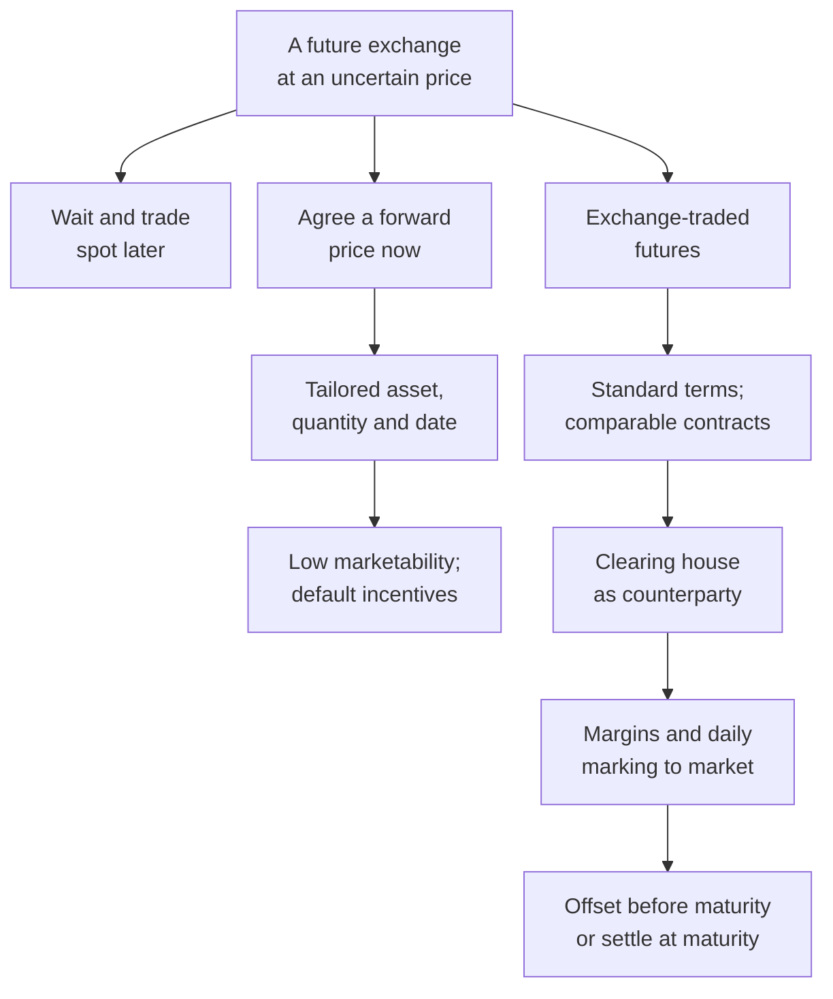
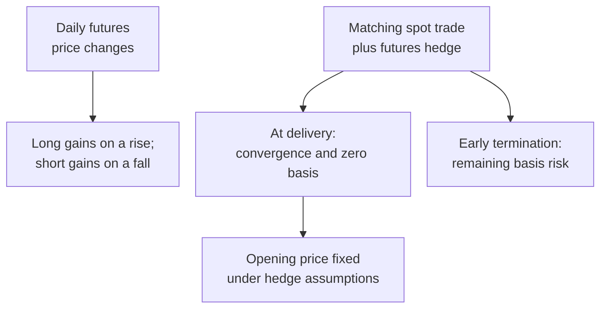

[[01_Notes/2026_2027/Winter_Semester/Financial_Markets_Instruments_I/Financial_Markets_Instruments_I_main.md#Week 1|Back to Financial Markets Instruments I — Week 1]]

# Spot, forward and futures contracts

How can a trader agree today on an exchange that will occur later, and what makes that agreement reliable? Week 1 separates price agreement from payment and delivery. A forward fixes a later exchange through a private agreement; a futures contract adds exchange standardization, clearing and daily settlement. These arrangements explain both the usefulness of futures for managing price uncertainty and the cash obligations a trader accepts. [[00_Materials/2026_2027/Winter_Semester/Financial_Markets_Instruments_I/Week_1/L10(EssentialsOfFuturesTrading).pptx|L10(EssentialsOfFuturesTrading).pptx, slide 2–5]] [[00_Materials/2026_2027/Winter_Semester/Financial_Markets_Instruments_I/Week_1/FI01(Futures Contracts).doc|FI01(Futures Contracts).doc, Ch. I, LibreOffice-rendered p. 2–4]]

## Topic map

The map synthesizes the selected handout chapter: classification on pp. 2–3, clearing and margins on pp. 3–5, convergence on p. 6, hedging on p. 7 and payoff/limits on pp. 8–9. It describes the Week 1 mechanism; it does not import the later chapters on financial contract examples, cost of carry or trading strategies. [[00_Materials/2026_2027/Winter_Semester/Financial_Markets_Instruments_I/Week_1/FI01(Futures Contracts).doc|FI01(Futures Contracts).doc, Ch. I, LibreOffice-rendered p. 2–9]]

## When the agreement, payment and delivery happen

A **spot contract** agrees an immediate sale and delivery at the current spot, or prompt, price. The lecture allows the usual practical delay of up to two days between transaction and settlement; the defining point is that the deal uses the price prevailing now. A **future spot contract**, in the lecture's terminology, means waiting until a specified future date to make a spot transaction. Its future price is still unknown today. Merely intending to buy later does not fix a price. [[00_Materials/2026_2027/Winter_Semester/Financial_Markets_Instruments_I/Week_1/L10(EssentialsOfFuturesTrading).pptx|L10(EssentialsOfFuturesTrading).pptx, slide 2]] [[00_Materials/2026_2027/Winter_Semester/Financial_Markets_Instruments_I/Week_1/FI01(Futures Contracts).doc|FI01(Futures Contracts).doc, Ch. I, LibreOffice-rendered p. 2]]

![[01_Notes/2026_2027/Winter_Semester/Financial_Markets_Instruments_I/assets/Week_1_L10_Spot_Timelines.png]]

*Source timelines: S means specification, P payment, and D delivery. The upper line places all three near the present; the lower line postpones all three to the future date T. The lower transaction therefore retains future spot-price uncertainty.* [[00_Materials/2026_2027/Winter_Semester/Financial_Markets_Instruments_I/Week_1/L10(EssentialsOfFuturesTrading).pptx|L10(EssentialsOfFuturesTrading).pptx, slide 2]]

A **forward contract** specifies today the underlying asset and quantity, the agreed forward price, and the future delivery or maturity date. Payment and delivery occur later. The parties can tailor these terms to their business needs. The benefit is that the agreed exchange price is known in advance. The cost is that a unique private obligation may be difficult or expensive to transfer or terminate. [[00_Materials/2026_2027/Winter_Semester/Financial_Markets_Instruments_I/Week_1/L10(EssentialsOfFuturesTrading).pptx|L10(EssentialsOfFuturesTrading).pptx, slide 3]] [[00_Materials/2026_2027/Winter_Semester/Financial_Markets_Instruments_I/Week_1/FI01(Futures Contracts).doc|FI01(Futures Contracts).doc, Ch. I, LibreOffice-rendered p. 2]]

![[01_Notes/2026_2027/Winter_Semester/Financial_Markets_Instruments_I/assets/Week_1_L10_Forward_Timeline.png]]

*The forward timeline places S at the beginning and P and D at T: fixing the terms and executing the exchange are separate events.* [[00_Materials/2026_2027/Winter_Semester/Financial_Markets_Instruments_I/Week_1/L10(EssentialsOfFuturesTrading).pptx|L10(EssentialsOfFuturesTrading).pptx, slide 3]]

Fixing a price also creates an incentive for the losing party to default. If the later spot price S exceeds the agreed price F, the buyer prefers delivery at F, while the seller could obtain more by selling at S. If S is below F, the seller prefers the agreement, while the buyer would prefer to buy spot. This is a credit-risk problem arising from an obligation's unfavorable market value, even though the contract has removed uncertainty about the agreed price. [[00_Materials/2026_2027/Winter_Semester/Financial_Markets_Instruments_I/Week_1/L10(EssentialsOfFuturesTrading).pptx|L10(EssentialsOfFuturesTrading).pptx, slide 3]] [[00_Materials/2026_2027/Winter_Semester/Financial_Markets_Instruments_I/Week_1/FI01(Futures Contracts).doc|FI01(Futures Contracts).doc, Ch. I, LibreOffice-rendered p. 2]]

## Standardized futures specifications

A **futures contract** is a standardized agreement for a future exchange, traded on a specialized exchange. The trader accepts the published terms and chooses whether to buy or sell at the available futures price. Standardization makes contracts comparable and allows an opposite trade to unwind a position. The lecture presents this ease of offsetting as an important source of liquidity. [[00_Materials/2026_2027/Winter_Semester/Financial_Markets_Instruments_I/Week_1/L10(EssentialsOfFuturesTrading).pptx|L10(EssentialsOfFuturesTrading).pptx, slide 4, 7]] [[00_Materials/2026_2027/Winter_Semester/Financial_Markets_Instruments_I/Week_1/FI01(Futures Contracts).doc|FI01(Futures Contracts).doc, Ch. I, LibreOffice-rendered p. 2–3]] [[00_Materials/2026_2027/Winter_Semester/Financial_Markets_Instruments_I/Week_1/02_seminar.pdf#page=3|02_seminar.pdf, PDF p. 3]]

A futures contract is a **derivative** because its price is derived from the underlying asset's price. The specifications identify the underlying asset, contract size, delivery month, quotation and minimum price movement, and delivery arrangements. An underlying asset may be a commodity, an index, an equity, a currency or an interest-rate-related instrument. For commodities, the grade of quality matters because goods of different quality need not have the same price. Delivery location also matters when transport costs are significant; alternative locations can require price adjustments. [[00_Materials/2026_2027/Winter_Semester/Financial_Markets_Instruments_I/Week_1/02_seminar.pdf#page=3|02_seminar.pdf, PDF p. 3–4]] [[00_Materials/2026_2027/Winter_Semester/Financial_Markets_Instruments_I/Week_1/02_seminar.pdf#page=8|02_seminar.pdf, PDF p. 8]]

The **contract multiplier** converts a quoted price movement into a monetary gain or loss. If a price is quoted in dollars per barrel and the contract covers 1,000 barrels, a $0.01 rise per barrel changes the contract's monetary value by $10. If an index contract pays $50 per index point and its minimum movement is 0.25 points, one tick is $12.50. In both cases,

$$\text{tick value}=\text{tick size}\times\text{contract multiplier}.$$

The units must cancel correctly: dollars per barrel times barrels gives dollars; index points times dollars per point gives dollars. For N contracts, multiply the monetary change by N. These are the seminar's examples, rather than claims that every oil or index contract uses those specifications. [[00_Materials/2026_2027/Winter_Semester/Financial_Markets_Instruments_I/Week_1/02_seminar.pdf#page=5|02_seminar.pdf, PDF p. 5]]

The seminar's fractional quotation example is $99+21.75/32=99.6796875$, or approximately 99.68, for the written quote $99\text{-}21\tfrac34$. Its text first discusses Treasury bonds and then labels the example “US T-Bill”; the label is internally inconsistent, so the verified learning point here is the arithmetic of the fractional quote. [[00_Materials/2026_2027/Winter_Semester/Financial_Markets_Instruments_I/Week_1/02_seminar.pdf#page=7|02_seminar.pdf, PDF p. 7]]

The seminar describes usual maturities as ranging from one month to two years. This is its introductory description; a particular contract's published terms determine its available maturities. [[00_Materials/2026_2027/Winter_Semester/Financial_Markets_Instruments_I/Week_1/02_seminar.pdf#page=6|02_seminar.pdf, PDF p. 6]]

Delivery month is part of the contract's identity: a June contract and a September contract are different obligations. The lecture and seminar describe March, June, September and December as usual financial-contract months, and the seminar says commodity contracts may be available monthly. These are the supplied introductory descriptions; the specified contract calendar remains necessary for an actual contract. A contract that is too large can exclude smaller traders, while one that is too small increases the number of transactions needed for a desired exposure. [[00_Materials/2026_2027/Winter_Semester/Financial_Markets_Instruments_I/Week_1/L10(EssentialsOfFuturesTrading).pptx|L10(EssentialsOfFuturesTrading).pptx, slide 4]] [[00_Materials/2026_2027/Winter_Semester/Financial_Markets_Instruments_I/Week_1/FI01(Futures Contracts).doc|FI01(Futures Contracts).doc, Ch. I, LibreOffice-rendered p. 3]] [[00_Materials/2026_2027/Winter_Semester/Financial_Markets_Instruments_I/Week_1/02_seminar.pdf#page=6|02_seminar.pdf, PDF p. 6]]

## Positions, open interest and the clearing house

A **long position** is a bought futures contract; a **short position** is a sold futures contract. Each outstanding contract has a long and a short side. **Open interest** counts the outstanding contracts as the number of open longs or, equivalently, open shorts; it does not add both sides and double-count the same contracts. [[00_Materials/2026_2027/Winter_Semester/Financial_Markets_Instruments_I/Week_1/L10(EssentialsOfFuturesTrading).pptx|L10(EssentialsOfFuturesTrading).pptx, slide 5]]

The clearing arrangement places the exchange or clearing house between the original counterparties after brokers arrange the trade. The clearing house keeps track of transactions and becomes the formal counterparty, honoring the agreed obligations within the arrangement described by the sources. Non-members channel their trades through members, and the clearing house calculates members' net positions. This reduces the trader's exposure to the original opposing client. [[00_Materials/2026_2027/Winter_Semester/Financial_Markets_Instruments_I/Week_1/L10(EssentialsOfFuturesTrading).pptx|L10(EssentialsOfFuturesTrading).pptx, slide 12]] [[00_Materials/2026_2027/Winter_Semester/Financial_Markets_Instruments_I/Week_1/FI01(Futures Contracts).doc|FI01(Futures Contracts).doc, Ch. I, LibreOffice-rendered p. 3]] [[00_Materials/2026_2027/Winter_Semester/Financial_Markets_Instruments_I/Week_1/02_seminar.pdf#page=11|02_seminar.pdf, PDF p. 11]]

![[01_Notes/2026_2027/Winter_Semester/Financial_Markets_Instruments_I/assets/Week_1_L10_Clearing_Arrangement.png]]

*Compare the direct relationship above with the interposed exchange below. The intermediate counterparty changes whom each side relies on for the agreed transaction; brokers still connect clients to the exchange.* [[00_Materials/2026_2027/Winter_Semester/Financial_Markets_Instruments_I/Week_1/L10(EssentialsOfFuturesTrading).pptx|L10(EssentialsOfFuturesTrading).pptx, slide 12]]

The lecture explicitly says this arrangement does **not** protect a client against the default of their own broker. The handout p. 3 contains both a sentence about honoring obligations after a broker's default and this same non-protection warning. Those statements should be retained as a source ambiguity rather than turned into a blanket guarantee that clients cannot lose money through a broker. The diagram establishes the interposition of clearing; it does not establish unlimited protection against every participant's default. [[00_Materials/2026_2027/Winter_Semester/Financial_Markets_Instruments_I/Week_1/L10(EssentialsOfFuturesTrading).pptx|L10(EssentialsOfFuturesTrading).pptx, slide 12]] [[00_Materials/2026_2027/Winter_Semester/Financial_Markets_Instruments_I/Week_1/FI01(Futures Contracts).doc|FI01(Futures Contracts).doc, Ch. I, LibreOffice-rendered p. 3]]

## How the obligation ends

**Closing out** means taking an offsetting position in an equivalent contract before maturity. A long sells the same underlying, contract size and delivery-month contract; a short buys it. The offset removes the open delivery obligation and fixes the cumulative trading result. A sale in a different delivery month would leave exposure in another contract rather than provide the matching offset. [[00_Materials/2026_2027/Winter_Semester/Financial_Markets_Instruments_I/Week_1/L10(EssentialsOfFuturesTrading).pptx|L10(EssentialsOfFuturesTrading).pptx, slide 7]] [[00_Materials/2026_2027/Winter_Semester/Financial_Markets_Instruments_I/Week_1/FI01(Futures Contracts).doc|FI01(Futures Contracts).doc, Ch. I, LibreOffice-rendered p. 5]] [[00_Materials/2026_2027/Winter_Semester/Financial_Markets_Instruments_I/Week_1/02_seminar.pdf#page=9|02_seminar.pdf, PDF p. 9]]

A position held to maturity follows its specified settlement method. **Physical delivery** exchanges the eligible underlying asset and cash. The source sequence is a long's notification, clearing-house assignment of a short, delivery of an eligible asset and determination/payment of the invoice. If the contract permits several eligible assets, the handout introduces the short's cheapest-to-deliver choice without developing the later bond calculations. **Cash settlement** transfers the final monetary amount when delivery is impractical, costly or excluded by the specification. The final marking-to-market price is the **Exchange Delivery Settlement Price (EDSP)**. [[00_Materials/2026_2027/Winter_Semester/Financial_Markets_Instruments_I/Week_1/L10(EssentialsOfFuturesTrading).pptx|L10(EssentialsOfFuturesTrading).pptx, slide 7]] [[00_Materials/2026_2027/Winter_Semester/Financial_Markets_Instruments_I/Week_1/FI01(Futures Contracts).doc|FI01(Futures Contracts).doc, Ch. I, LibreOffice-rendered p. 5]] [[00_Materials/2026_2027/Winter_Semester/Financial_Markets_Instruments_I/Week_1/02_seminar.pdf#page=8|02_seminar.pdf, PDF p. 8–9]]

The seminar states that less than 1% of all futures contracts end in commodity delivery and emphasizes that most traders offset. Treat that percentage as the seminar's illustrative statement; it supplies no sample, date or measurement method. The broader source-supported point is that closing out is common and enables trading without arranging physical delivery. [[00_Materials/2026_2027/Winter_Semester/Financial_Markets_Instruments_I/Week_1/02_seminar.pdf#page=9|02_seminar.pdf, PDF p. 9]] [[00_Materials/2026_2027/Winter_Semester/Financial_Markets_Instruments_I/Week_1/L10(EssentialsOfFuturesTrading).pptx|L10(EssentialsOfFuturesTrading).pptx, slide 7]]

## Trading limits and market abuse

**Daily price limits** define a permitted band around the previous day's settlement price. The handout describes limit-up or limit-down suspension when prices pass that band, with a cooling-off period intended to help participants reassess positions. **Position limits** cap the number of speculative contracts one trader, or a coordinated group, can hold. These limits constrain market influence rather than specifying a maximum possible loss on a position. [[00_Materials/2026_2027/Winter_Semester/Financial_Markets_Instruments_I/Week_1/FI01(Futures Contracts).doc|FI01(Futures Contracts).doc, Ch. I, LibreOffice-rendered p. 8]] [[00_Materials/2026_2027/Winter_Semester/Financial_Markets_Instruments_I/Week_1/02_seminar.pdf#page=14|02_seminar.pdf, PDF p. 14]]

The handout describes **cornering the market** as combining many long futures positions with control of the underlying supply, raising the underlying price and making it difficult for shorts to close or deliver at a reasonable price. This explains why position limits address concentration as well as the leverage created by small margin deposits. [[00_Materials/2026_2027/Winter_Semester/Financial_Markets_Instruments_I/Week_1/FI01(Futures Contracts).doc|FI01(Futures Contracts).doc, Ch. I, LibreOffice-rendered p. 8]]

## What to carry forward

The essential tradeoff is between a negotiated future exchange and a standardized obligation that can be offset and cleared. Standardization supports liquidity; clearing and daily settlement address counterparty exposure; margin makes the obligation operational but does not pay for the asset or cap its loss. The next note, [[01_Notes/2026_2027/Winter_Semester/Financial_Markets_Instruments_I/Week_1/Margins_and_Marking_to_Market.md|Margins and marking to market]], explains the daily cash mechanism. [[01_Notes/2026_2027/Winter_Semester/Financial_Markets_Instruments_I/Week_1/Basis_Convergence_and_Futures_Hedging.md|Basis, convergence and futures hedging]] shows why combining that mechanism with a spot transaction fixes a price only under the stated matching and convergence conditions. [[00_Materials/2026_2027/Winter_Semester/Financial_Markets_Instruments_I/Week_1/L10(EssentialsOfFuturesTrading).pptx|L10(EssentialsOfFuturesTrading).pptx, slide 4–10]]
