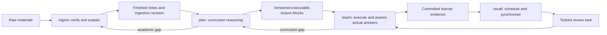

# Uni learning architecture

Current contract: 2026-10-03. This document owns cross-skill boundaries and storage; skill bodies own execution details. Historical reviews describe earlier designs, never current instructions. Vault root: `/Users/slavomirhoricka/Desktop/Obsidian/Uni`.

## Responsibility and artifact matrix

Shared reading never grants write ownership. Maintenance of infrastructure is an explicitly authorized maintenance task, separate from ordinary learning workflows.

| Action / authoritative artifact | Sole owner | Permitted readers / rules |
|---|---|---|
| Inspect raw academic materials; verify claims/equations/visuals; independent academic fact checking | ingest | Others may navigate identities but may not re-audit raw content |
| Notes, hubs, assets in `01_Notes/<course_id>/` | ingest | plan, teach; recall may reference titles/anchors without content audit |
| Raw materials in `00_Materials/` | User | ingest read-only; moves require explicit relocation authorization |
| `runtime/ingest/ingestion_log.md`, `runtime/ingest/logs/<run_id>.md` | ingest | plan reads completion/coverage; detail is completion authority, index navigation |
| Course `ingestion_state.json`: completion, freshness revision, checked hashes | ingest | plan reads/checks; teach/recall compare tokens only |
| Course `learning_plan.md`, `source_manifest.md`, `lessons/<objective_id>.md` | plan | teach/recall read; no learner outcomes or next-review dates |
| Course `curriculum_history/<plan_version>/`: prior plan, manifest, blocks, objective/criterion definitions | plan | immutable after publication; preserves interpretation of evidence |
| Objectives, dependencies, sequence, explanations, examples, keys, rubrics, correction tasks, delayed bank, compatibility/reassessment mappings | plan | teach selects only prepared forms; no curriculum design |
| Present/adapt explanation; choose prepared question; assess actual response with prepared rubric | teach | no external academic sourcing or independent problem construction |
| Course `learning_log.md`: presentations, results, assistance/exposure, acquisitions, issues, corrections, session state | teach | plan reads gaps, recall reads committed outcomes |
| Course `recall_state.json`: cursor, interval/due state, project mapping, outbox, task IDs, sync state, explicit deferrals | recall | teach may read review identity; no grade/outcome fields |
| `runtime/recall/project_map.json`: verified existing project IDs keyed by full vault course identity | recall | factual mappings only, no learner outcomes or invented schedules |
| Todoist recall task creation/update/reopen/supersession/sync | recall | positively identified recall-owned tasks only; completion is task state |
| Conduct due/reassessment review and record actual answer | teach | recall provides identities and due context; never teaches/grades |
| Navigation, naming, architecture, methodology, templates/utilities, package and release manifests | Authorized maintenance | ordinary skills report maintenance issues rather than rewriting infrastructure |
| `validation/` sample plans/rehearsals | Authorized maintenance | explicitly non-runtime; never real learner evidence |
| `history/` migration maps, baselines, snapshots, release ZIPs | Authorized maintenance | excluded from ordinary skill discovery/live link disambiguation |

Paths are relative to `03_Agents/` unless beginning `00_Materials` or `01_Notes`. `course_id` is exact `<academic_year>/<semester>/<course_folder>`. Preserve language, actual Unicode spelling, known code, year and semester. Compare NFC Unicode and spaces/underscores for lookup; never merge distinct codes/years/courses automatically.

## Source and generated packaging

Canonical skills remain `03_Agents/{ingest,plan,teach,recall}/SKILL.md`, with their owned templates/references/utilities. Existing `~/.agents/skills/ingest` and `~/.agents/skills/teach` symlinks remain unchanged. Plan/recall are discovered through the plugin; additional registrations are unnecessary. See [[03_Agents/README]].

`plugins/uni-teach/` is generated packaging. Run `python3 03_Agents/scripts/sync_plugin.py`, then `--check` before release. It copies skills, shared references/scripts and architecture, excludes runtime/history/validation/bytecode, verifies manifests/default prompts, and writes `package_inventory.json`. Never edit installed versioned caches. `plugins/uni-teach-release.json` separates confirmed account release and inspected host cache status; publishing does not prove the current chat reloaded it.

One owner per template: plan `templates/learning_plan.md`, `source_manifest.md`, `objective_lesson.md`; teach `templates/learning_log.md`; recall `templates/recall_state.json`. Old teaching planning-template paths are compatibility redirects only. Course records remain `03_Agents/<course_id>/`; no speculative records in empty mirror folders.

## Freshness, versions, and history

Ingest increments `ingestion_revision` and publishes blocked state before changing finished notes, then complete state after required checks. Plan enumerates/hashes finished note inputs, interprets changes and publishes source version plus ingest revision. Teach/recall compare those small tokens and transaction readiness; they never hash notes or reconcile curriculum.

Schema 3 plan, manifest and selected lesson must agree on `transaction_id`, `plan_version`, `source_version`, `ingestion_revision`, and course identity. Plan status must authorize that objective; unresolved academic gaps must not affect it. Ingest state must be complete and match. Absent state means an ingest adoption gap, not verification of old notes. Plan may prepare a blocked draft but cannot declare it ready. Legacy schema 1 remains preserved, never automatically certified as schema 3.

Manual edits outside ingest cannot reliably invalidate tokens. An explicit plan freshness pass detects them by hashes; only explicitly identified non-academic formatting changes can be reconciled there. Academic changes/uncertain provenance return to ingest. No active watcher exists. Report these limits.

Stable objective IDs are never reused. Changed objectives receive revisions; changed criteria receive criterion versions. Before replacement, plan archives definitions/manifests and necessary old cited excerpts if changed notes would erase interpretability. Splits/merges map predecessors and declare evidence compatibility or reassessment. Results retain original tuples. Plan/recall never regrade; teach records new assessment or append-only correction with `supersedes_event_id`, preserving originals.

## Safe writes and interruption recovery

Use `03_Agents/scripts/records.py` for owned course records. All writers share course `.learning-write.lock`; no authoritative file has multiple writers. `owner.json` carries owner/token/host/PID/time. Atomic mkdir acquires; release only a matching token. Held lock means conflict: retain draft outside authoritative records and report path. Never expire by age. Explicit maintenance recovery may release abandoned lock only after verifying recorded process is inactive on the recorded host and inspecting journals; PID reuse/unknown host needs human resolution.

1. Read current records and retain exact hashes for write-conflict detection. Lighter agents may hash records via utility; never academic notes.
2. Draft JSON outside records: `changes` maps owned relative filenames to full UTF-8 text; `expected` maps those same filenames to last-read SHA-256 (null only if absent). Optional stable `transaction_id`.
3. Run `python3 03_Agents/scripts/records.py commit COURSE_DIR OWNER DRAFT_JSON`. It locks, rereads, rejects stale hashes/ownership/path escapes, stages `.transactions/<id>/` and journal before replacements. Plan includes lessons, history, plan and manifest in one draft.
4. Atomic replacement fsyncs bytes/parent; journal commits only when all files match stages. Matching plan/manifest IDs provide an additional check.
5. Run `... status COURSE_DIR`. Readers stop while locked or journal unfinished. Also run `... verify COURSE_DIR plan PLAN_TRANSACTION_ID learning_plan.md source_manifest.md lessons/OBJECTIVE.md`: the referenced journal must exist, be committed/plan-owned and match active record bytes. Absence is not readiness; record hashing here is a transaction check, never academic-note hashing. Recall also runs `... verify-record COURSE_DIR teach learning_log.md` to require a committed teach journal exactly matching the active log; legacy unjournaled history is never silently promoted. Owner runs `... recover COURSE_DIR OWNER TRANSACTION_ID` after interruption. Old/staged bytes permit idempotent roll-forward; unexpected edits preserve journal and fail. Never discard unfinished updates or claim mismatched plans ready.

Global recall project mappings use the same utility at `03_Agents/runtime/recall/` (recall owns only `project_map.json` there). Utility validates owned paths and immutable events/history, not academic correctness or connector side effects. Ingest commits blocked state via utility, then separately locks/rereads it for note/assets edits, releasing before the utility completion commit. It never nests utility acquisition inside a manually held lock. Index/pass writes use ingest-owned runtime lock and atomic replacement; completed detail repairs index. Do not hold locks across handoffs. A crash before journaling leaves staged orphan data but no changed authoritative bytes; inspect/preserve orphan rather than treating it as a commit.

Learner events have unique IDs and actual offset-aware timestamps. Schema 3 uses fenced JSON. Presentation precedes result; unanswered presentations have no outcome. Derived summaries may change; committed payloads cannot. Legacy log text remains an exact prefix when new events append. No migration infers acquisition from confidence or task completion.

## Handoffs

| From → recipient | Trigger | Exact payload |
|---|---|---|
| ingest → plan | finished/adopted notes | full course ID, scope, run/status/completion path, note anchors, ingestion revision, assets, unresolved gaps |
| plan → ingest | academic gap/contradiction/unverified notes | course/scope, note location, conflicting claims or missing reasoning, blocked objectives |
| plan → teach | ready curriculum | course, plan/manifest paths and tuple, lesson/objective paths, prerequisites, coverage/exclusions, reassessment mapping |
| teach → plan | missing key/rubric/explanation/variant | course/objective/version/item, exact missing rule, observed event IDs, unaffected work |
| teach → ingest | academic contradiction | course, note/plan locations, inconsistency, affected objective; no silent repair |
| teach → recall | evidence committed | course/log path, event IDs, objective/version tuple, acquisition support IDs, review ID, actual response timestamp, assistance/exposure |
| recall → teach | due/overdue/reassessment | course/plan/lesson/log paths, objective/version, review ID, original/current due, trigger event, gate reason |

Invoke recipient within authorized workflow when available; otherwise return exact payload and next invocation. Never claim dispatch occurred without executing it. Reports distinguish intended, committed, synchronized, unverified.

## Methods and scheduling

Plan embeds retrieval, feedback/correction, worked-example fading, prerequisites, discrimination/transfer and separate delayed checks in small blocks with keys/rubric reasons. Teach implements one question at a time and records assistance. Normally two distinct unaided immediate checks establish acquisition: operational default, not personalized mastery. Delayed performance is separate. See [[03_Agents/references/LEARNING_METHODS]] for evidence/limits; methodology does not authorize external curriculum.

Recall uses `uni-fixed-v1`: 1 day after qualifying acquisition, 6 after first delayed pass, then half-up-rounded previous interval ×2.5 with at least one-day growth. Failed/partial/assisted delayed assessment schedules a 1-day reassessment gate plus corrective teaching/reacquisition. Source/criterion changes follow plan gates. No response preserves overdue date. Use actual response date converted to Europe/Prague and calendar-day arithmetic. These are defaults, not full SM-2, personal optima, or proof of retention. Calendar +1 day can be less than 24 hours: the plan's minimum elapsed delayed-check separation still governs qualifying evidence.

Recall consumes committed evidence idempotently, saves intended schedule/outbox before connector calls, and uses installed **Todoist: To Do List & Calendar** harness. At most one active positively owned task per logical review; stable markers/confirmed IDs support retries. Completion/deletion/notifications/user edits never create learning evidence. Unknown create outcomes require complete remote reconciliation before retry; unavailable/incomplete pagination blocks creation.

Recall runs explicitly or as same-session workflow after teach commits. Invoke recall then if available, otherwise report pending handoff. Skills create no background execution. No periodic automation/push-notification system is configured by this audit. Synchronized tasks appear on their due day; new evidence needs the next recall run.
