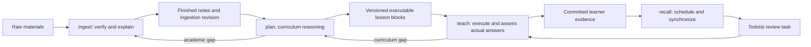
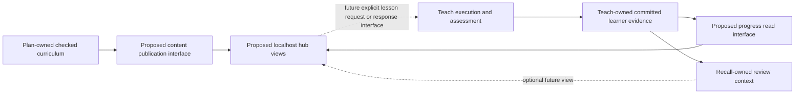

# University Assistant — master plugin architecture

Canonical master overview, inspected 2026-10-09. This existing document owns cross-skill boundaries and storage; the maintained skill bodies own execution details. The current workflow contract below is retained. The future learning hub sections are architectural goals only, **proposed, not yet implemented**; they do not change skill behavior or authorize implementation. Historical reviews describe earlier designs, never current instructions.

Primary vault: `/Users/slavomirhoricka/Desktop/University_notes`. For an isolated task, its actual selected checkout is the vault root, as required by root `AGENTS.md`. Some maintained skill bodies and older release documentation still contain `/Users/slavomirhoricka/Desktop/Obsidian/Uni`; that is a legacy path, overridden by the repository instructions. This documentation task does not edit those skills, registrations or releases.

## Authority and current component map

University Assistant is the private plugin with identity `uni-teach`. Inspection of the maintained folders, packaging utility and version 0.3.1 manifest establishes **exactly four current skills**: [[03_Agents/ingest/SKILL|ingest]], [[03_Agents/plan/SKILL|plan]], [[03_Agents/teach/SKILL|teach]] and [[03_Agents/recall/SKILL|recall]]. There is no learning-site skill. Templates, references, scripts, legacy template redirects and validation examples are supporting components, not additional skills.

This file is the appropriate master location because it already defines shared ownership, handoffs, freshness and storage and is linked by [[03_Agents/README]] and the vault README. Keep this single canonical overview; generated copies do not become maintenance authority.

| Component / location | Current responsibility and authority |
|---|---|
| `00_Materials/<course_id>/` | User-owned original sources; ingest reads the authorized scope. |
| `01_Notes/<course_id>/` | Ingest-owned finished explanations, hubs and source assets; the academic input to plan. |
| `03_Agents/{ingest,plan,teach,recall}/` | Sole maintained skill instructions, owned templates, references and utilities. |
| `03_Agents/<course_id>/` | Separate ingestion, curriculum, evidence and scheduling records, with one owner per artifact. |
| `03_Agents/runtime/ingest/` | Ingest-owned vault index and per-pass coverage/check records. |
| `03_Agents/runtime/recall/` | Recall-owned verified Todoist project mappings and their transactions. |
| `03_Agents/scripts/records.py` | Shared owner-enforcing locks, expected-byte checks, atomic replacements and recoverable journals. It does not grade or verify academic claims. |
| `03_Agents/references/LEARNING_METHODS.md` | Methodology evidence and limitations; not course content or learner evidence. |
| `03_Agents/scripts/sync_plugin.py`, `plugins/uni-teach/` | Packaging utility and generated distribution, including a copy of this architecture. Account release receipt and installed caches are separate deployment evidence. |
| `03_Agents/runtime/sessions/`, `history/`, `validation/` | Engineering handoffs, preserved history and fictional rehearsals; never learner progress or course readiness. |
| Todoist connector | External task service used only by recall; not a learning authority. No background watcher is configured by the skills. |

The following map describes the existing workflow. The proposed hub has a separate map below.

## Existing skill responsibility and ownership matrix

Read permissions are scoped to the resolved course and requested work. Each row summarizes the maintained skill's actual contract; it grants no extra writes. Shared transaction journals and lock metadata support each owner's writes without transferring ownership of the underlying record.

| Skill / purpose | Inputs and permitted reads | Owned data and permitted changes | Outputs and handoff points | Work it must not take over |
|---|---|---|---|---|
| **ingest** — inspect new/changed or adopted source material and establish checked, self-contained teaching notes | Exact user-supplied folder including nested files; originals and bounded verification context; existing notes/assets/hubs; ingestion index, linked passes and state; navigation guidance. May consult bounded academic references for verification/foundations and records their actual contribution. | Course notes, hubs and assets in `01_Notes`; runtime ingestion index and pass records; course `ingestion_state.json`, revisions, checked hashes/headings and unresolved gaps. Originals remain user-owned, read-only unless relocation was expressly authorized. | Finished notes plus independent source review, coverage ledger, conceptual priorities and prerequisite reasons; completion/run/revision, exact locators and gaps to **plan**. Interrupted coverage stays discoverable and incomplete; existing note replacement conflicts follow ingest's approval rule. | No lesson objectives, executable sequence, rubrics, criterion compatibility, curriculum archives, learner outcomes, recall dates or Todoist tasks. Its conceptual reading path is input to plan, not curriculum design. |
| **plan** — turn finished, checked notes into executable, versioned curriculum | Selected finished notes and necessary dependencies/assets; complete ingestion state and linked successful passes; existing plan/manifest/lessons/history; relevant committed learner events for gaps/version context; recall state only for requested timing constraints; explicit goals/scope/tools/deadline. | `learning_plan.md`, `source_manifest.md`, `lessons/<objective_id>.md`, immutable `curriculum_history/<plan_version>/`. Owns objectives, dependencies, sequence, prepared explanations/examples/tasks/keys/rubrics, acquisition/delayed conditions, compatibility and reassessment definitions; fingerprints finished-note inputs. | Matching committed bundle and ready/partial/blocked scope to **teach**; exact academic/provenance gaps to **ingest**; changed objective/version mappings, reassessment gates and answer-free review labels to **recall**, without due dates. | No raw-source audit, academic sourcing or note repair; no live teaching/grading, learning-log initialization, learner-status changes, regrading old answers, recall-state writes or task synchronization. |
| **teach** — run/resume prepared lessons, practise/review, assess actual answers | Matching committed ingestion and plan metadata; only indexed lesson blocks and cited finished-note sections/dependencies; committed learning events/session state; historical definitions when interpreting old evidence; recall review identity and reason. A narrow factual answer from a finished note may be given without objective records; structured study needs a ready executable plan. | Only course `learning_log.md`: observed presentations, responses/results, help/feedback/exposure, supported acquisition/reassessment events, issues, append-only corrections and derived session/evidence summaries. | Checkpointed attempts and actual version-qualified evidence; committed event IDs, times, assistance/exposure and gates to **recall**; precise missing prepared rules/variants to **plan**; note contradictions or explicit freshness warnings to **ingest**. | No curricula, new exercise/key/rubric design, raw-source re-audit, browsing course alternatives, note/manifest repair, academic-note hashing, review-date arithmetic or Todoist. Adapt prepared explanations/routes without inventing missing content. |
| **recall** — derive due reviews from committed evidence and synchronize verified course tasks | Requested course/objectives or existing recall states for a vault-wide due queue; targeted plan/lesson/manifest/ingestion metadata and committed teach events; current scheduling state; verified existing Todoist projects and positively owned task inventories. Checks event reference/commit/version integrity, not answers. | Course `recall_state.json`: evidence cursor, intended schedules, policy/version gates, deferrals/suppression, outbox, task IDs and append-only schedule/task/sync history. Runtime `project_map.json`: factual verified project mapping. External mutations only to positively identified recall-owned tasks under its synchronization contract. | Due/overdue/reassessment identities to **teach**; committed intended dates and separately connector-confirmed tasks; held conflicts/retry state when synchronization is uncertain; readiness/criterion gaps to **plan**, unfinished ingestion/academic issues to **ingest** through the appropriate handoff. | No teaching, grading, inferred mastery/acquisition, academic audits, note/plan/log writes, regrading, guessed project creation or treating task completion/missed dates/confidence as learning. No automatic watcher or notification service. |

The detailed artifact matrix below makes file-level ownership explicit. Maintenance of this overview is separate from executing any learning skill.

## Responsibility and artifact matrix

Shared reading never grants write ownership. Maintenance of infrastructure is an explicitly authorized maintenance task, separate from ordinary learning workflows.

| Action / authoritative artifact | Sole owner | Permitted readers / rules |
|---|---|---|
| Inspect raw academic materials; verify claims/equations/visuals; independent academic fact checking | ingest | Others may navigate identities but may not re-audit raw content |
| Notes, hubs, assets in `01_Notes/<course_id>/` | ingest | plan, teach; recall may reference titles/anchors without content audit |
| Raw materials in `00_Materials/` | User | ingest read-only; moves require explicit relocation authorization |
| `runtime/ingest/ingestion_log.md`, `runtime/ingest/logs/<run_id>.md` | ingest | plan reads completion/coverage; detail is completion authority, index navigation |
| Course `ingestion_state.json`: completion, freshness revision, checked hashes | ingest | plan reads/checks; teach/recall compare tokens only |
| Course `learning_plan.md`, `source_manifest.md`, `lessons/<objective_id>.md` | plan | teach/recall read; no learner outcomes or next-review dates |
| Course `curriculum_history/<plan_version>/`: prior plan, manifest, blocks, objective/criterion definitions | plan | immutable after publication; preserves interpretation of evidence |
| Objectives, dependencies, sequence, explanations, examples, keys, rubrics, correction tasks, delayed bank, compatibility/reassessment mappings | plan | teach selects only prepared forms; no curriculum design |
| Present/adapt explanation; choose prepared question; assess actual response with prepared rubric | teach | no external academic sourcing or independent problem construction |
| Course `learning_log.md`: presentations, results, assistance/exposure, acquisitions, issues, corrections, session state | teach | plan reads gaps, recall reads committed outcomes |
| Course `recall_state.json`: cursor, interval/due state, project mapping, outbox, task IDs, sync state, explicit deferrals | recall | teach may read review identity; no grade/outcome fields |
| `runtime/recall/project_map.json`: verified existing project IDs keyed by full vault course identity | recall | factual mappings only, no learner outcomes or invented schedules |
| Todoist recall task creation/update/reopen/supersession/sync | recall | positively identified recall-owned tasks only; completion is task state |
| Conduct due/reassessment review and record actual answer | teach | recall provides identities and due context; never teaches/grades |
| Navigation, naming, architecture, methodology, templates/utilities, package and release manifests | Authorized maintenance | ordinary skills report maintenance issues rather than rewriting infrastructure |
| `validation/` sample plans/rehearsals | Authorized maintenance | explicitly non-runtime; never real learner evidence |
| `history/` migration maps, baselines, snapshots, release ZIPs | Authorized maintenance | excluded from ordinary skill discovery/live link disambiguation |

Paths are relative to `03_Agents/` unless beginning `00_Materials` or `01_Notes`. `course_id` is exact `<academic_year>/<semester>/<course_folder>`. Preserve language, actual Unicode spelling, known code, year and semester. Compare NFC Unicode and spaces/underscores for lookup; never merge distinct codes/years/courses automatically.

## Source and generated packaging

Canonical skills remain `03_Agents/{ingest,plan,teach,recall}/SKILL.md`, with their owned templates/references/utilities. Existing `~/.agents/skills/ingest` and `~/.agents/skills/teach` symlinks remain unchanged. Plan/recall are discovered through the plugin; additional registrations are unnecessary. See [[03_Agents/README]].

`plugins/uni-teach/` is generated packaging. Run `python3 03_Agents/scripts/sync_plugin.py`, then `--check` before release. It copies skills, shared references/scripts and architecture, excludes runtime/history/validation/bytecode, verifies manifests/default prompts, and writes `package_inventory.json`. Never edit installed versioned caches. `plugins/uni-teach-release.json` separates confirmed account release and inspected host cache status; publishing does not prove the current chat reloaded it.

One owner per template: plan `templates/learning_plan.md`, `source_manifest.md`, `objective_lesson.md`; teach `templates/learning_log.md`; recall `templates/recall_state.json`. Old teaching planning-template paths are compatibility redirects only. Course records remain `03_Agents/<course_id>/`; no speculative records in empty mirror folders.

## Freshness, versions, and history

Ingest increments `ingestion_revision` and publishes blocked state before changing finished notes, then complete state after required checks. Plan enumerates/hashes finished note inputs, interprets changes and publishes source version plus ingest revision. Teach/recall compare those small tokens and transaction readiness; they never hash notes or reconcile curriculum.

Schema 3 plan, manifest and selected lesson must agree on `transaction_id`, `plan_version`, `source_version`, `ingestion_revision`, and course identity. Plan status must authorize that objective; unresolved academic gaps must not affect it. Ingest state must be complete and match. Absent state means an ingest adoption gap, not verification of old notes. Plan may prepare a blocked draft but cannot declare it ready. Legacy schema 1 remains preserved, never automatically certified as schema 3.

Manual edits outside ingest cannot reliably invalidate tokens. An explicit plan freshness pass detects them by hashes; only explicitly identified non-academic formatting changes can be reconciled there. Academic changes/uncertain provenance return to ingest. No active watcher exists. Report these limits.

Stable objective IDs are never reused. Changed objectives receive revisions; changed criteria receive criterion versions. Before replacement, plan archives definitions/manifests and necessary old cited excerpts if changed notes would erase interpretability. Splits/merges map predecessors and declare evidence compatibility or reassessment. Results retain original tuples. Plan/recall never regrade; teach records new assessment or append-only correction with `supersedes_event_id`, preserving originals.

## Safe writes and interruption recovery

Use `03_Agents/scripts/records.py` for owned course records. All writers share course `.learning-write.lock`; no authoritative file has multiple writers. `owner.json` carries owner/token/host/PID/time. Atomic mkdir acquires; release only a matching token. Held lock means conflict: retain draft outside authoritative records and report path. Never expire by age. Explicit maintenance recovery may release abandoned lock only after verifying recorded process is inactive on the recorded host and inspecting journals; PID reuse/unknown host needs human resolution.

1. Read current records and retain exact hashes for write-conflict detection. Lighter agents may hash records via utility; never academic notes.
2. Draft JSON outside records: `changes` maps owned relative filenames to full UTF-8 text; `expected` maps those same filenames to last-read SHA-256 (null only if absent). Optional stable `transaction_id`.
3. Run `python3 03_Agents/scripts/records.py commit COURSE_DIR OWNER DRAFT_JSON`. It locks, rereads, rejects stale hashes/ownership/path escapes, stages `.transactions/<id>/` and journal before replacements. Plan includes lessons, history, plan and manifest in one draft.
4. Atomic replacement fsyncs bytes/parent; journal commits only when all files match stages. Matching plan/manifest IDs provide an additional check.
5. Run `... status COURSE_DIR`. Readers stop while locked or journal unfinished. Also run `... verify COURSE_DIR plan PLAN_TRANSACTION_ID learning_plan.md source_manifest.md lessons/OBJECTIVE.md`: the referenced journal must exist, be committed/plan-owned and match active record bytes. Absence is not readiness; record hashing here is a transaction check, never academic-note hashing. Recall also runs `... verify-record COURSE_DIR teach learning_log.md` to require a committed teach journal exactly matching the active log; legacy unjournaled history is never silently promoted. Owner runs `... recover COURSE_DIR OWNER TRANSACTION_ID` after interruption. Old/staged bytes permit idempotent roll-forward; unexpected edits preserve journal and fail. Never discard unfinished updates or claim mismatched plans ready.

Global recall project mappings use the same utility at `03_Agents/runtime/recall/` (recall owns only `project_map.json` there). Utility validates owned paths and immutable events/history, not academic correctness or connector side effects. Ingest commits blocked state via utility, then separately locks/rereads it for note/assets edits, releasing before the utility completion commit. It never nests utility acquisition inside a manually held lock. Index/pass writes use ingest-owned runtime lock and atomic replacement; completed detail repairs index. Do not hold locks across handoffs. A crash before journaling leaves staged orphan data but no changed authoritative bytes; inspect/preserve orphan rather than treating it as a commit.

Learner events have unique IDs and actual offset-aware timestamps. Schema 3 uses fenced JSON. Presentation precedes result; unanswered presentations have no outcome. Derived summaries may change; committed payloads cannot. Legacy log text remains an exact prefix when new events append. No migration infers acquisition from confidence or task completion.

## Handoffs

| From → recipient | Trigger | Exact payload |
|---|---|---|
| ingest → plan | finished/adopted notes | full course ID, scope, run/status/completion path, note anchors, ingestion revision, assets, unresolved gaps |
| plan → ingest | academic gap/contradiction/unverified notes | course/scope, note location, conflicting claims or missing reasoning, blocked objectives |
| plan → recall | curriculum/version reconciliation | course, changed objective/version tuples, compatibility and reassessment requirements, answer-free review labels/start instructions, deadline constraints; no outcomes or due dates |
| plan → teach | ready curriculum | course, plan/manifest paths and tuple, lesson/objective paths, prerequisites, coverage/exclusions, reassessment mapping |
| teach → plan | missing key/rubric/explanation/variant | course/objective/version/item, exact missing rule, observed event IDs, unaffected work |
| teach → ingest | academic contradiction | course, note/plan locations, inconsistency, affected objective; no silent repair |
| teach → recall | evidence committed | course/log path, event IDs, objective/version tuple, acquisition support IDs, review ID, actual response timestamp, assistance/exposure |
| recall → teach | due/overdue/reassessment | course/plan/lesson/log paths, objective/version, review ID, original/current due, trigger event, gate reason |

Invoke recipient within authorized workflow when available; otherwise return exact payload and next invocation. Never claim dispatch occurred without executing it. Reports distinguish intended, committed, synchronized, unverified.

## Current checks and review points

These are existing repository and skill gates, not new hub integrations:

1. **Source → notes:** ingest inventories source identities and full selected coverage, publishes blocked freshness before note changes, then obtains an independent helper's original-source review of accuracy, coverage, priorities, prerequisites, explanations and visuals. Ingest repairs findings; the checker verifies the final revised content. Completion requires structural validation, finalized pass/index records and committed complete ingestion state.
2. **Notes → curriculum:** plan requires checked ingestion provenance and verifies its committed state, inspects finished-note changes, prepares every ready block with keys/rubrics and reconciles versions. Root `AGENTS.md` requires a separate curriculum reviewer of finished notes, plan/manifest, changed lessons, dependencies, keys, compatibility and preserved history. That reviewer does not substitute raw sources for notes or repair them. Academic gaps return to ingest for repair and renewed source review.
3. **Curriculum → lesson/review execution:** teach and recall require unlocked records, no unfinished journal, committed matching plan/manifest/selected-lesson transactions and complete matching ingestion revision. A partial plan permits only explicitly ready objectives. Token checks are not academic re-audits and do not detect every out-of-workflow edit; explicit changes return to ingest/plan.
4. **Response → evidence → schedule:** teach checkpoints the prompt before presentation and the actual response before later help, then verifies its log journal. Recall verifies committed log bytes and supporting event journals, version compatibility and delayed conditions before deriving dates. No answer means no result; elapsed time or task completion creates no learning evidence.
5. **Schedule → external task:** recall journals intended state/outbox before dispatch, verifies unique existing projects and positively owned tasks, confirms connector readback, and retains uncertain/conflicting operations for recovery. Local persistence and Todoist mutation are separate operations.
6. **Repository integration:** scoped diff, before/after vault audit, applicable owner-transaction verification and final independent reviews gate ingestion/planning publication. Root `AGENTS.md` governs branch/PR, CI/protection, merge verification and cleanup. Workflow-record commitment and Git commitment are separate guarantees.

## Inspected runtime state and limits

Snapshot from repository base `a7b1149`, inspected 2026-10-09; navigation only, never an ongoing readiness certificate. [[03_Agents/VAULT_MAP]] is dated 2026-10-03 and predates subsequent notes/plans. Current course records and linked pass details remain authoritative. The [[03_Agents/runtime/ingest/ingestion_log|ingestion index]] still marks the Week 2 multi-course pass incomplete, while its [[03_Agents/runtime/ingest/logs/20261007T122546+0200_week2_courses|detail]] records independently completed FMI and Econometrics II scopes. Green Deal remains blocked. This architecture task does not resume or finalize that pass.

| Existing course records (`2026_2027/Winter_Semester/`) | Plan declaration / captured ingestion revision | Current ingestion state | Architectural implication |
|---|---|---|---|
| `Behavioral_Economics` | P001, partial, revision 2 | complete, revision 2 | Bounded ready objectives exist; excluded later material remains outside coverage. Use full readiness checks before execution. |
| `Comparative_Economics` | P001, partial, revision 1 | complete, revision 1 | Bounded ready objectives exist; a partial course is not whole-semester readiness. |
| `Econometrics_II` | P002, partial, revision 1 | complete, revision 2 | Prior plan is stale against the current ingestion token; plan reconciliation remains necessary. |
| `Economics_of_Green_Deal` | P002, partial, revision 1 | blocked, revision 2 | Affected execution is blocked by incomplete ingestion and mismatched revision. |
| `Financial_Markets_Instruments_I` | P002, ready, revision 1 | complete, revision 2 | A stored `ready` declaration alone does not establish current readiness. Reconcile through plan. |

The five courses' current ingestion records and all 36 indexed ready lesson bundle transactions verify against their owner journals, with no locks or pending transactions at inspection. Journal integrity does not clear the above freshness/coverage gates or constitute a new academic/curriculum review. These courses have no learning logs or recall states in this snapshot. Legacy `2025_2026/Summer_Semester/JEB109_Econometrics_I` retains a provisional P001 plan and actual earlier learner log; preserve them without promoting legacy claims to schema-3 readiness. Validation curricula remain fictional rehearsals. No learner record should be invented to fill a hub dashboard.

## Methods and scheduling

Plan embeds retrieval, feedback/correction, worked-example fading, prerequisites, discrimination/transfer and separate delayed checks in small blocks with keys/rubric reasons. Teach implements one question at a time and records assistance. Normally two distinct unaided immediate checks establish acquisition: operational default, not personalized mastery. Delayed performance is separate. See [[03_Agents/references/LEARNING_METHODS]] for evidence/limits; methodology does not authorize external curriculum.

Recall uses `uni-fixed-v1`: 1 day after qualifying acquisition, 6 after first delayed pass, then half-up-rounded previous interval ×2.5 with at least one-day growth. Failed/partial/assisted delayed assessment schedules a 1-day reassessment gate plus corrective teaching/reacquisition. Source/criterion changes follow plan gates. No response preserves overdue date. Use actual response date converted to Europe/Prague and calendar-day arithmetic. These are defaults, not full SM-2, personal optima, or proof of retention. Calendar +1 day can be less than 24 hours: the plan's minimum elapsed delayed-check separation still governs qualifying evidence.

Recall consumes committed evidence idempotently, saves intended schedule/outbox before connector calls, and uses installed **Todoist: To Do List & Calendar** harness. At most one active positively owned task per logical review; stable markers/confirmed IDs support retries. Completion/deletion/notifications/user edits never create learning evidence. Unknown create outcomes require complete remote reconciliation before retry; unavailable/incomplete pagination blocks creation.

Recall runs explicitly or as same-session workflow after teach commits. Invoke recall then if available, otherwise report pending handoff. Skills create no background execution. No periodic automation/push-notification system is configured by this audit. Synchronized tasks appear on their due day; new evidence needs the next recall run.

## Future personal learning hub — proposed, not yet implemented

The product goal is **one interactive learning hub for all courses**, presenting checked vault curriculum through a PC browser at `localhost`. Course content, learner evidence, recall scheduling and the presentation layer should remain independently owned and updateable. The current plugin is a file-based workflow, not a web application; this section defines desired boundaries without choosing a framework, database, server, site generator, deployment setup or API transport.

### Scope and exclusions

The first version is for one learner on their PC, accessed on that same machine through `localhost`. Localhost access is the intended boundary; access from other machines on a home network is not part of this version. It should show available courses, supported coverage, prepared learning routes and honest readiness/progress states. “All courses” means a common catalogue and navigation experience, not presumed checked plans for every vault folder. Missing, partial, stale and blocked curriculum must stay visible as such.

Phone access, remote hosting, public access, accounts, cross-device syncing and ChatGPT embedding are explicitly out of scope. Existing recall may still use its separate Todoist connector; the future local hub does not acquire that integration or create a new remote service. Whether a hub view shows already-derived recall context remains an interface decision.

**Flashcards are excluded from this architecture task and the proposed first-version scope.** No flashcard fields, generators, plan/workflow changes or plan revisions are introduced. Existing prepared retrieval and delayed checks remain the current lesson contract. Flashcards could be reconsidered only as a separate future decision.

### Proposed learning-site skill and component boundaries

**learning-site is proposed, not yet implemented.** Its future purpose would be to maintain the hub's presentation and produce replaceable course views from completed, checked plan bundles. It would consume plan outputs, not create curriculum. No skill file, hub files, prototype, integration or application code is created by this document.

| Proposed component / responsibility | Inputs and permitted future effects | Boundary / owner handoff |
|---|---|---|
| **learning-site skill / presentation maintenance** | Read completed plan/manifest/indexed lesson bundles, permitted referenced note/asset content and readiness metadata. Own only future hub presentation and replaceable generated course-view artifacts, whose locations/format are undecided. Report the consumed version and generation/check status. | Cannot edit notes, ingestion records, plans, lessons, history, learner logs, recall state or Todoist. Missing source content → ingest; incomplete lesson contract/version reconciliation → plan. No authority to certify a blocked plan. |
| **Course-content publication interface** | Expose an internally consistent checked bundle with full course identity, objective/revision/criterion identifiers, plan/source/ingestion versions, transaction provenance, locators, scope/exclusions, dependencies and readiness. Treat these as conceptual interface requirements, not a new record schema. | Plan remains sole curriculum owner. The eventual consumer must obtain a coherent committed snapshot and detect a changed revision; the mechanism and representation remain open. No raw-source re-ingestion or silent semantic rewrite during publication. |
| **Hub learner-facing interaction** | Navigate course views and prepared routes; display progress returned by its owner; potentially collect an explicit learner action/response for a separately defined teaching interface. | Presentation alone neither teaches/assesses nor commits outcomes. Lesson execution/assessment stays with teach. Any future response submission, feedback/key disclosure and resumable-session bridge needs its own contract before implementation. A UI click is not acquisition. |
| **Learner-progress persistence boundary** | Retain durable observed evidence/session history independently of regenerated content; supply a read model for the hub. Current authoritative records are teach-owned `learning_log.md`, with journals and old definition tuples. | learning-site does not own progress storage or write the log. Any future storage adapter must preserve teach's logical ownership, append-only evidence and safe writes. Physical storage, adapter ownership and migration strategy are unresolved; no second authoritative progress store is established here. |
| **Recall view / routing boundary** | If later included, display recall-owned due/reassessment context and route a requested review to teach with its identity and gates. | Recall alone derives dates and owns scheduling/sync decisions and Todoist mutations. The hub must not invent a scheduler or infer results from task state. An invocation mechanism is undecided. |

Solid arrows express existing ownership or proposed read flows; dotted arrows are undecided future interfaces. This map is conceptual, not a configured system. The hub and learning-site skill have no write arrow to curriculum, evidence storage or schedules.

### Content and progress remain separate

| Data class | Authority now | Future hub treatment / update guarantee |
|---|---|---|
| Course explanations, objectives, task forms, answer keys, criteria and compatibility/history | Ingest for notes; plan for executable curriculum and immutable earlier definitions | Read-only inputs to publication. Derived course views are replaceable and record exact consumed versions. Learner-facing views must preserve the prepared prompt-before-feedback separation; keys are available only through the eventual teaching presentation contract. |
| Actual responses, assistance/exposure, assessed outcomes, acquisition/gate evidence and resume state | Teach's committed `learning_log.md`; immutable events plus derived summaries | Durable progress independent of generated course views. Read/display via a separate interface; regeneration must never initialize, overwrite, reset or delete evidence. Absence is unknown/not yet recorded, not failure or mastery. |
| Due dates, explicit deferrals, policy/version gates, task/sync history | Recall's committed state and verified project mappings | Separate derived scheduling/integration state, displayed with freshness/synchronization status if exposed. A date or completed task is not a learning result. |
| Presentation preferences or navigation bookmarks, if later needed | Not decided | Keep separate from assessed evidence. A bookmark must not update a plan or create a learner outcome. |

Two invariants guide future design: **updating generated course content must preserve learner progress**, and **recording progress must not edit plans**. Version-qualified stable course/objective identities join the content and progress views without combining their ownership. Preserve historical definitions so old results remain interpretable; plan compatibility mappings or teach's new reassessment resolve changed content, never a site rebuild or automatic regrading.

For example, publishing P002 after P001 would replace the generated course view while retaining P001 attempt events and their definition references. The progress view would show compatibility/reassessment according to the plan and committed new evidence. Conversely, a new response recorded by teach would update the progress view while leaving the published plan bundle unchanged. If publication fails or a version becomes stale, retain the evidence, mark the affected view unavailable/stale and route the issue to its owner; never reset progress as a repair.

Independent updates need explicit interface versions, compatible identities and failure states. Course publication, progress persistence and recall synchronization have separate commit/recovery boundaries. The future hub should distinguish last displayed state from verified current state and avoid consuming mixed bundles during concurrent writes. The exact snapshot, invalidation and refresh mechanisms are open decisions; no watcher is assumed.

### Open decisions and next documentation step

No relevant hub technology decision was found in the maintained architecture, skill instructions, references or current session records. Existing Markdown/JSON files and `records.py` are current workflow infrastructure, not a selection of a future web stack.

| Open question | Decision needed before implementation |
|---|---|
| First-version interaction depth | Does the initial hub navigate/read prepared material and hand off to teach, or support an explicit lesson session bridge? Define response, feedback and key visibility without embedding ChatGPT or taking over assessment. |
| Checked content interface | Consume canonical files directly or a generated export? Define completed bounded scope, verified snapshot/readiness, schema/contract version, asset/anchor resolution, stale/blocked states and refresh timing. A partial course may expose only its completed checked scope. |
| Progress persistence and access | Keep vault learner logs as the sole physical authority or add an adapter later? Define logical owner, submission/read interfaces, idempotency, timestamps, lock/conflict handling and preservation of all existing evidence. Avoid two writable authorities. |
| Revision reconciliation in the hub | Define how views join stable IDs and exact version tuples, display archived/retired objectives and reassessment requirements, and preserve unfinished sessions across publication. Plan still decides compatibility. |
| Local runtime and packaging | Choose framework, server, storage technology, site/export tooling, port/start-stop behavior and distribution only after interface requirements. Preserve PC-only localhost access and separate regenerable content from durable progress. |
| Recall exposure | Decide whether due queues are shown locally and how a learner explicitly requests teach/recall; retain the current distinction between intended schedule, synchronized task and assessed review. |
| Maintenance and verification | Define ownership of future UI/accessibility checks, interface compatibility checks, publication/recovery validation and progress-preservation checks. Source and curriculum checks remain with their current reviewers. |

**Next step:** a separate documentation task should settle first-version interaction depth and write the content-read, progress-read/submit and optional recall-view interface contracts, including version/failure cases and progress-preservation acceptance criteria. Then record any technology choice in a decision document linked here. Neither that next task nor implementation is authorized by this overview. Skill creation, integration and product development require a later explicit request.
