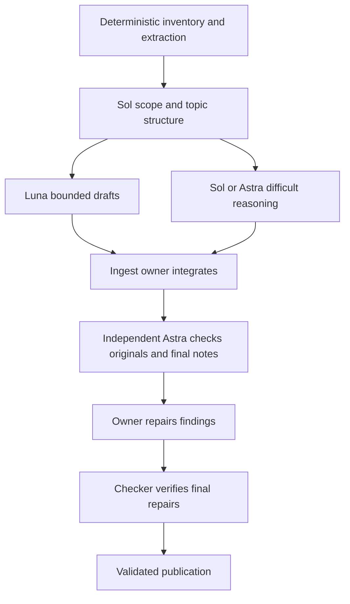

# University Assistant model routing

Policy `uni-model-routing-v1`, requested 2026-10-10. Four public skills remain: ingest, plan, teach and recall. Roles below are internal agents, not additional skills. Explicit user model/effort choices take precedence. These defaults are operational starting settings, not a benchmarked optimum.

## Defaults and escalation

| Skill / role | Agent profile | Model | Effort | Escalation trigger and destination |
|---|---|---|---|---|
| Ingest coordination and note synthesis | `uni_ingest_owner` | `gpt-6.1-sol` | `high` | Difficult derivations, conflicting sources or substantial missing foundations: bounded `uni_ingest_reasoning_astra` (`gpt-6-astra`, `high`), owner integrates. |
| Bounded ingest draft | `uni_ingest_draft` | `gpt-6-luna` | `medium` | Complex but clearly specified section: `uni_ingest_draft_high` (`high`). Interpretation dominates: Sol owner handles it; difficult reasoning uses Astra helper. |
| Independent source checker | `uni_source_checker` | `gpt-6-astra` | `high` | Difficult proof, identification argument or unresolved discrepancy: fresh `uni_source_checker_xhigh` (`xhigh`). |
| Plan preparation | `uni_plan_owner` | `gpt-6.1-sol` | `high` | Mathematically demanding or substantially revised curriculum: `uni_plan_owner_astra` (`gpt-6-astra`, `high`). |
| Independent curriculum checker | `uni_curriculum_checker` | `gpt-6-astra` | `high` | Complex assessment routes or version compatibility: `uni_curriculum_checker_xhigh` (`xhigh`). |
| Prepared teaching and routine assessment | `uni_teach_owner` | `gpt-6-luna` | `medium` | Difficult free-form reasoning or nuanced prepared assessment: `uni_teach_assessor` (`gpt-6.1-sol`, `high`), teach owns the final log write. Missing criteria -> plan, not helper invention. |
| Recall operations | `uni_recall_owner` | `gpt-6-luna` | `low` | Operational complexity: `uni_recall_owner_medium` (`medium`); arithmetic/event replay stays in `schedule.py`. |

Use concrete task features and observed discrepancies for escalation, not a worker's self-reported confidence. Illegible content remains blocked regardless of model/effort. Do not default to max/ultra or create endless repair loops. Record requested settings separately from host-confirmed actual settings.

## Entry dispatch and capabilities

1. Resolve the actual checkout and skill scope under repository instructions before any workflow write. Read this policy from `03_Agents/references/MODEL_ROUTING.md` in that checkout; an installed plugin supplies an equivalent `references/MODEL_ROUTING.md`. Canonical role files are `03_Agents/agents/*.toml`; generated project copies are `.codex/agents/*.toml`, and packaged copies are `agents/*.toml`.
2. For a top-level skill invocation, delegate once to its owner profile with the table's explicit model **and** effort. A session marked `delegated_owner: <profile>` executes directly and never redispatches itself. A marked `helper_role` executes only its assigned draft/review/assessment task; reading an owning skill does not authorize owner dispatch. The host cannot change the already-running chat model merely by reading a skill. The parent remains the user-facing relay/repository integrator; it must not execute the course writes in parallel with its delegated owner.
3. Prefer the host's custom-agent selection when available. Otherwise use its exposed spawn API with explicit model/effort and the canonical profile instructions. With the collaboration API used here, set `fork_turns: "none"` when overriding model/effort; give a self-contained bounded prompt. Do not rely on inherited defaults or send the entire unrelated chat history. Example equivalent dispatch:

   `spawn_agent(task_name="uni_ingest_owner", model="gpt-6.1-sol", reasoning_effort="high", fork_turns="none", message=<bounded owner assignment>)`

   Native custom profiles fix their own model/effort and can override spawn settings. When an explicit user model/effort choice differs from a profile, use a generic explicit-model spawn with that profile's bounded role instructions rather than selecting the pinned profile; preserve the user's choice or report that the host cannot honor it. Use the distinct escalation profile rather than selecting the baseline custom profile and hoping an effort override wins. Never edit global model defaults or installation caches to route a task.
4. Every assignment includes `delegated_owner` or `helper_role`, absolute checkout root, owning skill path, user-authorized scope/full course ID, exact source/finished-note/record locators, prior run and transaction IDs, user constraints/overrides, permitted writes (none for helpers), trust boundaries, expected result and wait/repair protocol. The owner reads authoritative records itself. A helper summary is not provenance, readiness, or a learner answer.
5. Check the host's available models, spawn/follow-up/wait features and selected-checkout tool paths. If configured routing is unavailable, report the exact limitation before substantive work. Do not claim a configured model ran. A user-selected current-model execution may proceed under the same skill gates. Independent source/curriculum checks still require a separate actual reviewer; their absence leaves the affected work blocked. Do not silently downgrade a requested model or switch to a separately billed service.
6. Wait for dependent owner/reviewer results. Only independent read-only draft tasks may run concurrently; never mutate the same course from multiple owners/checkouts. Before replacing an owner for escalation/interruption, stop it, release/inspect locks, reread journals/current bytes and pass its recovery intent. Never start two authoritative writers or infer completed work from a terminated agent.

## Ingestion stages

1. **Inventory/extraction:** use deterministic local tools for paths, hashes, counts, native text and rendering. Native extraction does not prove visual coverage. Originals are read-only; temporary conversions stay outside the vault.
2. **Scope and structure:** Sol owner inspects the full selected sources and bounded references, resolves topic structure, priorities/prerequisites, conflicts and coverage obligations. It establishes the skill's blocked freshness state before note changes.
3. **Bounded drafts:** assign coherent straightforward sections to Luna with original page/slide ranges, readable renders, verified prerequisites and expected citation format. Require draft text, exact evidence locators and unresolved regions. Workers do not write notes, freshness state, assets or logs and do not certify omissions/coverage.
4. **Difficult reasoning:** owner handles interpretation-heavy sections or asks the Astra reasoning helper for a bounded proposed derivation/explanation. Unsupported steps remain gaps.
5. **Integration:** ingest owner rereads current notes and integrates verified drafts/assets under existing preserve-text, lock and approval rules. It reconciles notation, dependencies and cross-section qualifications and maintains the coverage ledger.
6. **Independent review:** a fresh Astra checker establishes expectations from the full original selected scope and relevant reference passages before comparing notes/ledger. It checks equations, visuals, accuracy, omissions, priorities, foundations and simplification. Exact findings only; no writes. A spot check cannot certify full coverage.
7. **Repair and publication:** owner repairs; checker rechecks final revisions and affected context. Only then run structural/transaction checks, finalize pass/index and publish complete ingestion state. Existing incomplete/blocked and user-approval gates remain mandatory. Hand plan checked notes; no grading/recall is triggered.

## Planning and curriculum review

Plan works only from finished checked notes, not originals. The owner prepares objectives, explanations, all questions/keys/rubrics, dependencies, history and exact compatibility tuples. A separate Astra curriculum checker independently executes every changed prepared route and checks finished-note support, readiness and preserved history. Plan fixes; checker verifies final content before ready publication. Academic/provenance gaps return to ingest for repair and renewed source review. No ready curriculum is published with missing review or material findings.

## Interactive teaching and assessment

Keep one `uni_teach_owner` alive across learner turns. The parent follows up on that agent instead of respawning for each answer, shows its verbatim next prompt/feedback, and forwards only the verbatim actual learner response, attempt/version identities, observed receipt time with timezone (actual answer time may be unknown), known conditions/assistance/exposure, and which prompts/feedback were actually displayed. An owner first commits `attempt_started`, then returns one answer-free prompt with course/objective/item/version/attempt identities, phase, persistence status and blockers. It releases locks while waiting. Parent narration, worker text and inferred answers never become learner evidence. Generated feedback is pending delivery, not observed exposure. The parent acknowledges actual displayed prompt/feedback with a supported delivery receipt or the next visible learner exchange; teach records exposure only from that evidence, preserving unknown actual display times. Do not advance a delayed-retention gate on uncertain delivery timing. Use `followup_task` to resume an idle owner; `send_message` alone does not trigger a turn. Keep engineering role/model/agent IDs in session/pass records, not a new learner-evidence schema.

For a demanding or ambiguous response **within a prepared rubric**, teach supplies the read-only Sol assessor the actual answer, full item/key/rubric, relevant finished-note sections and conditions. Await assessment before committing the result; teach checks component decisions and remains sole evidence writer. Unprepared plausible methods or missing/ambiguous criteria stay unscorable and route to plan. Stronger assessment grants no authority to invent criteria or regrade old evidence. Preserve attempt_result-before-help and acquisition/retention rules.

If the persistent agent is gone, recover from committed log/journals and the exact known user response; record unknown timing honestly. Do not repeat an exposed prompt as a fresh independent check. If the host cannot relay interactive follow-ups, report the limitation and execute teach in the user-selected current model under its normal contract; do not imply Luna execution.

## Recall and deterministic checks

Recall alone verifies committed evidence and freshness, invokes `schedule.py` for date arithmetic/event replay, maintains the outbox/positive ownership and performs authorized Todoist synchronization. Neither teach nor an assessor schedules reviews. Operational escalation transfers the same scope and existing task/transaction IDs after the prior owner stops; never duplicate a create operation after an uncertain result. Unknown remote outcomes require reconciliation. Recall never grades.

## Configuration, packaging and verification

Maintain TOML sources only in `03_Agents/agents/`. `sync_plugin.py` generates the project `.codex/agents/uni_*.toml` and packaged `agents/uni_*.toml`; it preserves unrelated custom agents. Project custom agents load in supported Codex sessions after the checkout is synchronized and a new session discovers them. Packaging these supporting files does **not** auto-install project or personal configuration. Installed skills still use explicit spawn settings/instructions when native custom-profile selection is unavailable. No global config, MCP permission, audience or installation cache is modified.

Run `python3 03_Agents/scripts/sync_plugin.py --check` and the routing/packaging tests after changes. TOML parsing and generated-copy equality verify configuration contracts; they do not prove runtime model selection, academic correctness, or teaching quality. Record actual host dispatch/reviewer identities and scope in the task/pass records; no learner record for configuration rehearsals. Benchmark routing later on representative sources and human-reviewed responses before claiming quality/cost improvements.

Host reference: [Codex subagents](https://learn.chatgpt.com/docs/agent-configuration/subagents). Explicit user settings and available host capabilities take precedence over policy defaults.
