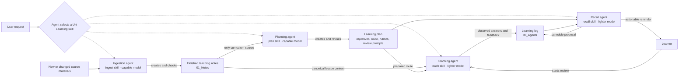

# Learning workflow architecture

Source: [[Drawing 2026-10-03 19.22.41.excalidraw]]

The planner is the only writer of the learning plan. The teaching agent reads the finished notes and plan, and writes learner evidence to the log. Recall schedules reviews and reminders; only an observed teaching or review session can add learning outcomes. Skill selection follows the request; model selection is a separate host setting.
