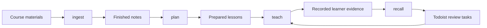

# University Notes

A university study vault for Obsidian, containing course materials, connected study notes, diagrams, and an AI-assisted learning workflow. The academic content spans economics, finance, accounting, statistics, econometrics, mathematics, and related subjects across the 2024–2025, 2025–2026, and 2026–2027 academic years.

## Repository structure

```text
University_notes/
├── 00_Materials/          Original course materials
│   └── <academic_year>/<semester>/<course>/
├── 01_Notes/              Study notes, course hubs, and visual assets
│   └── <academic_year>/<semester>/<course>/
├── 02_Resources/          Shared reference notes and drawings
├── 03_Agents/             Learning skills, course records, and maintenance tools
│   ├── <academic_year>/<semester>/<course>/
│   ├── ingest/
│   ├── plan/
│   ├── teach/
│   ├── recall/
│   ├── runtime/
│   ├── references/
│   ├── scripts/
│   ├── plugins/
│   ├── validation/
│   └── history/
├── Excalidraw/            Standalone drawings and workflow diagrams
├── .obsidian/             Vault settings, plugins, and theme files
└── .claudian/             Claudian settings
```

Course folders use the same year, semester, and course identity across materials, notes, and agent records. Years use names such as `2026_2027`; semesters use `Winter_Semester` or `Summer_Semester`. Course names include their code when known, for example `JEB109_Econometrics_I`, or retain a descriptive name such as `Behavioral_Economics`.

### 00_Materials — original sources

[00_Materials](00_Materials/) stores lecture slides, seminar exercises, textbooks, articles, handbooks, and other course documents. Most files are PDFs, with PowerPoint slides, Word documents, and occasional data or image files. Depending on the course, sources are grouped into folders such as `Week_1`, `Lectures`, `Seminars`, `Textbook`, or `Additional_Reading`.

These files provide the source material for the notes. The ingestion workflow reads them and records which sources and sections it covered.

### 01_Notes — study content

[01_Notes](01_Notes/) contains Markdown explanations, definitions, derivations, worked examples, and seminar notes. A course hub named `<course_folder>_main.md` links its topics together. Course `assets/` folders contain figures and tables used by the notes.

The collection includes microeconomics, macroeconomics, statistics, econometrics, financial economics, accounting, international finance, and game theory. The 2026–2027 notes also cover behavioral economics, comparative economics, environmental economics, financial markets and instruments, and mergers and acquisitions. Coverage varies by course; a folder or hub alone does not indicate complete source coverage.

### 02_Resources and Excalidraw — shared references and visuals

[02_Resources](02_Resources/) contains material shared outside the course hierarchy, currently a shareholder activism note and an Excalidraw drawing. [Excalidraw](Excalidraw/) contains standalone drawings, including a learning workflow architecture diagram. Excalidraw files retain their `.excalidraw.md` format.

### Hidden configuration

`.obsidian/` contains vault preferences, workspace state, community plugin files, and the Things theme. The bundled plugins include Dataview, Excalidraw, LaTeX helpers, Omnisearch, and other vault tools. `.claudian/` contains the Claudian settings file.

## 03_Agents — the learning workflow

[03_Agents](03_Agents/) stores both the maintained learning skills and the records produced while using them. Its four stages have separate responsibilities:



| Skill | Responsibility | Main outputs |
| --- | --- | --- |
| [ingest](03_Agents/ingest/SKILL.md) | Inspect and verify raw materials; create source-grounded notes and visuals; track coverage and freshness. | Notes and assets in `01_Notes/`, ingestion pass records, and course `ingestion_state.json`. |
| [plan](03_Agents/plan/SKILL.md) | Turn finished notes into a versioned, executable curriculum with objectives, explanations, practice, answer keys, and assessment criteria. | `learning_plan.md`, `source_manifest.md`, `lessons/`, and `curriculum_history/`. |
| [teach](03_Agents/teach/SKILL.md) | Run or resume prepared lessons, assess actual answers against prepared criteria, and record session progress. | Course `learning_log.md` containing learner evidence and session state. |
| [recall](03_Agents/recall/SKILL.md) | Derive review dates from committed learner evidence and synchronize review tasks with verified existing Todoist course projects. | Course `recall_state.json`, shared project mappings, and synchronized review tasks. |

Planning defines the curriculum; teaching records what the learner actually did; recall schedules reviews from that evidence. Missing or stale source verification returns to ingestion, and a missing or stale lesson plan returns to planning. Completing a task alone does not establish learning.

### Files and folders inside 03_Agents

| Path | Contents |
| --- | --- |
| `<academic_year>/<semester>/<course>/` | Course records mirroring the academic folder structure. Records are created as the workflow needs them; the presence of notes does not imply a ready curriculum or learner history. |
| `ingest/`, `plan/`, `teach/`, `recall/` | Canonical skill instructions, templates, references, and skill utilities. |
| `runtime/ingest/` | Vault-wide ingestion index (`ingestion_log.md`) and individual pass records in `logs/`. |
| `runtime/recall/` | Verified course-to-Todoist project mappings in `project_map.json`. |
| `references/` | Learning methodology and plugin documentation. |
| `scripts/` | Utilities for record handling, plugin packaging, and maintenance checks. |
| `plugins/uni-teach/` | Generated plugin package built from the canonical skills. Make skill changes in the canonical folders and regenerate the package. |
| `plugins/uni-teach-release.json` | Release receipt recording the private plugin release and host installation status. |
| `validation/` | Example curricula and contract rehearsals, separate from real learner evidence. |
| `history/` and `.backups/` | Archived audits, reviews, migrations, snapshots, and plugin releases. |

Start with the [agent workspace README](03_Agents/README.md). The [learning architecture](03_Agents/LEARNING_ARCHITECTURE.md) defines ownership, handoffs, freshness, versions, and record handling. The [vault map](03_Agents/VAULT_MAP.md) provides a dated course inventory, and [naming conventions](03_Agents/NAMING_CONVENTIONS.md) describe how to name new files and folders. Consult current files and ingestion records for changes since the inventory was written.

### Using the skills

With the skills registered in a compatible host, typical requests are:

- `$ingest 00_Materials/<academic_year>/<semester>/<course>/<scope>` — process an exact source folder.
- `$uni-teach:plan Prepare a learning plan for <full course path>, <topic/scope>` — prepare lessons from completed ingestion notes.
- `$teach Teach/resume/review <full course path>, <topic>; I have <study budget>` — work through prepared lessons. `$uni-teach:teach` is the plugin equivalent.
- `$uni-teach:recall Synchronize my committed course reviews with Todoist` — synchronize evidence-based reviews with existing course projects.

The workflow was configured for the original Obsidian vault at `/Users/slavomirhoricka/Desktop/Obsidian/Uni`. Cloning this repository copies its files; using the agent workflow from a different location requires checking its configured vault paths and skill registrations. Todoist synchronization also requires the separate Todoist integration and verified project mappings.

Recall runs on request or after a qualifying teaching handoff when available. The workflow does not install a background watcher. Legacy records remain preserved, while current lesson readiness depends on matching ingestion and curriculum versions.

## Opening and maintaining the vault

Open this repository folder as a vault in Obsidian to navigate its internal `[[wikilinks]]`, embedded assets, and drawings. GitHub can display the Markdown files, but Obsidian provides the vault navigation and plugin features.

Run maintenance commands from the repository root:

```sh
# Audit live vault links, source paths, hubs, and course-folder mirrors.
python3 03_Agents/check_vault.py

# Regenerate the plugin after changing canonical skill sources.
python3 03_Agents/scripts/sync_plugin.py

# Check whether generated packaging matches its sources.
python3 03_Agents/scripts/sync_plugin.py --check
```

The vault checker reports unresolved references; it does not certify academic accuracy or PDF page bounds. Generating a plugin package is separate from installing or publishing it.
